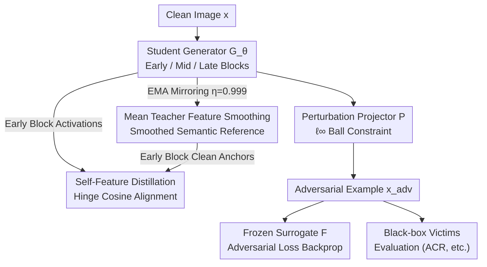

# Improving Black-Box Generative Attacks via Generator Semantic Consistency

**Conference**: ICLR 2026  
**arXiv**: [2506.18248](https://arxiv.org/abs/2506.18248)  
**Code**: To be released  
**Area**: Audio and Speech  
**Keywords**: Generative Adversarial Attacks, Black-box Transferability, Mean Teacher, Semantic Consistency, Feature Distillation

## TL;DR

By analyzing the semantic degradation phenomenon in the intermediate layer features of generators, this paper proposes a Mean Teacher-based semantic structure-aware framework. It performs self-feature distillation in the early layers of the generator to maintain semantic consistency, thereby enhancing the transferability of adversarial examples across models, domains, and tasks.

## Background & Motivation

**Background**: Generative adversarial attacks train a perturbation generator. After learning on a white-box surrogate model, the generated perturbations are applied to unseen black-box victim models. Compared to iterative attacks, generative methods offer higher inference efficiency, better scalability, and superior transferability. However, existing methods mostly treat the generator as a black box, optimizing only the end-to-end surrogate loss while ignoring how the generator internally represents semantic information (object boundaries, rough shapes), thus wasting an internal signal that could be directly intervened upon.

**Key Insight**: The authors divide the intermediate activations of the trained generator into three segments—**early**, **mid**, and **late**—based on the residual block positions and quantify them block by block. They find that early blocks consistently retain the rough semantic structure of the input image (object contours, shape priors), while mid-to-late blocks gradually lose semantic cues as perturbations accumulate. In other words, by locking semantic integrity in the early blocks, subsequent layer perturbations can focus more on salient object regions, thereby increasing transferability.

**Core Problem**: The problem converges into two specific questions: At which stage of the generator do semantic cues begin to degrade? Which intermediate blocks have the greatest impact on transferability? The core idea of this paper is to answer them by using a time-smoothed reference to fix the non-degraded semantic structure in early blocks, making the learned perturbations more "semantically aware."

## Method

### Overall Architecture

The method is a plug-and-play module that can be superimposed on any generative attack baseline, centered around a Student–Teacher dual-generator setup. The Student generator $\mathcal{G}_\theta$ is trained via gradient descent to produce adversarial perturbations; the Teacher generator $\mathcal{G}_{\theta'}$ does not participate in backpropagation but mirrors the Student using Exponential Moving Average (EMA) to provide a time-smoothed feature reference. During training, a clean image is fed into the Student, and the activations of the early blocks are pulled toward the corresponding semantic reference of the Teacher's early blocks via a **self-feature distillation** loss. The perturbations output by the Student are constrained within the $\ell_\infty$ ball by a projector $\mathcal{P}$ to obtain adversarial examples. Adversarial supervision is then provided by a frozen surrogate model $\mathcal{F}$, which passes gradients back to the Student. The mechanism focuses on fixing the non-degraded rough semantic structure in the blocks closest to the input, allowing subsequent layers to fill in salient object regions. The adversarial objective on the surrogate remains unchanged; distillation is an additional guidance path.

### Key Designs

**1. Mean Teacher Feature Smoothing: Denoising the "Semantic Reference"**

Directly using the current Student's own intermediate features as alignment targets is unreliable—adversarial training itself introduces high-frequency perturbation artifacts into feature maps, causing targets to jitter violently during training. Therefore, a Teacher generator that does not participate in backpropagation is introduced, following the Student via EMA: $\theta' \leftarrow \eta\theta' + (1-\eta)\theta$, with momentum $\eta=0.999$. This high momentum means the Teacher is a long-term average of the Student's historical trajectory, smoothing out single-step perturbation artifacts and leaving stable, semantically coherent intermediate feature maps to serve as "clean anchors" for Student self-alignment.

**2. Early Block Self-Feature Distillation: Locking Semantics in Early Blocks Only**

Key observations show that early blocks (experimental set $L_{\text{early}}=\{1,2\}$) retain the most semantics, while mid-to-late blocks lose semantics as perturbations accumulate. Thus, distillation is applied only to early blocks, forcing the Student's early activations to approximate the Teacher's semantically rich features. Alignment uses cosine similarity in a hinge format:

$$\mathcal{L}_{\text{distill}} = \sum_{\ell=1}^{L_{\text{early}}} \mathcal{W}_{\text{distill}} \max(0, \tau - \cos(\mathbf{g}_s^{(\ell)}, \mathbf{g}_t^{(\ell)}))$$

where $\mathbf{g}_s^{(\ell)}$ and $\mathbf{g}_t^{(\ell)}$ are the activations of the Student and Teacher at the $\ell$-th block, respectively, $\tau=0.6$ is the similarity threshold, and $\mathcal{W}_{\text{distill}}$ is a learnable softmax weight. The hinge term penalizes only when similarity is below $\tau$—once semantics are sufficiently aligned, it releases the constraint to avoid weakening attack intensity; learnable weights allow the model to decide how tightly to pull each early block.

**3. ACR Metric: Accounting for "Accidental Help"**

This is an evaluation contribution. Traditional protocols only check if an attack causes a prediction error, ignoring cases where an attack "corrects" an originally wrong prediction. This can overestimate true destructive power. The paper proposes the Accidental Correction Rate (ACR) to count the proportion of samples accidentally corrected during the attack. A lower ACR indicates the attack is more "purely" destructive rather than helping by chance, providing a more honest depiction of attack efficacy.

### Loss & Training

Adversarial supervision adopts cosine similarity in the surrogate feature space, ensuring the surrogate features of the adversarial example $x^{adv}$ deviate as much as possible from the clean sample $x$: $\mathcal{L}_{\text{adv}} = \cos(\mathcal{F}_k(x), \mathcal{F}_k(x^{adv}))$. The total loss is a weighted sum of the adversarial and distillation terms: $\mathcal{L} = \mathcal{L}_{\text{adv}} + \lambda_{\text{distill}} \cdot \mathcal{L}_{\text{distill}}$, with $\lambda_{\text{distill}}=0.7$. Surrogate features are taken from VGG-16 layer 16 (Maxpooling.3), trained on ImageNet-1K with a perturbation budget $\epsilon=10$. Since distillation only affects the Student's own early features and requires no additional labels or external models, the scheme serves as a plug-and-play module for existing baselines.

## Key Experimental Results

### Main Results (Cross-Model Transfer)
As a plug-and-play module, this method can be added to existing generative attack baselines:

| Baseline Method | Cross-model ASR Gain | Cross-domain ASR Gain | Cross-task Improvement |
|---------|---------------|-------------|-----------|
| BIA (Baseline) | Significant | Significant | Consistent |
| CDA + Ours | ✓ | ✓ | ✓ |
| LTP + Ours | ✓ | ✓ | ✓ |
| GAMA + Ours | ✓ | ✓ | ✓ |
| FACL + Ours | ✓ | ✓ | ✓ |
| PDCL + Ours | ✓ | ✓ | ✓ |

### Cross-Domain Transfer (CUB-200, Stanford Cars, FGVC Aircraft)
Using BIA as the baseline with a VGG-19 surrogate:
- Accuracy drop: 10.05%p (Lower is better)
- ASR Gain: 11.20%p
- FR Gain: 10.39%p
- ACR Drop: 2.26%p (Lower is better)

### Ablation Study

| Configuration | Key Metric | Explanation |
|------|---------|------|
| Early Distillation (1,2) | Optimal | Early blocks retain maximum semantic info |
| Mid Distillation | Inferior | Semantics partially degraded |
| Late Distillation | Worst | Semantics severely degraded |
| τ=0.6 | Optimal | Balances attack strength |
| Without Mean Teacher | Drop | Lacks time-smoothed reference |

### Key Findings
- Consistent gains across all four cross-settings (Cross-model, Cross-domain, Cross-task SS, Cross-task OD).
- Maintains robustness under adversarial purification defense (NRP).
- Perceptual quality (PSNR/SSIM/LPIPS) is not compromised and even slightly improved.
- High training stability across multiple random seeds (low standard deviation).
- Performance on CLIP zero-shot classification varies by baseline.

## Highlights & Insights

1. **Internal Semantic Analysis of Generators**: First systematic analysis of semantic degradation in generative attack intermediate layers, identifying early blocks as crucial for semantic integrity.
2. **Plug-and-Play Design**: A general framework applicable to any existing generative adversarial attack method, providing consistent performance boosts.
3. **ACR Metric**: Reveals flaws in existing evaluation protocols where traditional metrics ignore "accidental corrections" (predictions becoming correct post-attack).
4. **Difference Map Analysis**: Visualization confirms that adversarial noise generated by this method is more concentrated on the semantic structures of objects.

## Limitations & Future Work

- Effectiveness depends on generator architecture—limited improvement if early blocks lack rich semantic cues (e.g., in architectures different from U-Net).
- Transferability gains on tasks beyond image classification (detection, segmentation) are limited, suggesting classification-oriented surrogates struggle to align features for other tasks.
- The focus is on internal semantic maintenance, which differs from methods targeting "benign-adversarial differences"; the two could be used complementarily.

## Related Work & Insights

- **BIA** (Zhang et al., 2022): Baseline method using similarity loss in surrogate feature space.
- **GAMA** (Aich et al., 2022): Uses CLIP vision-language models to enhance generative attacks.
- **Mean Teacher** (Tarvainen & Valpola, 2017): Originally for semi-supervised learning, innovatively introduced here for adversarial attacks.
- Insights: Semantic analysis of intermediate features could be extended to other generative tasks like image inpainting or style transfer.

## Rating
- Novelty: ⭐⭐⭐⭐ — Semantic degradation perspective is novel, though Mean Teacher is an established technique.
- Experimental Thoroughness: ⭐⭐⭐⭐⭐ — Comprehensive evaluation across model/domain/task settings, solid ablations, and included purification/zero-shot tests.
- Writing Quality: ⭐⭐⭐⭐ — Clear motivation and rich visualizations.
- Value: ⭐⭐⭐⭐ — Plug-and-play with consistent gains; valuable for adversarial robustness research.

## Related Papers

- [\[NeurIPS 2025\] From Black Box to Biomarker: Sparse Autoencoders for Interpreting Speech Models of Parkinson's Disease](../../NeurIPS2025/audio_speech/from_black_box_to_biomarker_sparse_autoencoders_for_interpreting_speech_models_o.md)
- [\[ICLR 2026\] StableToken: A Noise-Robust Semantic Speech Tokenizer for Resilient SpeechLLMs](stabletoken_a_noise-robust_semantic_speech_tokenizer_for_resilient_speechllms.md)
- [\[ICLR 2026\] AVERE: Improving Audiovisual Emotion Reasoning with Preference Optimization](avere_improving_audiovisual_emotion_reasoning_with_preference_optimization.md)
- [\[ICLR 2026\] SpeechOp: Inference-Time Task Composition for Generative Speech Processing](speechop_inference-time_task_composition_for_generative_speech_processing.md)
- [\[ICLR 2026\] Hierarchical Semantic-Acoustic Modeling via Semi-Discrete Residual Representations for Expressive End-to-End Speech Synthesis](hierarchical_semantic-acoustic_modeling_via_semi-discrete_residual_representatio.md)

<!-- RELATED:END -->

<!-- RELATED:START -->

## Related Papers

- [\[NeurIPS 2025\] From Black Box to Biomarker: Sparse Autoencoders for Interpreting Speech Models of Parkinson's Disease](../../NeurIPS2025/audio_speech/from_black_box_to_biomarker_sparse_autoencoders_for_interpreting_speech_models_o.md)
- [\[ICLR 2026\] StableToken: A Noise-Robust Semantic Speech Tokenizer for Resilient SpeechLLMs](stabletoken_a_noise-robust_semantic_speech_tokenizer_for_resilient_speechllms.md)
- [\[ICLR 2026\] AVERE: Improving Audiovisual Emotion Reasoning with Preference Optimization](avere_improving_audiovisual_emotion_reasoning_with_preference_optimization.md)
- [\[ICLR 2026\] SpeechOp: Inference-Time Task Composition for Generative Speech Processing](speechop_inference-time_task_composition_for_generative_speech_processing.md)
- [\[ICLR 2026\] Hierarchical Semantic-Acoustic Modeling via Semi-Discrete Residual Representations for Expressive End-to-End Speech Synthesis](hierarchical_semantic-acoustic_modeling_via_semi-discrete_residual_representatio.md)

<!-- RELATED:END -->
