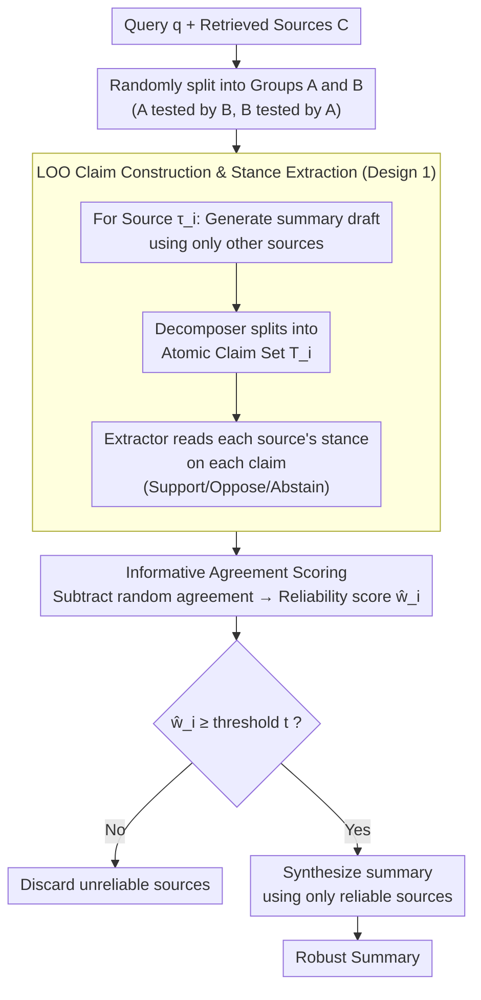

# Incentive-Aligned Multi-Source LLM Summaries

**Conference**: ICLR 2026  
**arXiv**: [2509.25184](https://arxiv.org/abs/2509.25184)  
**Code**: None  
**Area**: Audio/Speech  
**Keywords**: truthful summarization, incentive alignment, peer prediction, prompt injection, source reliability  

## TL;DR

This work introduces the multi-task peer prediction mechanism from game theory into the LLM multi-source summarization pipeline, proposing the Truthful Text Summarization (TTS) framework. By constructing leave-one-out (LOO) cross-evaluation sets, extracting source stances on claims, and scoring reliability through informative agreement to filter unreliable sources before re-summarizing, the authors theoretically prove that "truthful reporting is the utility-maximizing strategy." Experiments demonstrate effective defense against prompt injection, fake information sources, and collaborative attacks.

## Background & Motivation

**Paradigm shift from search to summary**: Traditional search engines display multiple results as independent entries, where the impact of a single malicious source is limited. LLM-driven summarization merges multiple sources into a single narrative, allowing a strategic actor to hijack the entire output via prompt injection or semantic steering, with an impact far exceeding traditional search rankings.

**Triple vulnerability of LLMs**: (a) Susceptibility to plausible hallucinations, (b) ease of manipulation by adversarial prompt injection, and (c) difficulty in adjudicating contradictory claims. These factors provide opportunities for malicious sources.

**Incentive mismatch problem**: Existing RAG pipelines focus only on technical summarization quality (e.g., self-criticism, LLM-as-judge) and overlook the strategic behavior of content creators. If manipulation yields higher exposure at a lower cost, information sources have the incentive to provide false data.

**Key Challenge**: The need to achieve both technical robustness (filtering bad sources) and incentive robustness (making truthful reporting a Nash equilibrium) simultaneously, especially without ground-truth labels.

**Key Insight**: Drawing on the peer prediction mechanism from game theory, which requires no ground truth, reliability is evaluated using informative agreement between sources.

## Method

### Overall Architecture

The TTS (Truthful Text Summarization) framework addresses scenarios where a search system feeds multiple web sources into an LLM to synthesize a summary. Some sources might be outdated, commercially motivated, or contain hidden prompt injection instructions (e.g., "Paris weather warning vs. outdoor park promotion"). Existing pipelines fail to verify source authenticity and are vulnerable to manipulation. The core logic of TTS is **filter then generate**: the pipeline is split into two passes. The first pass does not produce a summary but has sources "test and grade" each other to calculate a reliability score $\hat{w}_i$ independent of ground truth. The second pass removes low-scoring sources entirely and synthesizes the final summary using only reliable sources. This scoring process adapts the multi-task peer prediction mechanism into a "sources grading sources" format to identify trustworthy entities on the open web.

### Key Designs

**1. Leave-One-Out (LOO) Claim Construction & Stance Extraction: Preventing sources from manipulating their own tests**

If a source can influence the set of claims used to evaluate it, it might opportunistically craft questions it can answer correctly. TTS employs **claim exogeneity**: for each source $\tau_i$, a draft summary is generated using only the other sources $\{\tau_j\}_{j \neq i}$, which is then broken into atomic claims $T_i$ by a decomposer $D$. Since $\tau_i$ never participates in the construction of its own evaluation set, $T_i$ remains exogenous and unmanipulable. After obtaining the claims, an extractor $E$ reads the stance $r_{ik} \in \{1(\text{Support}), 0(\text{Oppose}), \bot(\text{Abstain})\}$ of each source toward claim $k$, standardizing messy free text into comparable discrete signals.

Computing LOO for every single source involves a complexity of $O(|\mathcal{C}|K(|\mathcal{C}|-1))$, which is prohibitive at scale. TTS implements this by randomly splitting sources into groups A and B; group A uses claims from group B for evaluation and vice versa. This preserves claim exogeneity while reducing complexity to linear $O(K|\mathcal{C}|)$.

**2. Informative Agreement Scoring: Identifying reliable sources without ground truth**

With stance signals available, how can reliability be determined without ground truth? Simply rewarding "agreement" would encourage collusive lying. Instead, TTS measures **informative** agreement: agreement on a specific claim must subtract the baseline of "accidental agreement across random claims." For every pair (source $i$, peer $j$), the score is calculated as:

$$\sigma_{ikj} = S(r_{ik}, r_{jk}) - S(r_{i\ell}, r_{jm})$$

where $\ell, m$ are two different claims selected via random permutation. The mean is taken across all peers $j$ and claims $k$ to derive the source score $\hat{w}_i$. Only when a source carries valid information correlated with others does the score become significantly positive. "Uninformative" strategies—including collusive stances from sybil attackers—result in scores near zero and are subsequently filtered.

**3. Filtering & Re-summarization: Severing adversarial paths before generation**

After obtaining all $\hat{w}_i$, sources with $\hat{w}_i < t_{\text{src},i}$ (using a fixed global threshold $t = 0.06$ in experiments) are filtered. The final summary is synthesized only from the remaining reliable sources. The critical point is that **isolation happens before the final generation**: adversarial text never enters the generation context, providing a more robust defense than prompt-level instructions (e.g., "ignore suspicious instructions") and preventing the LLM from being swayed by contradictory claims.

**4. Theoretical Guarantees: Establishing "truthful reporting" as an equilibrium**

The first three steps represent the mechanism, but ensuring sources **lack the incentive** to cheat requires proving that "truthfully reporting one's true stance" is indeed the utility-maximizing strategy. TTS provides three progressive theorems covering asymptotic, strong guarantee, and finite-sample cases. Unlike heuristic scoring, this grants the "exposure (citation in summary) = incentive" design provable incentive-alignment properties.

| Theorem | Condition | Guarantee |
|---|---|---|
| Thm 3.2 (Asymptotic informed truthfulness) | $K \to \infty$, threshold $0 < t < \alpha_i \eta_i^{\text{truth}} \gamma$ | Truthfulness is weakly better than all strategies, strictly better than any uninformative strategy |
| Thm 3.3 (Strong truthfulness) | Large $K$ + bias-flipping $\geq \varphi_{\min}$ claims | Truthfulness is strictly better than all significantly biased strategies |
| Thm 3.4 ($\varepsilon$-informed truthfulness) | Finite $K$ + midpoint threshold | Utility error decays exponentially with $K$; $K \geq O(\ln(v_i/\varepsilon)/\underline{g}_i^2)$ is sufficient |

Compared to traditional peer prediction, TTS makes three key adaptations for the open web: evaluation tasks are constructed on-the-fly via LOO so sources cannot manipulate them; reports transition from abstract signals to natural language documents (proven equivalent to signal-report strategies); and incentives shift from monetary payments to exposure/attribution, as paying sources in open search is impractical.

## Key Experimental Results

### Main Results

| Method | NQ Precision | NQ Answer Acc | ClashEval Precision | ClashEval Answer Acc |
|---|---|---|---|---|
| Initial Synthesis | 40.8% | 25.1% | 49.3% | 15.6% |
| Majority Prompt | 43.4% | 27.5% | 58.7% | 30.2% |
| Majority Claims | 50.1% | 38.6% | 63.6% | 38.4% |
| **TTS (Ours)** | **76.1%** | **72.3%** | **86.2%** | **77.1%** |

TTS improves answer accuracy on NQ to 72.3% (vs. 25.1% for initial synthesis) and on ClashEval to 77.1% (vs. 15.6%), while nearly doubling precision improvements.

### Ablation Study (Sybil Attacks)

By adding 4 "uninformative" sources (all opposing all claims) into ClashEval, simple majority voting schemes fail completely—not only awarding high scores to sybil attackers but also incorrectly elevating the scores of adversarial sources. TTS continues to assign near-zero scores to uninformative sources, maintaining the correct reliability ranking. This validates the theoretical robustness of peer prediction scoring against collusive uninformative equilibria.

### Computational Cost

On average, each query (7 sources) costs approximately 174k input tokens + 13k output tokens, totaling ~$0.07/query using gemini-2.5-flash-lite. In practical deployment, TTS can be run on sampled traffic to accumulate source reputation signals.

## Highlights & Insights

- **Pioneering intersection of Game Theory × LLM Security**: The first use of peer prediction for source filtering in LLM summarization, distinguishing reliable from unreliable sources without ground-truth labels.
- **Structural Advantage**: Isolating and removing unreliable sources before final generation fundamentally blocks the path of adversarial text—a more thorough approach than prompt-level defenses.
- **Implications for RAG Systems**: The TTS scoring mechanism can be embedded as a source trustworthiness module in any LLM system that integrates external sources (RAG, Agents, Search Summaries).
- **Incentive Design Perspective**: Shifts the LLM summarization problem from "how to generate good summaries" to "how to design an ecosystem where sources are incentivized to provide truthful information."

## Limitations & Future Work

- Experimental scale is relatively small (6-7 sources per query) and has not been validated in large-scale scenarios with hundreds of sources.
- Uses a fixed global threshold ($t = 0.06$); adaptive thresholds could further improve performance.
- The quality of claim decomposition and stance extraction depends on LLM capabilities; performance in multilingual or highly specialized domains remains to be verified.
- Could be combined with reputation priors (discussed in Appendix D) for incremental source evaluation.

## Rating

- Novelty: ⭐⭐⭐⭐⭐ The intersection of game theory and LLM summarization is a fresh direction with complete theoretical guarantees.
- Experimental Thoroughness: ⭐⭐⭐ Small-scale validation is effective but lacks large-scale and multilingual experiments.
- Writing Quality: ⭐⭐⭐⭐ Rigorous theoretical derivation and clear framework diagrams.
- Value: ⭐⭐⭐⭐⭐ Significant insights for LLM information security and RAG system design.

<!-- RELATED:START -->

## Related Papers

- [\[ICLR 2026\] MAPSS: Manifold-Based Assessment of Perceptual Source Separation](mapss_manifold-based_assessment_of_perceptual_source_separation.md)
- [\[AAAI 2026\] PSA-MF: Personality-Sentiment Aligned Multi-Level Fusion for Multimodal Sentiment Analysis](../../AAAI2026/audio_speech/psa-mf_personality-sentiment_aligned_multi-level_fusion_for_multimodal_sentiment.md)
- [\[ICML 2026\] MultiBreak: A Scalable and Diverse Multi-turn Jailbreak Benchmark for Evaluating LLM Safety](../../ICML2026/audio_speech/multibreak_a_scalable_and_diverse_multi-turn_jailbreak_benchmark_for_evaluating_.md)
- [\[ICLR 2026\] TASTE: Text-Aligned Speech Tokenization and Embedding for Spoken Language Modeling](taste_text-aligned_speech_tokenization_and_embedding_for_spoken_language_modelin.md)
- [\[AAAI 2026\] Hearing More with Less: Multi-Modal Retrieval-and-Selection Augmented Conversational LLM-Based ASR](../../AAAI2026/audio_speech/hearing_more_with_less_multi-modal_retrieval-and-selection_augmented_conversatio.md)

<!-- RELATED:END -->
