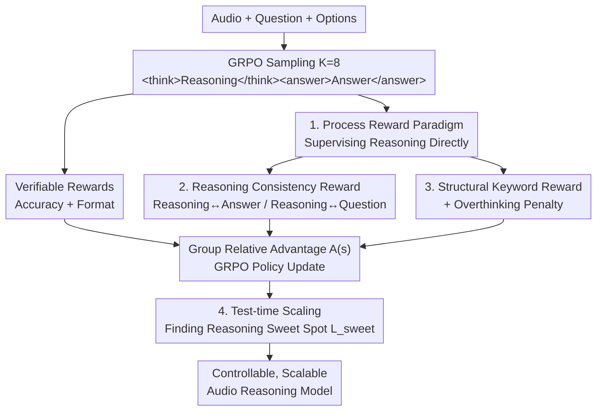

# Incentivizing Consistent, Effective and Scalable Reasoning Capability in Audio LLMs via Reasoning Process Rewards

**Conference**: ICLR 2026  
**OpenReview**: [https://openreview.net/forum?id=DUr48hxO2h](https://openreview.net/forum?id=DUr48hxO2h)  
**Area**: Audio & Speech / LLM Reasoning  
**Keywords**: Audio Large Language Models, Reasoning Process Rewards, GRPO, Test-time Scaling, Inverse Scaling

## TL;DR
Addressing the phenomenon where "thinking more leads to worse performance" (test-time inverse scaling) in Audio LLMs, this paper employs GRPO online reinforcement learning with a multi-faceted reward suite that **rewards the reasoning process itself** (consistency, structural patterns, logical depth, domain knowledge, and overthinking penalty). This transforms reasoning from a burden into a gain, achieving SOTA on MMAU and MMSU while outperforming GPT-4o Audio and Gemini 2.5 Pro.

## Background & Motivation
**Background**: Audio Large Language Models (Audio LLMs, e.g., Qwen2.5-Omni, GPT-4o Audio, Gemini 2.5) have achieved near-human acoustic understanding. The research frontier is shifting from "perception" to "reasoning about the sonic world." In the text domain, Chain-of-Thought (CoT) is a universal remedy for reasoning capability.

**Limitations of Prior Work**: However, CoT often exhibits **test-time inverse scaling** in the audio domain—versions with explicit reasoning perform worse than direct answering, and performance further degrades as the reasoning chain lengthens. The authors diagnose this not as a limit of reasoning capability itself, but as a training failure: models are forced to "think" without being taught "how," leading to hallucinated, inconsistent, and logically loose reasoning chains where errors accumulate over long sequences.

**Key Challenge**: Existing training paradigms fail to address the root cause. SFT on CoT data merely causes the model to **memorize templates**, learning to produce plausible-looking but fragile reasoning traces. Conversely, RLVR (Reinforcement Learning from Verifiable Rewards, such as R1-AQA or Ke-Omni-R) focuses solely on **final answer accuracy and format compliance** as outcome signals, neglecting logical fallacies and failing to reward coherent analysis. Consequently, models can "guess right" through incorrect or irrelevant reasoning, leaving inconsistency and hallucination unresolved.

**Goal**: Transform reasoning from an uncontrollable, stochastic emergence into a **controllable, trainable, and scalable** skill. Specifically, this work aims to simultaneously solve reasoning-answer inconsistency, lack of structured reasoning, and the inverse scaling failure mode.

**Key Insight**: Since outcome-based rewards only supervise the "destination," supervision signals should be applied directly to the **reasoning process**—providing fine-grained feedback on semantic consistency, structural patterns, and logical depth.

**Core Idea**: Shift from "outcome verification" to "rewarding the reasoning process." Use GRPO combined with a multi-faceted reward suite to mold reasoning into a controllable skill and identify the "reasoning sweet spot" during test-time.

## Method

### Overall Architecture
Ours, CESAR (Consistent, Effective and Scalable Audio Reasoners), takes audio-QA samples $(a_i, q_i, C_i, y_i)$ as input. It trains an Audio LLM $\pi_\theta$ to produce both a reasoning chain $t_i$ and an answer $\hat{y}_i$ using the structured format `<think>reasoning</think><answer>answer</answer>`, allowing for separate evaluation of reasoning quality and answer correctness.

The pipeline is an **online reinforcement learning loop**: for each sample, $K=8$ responses are sampled using the current policy. A **multi-faceted reward suite** scores each response, and GRPO is used to calculate relative advantage within the group to update the policy. This reward suite is key—beyond traditional verifiable rewards (accuracy + format), it incorporates three categories of **reasoning process rewards**: reasoning-answer/question consistency, structural keywords (patterns + logic + domain), and an overthinking penalty. Post-training, **test-time scaling** is used to scan different maximum thinking lengths to find the "reasoning sweet spot" for peak performance.

### Key Designs

**1. Decomposition into Process Rewards: Directing Supervision to the Reasoning Chain**

Traditional RLVR rewards are defined as $R_{\text{RLVR}}(s_i) = \mathbb{I}[\hat{y}_i = y_i] + \mathbb{I}[\text{ValidFormat}(s_i)]$. By only checking the answer and format, the model cannot distinguish between "valid reasoning" and "guessing correctly," leading to stochastic reasoning behaviors. Ours decomposes the total reward into two complementary parts:

$$R_{\text{total}}(s_i) = \underbrace{\alpha_1 R_{\text{acc}} + \alpha_2 R_{\text{format}}}_{\text{Verifiable Rewards}} + \underbrace{\alpha_3 R_{\text{consistency}} + \alpha_4 R_{\text{keywords}} + \alpha_5 R_{\text{overthinking}}}_{\text{Reasoning Process Rewards}}$$

Process rewards focus on quality, consistency, and conciseness. Accuracy is weighted highest ($\alpha_1 = 5.0$, others $\alpha_{2\text{-}5} = 1.0$) to ensure correctness while allowing process rewards to shape the reasoning path.

**2. Reasoning Consistency Reward: Bridging Reasoning-Answer Disconnection**

To mitigate the failure mode where reasoning and answers are decoupled (e.g., analyzing "three rings" but answering "2"), consistency rewards utilize bidirectional semantic alignment:

$$R_{\text{consistency}}(s_i) = \text{Sim}_{\text{semantic}}(t_i, \hat{y}_i) + \text{Sim}_{\text{semantic}}(t_i, Q_i)$$

Where $Q_i = (q_i, C_i)$ is the full context. $\text{Sim}(t_i, \hat{y}_i)$ forces the reasoning chain to support its own conclusion, and $\text{Sim}(t_i, Q_i)$ anchors the reasoning to the problem context to suppress hallucinations. Semantic similarity is implemented via concept overlap:

$$\text{Sim}_{\text{semantic}}(x, y) = \frac{\text{ConceptOverlap}(x, y)}{\max(|\text{Concepts}(x)|, |\text{Concepts}(y)|)}$$

**3. Structural Keyword Reward + Overthinking Penalty: Balancing Depth and Conciseness**

Positive structural rewards act as cognitive scaffolding:

$$R_{\text{keywords}}(s_i) = R_{\text{pattern}}(s_i) + R_{\text{logic}}(s_i) + R_{\text{domain}}(s_i)$$

$R_{\text{pattern}}$ rewards structured architectures (e.g., sequential organization, comparative analysis), $R_{\text{logic}}$ rewards logical markers (e.g., deduction, hypothesis testing), and $R_{\text{domain}}$ uses weighted summation $\sum w_d \cdot \mathbb{I}[\text{Term}_d \in t_i]$ to reward the use of professional acoustic, musical, or speech terminology.

The overthinking penalty addresses error accumulation in long chains:

$$R_{\text{overthinking}}(s_i) = 1 - \frac{|t_i|}{L_{\text{max\_output}}}$$

This linear penalty forces the model to develop metacognition on when to stop, preventing repetitive analysis and hallucination.

**4. Test-time Scaling and the Reasoning Sweet Spot**

Ours defines test-time scaling by evaluating performance $P(L_{\text{max\_think}})$ across different maximum thinking lengths. The length at which peak performance occurs is the **Reasoning Sweet Spot** $L_{\text{sweet}} = \arg\max_L P(L)$. CESAR's performance steadily climbs to a peak, and the overthinking penalty allows it to reach a higher peak at a **shorter chain length (approx. 35–40 tokens)** compared to baselines that either collapse or show no gain.

### Loss & Training
GRPO is used for process-oriented control: for each sample, $K=8$ responses are sampled to optimize $L_{\text{GRPO}} = L_{\text{PG}}^{\text{multi-faceted}} + \beta \cdot L_{\text{KL}}$. The advantage function $A(s_i^{(k)})$ uses group relative rewards to help the model distinguish high-quality from low-quality reasoning. Data augmentation is applied to the training set by generating linguistic variants of questions while keeping audio and answers invariant. Qwen2.5-Omni-7B is used as the base model, trained on AVQA.

## Key Experimental Results

### Main Results
On the OOD MMAU Test-mini (covering 27 reasoning skills), CESAR achieved SOTA, surpassing GPT-4o Audio and Gemini 2.5 Pro:

| Method | Reasoning | Sound | Music | Speech | Total Acc |
|------|------|-------|-------|--------|---------|
| **CESAR** | ✓ | 83.48 | 73.05 | 74.77 | **77.10** |
| CESAR | ✗ | 79.88 | 67.96 | 73.27 | 73.70 |
| CESAR w/o Overthinking Penalty | ✓ | 81.98 | 70.06 | 77.48 | 76.50 |
| Ke-Omni-R (RL Baseline) | ✓ | 79.28 | 70.06 | 74.47 | 74.60 |
| Gemini 2.5 Pro | - | 75.08 | 68.26 | 71.47 | 71.60 |
| GPT-4o Audio | - | 64.56 | 56.29 | 66.67 | 62.50 |
| Qwen2.5-Omni-7B (Base) | ✓ | 69.07 | 59.58 | 66.97 | 65.20 |
| Qwen2.5-Omni-7B (Base) | ✗ | 72.37 | 64.37 | 69.07 | 68.60 |

The base model shows clear test-time inverse scaling (65.20 with reasoning vs 68.60 without), while CESAR resolves this issue (77.10 vs 73.70).

### Ablation Study
| Configuration | MMAU Total Acc | Note |
|------|--------------|------|
| CESAR (Full) | 77.10 | Sweet spot at ~35–40 tokens |
| CESAR w/o Overthinking Penalty (OP) | 76.50 | Lower peak, requires longer chains |
| Ke-Omni-R (Outcome reward only) | 74.60 | Lacks process rewards |
| Qwen2.5-Omni-7B (Base + CoT) | 65.20 | Inverse scaling observed |

Human evaluation shows CESAR has an **88.60%** win rate in reasoning quality against the base Qwen2.5-Omni and **63.10%** against the strong RL baseline Ke-Omni-R.

### Key Findings
- **Overthinking Penalty (OP) is critical**: Removing it lowers the peak to 76.5% and requires longer chains. OP allows for higher accuracy with more efficient, condensed reasoning.
- **Process vs Outcome Advantage**: The superiority of CESAR over Ke-Omni-R is most pronounced in reasoning-intensive categories, proving that process rewards cultivate more robust, generalizable reasoning.
- **Synergy**: Enhanced reasoning also improves underlying perception; the version of CESAR without explicit reasoning (73.70) still significantly outperforms the base model.

## Highlights & Insights
- **Diagnosis of Test-time Inverse Scaling**: The first work to systematically prove that "CoT makes audio worse" is a training artifact, not an inherent utility limit of reasoning.
- **Process Reward Paradigm**: A transferable framework that converts consistency, logic, and domain knowledge into computable rewards for GRPO, applicable to any RLVR scenario.
- **Consistency via Concept Overlap**: A lightweight, multiplier-free method to bridge the reasoning-answer gap without external scoring models.
- **Reasoning Sweet Spot**: Frames test-time scaling as a zero-cost tuning knob for performance, revealing the optimal reasoning depth of the model.

## Limitations & Future Work
- **Perception Bottleneck**: Reasoning performance is near-human, but perception tasks still show a significant gap compared to human levels.
- **Proxy Signals**: Structural and domain rewards rely on keyword/pattern detection, which may lead to reward hacking.
- **Narrow Task Scope**: Primarily validated on Multiple Choice Questions (MCQ); applicability to open-ended generation or multi-turn dialogue remains to be tested.

## Related Work & Insights
- **vs SFT-on-CoT**: Unlike SFT which results in template imitation, CESAR uses process-reward RL to cultivate genuine analytical capabilities.
- **vs RLVR (Ke-Omni-R, R1-AQA)**: These rely on outcome signals. CESAR addresses the reasoning-answer misalignment that outcome rewards cannot reach.
- **vs Text-based o1 / DeepSeek-R1**: While those models prove RL works for text reasoning, this work adapts the concept to audio and solves the modality-specific inverse scaling problem.

## Rating
- Novelty: ⭐⭐⭐⭐⭐ 
- Experimental Thoroughness: ⭐⭐⭐⭐⭐ 
- Writing Quality: ⭐⭐⭐⭐ 
- Value: ⭐⭐⭐⭐⭐ 

<!-- RELATED:START -->

## Related Papers

- [\[ICLR 2026\] UALM: Unified Audio Language Model for Understanding, Generation and Reasoning](ualm_unified_audio_language_model_for_understanding_generation_and_reasoning.md)
- [\[ICLR 2026\] OWL: Geometry-Aware Spatial Reasoning for Audio Large Language Models](owl_geometry-aware_spatial_reasoning_for_audio_large_language_models.md)
- [\[ICLR 2026\] PrismAudio: Decomposed Chain-of-Thought and Multi-dimensional Rewards for Video-to-Audio Generation](prismaudio_decomposed_chain-of-thought_and_multi-dimensional_rewards_for_video-t.md)
- [\[ICLR 2026\] STAR-Bench: Probing Deep Spatio-Temporal Reasoning as Audio 4D Intelligence](star-bench_probing_deep_spatio-temporal_reasoning_as_audio_4d_intelligence.md)
- [\[ICLR 2026\] AVERE: Improving Audiovisual Emotion Reasoning with Preference Optimization](avere_improving_audiovisual_emotion_reasoning_with_preference_optimization.md)

<!-- RELATED:END -->
