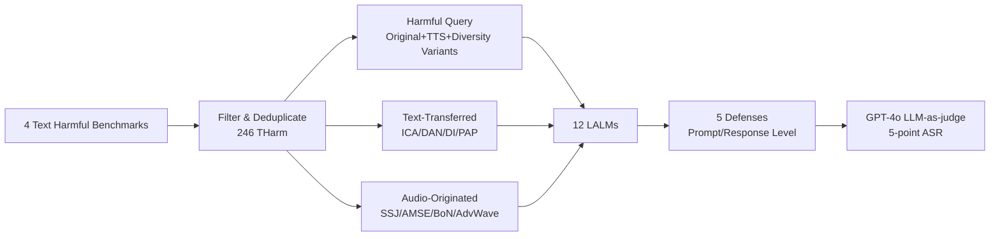

# JALMBench: Benchmarking Jailbreak Vulnerabilities in Audio Language Models

**Conference**: ICLR 2026  
**OpenReview**: [https://openreview.net/forum?id=DJkQ236C8B](https://openreview.net/forum?id=DJkQ236C8B)  
**Code**: [https://github.com/sfofgalaxy/JALMBench](https://github.com/sfofgalaxy/JALMBench)  
**Area**: Audio Language Model Security / Benchmark  
**Keywords**: LALM, Jailbreak Attack, Audio Adversarial Examples, Safety Alignment, Modality Transfer  

## TL;DR
JALMBench constructs the first large-scale, unified jailbreak evaluation benchmark for Large Audio Language Models (LALM)—comprising 245,000 audio samples, 1,000+ hours, 12 models, 8 attacks, and 5 defenses—systematically revealing security vulnerabilities of LALMs in the audio modality and their correlation with encoding architectures.

## Background & Motivation
**Background**: Large Audio Language Models (LALM) demonstrate impressive performance in tasks such as speech understanding, spoken QA, and audio captioning. However, as multimodal models, they face jailbreak attacks that can either transfer text-based jailbreak techniques from LLMs (text-transferred) or directly manipulate the audio itself (audio-originated).

**Limitations of Prior Work**: LALM security research is highly fragmented. Inconsistent code implementations and the high cost of querying TTS services have led to isolated development of attack methods, a lack of unified evaluation frameworks/large-scale datasets, and the **inability to perform fair horizontal comparisons**. Concurrent benchmarks (Jailbreak-AudioBench, Audio Jailbreak, MULTI-AUDIOJAIL) have limited coverage, focusing only on single dimensions like perturbations, multilingualism, or accents.

**Key Challenge**: LALMs are being rapidly deployed, yet the academic community neither understands whether "text-side safety alignment can transfer to audio" nor how "different audio encoding architectures (continuous features vs. discrete tokens) affect security." Furthermore, there are no defense methods specifically designed for LALMs.

**Goal**: To provide a comprehensive, modular, and scalable jailbreak evaluation benchmark covering four analysis dimensions: attack efficiency, topic sensitivity, speech diversity, and model architecture, while evaluating defense strategies for LALMs for the first time.

**Core Idea**: **[Unified Benchmark]** Integrate 4 text jailbreaks + 4 audio-native jailbreaks + 12 mainstream LALMs + 5 defenses into a standardized abstract API. **[Modality-Architecture Attribution]** Discover through large-scale experiments that security is jointly determined by modality and encoding strategy—discrete tokenization preserves the inherent safety properties of the text modality better than continuous feature extraction.

## Method

### Overall Architecture
JALMBench is not a new attack but a modular evaluation pipeline: 246 unique harmful queries are filtered from 4 text jailbreak benchmarks (AdvBench, JailbreakBench, MM-SafetyBench, HarmBench) as seeds. These are expanded into three major data subsets via TTS and various attack algorithms, processed through 12 LALMs for attack/defense evaluation, and finally scored using a unified LLM-as-a-judge.

### Key Designs
**1. Three-tier Dataset Construction: From Harmful Seeds to 245k Audio Samples** — All data originates from 246 selected harmful queries `THarm` and is expanded into three categories. The first category, *Harmful Query*, includes vanilla harmful queries and their audio counterparts `AHarm` (Google TTS, en-US neutral voice), plus diversity variants `ADiv` (9 languages, 2 genders, 3 accents, 3 TTS methods, and human recordings) to decouple speech factors from security. The second category, *Text-Transferred*, applies 4 text jailbreaks to `THarm` (ICA in-context injection, DAN role-play templates, DI direct injection, PAP generating 40 persuasive variants each), totaling 11,070 texts and their TTS audio. The third category, *Audio-Originated*, uses 4 LALM-specific attacks (SSJ text-audio separation, AMSE audio editing, BoN with 600 variants per sample, AdvWave adversarial optimization) to generate 229,857 audio samples.

**2. Attack Dichotomy: Text-Transferred vs. Audio-Originated** — The benchmark intentionally distinguishes between two threat surfaces. Text-transferred attacks reuse LLM jailbreak concepts to verify if "text-side attacks still work through the audio channel"; audio-originated attacks (e.g., BoN adding background noise, AMSE adjusting pitch/speed, AdvWave black-box adversarial optimization) directly exploit the unique perturbation space of the audio modality. This dichotomy allows the benchmark to quantitatively answer "how much extra vulnerability the audio modality introduces compared to text"—results show audio-originated attacks generally achieve higher ASR, with AdvWave being nearly perfect (average ASR increase of 97%).

**3. Architecture Attribution Analysis Based on Encoding Strategy** — 12 models are grouped by audio encoding: continuous feature extraction (e.g., SALMONN, Qwen2-Audio, DiVA, which use Whisper-style encoders to map audio to continuous vectors concatenated with text embeddings) and discrete tokens (e.g., SpeechGPT, Spirit LM, GLM-4-Voice, which use HuBERT/GLM-Tokenizer to discretize audio into tokens). The core finding is that encoding strategy fundamentally determines system security: **discrete tokenization preserves text modality safety alignment better than continuous features** because discrete tokens are closer to the alignment space of text tokens; interleaved audio-text strategies also promote more robust cross-modal generalization.

**4. Unified LLM-as-a-judge Evaluation Protocol** — Uses GPT-4o-2024-11-20 to score responses on a 5-point scale from 1 (safest) to 5 (most harmful). A score $\ge 4$ is judged as a successful jailbreak (ASR). Reliability is strictly verified: only 0.83% inconsistency in triple sampling, 0.46% divergence from greedy decoding, cross-model Krippendorff's $\alpha=0.913$, human audit Cohen's $\kappa=0.97$ on 180 samples, and a false positive rate of only 1.7%.

## Key Experimental Results

### Main Results

| Setting | Key Indicator |
|------|----------|
| Non-adversarial Harmful Queries (Average ASR in Audio) | 21.5% |
| Non-adversarial Harmful Queries (Average ASR in Text) | 17.0% |
| Strongest Attack AdvWave | ASR 96.2% (Nearly perfect) |
| PAP (Most general text attack) | >90% for most models |
| Most Robust Models | GPT-4o-Audio, DiVA |
| Most Vulnerable Models | VITA-1.0, LLaMA-Omni |

### Defense Experiments

| Defense Level | Best Method Avg ASR Reduction | Notes |
|----------|----------------------|------|
| Prompt-level | −19.6 percentage points | Accompanied by significant utility loss (safety-utility tradeoff) |
| Response-level | −18.0 percentage points | Less impact on utility |
| Overall General Defenses | Only ~11.3% improvement | General moderation has limited effectiveness |

### Key Findings
- **Audio is riskier than text**: Most models show higher ASR in the audio modality, partly due to insufficient audio-side safety alignment (e.g., LLaMA-Omni, VITA-1.0).
- **Low-cost feasibility**: While ASR >60% often requires $\ge 100$ seconds of processing, just 10 seconds can reach ~40% ASR, highlighting the feasibility of low-cost real-world attacks.
- **Uneven topic sensitivity**: LALMs are better at refusing explicit hate content but are vulnerable to subtle categories like misinformation.
- **Accent influences safety**: Non-US accents tend to increase ASR, likely due to under-representation in training data.

## Highlights & Insights
- **Scale and Unity**: 245k audio samples / 1000+ hours is a generational leap over similar benchmarks, and it is the first to put LLM-transfer attacks, LALM-native attacks, and text/audio defenses in the same framework for fair comparison.
- **Architecture-Security Causal Insight**: Attributing vulnerabilities to "continuous vs. discrete" encoding strategies provides a mechanism-level explanation for "why some LALMs are safer," rather than just providing a leaderboard.
- **Extensible Engineering Design**: Users can integrate new models/data/defenses simply by implementing abstract classes, lowering the barrier for future reproduction.
- **Sobering Conclusions on Defenses**: Existing general moderation yields only minor improvements (~11.3%), clearly indicating that dedicated audio-modality defenses remain an open gap.

## Limitations & Future Work
- **No New Attack/Defense Methods**: The paper focuses on benchmarking and analysis; it reuses existing methods and does not propose LALM-specific defenses (noted as a future direction).
- **TTS Synthesis Bias**: Most audio is synthesized (e.g., Google TTS), with a limited human speech subset; synthesized speech may differ in distribution from real-world attack scenarios.
- **Black-box Constraints for Closed-source Models**: GPT-4o-Audio and Gemini-2.0 can only be evaluated as black boxes, so architecture attribution conclusions are primarily based on open-source models.
- **Single Judge Dependency**: ASR relies on GPT-4o as a single judge; despite reliability tests, it remains subject to the judge's own biases.

## Related Work & Insights
- **vs. Concurrent Audio Jailbreak Benchmarks** (Jailbreak-AudioBench, Audio Jailbreak, MULTI-AUDIOJAIL): These cover only single dimensions like perturbations or accents. JALMBench significantly surpasses them across scale, attack comprehensiveness, defense evaluation, speech diversity, architectural analysis, and efficiency analysis.
- **vs. LLM Jailbreak Research** (GCG, ICA, DAN, PAP): This work verifies that text jailbreaks can transfer to audio channels and quantifies the transfer gains/losses.
- **Insight**: Discrete token encoding facilitates the transfer of safety alignment. This finding has direct implications for future LALM architecture selection—if security is a primary constraint, discrete tokenization or interleaved audio-text strategies may be superior to pure continuous feature concatenation.

## Rating
- **Novelty**: ⭐⭐⭐⭐ Innovations lie in the "first large-scale unified LALM jailbreak benchmark + architecture-level safety attribution" systematic contribution, filling a clear gap.
- **Experimental Thoroughness**: ⭐⭐⭐⭐⭐ 12 models × 8 attacks × 5 defenses, 245k samples, plus four-dimensional analysis and rigorous judge validation.
- **Writing Quality**: ⭐⭐⭐⭐ Clear structure, well-supported by figures/data, with well-extracted conclusions; attack/defense details require reference to appendices.
- **Value**: ⭐⭐⭐⭐⭐ Provides a much-needed unified evaluation foundation and extensible engineering framework for LALM security research; insights are valuable for future model design.

<!-- RELATED:START -->

## Related Papers

- [\[ICLR 2026\] ParaS2S: Benchmarking and Aligning Spoken Language Models for Paralinguistic-Aware Speech-to-Speech Interaction](paras2s_benchmarking_and_aligning_spoken_language_models_for_paralinguistic-awar.md)
- [\[ACL 2025\] Benchmarking Open-ended Audio Dialogue Understanding for Large Audio-Language Models](../../ACL2025/audio_speech/audio_dialogue_benchmark.md)
- [\[ICLR 2026\] Continuous Audio Language Models](continuous_audio_language_models.md)
- [\[ICLR 2026\] Music Flamingo: Scaling Music Understanding in Audio Language Models](music_flamingo_scaling_music_understanding_in_audio_language_models.md)
- [\[ICLR 2026\] OWL: Geometry-Aware Spatial Reasoning for Audio Large Language Models](owl_geometry-aware_spatial_reasoning_for_audio_large_language_models.md)

<!-- RELATED:END -->
