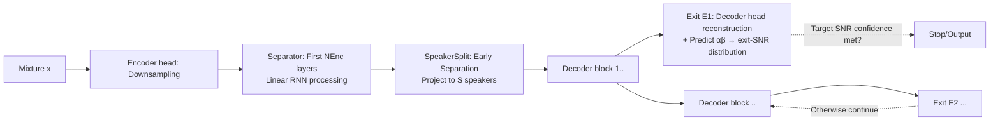

# Knowing When to Quit: Probabilistic Early Exits for Speech Separation Networks

**Conference**: ICLR 2026  
**OpenReview**: [https://openreview.net/forum?id=RKzBRfV6J8](https://openreview.net/forum?id=RKzBRfV6J8)  
**Code**: TBD  
**Area**: Speech Separation / Dynamic Inference / Probabilistic Modeling  
**Keywords**: Speech Separation, Early-exit, Uncertainty Modeling, Student-t Likelihood, Dynamic Computation, TasNet  

## TL;DR
This paper proposes PRESS: a probabilistic model using a "signal + error variance" framework to estimate **interpretable predicted SNR distributions** for each early-exit point in speech separation networks. It decides when to stop computation during inference based on the "confidence in reaching the target SNR," achieving dynamic computational scaling without sacrificing reconstruction quality.

## Background & Motivation
- **Background**: Since TasNet, single-channel speech separation has been dominated by deep networks like Conv-TasNet, SepFormer, and SepReformer, which constantly achieve new SOTA results in "separation quality per unit of computation." However, these are **static networks** with fixed computational costs and parameters, making them unable to adaptively reduce computation for simple inputs like non-overlapping speech, low noise, or silence.
- **Limitations of Prior Work**: Rigid computational budgets hinder deployment on embedded or heterogeneous devices like phones and hearing aids, which require dynamic scaling based on resources and power. Prior early-exit solutions have two major flaws: (1) Exit conditions are defined **implicitly** via loss functions (convex combinations of reconstruction and utilization losses), freezing the performance-computation tradeoff at training time; (2) Exits are based on similarity between adjacent layer representations, which does **not link to any performance metrics** and lacks interpretability.
- **Key Challenge**: There is a need for exit conditions **directly anchored to interpretable performance metrics** (e.g., "error is below target SNR") without requiring the target signal (which is unknown at inference) and avoiding the fragility of multi-objective weight tuning.
- **Goal**: Design a separation/enhancement network with **early-exit capabilities** paired with an **uncertainty-aware probabilistic framework**. This allows exit conditions to be expressed in terms of "expected SNR" without manual weight tuning between quality and exit precision during training.
- **Core Idea**: **Probabilistically model the target signal and error variance**. For each exit point, predict both the clean speech estimate $\hat{x}_i$ and the error variance $\sigma_i^2$. By applying a conjugate inverse-Gamma prior to the variance and marginalizing it out, a Student-t likelihood is obtained as the sole training objective. This distribution is then used to **derive an analytical distribution of the predicted SNR**, transforming the exit decision into whether the "confidence of reaching the target SNR" is sufficiently high.

## Method

### Overall Architecture
PRESS (PRobabilistic Early-exit for Speech Separation) consists of two parts: a **probabilistic speech modeling** layer (providing training targets and exit criteria) and the **PRESS-Net architecture** (an encoder–separator–decoder design without downsampling in the separator, inserting multiple "early reconstruction" exit points along the depth). During training, all exit points share a summed Student-t likelihood objective (no per-exit weighting needed). During inference, each exit outputs $(\hat{x}_i,\alpha_i,\beta_i)$ to evaluate if the predicted SNR exceeds the target with sufficient confidence.

### Key Designs

**1. Student-t Likelihood: Learning reconstruction and uncertainty with one objective.** The target $x_j$ is modeled as a Gaussian with mean $\hat{x}_i$ and variance $\sigma_i^2$. An inverse-Gamma prior $\mathrm{InvGam}(\alpha_i,\beta_i)$ is placed on $\sigma_i^2$. Marginalizing out the variance yields the multivariate Student-t likelihood $L_i = \mathrm{St}(x_j\mid\hat{x}_i,2\alpha_i,\frac{\beta_i}{\alpha_i}I)$, where the log-likelihood is $\ln L_i \propto -(\alpha_i+\tfrac{T}{2})\ln(1+\tfrac{\|x_j-\hat{x}_i\|_2^2}{2\beta_i}) - \tfrac{T}{2}\ln\beta_i + \cdots$. This term naturally balances "reducing the error/variance ratio" and "penalizing underestimated variance." Thus, **a single objective learns both reconstruction quality and error uncertainty**, eliminating the fragile reconstruction + utilization loss weighting. For multiple speakers, uPIT is used, and for multiple exits, a joint permutation is applied across all exits to prevent speakers from swapping.

**2. Three SNR-like exit conditions derived from distribution.** Given the distributional assumptions for $x_j$ and the error, the error energy follows a (non-central) Chi-squared distribution. Consequently, SNR and SNRi can be expressed as ratios of Chi-squared variables. For large frame lengths $T$, the ratio converges to the conditional mean, degenerating into a **shifted Gamma distribution**, e.g., $\mathrm{SNR}\xrightarrow{T\to\infty}1+z_{\text{SNR}}$, where $z_{\text{SNR}}\sim\mathrm{Gam}(\alpha_i,\tfrac{\|\hat{x}_i\|_2^2}{\beta_i T})$. This allows the exit condition to be **directly expressed as an analytical distribution of predicted SNR**, allowing the calculation of confidence for "SNR ≥ t" for any target level $t$. To handle silence/no-interference cases where SNR might fail, a **reference loudness condition** $\mathrm{SNR}_{\text{ref}}$ is added, comparing fixed reference power $P_{\text{ref}}^2$ to predicted noise energy.

**3. Unified exit criterion with optimistic-pessimistic aggregation.** For a single speaker, the maximum of the complementary CDFs of the three conditions is taken (**optimistic**): $p(\mathrm{SNR}_{\text{exit}}\ge t)=\max\{p(\mathrm{SNR}\ge t),\,p(\mathrm{SNRi}\ge t),\,p(\mathrm{SNR}_{\text{ref}}\ge t)\}$, meaning the exit is triggered if any condition is met. Across speakers, the minimum is taken (**pessimistic**) and compared against a threshold $p$: $\min_i p(\mathrm{SNR}_{\text{exit}}\ge t)\ge p$. This criterion provides both target level $t$ (cleanliness) and confidence $p$ (certainty), both of which are **adjustable at inference time**, so the performance-compute tradeoff is no longer frozen by training.

**4. PRESS-Net: A non-downsampling separator for "early reconstruction".** It follows the encoder-separator-decoder and early split of SepReformer but **deliberately avoids downsampling** within the separator so that any exit point can reconstruct speech without upsampling artifacts. Since this results in high temporal resolution, making self-attention complexity prohibitive, a **Self-Gated Linear RNN** is used as the backbone, paired with sparse cross-speaker attention (Linear RNN:Speaker Attention = 5:1). Stability is maintained via LayerScale (per-channel scaling $\gamma$ initialized at $10^{-5}$) + pre-norm + RMSNorm. Exit points are placed every few decoder blocks.

**5. Block-likelihood and Calibration Fine-tuning.** A global single $\sigma_i^2$ assumes error stationarity, which is unrealistic for audio. **Block-likelihood** models every $T$ consecutive samples with independent $\sigma_{i,b}^2$. Calibration is evaluated using PIT and CRPS. The paper found that models trained on 4s segments **calibrate poorly** on full-length audio; fine-tuning on full-length audio for ~3% of extra steps significantly improves both calibration and separation performance.

## Key Experimental Results

### Main Results (WSJ0-2mix / Libri2Mix / WHAM! / WHAMR!, SI-SNRi dB)

| Model | WSJ0-2mix | Libri2Mix | WHAM! | WHAMR! | #Params(M) | GMAC/s |
|---|---|---|---|---|---|---|
| Conv-TasNet | 15.3 | 12.2 | 12.7 | 8.3 | 5.1 | 10.5 |
| SepFormer | 20.4 | 19.2 | 14.7 | 14.0 | 26.0 | 86.9 |
| SepReformer (T) | 22.4 | 19.7 | 17.2 | – | 3.7 | 10.4 |
| SepReformer (M) | 24.2 | 22.0 | 17.8 | – | 17.3 | 81.3 |
| **PRESS-4 @4 (S)** | 22.91 | 20.04 | 16.49 | 14.54 | 3.4 | 11.3 |
| **PRESS-12 @8 (M)** | 23.47 | 20.42 | 16.57 | 14.67 | 15.6 | 54.4 |
| **PRESS-12 @12 (M)** | 24.28 | 20.88 | 16.65 | 14.69 | 22.4 | 79.7 |
| **PRESS-4 @4 (S) + FT** | 23.41 | 21.01 | 17.25 | 15.13 | 3.4 | 11.3 |
| **PRESS-12 @12 (M) + FT** | 24.36 | 21.29 | 17.49 | 15.67 | 22.4 | 79.7 |

> A single network outputs at multiple exit points (@4/@8/@12), with quality increasing monotonically with depth. The small PRESS-4 matches SepReformer (T), and full-length fine-tuning (+FT) approaches or exceeds larger static models.

### Ablation Study (PRESS-4 (S), WSJ0-2mix)

| Training Config Ablation | SI-SNRi | SDRi | #Params |
|---|---|---|---|
| (a) SI-SNR Loss | 22.95 | 23.1 | 3.55M |
| (b) Normal Likelihood | 22.42 | 22.58 | 3.55M |
| (c) t-Likelihood + Per-exit uPIT | 21.1 | 20.97 | 3.55M |
| (d) t-Likelihood + 6 Exits | 22.89 | 23.01 | 3.57M |
| (e) t-Likelihood + 12 Exits | 22.9 | 22.99 | 3.66M |
| (f) t-Likelihood + 200K FT | 22.9 | 23.11 | 3.55M |

| Block size T | SI-SNRi | Receptive Field |
|---|---|---|
| 8000 | 22.82 | 1000ms |
| 2000 | 22.79 | 250ms |
| 500 | 22.69 | 62ms |

### Key Findings
- **(a)** Student-t likelihood can replace SI-SNR without performance loss. **(b)** Simple normal likelihood performs worse.
- **(c)** **Joint permutation** of adjacent exits is critical; allowing speakers to swap between exits breaks the early-separation design, dropping performance to 21.1.
- **(d)(e)** Increasing exit points from 4 to 6/12 does not harm performance at any exit point.
- **Dynamic Inference**: Scaling with probabilistic exit conditions yields an efficiency curve **superior to those formed by static exit points**. Single-exit models are less efficient at deep exits than jointly trained ones.
- **Speech Enhancement**: On DNS2020, PRESS-12 @12 (M) achieves SI-SDR 22.15 and STOI 97.13, competitive with TF-Locoformer and ZipEnhancer at similar GMAC/s.

## Highlights & Insights
- **Interpretable Exit Criteria**: Moving from "representation similarity" to "90% certain that error is below 22 dB." Exit conditions are linked to **interpretable metrics** and **adjustable confidence**.
- **Single Objective over Multi-target Weighting**: While traditional early-exits require manual tuning of reconstruction and utilization losses, the Student-t likelihood unifies reconstruction and uncertainty, deferring the tradeoff to inference time.
- **Architecture-Criterion Synergy**: Avoiding downsampling in the separator allows for clean reconstructions at shallow exits, which in turn necessitates efficient backbones like Linear RNNs. Joint permutation ensures speaker consistency across exits.
- **Calibration Matters**: Using PIT/CRPS to quantify if predicted variance is trustworthy reveals that training-inference length mismatch breaks calibration. Minor fine-tuning on full-length audio fixes this, which is essential for "confidence-based" exits.

## Limitations & Future Work
- **Per-speaker Independent Exit**: Currently uses the minimum confidence across speakers (everyone must satisfy the criterion). Implementing independent exits for each speaker is a key future direction.
- **Large T Approximation**: The SNR distribution approximation as a shifted Gamma relies on large frame lengths; reliability in short-block or low-latency online scenarios requires caution.
- **Calibration Dependence**: Poor calibration when moving from 4s training to full-length audio suggests sensitivity to distribution shifts.
- **Perceptual Quality in Enhancement**: On DNS2020, WB-PESQ (e.g., PRESS-12 3.10) lags behind specialized enhancement SOTA (TF-Locoformer 3.72), indicating room for improvement in perceptual metrics.

## Related Work & Insights
- **Early-exit Taxonomy**: Differs from BranchyNet (entropy) slotting or universal transformers (halting probabilities) by providing **interpretable, performance-anchored, and inference-adjustable** exit conditions.
- **TasNet and SepReformer**: Architecture evolves from SepReformer but adopts Linear RNNs and removes separator downsampling to serve "early reconstruction."
- **Uncertainty/Iterative Refinement**: Complements works like SepIt (SNR bounds) and DiffSep (diffusion steps) by providing a explicit "calibrated probabilistic SNR confidence" halting criterion.
- **Insight**: Modeling exit conditions as "predicted distributions of performance metrics" is a generalizable paradigm for other regression tasks (super-resolution, time-series) where quality can be expressed as a ratio.

## Rating
- **Novelty**: ⭐⭐⭐⭐ Reconceptualizing early-exit as a predicted SNR distribution with adjustable confidence using Student-t likelihood is elegant and rare.
- **Experimental Thoroughness**: ⭐⭐⭐⭐ Covers various separation and enhancement datasets with comprehensive ablation and efficiency curves. Enhancement perceptual metrics are a slight gap.
- **Writing Quality**: ⭐⭐⭐⭐ Clear derivations, intuitive figures (spectrograms, efficiency/calibration curves), and strong logical flow between architecture and criteria.
- **Value**: ⭐⭐⭐⭐ Strong potential for deployment in resource-constrained, interpretable dynamic separation scenarios like hearing aids.

<!-- RELATED:START -->

## Related Papers

- [\[ICLR 2026\] Toward Complex-Valued Neural Networks for Waveform Generation](toward_complex-valued_neural_networks_for_waveform_generation.md)
- [\[ICLR 2026\] MAPSS: Manifold-Based Assessment of Perceptual Source Separation](mapss_manifold-based_assessment_of_perceptual_source_separation.md)
- [\[ICLR 2026\] Efficient Audio-Visual Speech Separation with Discrete Lip Semantics and Multi-Scale Global-Local Attention](efficient_audio-visual_speech_separation_with_discrete_lip_semantics_and_multi-s.md)
- [\[ICLR 2026\] When and Where to Reset Matters for Long-Term Test-Time Adaptation](when_and_where_to_reset_matters_for_long-term_test-time_adaptation.md)
- [\[ICLR 2026\] When Style Breaks Safety: Defending LLMs Against Superficial Style Alignment](when_style_breaks_safety_defending_llms_against_superficial_style_alignment.md)

<!-- RELATED:END -->
