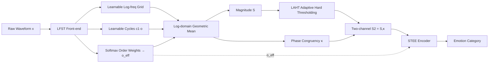

# Learnable Fractional Superlets with a Spectro-Temporal Emotion Encoder for Speech Emotion Recognition

**Conference**: ICLR 2026  
**OpenReview**: [https://openreview.net/forum?id=uZGEEL20mU](https://openreview.net/forum?id=uZGEEL20mU)  
**Code**: [https://github.com/alaaNfissi/LFST-for-SER](https://github.com/alaaNfissi/LFST-for-SER)  
**Area**: Speech Emotion Recognition / Learnable Time-Frequency Front-end  
**Keywords**: speech emotion recognition, learnable front-end, fractional superlet, time-frequency analysis, phase congruency  

## TL;DR
The classic "super-resolution wavelet" (superlet) is transformed into a fully differentiable, end-to-end learnable time-frequency front-end called LFST. It allows the frequency grid, the number of cycles per band, and the fractional mixture weights to be learned from data. Paired with a lightweight STEE encoder, it achieves SOTA results on three speech emotion datasets with minimal parameter counts.

## Background & Motivation
**Background**: The success of Speech Emotion Recognition (SER) depends heavily on how the front-end expands raw waveforms into a time-frequency (TF) structure. Mainstream front-ends typically use fixed-window STFT/Mel-spectrograms, wavelet transforms, or large self-supervised models like wav2vec 2.0 / HuBERT.

**Limitations of Prior Work**: (1) STFT windows are fixed—long windows offer high frequency resolution but blur transient events, and vice-versa, whereas emotional cues span multiple time scales from micro-prosody to spectral envelopes; (2) Classical wavelets have too few cycles at high frequencies, leading to degraded frequency resolution; (3) Existing superlets (geometric averages of wavelets with different cycle counts) and fractional superlets alleviate "banding" artifacts, but their order, cycles, and weights must be manually tuned and are **neither differentiable nor end-to-end trainable**; (4) Large self-supervised models are computationally expensive and lack interpretability.

**Key Challenge**: The trade-off between temporal and spectral resolution has long been treated as a **fixed design choice** hard-coded into the front-end, failing to adapt to signal statistics and task objectives.

**Goal**: To transform this "TF trade-off" from a fixed prior into a **data-driven inductive bias**, allowing the front-end to self-learn which frequency bands require sharper temporal resolution or narrower frequency focus.

**Core Idea**: **[Learnable Fractional Superlet]** uses softmax-normalized weights to create convex combinations across discrete orders, deriving a continuously variable "effective order" for each frequency band. It aggregates Morlet responses across multiple cycle counts using a geometric mean in the log-domain, making the frequency grid, cycle counts, and order weights fully trainable via backpropagation.

## Method

### Overall Architecture
The system consists of two parts in series: the **LFST** (Learnable Fractional Superlet Transform) front-end, which converts the raw waveform into a two-channel TF map—magnitude $S$ and phase congruency $\kappa$; and the **STEE** (Spectro-Temporal Emotion Encoder), which ingests these channels alongside the effective order $o_{\text{eff}}$ for FiLM modulation to output emotion categories. The entire pipeline is trained end-to-end using focal loss, with all LFST parameters (frequency grid, cycle counts, order weights, thresholds) updated via gradients.

### Key Designs

**1. Learning Fractional Mixtures over a Simplex: From "Adjacent Order Interpolation" to "Full-Order Convex Combinations"**  
Classical fractional superlets only interpolate between adjacent integer orders $\{o_i, o_i+1\}$, meaning the set of participating cycles still jumps at integer boundaries, making it inherently piecewise. This paper learns a set of logits $\theta_{i,o}$ for each frequency band $f_i$ and each order $o \in \{1, \dots, O\}$, passing them through a softmax to obtain weights $w_{i,o} = \exp(\theta_{i,o})/\sum_{o'}\exp(\theta_{i,o'})$ on a simplex. Magnitudes are aggregated via a weighted geometric mean in the log-domain: $S_{f_i}(t) = \exp\!\big(\sum_o w_{i,o}\log(|W_{i,o}(t)|+\varepsilon)\big)$. The effective order is defined as $o_{\text{eff}}(f_i) = \sum_o o\,w_{i,o} \in [1,O]$. This yields a truly continuous mixture across all orders for each band, eliminating banding artifacts. Numerical stability is ensured by log-domain accumulation without explicitly constructing large $[B, F, O, T]$ tensors.

**2. Learnable Log-Frequency Grid and Cycles per Band**  
The frequency grid is no longer uniform or fixed; it is constructed from a set of positive increments learned in the log-frequency domain: $\log f_i = \log f_{\min} + \sum_{j<i}\delta_j$, where $\delta_j \propto \mathrm{softplus}(\vartheta_{\delta,j})$. Normalization and accumulation ensure strict monotonicity and accurate anchoring within $[f_{\min}, f_{\max}]$. The base cycle count for each band is also learnable: $c_1(f_i) = 1 + \mathrm{softplus}(\vartheta_{c,i}) \ge 1$, with higher orders following the multiplicative structure $c_o = o \cdot c_1$. This allows resolution to automatically concentrate on frequency bands containing pitch and formants, where emotional cues are most dense.

**3. Weighted Phase Congruency Channel $\kappa$**  
Beyond magnitude, the authors use the same set of order weights to measure phase alignment across orders: $\kappa_{f_i}(t) = \big|\sum_o w_{i,o}\,W_{i,o}(t)/(|W_{i,o}(t)|+\varepsilon)\big|^2 \in [0,1]$. This essentially sums the unit phasors of each order by weight and takes the magnitude; the more consistent the phases across orders, the closer $\kappa$ is to 1. This channel suppresses broadband impulsive noise (reducing false positives in "Happy" detections). It is concatenated with $S$ as a dual-channel input and used with $o_{\text{eff}}$ to drive FiLM gating in the encoder.

**4. Learnable Asymmetric Hard Thresholding (LAHT)**  
An element-wise smoothing hard thresholding denoiser applied only to magnitude $S$. Thresholds are constructed from parameters via softplus with a tanh bias, clamped to $[\varepsilon, \tau_{\max}]$. Gating is implemented using a stable fast sigmoid with slope $\gamma$, $\sigma_\gamma(z) = \frac{1}{2}(\tanh(\frac{\gamma}{2} z)+1)$, providing a nearly binary yet continuously differentiable switch. It is mapped as $\mathrm{LAHT}(u) = \sigma_\gamma(u_+-\tau_+)u_+ - \sigma_\gamma(u_--\tau_-)u_-$. Small coefficients are pushed toward 0 while large ones pass with unit gain, sparsifying and denoising TF activations while preserving transients, which is particularly effective for low-SNR telephone recordings (NSPL-CRISE).

**5. Compact STEE Encoder**  
A sequence of TF-aware lightweight modules: a depthwise convolutional stem along time (extracting temporal micro-patterns per band without early cross-band mixing) → spectral residual blocks along frequency (capturing short-range cross-band correlations) → two TF-hybrid residual blocks with SE channel recalibration → **Adaptive FiLM Frequency Gating** (using temporal mean/log-std of $S, \kappa$ fused with $o_{\text{eff}}$, projected via Linear(5→1) and $F \to C$ to generate channel gates for content- and order-aware modulation) → local axial self-attention along time after fixed-stride downsampling (linear cost) → Attentive Statistical Pooling (learning weighted mean and std) + linear classification head. All convolutions are depthwise or 1×1, and attention is 1D local, making the parameter count orders of magnitude smaller than SSL models.

## Key Experimental Results

### Main Results (Comparison with SOTA)

| Method | NSPL Acc | NSPL F1 | IEMOCAP Acc | IEMOCAP F1 | EMO-DB Acc | EMO-DB F1 |
| :--- | :--- | :--- | :--- | :--- | :--- | :--- |
| Mirsamadi et al. (2017) | 51.3 | 52.1 | 63.5 | 63.8 | — | — |
| Li et al. (2019) | 68.7 | 69.3 | 81.6 | 82.1 | — | — |
| Zhao et al. (2019) | 67.2 | 67.9 | 52.1 | 52.4 | — | — |
| Tuncer et al. (2021) | — | — | — | — | 88.35 | 88.35 |
| Liu & Kexin (2022) | — | — | — | — | 89.13 | 89.4 |
| **LFST+STEE (Ours)** | **76.9** | **76.6** | **87.5** | **86.8** | **91.4** | **90.4** |

New SOTA achieved across all three datasets; on IEMOCAP Cohen's $\kappa=0.833$, EMO-DB $\kappa=0.898$, NSPL $\kappa=0.708$. McNemar tests against the majority class baseline showed $p < 10^{-30}$, proving gains do not stem from class priors.

### Ablation Study (Same STEE, Front-end Swap)

| Front-end | NSPL Acc | NSPL F1 | IEMOCAP Acc | IEMOCAP F1 | EMO-DB Acc | EMO-DB F1 |
| :--- | :--- | :--- | :--- | :--- | :--- | :--- |
| STFT+STEE | 73.1 | 72.7 | 84.8 | 84.0 | 89.0 | 88.2 |
| Wavelet+STEE (Morlet) | 74.6 | 74.6 | 85.4 | 84.8 | 90.1 | 89.5 |
| Fixed superlet+STEE | 74.9 | 74.7 | 86.0 | 85.1 | 90.1 | 89.8 |
| LEAF+STEE | 72.5 | 72.1 | 84.9 | 84.1 | 89.0 | 88.2 |
| **LFST+STEE (Ours)** | **76.9** | **76.6** | **87.5** | **86.8** | **91.4** | **90.4** |

Under capacity-matched conditions (same STEE backbone and hyperparameters), performance improves monotonically from STFT → Wavelet → Fixed Superlet → LFST, proving gains are primarily due to the learnable front-end.

### Key Findings
- **Error profiles change with the front-end**: STFT has heavier Happy↔Angry confusion on IEMOCAP; wavelets improve harmonic tracking but lack transient sharpness, increasing Angry errors; fixed superlets lie in between; LEAF degrades to STFT-like performance under a compact STEE.
- **Modules serve specific roles**: Learned fractional mixtures sharpen narrowband quasi-stationary content (improving Neutral/Sad) while preserving transient temporal sharpness (benefiting Angry/Happy); the $\kappa$ channel suppresses broadband impulses; LAHT inhibits low-SNR activations; the learned log-frequency grid concentrates resolution near pitch/formants.
- **Narrowband telephone scenarios benefit most**: The relative advantage of LFST is most significant on the 8 kHz noisy NSPL-CRISE, suggesting learnable denoising and adaptive resolution are more valuable for real-world degraded data.

## Highlights & Insights
- **Transforming Signal Processing "Priors" into "Parameters"**: Fractional superlets were previously hand-tuned offline tools. This study incorporates them into backpropagation using a softmax simplex and log-domain geometric mean—a clean approach supported by theories of admissibility, continuity, and approximate analyticity.
- **Interpretability and Efficiency Combined**: $o_{\text{eff}}$ directly indicates the sharpness of analysis per band, and frequency grid visualization aligns with pitch/formants, all while maintaining a parameter count orders of magnitude smaller than self-supervised models.
- **Phase Congruency as Underestimated "Free" Information**: Reusing the same set of order weights allows for the calculation of a differentiable channel resistant to broadband noise with almost zero additional parameters.

## Limitations & Future Work
- **Computational Overhead for Structural Complexity**: LFST requires multi-order complex convolutions per band, resulting in higher FLOPs/latency/memory compared to STFT or LEAF (quantified in the appendix). This represents a trade-off: computational power for interpretable TF representations.
- **Lack of Direct Comparison with SSL Models**: For fair capacity-matched ablation, the authors did not compare against fine-tuned wav2vec 2.0 / HuBERT; integrating LFST into SSL pipelines is left for future work.
- **NSPL-CRISE is Private Data**: Telephone scenario results are difficult to replicate externally, and validation was only performed on three relatively small-scale datasets; in-the-wild and cross-lingual transferability remains to be tested.

## Related Work & Insights
- **Differentiable Front-ends**: LEAF (parameterized Gabor filters) and SincNet (learnable sinc band-pass) pioneered learnable front-ends but lack a super-resolution mechanism that is continuously adjustable across bands. SigWavNet and multi-level wavelet packets use predefined shapes or hierarchies. LFST simultaneously learns the frequency grid, cycle counts, and fractional weights, providing a TF tiling more flexible than fixed bases or global parameterized filter banks.
- **Insight**: The strategy of "differentiating classical transforms for end-to-end learning" is applicable to other domains (EEG, vibration signals, radar)—wherever mature hand-tuned TF tools exist, they can likely be transformed into learnable front-ends using similar softmax-over-order and log-domain aggregation methods.

## Rating
- **Novelty**: ⭐⭐⭐⭐ Differentiating fractional superlets and learning full-order simplex mixtures + phase congruency is a clean and rare contribution, though built upon existing work like superlets/LEAF/SincNet.
- **Experimental Thoroughness**: ⭐⭐⭐⭐ Solid SOTA results across three datasets + capacity-matched ablations + statistical tests (McNemar, CI, Cohen's $\kappa$), though dataset sizes are small and comparison with SSL models is missing.
- **Writing Quality**: ⭐⭐⭐⭐ Mathematical derivations (admissibility, continuity, stability conditions) and engineering implementations (numerically stable parameterization) are clear, with comprehensive diagrams.
- **Value**: ⭐⭐⭐⭐ Provides a theoretically grounded and practical route for parameter-efficient, interpretable SER; the "classical transform differentiation" paradigm is transferable to broader signal domains.

<!-- RELATED:START -->

## Related Papers

- [\[ICLR 2026\] AVERE: Improving Audiovisual Emotion Reasoning with Preference Optimization](avere_improving_audiovisual_emotion_reasoning_with_preference_optimization.md)
- [\[AAAI 2026\] Cross-Space Synergy: A Unified Framework for Multimodal Emotion Recognition in Conversation](../../AAAI2026/audio_speech/cross-space_synergy_a_unified_framework_for_multimodal_emotion_recognition_in_co.md)
- [\[ICLR 2026\] EmotionThinker: Prosody-Aware Reinforcement Learning for Explainable Speech Emotion Reasoning](emotionthinker_prosody-aware_reinforcement_learning_for_explainable_speech_emoti.md)
- [\[AAAI 2026\] Do LLMs Feel? Teaching Emotion Recognition with Prompts, Retrieval, and Curriculum Learning](../../AAAI2026/audio_speech/do_llms_feel_teaching_emotion_recognition_with_prompts_retrieval_and_curriculum_.md)
- [\[ICML 2026\] Sparse Autoencoders for Interpretable Emotion Control in Text-to-Speech](../../ICML2026/audio_speech/sparse_autoencoders_for_interpretable_emotion_control_in_text-to-speech.md)

<!-- RELATED:END -->
