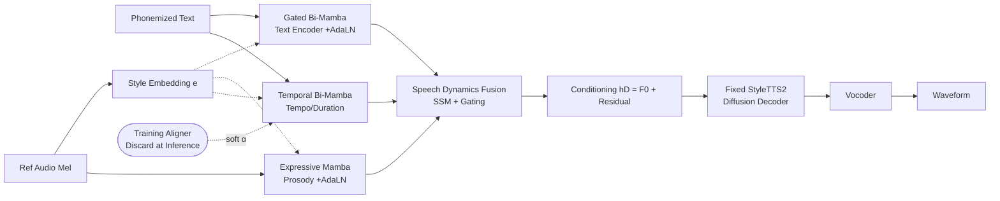

# MambaVoiceCloning: Efficient and Expressive Text-to-Speech via State-Space Modeling and Diffusion Control

**Conference**: ICLR 2026  
**OpenReview**: [https://openreview.net/forum?id=0oXyMbPMtP](https://openreview.net/forum?id=0oXyMbPMtP)  
**Code**: [https://github.com/sahilkumar15/MVC](https://github.com/sahilkumar15/MVC)  
**Area**: Speech Synthesis / State-Space Models / Diffusion TTS  
**Keywords**: Mamba, State-Space Model, Text-to-Speech, Diffusion, StyleTTS2, Streaming Synthesis, Long-form Robustness  

## TL;DR
MVC transforms the entire **conditioning path (text/tempo/prosody) of diffusion TTS into pure SSM (Mamba) at inference**, eliminating all attention and explicit recurrences. By utilizing a lightweight training-only aligner and maintaining a fixed StyleTTS2 decoder/vocoder, it achieves modest but statistically significant quality gains over StyleTTS2, VITS, and hybrid Mamba-Attention models, while compressing the encoder to 21M parameters and increasing throughput by 1.6×.

## Background & Motivation
- **Background**: Diffusion TTS models have achieved high naturalness and expressiveness, yet their conditioning encoders (modeling text, duration, and prosody) typically rely on Transformer attention or recurrent modules.
- **Limitations of Prior Work**: Attention mechanisms incur $O(T^2)$ computational/memory costs and global context mixing, which is unfavorable for streaming; recurrent structures suffer from long-range drift and state instability. While linear attention reduces asymptotic complexity, it retains global interaction, making streaming challenging. Existing Mamba-TTS models (e.g., Jiang/Zhang 2024) remain **hybrids at inference**, using attention for duration or style modules, which limits streaming stability.
- **Key Challenge**: The diffusion decoder itself is the dominant source of latency, making encoder efficiency critical for deployment. However, it had not been verified whether the conditioning path could be **completely** attention-free and recurrence-free without sacrificing quality.
- **Goal**: To verify whether diffusion TTS can adopt a **full SSM-at-inference** conditioning stack under a strictly matched mel → diffusion → vocoder pipeline (keeping the decoder/vocoder fixed and changing only the conditioning path).
- **Core Idea**: **[Pure SSM Conditioning Stack]** Three selective SSM modules—a gated bi-directional Mamba text encoder, a Temporal Bi-Mamba supervised by a monotonic aligner during training, and an Expressive Mamba with AdaLN modulation—integrated with **gated forward-backward fusion** instead of simple concatenation. The aligner exists only during training and is discarded at inference.

## Method

### Overall Architecture
Starting from phonemized text and reference audio, MVC produces three conditioning streams: a gated Bi-Mamba text encoder (phoneme modeling), a Temporal Bi-Mamba (tempo/duration alignment), and an Expressive Mamba operating on mel features (prosody control). These streams fuse during the "Speech Dynamics" stage before feeding into a **fixed StyleTTS2 diffusion decoder and vocoder** to synthesize waveforms. A lightweight attention aligner provides phoneme-to-frame soft supervision during training but is **completely removed at inference**, allowing the entire encoder to operate in $O(T)$ with no attention maps and bounded activations. Since the decoder/vocoder is identical across MVC and all baselines, differences in MOS, WER, pitch stability, and runtime are directly attributable to the conditioning stack design.

### Key Designs

**1. Gated Bi-directional Mamba Text Encoder: Using gated fusion instead of concatenation to stabilize long-range prosody.** The text encoder replaces self-attention with forward and backward Uni-Mamba selective scans $h_f=\mathrm{Mamba}_f(x),\, h_b=\mathrm{Mamba}_b(x)$, achieving $O(T_x)$ complexity and numerically stable recurrent dynamics. Crucially, instead of simple concatenation as in previous bi-Mamba setups, a gated fusion is introduced: $h_T=\big(\sigma(W_g[h_f;h_b])\odot[h_f;h_b]\big)W_o$. This allows the gates to modulate context based on local syntactic cues, maintaining stable gating patterns over 2–6 minute passages without collapse or drift. Subsequently, AdaLN is used to inject speaker/style: $\mathrm{AdaLN}(z,e)=\gamma(e)\odot\mathrm{LN}(z)+\beta(e)$. Ablations (Table 8) show that removing either gating or AdaLN significantly degrades long-form MOS and increases pitch RMSE, confirming this "Gating + AdaLN" combination is essential for Mamba-TTS.

**2. Expressive Mamba Prosody Encoder: Pure SSM for speaker prosody injection.** Given mel features $M$ and style embedding $e$, a gated transformation with AdaLN produces stylized input $h_{M,s}$, followed by a Mamba block $h_E=\mathrm{Mamba}(h_{M,s})$. It contains no attention and specifically captures slowly varying prosodic dynamics over long inputs. In component-removal ablations, removing this module caused the largest CMOS drop (−0.41) on OOD data, indicating the prosody path is central to maintaining naturalness for challenging text.

**3. Training Aligner + Temporal Bi-Mamba: Distilling alignment knowledge into SSM for zero-attention inference.** Temporal Bi-Mamba models tempo and phoneme-duration alignment. Style embeddings are broadcast to frames and transformed via shallow gating to $h_S$. Forward/backward Mamba with local Conv1D captures temporal dynamics, outputting a linear fusion $h_B=[h_f;h_b]W_f$. During training, a small 2-layer Transformer aligner uses monotonic alignment loss to map token encodings to frame-level weights $\alpha\in\mathbb{R}^{T_m\times T_x}$, yielding $h_A=\alpha\, h_{T,s}$; **the aligner is discarded at inference**. Perturbation experiments show MVC tolerates moderate alignment noise, upholding the "full SSM inference" commitment.

**4. SSM-only Prosody/Dynamics Path and Streaming: State carryover for bounded memory.** Pitch modeling fuses $h_E$ and $h_B$ into $h_P$ for linear prediction $F0=h_P W_F+b_F$, avoiding additional attention-based pitch predictors. The Speech Dynamics stage utilizes a Conv1D+SSM temporal predictor to produce rhythmic representations, fused with $h_P$ to yield the final condition $h_D=[\hat F0; n]$. During streaming, the bi-directional text encoder is replaced by a causal Uni-Mamba. SSM states are **carried forward without reset** at chunk boundaries, and a look-ahead $L$ provides $L$ seconds of future mel frames to prevent premature decisions at boundaries; $L\ge0.5$s is sufficient for perceptual smoothness.

## Key Experimental Results
Models were trained on LJSpeech (24h/1 spk) + LibriTTS (245h/1151 spk) and evaluated on VCTK zero-shot, CSS10 (ES/DE/FR) cross-lingual, and 2–6 minute Gutenberg long-form text. All models shared the mel frontend, 5-step diffusion scheduler, vocoder, and optimization schedule; quality differences reflect conditioning stack design.

### Main Results
Subjective scores on LibriTTS unseen speakers (MOS-N/MOS-S, higher is better):

| Model | MOS-N ↑ | MOS-S ↑ |
|---|---|---|
| Ground Truth | 4.60 | 4.35 |
| VITS | 3.69 | 3.54 |
| StyleTTS2 | 4.15 | 4.03 |
| **MVC (Ours)** | **4.22** | **4.07** |

Objective metrics on LJSpeech (mean of 3 seeds):

| Model | F0 RMSE ↓ | MCD ↓ | WER ↓ | PESQ ↑ | RTF ↓ |
|---|---|---|---|---|---|
| VITS | 0.667 | 4.97 | 7.23% | 3.64 | 0.0211 |
| StyleTTS2 | 0.651 | 4.93 | 6.50% | 3.79 | 0.0174 |
| **MVC** | 0.653 | **4.91** | 6.52% | **3.85** | **0.0169** |

Long-form (Short ≤10s / Long >60s) MOS and RTF:

| Model | MOS-Short | MOS-Long | RTF-Short | RTF-Long |
|---|---|---|---|---|
| StyleTTS2 | 4.15 | 3.91 | 0.0185 | 0.0200 |
| **MVC** | **4.22** | **4.16** | **0.0177** | **0.0170** |

### Ablation Study
Component removal (OOD set, CMOS-N drop relative to full MVC):

| Component Removed | CMOS-N Drop |
|---|---|
| Bi-Mamba Text Encoder | −0.38 |
| Expressive Mamba Prosody | **−0.41** |
| Temporal Bi-Mamba | −0.36 |

Fusion/Conditioning ablation (LJSpeech long-form):

| Variant | MOS-Long ↑ | Pitch RMSE ↓ | RTF ↓ |
|---|---|---|---|
| **MVC (Gating + AdaLN)** | **4.16** | **1.92** | **0.0177** |
| Gating only (No AdaLN) | 4.02 | 2.04 | 0.0186 |
| AdaLN only (No Gating) | 3.95 | 2.22 | 0.0198 |
| Concat only (None) | 3.64 | 2.89 | 0.0216 |

### Key Findings
- **Latency Bottleneck is Diffusion, not Encoder**: On 500 LJSpeech segments, the diffusion decoder accounts for 54.2% of latency, the Mamba encoder stack 31.4%, and the vocoder 14.4%. Thus, end-to-end RTF gains are moderate, but SSM-only design reduces peak VRAM and boosts conditioning throughput.
- **Gating + AdaLN is Indispensable**: The concatenation-only variant achieved a long-form MOS of only 3.64, significantly lower than the full MVC's 4.16. Simply replacing attention with bi-directional SSM is insufficient; gating and style modulation are keys to matching or exceeding Transformer quality.
- **Depth Sweet Spot at 6 Layers**: 6 layers for the text encoder offer the best quality-efficiency trade-off. BiLSTM at equivalent capacity showed the lowest MOS and highest RTF, proving selective scanning is more efficient than recurrent stacking.
- **Graceful Streaming Degradation**: Reducing look-ahead from 2.0s to 0.25s increased WER from 7.3% to 11.2% and decreased MOS from 3.91 to 3.74; $L\ge0.5$s maintains perceptual smoothness.

## Highlights & Insights
- **"Full SSM at Inference" as a Falsifiable Hypothesis**: Previous Mamba-TTS models often retained attention for duration or style modeling. MVC is the first to implement the entire text+tempo+prosody path via SSM and proves through perturbation that it does not rely on perfect alignment.
- **Honest Positioning via Strict Protocols**: By fixing the decoder/vocoder and unifying data/optimization, quality differences clearly reflect encoder design. The authors correctly categorize models like NaturalSpeech 3 or CosyVoice as "scale-driven" rather than "architecture-driven" baselines, focusing on the specific contribution of encoder architecture.
- **Quantified Value of Gated Fusion**: By decoupling the "replace with SSM" and "add Gating + AdaLN" steps, the paper demonstrates that the former alone is insufficient, and the latter is what recovers quality. This provides a clear takeaway for subsequent Mamba-based sequence modeling.

## Limitations & Future Work
- Focuses on conditioning efficiency rather than fine-grained emotional control—AdaLN provides global rather than segment-wise expressive style cues.
- Trained primarily on English data; while cross-lingual (CSS10) generalization is decent, errors in stress/pausing for long German compound words remain.
- **Diffusion decoder remains the latency bottleneck**, limiting the end-to-end RTF improvement of the encoder. Deployment benefits are more significant in memory usage and throughput.
- Absolute gains are relatively small (MOS ≈ +0.07, RTF ≈ −0.0005); the authors characterize this as an "encoder-side refinement" rather than a paradigm shift.

## Related Work & Insights
- **vs. Attention-based TTS (Tacotron/JETS/StyleTTS2)**: These offer strong alignment and style modeling but with quadratic complexity and global interactions unsuitable for streaming, motivating the need for linear-time, bounded-activation conditioning stacks.
- **vs. Hybrid Mamba (Jiang/Zhang 2024)**: MVC replaces simple bi-Mamba concatenation with gated forward-backward fusion + AdaLN, using capacity-matched baselines to isolate the architectural effects of removing attention.
- **Insight**: To leverage the advantages of SSMs in sequential conditioning tasks, mechanisms like gating and conditional modulation (AdaLN) are necessary; simple backbone replacement is usually insufficient to match Transformer quality. "Heavy training module, light inference SSM" is a deployment paradigm worth promoting.

## Rating
- **Novelty**: ⭐⭐⭐ — The "full SSM conditioning stack at inference" is a clean and previously unverified hypothesis. The combination of gated fusion and AdaLN is novel, though the overall work is a refined reorganization of existing components (Mamba/StyleTTS2/AdaLN).
- **Experimental Thoroughness**: ⭐⭐⭐⭐ — Strict protocol matching; covers ID/OOD/zero-shot/cross-lingual/long-form/streaming. Ablations cover components, depth, and fusion types with solid statistical testing.
- **Writing Quality**: ⭐⭐⭐⭐ — Honest about small gains, clearly defines baseline boundaries, and presents modest but justified claims.
- **Value**: ⭐⭐⭐ — Friendly for deployment (memory/throughput/long-form stability) as a plug-and-play efficient conditioning module. However, because diffusion still dominates latency, the impact is more an engineering refinement than a breakthrough.

<!-- RELATED:START -->

## Related Papers

- [\[NeurIPS 2025\] Efficient Speech Language Modeling via Energy Distance in Continuous Latent Space](../../NeurIPS2025/audio_speech/efficient_speech_language_modeling_via_energy_distance_in_continuous_latent_spac.md)
- [\[ICLR 2026\] VibeVoice: Expressive Podcast Generation with Next-Token Diffusion](vibevoice_expressive_podcast_generation_with_next-token_diffusion.md)
- [\[ICLR 2026\] Hierarchical Semantic-Acoustic Modeling via Semi-Discrete Residual Representations for Expressive End-to-End Speech Synthesis](hierarchical_semantic-acoustic_modeling_via_semi-discrete_residual_representatio.md)
- [\[ICLR 2026\] TASTE: Text-Aligned Speech Tokenization and Embedding for Spoken Language Modeling](taste_text-aligned_speech_tokenization_and_embedding_for_spoken_language_modelin.md)
- [\[ICLR 2026\] Speech World Model: Causal State–Action Planning with Explicit Reasoning for Speech](speech_world_model_causal_stateaction_planning_with_explicit_reasoning_for_speec.md)

<!-- RELATED:END -->
