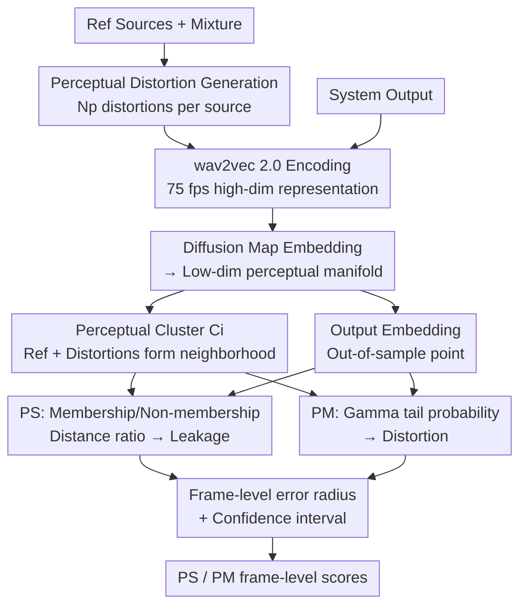

# MAPSS: Manifold-Based Assessment of Perceptual Source Separation

**Conference**: ICLR 2026  
**arXiv**: [2509.09212](https://arxiv.org/abs/2509.09212)  
**Code**: Yes ([https://github.com/Amir-Ivry/MAPSS-measures](https://github.com/Amir-Ivry/MAPSS-measures))  
**Area**: Audio and Speech  
**Keywords**: Source separation evaluation, perceptual metrics, diffusion maps, manifold learning, self-supervised representation

## TL;DR

This paper proposes two complementary metrics, Perceptual Separation (PS) and Perceptual Match (PM). By utilizing diffusion maps to embed self-supervised representations into low-dimensional manifolds, it achieves the first functional decoupling of leakage and self-distortion in source separation. Compared with 18 mainstream metrics, it almost consistently ranks first or second in terms of correlation with subjective scores.

## Background & Motivation

A long-standing mismatch exists between the objective evaluation of source separation and human subjective perception. Fundamental flaws of existing metrics include:

**Confusing Leakage and Distortion**: Metrics like SDR and SI-SDR mix interfering speaker leakage and target signal distortion into a global energy ratio, making it impossible to determine the source of the error.

**Lack of Fine-grained Analysis**: Metrics like PESQ and STOI map an entire speech segment to a single MOS score, lacking frame-level localization capabilities.

**Black-box and Lack of Confidence**: Learned metrics such as DNSMOS cannot quantify the reliability of their decisions.

**Inability to Meet Multi-dimensional Needs**: No existing metric family can simultaneously achieve decoupled leakage/distortion analysis, frame-level resolution, and error estimation.

Core Goal: Design complementary perceptual metrics—PS to quantify the degree of separation (leakage) and PM to quantify the degree of matching (distortion). Both should be differentiable, operate at the frame level (75 fps), and provide theoretical error guarantees.

## Method

### Overall Architecture

MAPSS is a **pure evaluation framework** (no network training) that aims to functionally decouple two types of errors in source separation—the "leakage" of other speakers and the "distortion" of the target speech—scoring them separately. Its core idea: instead of calculating ratios in the waveform/energy domain, project signals into a low-dimensional geometric space reflecting human perception, where "distance" directly corresponds to "perceptual difference," then measure how close and similar the output is to the target source within this space.

The pipeline works as follows: first, apply dozens of basic distortions to each reference source in the mixture to encode them into high-dimensional representations using a pre-trained wav2vec 2.0. These representations are projected onto a low-dimensional perceptual manifold via diffusion maps, where the "reference + distortions" for each source naturally form a cluster (perceptual cluster), while the system output serves as an "out-of-sample point" residing on the manifold. Finally, calculate two complementary scores on the manifold—PS evaluates which cluster the output is closer to (leakage), and PM evaluates the output's position within the distortion distribution of the target cluster (distortion). A provable error radius is provided for each frame-level score. The entire process operates at the frame level (75 fps), and both PS and PM are differentiable.

### Key Designs

**1. Diffusion Maps: Mapping Euclidean distance to perceptual dissimilarity**

The geometric foundation of the metrics is diffusion maps, addressing the fundamental problem: "In which space does distance correspond to human hearing?" Let the high-dimensional encoded vectors be $\mathcal{X} = \{\mathbf{x}_i\}_{i=1}^N$. Use a Gaussian kernel to measure pairwise similarity $\mathbf{K}_{i,j} = \exp(-\|\mathbf{x}_i - \mathbf{x}_j\|_2^2 / \sigma_\mathbf{K}^2)$, apply $\alpha$-normalization to counteract non-uniform sampling density, and normalize to a row-stochastic transition matrix $\mathbf{P} = \mathbf{D}^{-1}\mathbf{K}$. Spectral decomposition of $\mathbf{P}$ yields the low-dimensional embedding $\boldsymbol{\Psi}_t(\mathbf{x}_i) = (\lambda_1^t \mathbf{u}_1(i), \ldots, \lambda_d^t \mathbf{u}_d(i))^T$. The key benefit is that the Euclidean distance in the embedding space equals the diffusion distance in the original space $D_t^2(i,j) = \|\boldsymbol{\Psi}_t(\mathbf{x}_i) - \boldsymbol{\Psi}_t(\mathbf{x}_j)\|_2^2$. Thus, all "distance calculations" are performed on the low-dimensional manifold while faithfully reflecting perceptual dissimilarity. This is the shared stage for both PS and PM.

**2. Perceptual Distortion Clustering: Defining the "perceptual neighborhood"**

To determine which source a system output is closer to, the "sphere of influence" for each source on the manifold must be defined. For the $i$-th reference source, $N_p \in [60,70]$ basic distortions (clipping, notch filtering, pitch shifting, reverberation, colored noise, etc.) are applied. These distortions range from mild (15 dB SNR colored noise) to severe (heavy-tail reverb, hard clipping), covering the range of perceptual fluctuations acceptable to the human ear. These distorted waveforms, along with the reference itself, are encoded by wav2vec 2.0 and embedded via diffusion maps to form a perceptual cluster:

$$\mathcal{C}_i^{(d)} = \{\boldsymbol{\Psi}_t^{(d)}(\mathbf{x}_i), \boldsymbol{\Psi}_t^{(d)}(\mathbf{x}_{i,p}) \mid p=1,\ldots,N_p\}$$

A deliberate design choice: **the system output embedding is not included in the cluster**. Clusters consist only of the reference and its distortions; the output is always measured as an "out-of-sample point" to avoid circular bias. These distortion points concretize the "perceptually acceptable range of the target source" into a geometric region, providing a reference for PS/PM.

**3. PS and PM: Decoupling leakage and distortion**

With the manifold and clusters, MAPSS uses two independent scores to answer the two questions often conflated by traditional metrics.

PS (Perceptual Separation) answers "how much of other sources is leaked into the output." It compares the Mahalanobis distance from the output to two types of clusters:

$$\widehat{\text{PS}}_i^{(d)} = 1 - \frac{\hat{A}_i^{(d)}}{\hat{A}_i^{(d)} + \hat{B}_i^{(d)}} \in [0,1]$$

where $\hat{A}_i^{(d)}$ is the distance to its own membership cluster, and $\hat{B}_i^{(d)}$ is the distance to the nearest non-membership cluster. When $\hat{A} \ll \hat{B}$, meaning the output stays close to the target and far from others, PS → 1, indicating clean separation. If the output is pulled closer by another source, $\hat{B}$ decreases and PS drops, corresponding to increased leakage. It focuses on "relative membership" rather than absolute energy.

PM (Perceptual Match) answers "how much distortion the output has relative to the target source." It collects the distances from various distortion samples within the cluster to the reference, denoted as $\hat{\mathcal{G}}_i^{(d)}$. After confirming via the KS test that these distances approximately follow a Gamma distribution, the Gamma parameters $\hat{k}_i^{(d)}, \hat{\theta}_i^{(d)}$ are estimated using moment matching. Substituting the actual distance from the output to the reference into the Gamma tail probability yields:

$$\widehat{\text{PM}}_i^{(d)} = Q(\hat{k}_i^{(d)}, \hat{a}_i^{(d)} / \hat{\theta}_i^{(d)}) \in [0,1]$$

Intuitively, if the output falls within the "acceptable distortion" distribution, PM → 1. As the output deviates further from the reference into the distribution's tail, PM decreases. Modeling distortion as a probability distribution allows PM to tolerate reasonable perceptual fluctuations while punishing truly abnormal deviations.

**4. Theoretical Error Guarantees: Provable error radii**

Since the manifold dimension $d$ is a finite truncation, PS/PM inevitably deviate from the theoretical true values. Based on Schur complement decomposition, the paper derives a deterministic frame-level error radius. For example, for PS:

$$|\text{PS}_i - \text{PS}_i^{(d)}| \leq \frac{B_i^{(d)} |\delta_{i,i}| + A_i^{(d)} |\delta_{i,j^*}|}{(A_i^{(d)} + B_i^{(d)})^2}$$

It further provides non-asymptotic high-probability confidence intervals. Experiments show that substituting this worst-case error radius leaves the ranking of PS/PM relative to subjective scores almost unchanged, proving that truncation error is small enough not to affect practical selection.

### Loss & Training

MAPSS does not involve any network training; the encoder is a pre-trained wav2vec 2.0. All core calculations are deterministic steps: distortion generation, wav2vec 2.0 forward inference, diffusion map spectral decomposition, Mahalanobis distance calculation, and Gamma fitting. Since both PS and PM are **differentiable**, they can be used directly as training losses to optimize separation models.

## Key Experimental Results

### Main Results

**Comparison with 18 mainstream metrics on the SEBASS database**

Linear (Pearson) and rank (Spearman) correlations of PS and PM with human subjective MOS in English/Spanish/Music mixture scenarios:

| Metric Category | Representative Metrics | Ranking Performance |
|---------|---------|---------|
| Energy Ratio | SDR, SI-SDR, SIR, SAR | Medium-Low |
| Classical Perceptual | PESQ, STOI, ESTOI | Medium |
| Learned | DNSMOS, SpeechBERTscore | Medium-High |
| **Ours (MAPSS)** | **PS, PM** | **Almost always 1st or 2nd** |

**Complementarity Verification**: Normalized Mutual Information (NMI) analysis shows high complementarity between PS and PM—PS captures leakage and PM captures distortion, providing non-overlapping perspectives.

### Ablation Study

**Encoder Choice**: wav2vec 2.0 performs best, as its self-supervised representations align most closely with human perception.

**Distortion Set Size**: $N_p \in [60,70]$ is the optimal range; too few provide insufficient coverage, while too many show diminishing returns.

**Error Radius Validation**: Deterministic frame-level error radii do not change PS/PM rankings in almost all scenarios, with high-probability confidence intervals providing statistical guarantees.

### Key Findings

1. **Decoupling is effective**: PS specifically captures leakage, and PM specifically captures distortion.
2. **Self-supervised representations + Manifold learning > Traditional features**: Meaningful perceptual clusters naturally form under diffusion maps.
3. **Value of frame-level grain**: 75 fps evaluation allows for precise localization of separation quality issues.
4. **Generalization**: Excellent performance across English, Spanish, and music scenarios.

## Highlights & Insights

- **First functional decoupling of leakage and distortion** in source separation, filling a methodological gap.
- **"Perception-Geometry Hypothesis" verified**: The chain of diffusion distance → Euclidean distance → perceptual similarity is established.
- **Differentiability** allows it to serve as a training loss, bridging evaluation and optimization.
- Sophisticated distortion set design: Creates a "perceptual neighborhood" for the reference signal.
- **First theoretical error guarantees provided for separation metrics**: Deterministic radii + non-asymptotic confidence intervals.

## Limitations & Future Work

1. Encoding 60-70 distortions per source incurs high computational overhead, limiting real-time applications.
2. Dependence on wav2vec 2.0 may be sub-optimal for non-speech audio (pure instruments).
3. Assumption of $N_f \geq 2$: PS requires non-membership clusters and cannot be used directly in single-source enhancement.
4. Manual distortion sets might have blind spots; data-driven distortion generation could be explored.
5. Rank correlation is weaker for Spanish; cross-lingual robustness requires more validation.

## Related Work & Insights

- **Diffusion Maps** (Coifman & Lafon, 2006), originally for dimensionality reduction, are innovatively applied to audio quality assessment.
- **wav2vec 2.0** self-supervised representations effectively capture perceptually relevant audio features.
- **Mahalanobis distance + Gamma distribution modeling** provides a probabilistic statistical framework.
- Insight: Manifold learning has great potential for metric design and can be extended to image/video quality assessment.

## Rating

- Novelty: ⭐⭐⭐⭐⭐ — Entirely new evaluation paradigm with pioneering contributions.
- Technical Depth: ⭐⭐⭐⭐⭐ — Thorough diffusion map derivation and non-trivial error guarantees.
- Experimental Thoroughness: ⭐⭐⭐⭐ — Comprehensive comparison with 18 baselines, though using only one evaluation database.
- Value: ⭐⭐⭐⭐ — Differentiable for training, though computational cost may limit large-scale use.

<!-- RELATED:START -->

## Related Papers

- [\[ICLR 2026\] Incentive-Aligned Multi-Source LLM Summaries](incentive-aligned_multi-source_llm_summaries.md)
- [\[ICLR 2026\] Knowing When to Quit: Probabilistic Early Exits for Speech Separation Networks](knowing_when_to_quit_probabilistic_early_exits_for_speech_separation_networks.md)
- [\[ICML 2026\] Self-Guidance: Enhancing Neural Codecs via Decoder Manifold Alignment](../../ICML2026/audio_speech/self-guidance_enhancing_neural_codecs_via_decoder_manifold_alignment.md)
- [\[ICLR 2026\] Physics-Informed Audio-Geometry-Grid Representation Learning for Universal Sound Source Localization](physics-informed_audio-geometry-grid_representation_learning_for_universal_sound.md)
- [\[AAAI 2026\] Multi-granularity Interactive Attention Framework for Residual Hierarchical Pronunciation Assessment](../../AAAI2026/audio_speech/multi-granularity_interactive_attention_framework_for_residual_hierarchical_pron.md)

<!-- RELATED:END -->
