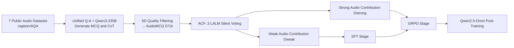

# Measuring Audio's Impact on Correctness: Audio-Contribution-Aware Post-Training of Large Audio Language Models

**Conference**: ICLR 2026  
**OpenReview**: [https://openreview.net/forum?id=sJ0jUO9Mxr](https://openreview.net/forum?id=sJ0jUO9Mxr)  
**Code**: TBD  
**Area**: Audio Language Models / Post-Training  
**Keywords**: Large Audio Language Models, Post-Training, Audio-Contribution, GRPO, SFT-to-RL, AudioMCQ  

## TL;DR
This paper reveals the prevalent "zero audio-contribution" phenomenon in Large Audio Language Models (LALMs)—where models answer correctly even when the audio is replaced with silence. It proposes a data filtering method based on "audio contribution" and a two-stage post-training paradigm (Weak-to-Strong / Mixed-to-Strong). Combined with the 570k-sample AudioMCQ dataset, it achieves SOTA results on four major audio understanding benchmarks.

## Background & Motivation
**Background**: Large Audio Language Models (LALMs) represent an important frontier in multimodal AI, handling tasks such as ASR, audio captioning, and music understanding. Given the high cost of pre-training, post-training (SFT, RL) has become a cost-effective direction for performance improvement. Recent works like R1-AQA and Omni-R1 utilize GRPO reinforcement learning, while SARI and Step-Audio2 employ multi-stage SFT+RL paradigms.

**Limitations of Prior Work**: Despite using more data, multi-stage paradigms (SFT followed by RL) **do not necessarily outperform single-stage post-training consistently**, effectively setting an invisible ceiling on the scale of post-training data. There are two primary reasons: first, the lack of large-scale, high-quality post-training datasets for LALMs; second, the core problem of "how to allocate data between SFT and RL stages" has rarely been studied systematically.

**Key Challenge**: Models frequently **answer questions correctly without actually listening to the audio**. By evaluating mainstream LALMs with audio replaced by 30 seconds of silence, the authors found an average accuracy of 49.8% on MMAU-test-mini (where random guessing is 25.5%). MMAR and MMSU also showed scores significantly higher than random chance. This indicates many "audio QA" tasks are solved via textual cues or pre-trained knowledge, with audio providing no actual contribution—a phenomenon the authors call **zero audio-contribution**.

**Goal**: To construct a large-scale dataset, quantify the "audio contribution" of each sample, and design superior SFT-to-RL data allocation strategies based on these findings.

**Core Idea**: **[Data Allocation Perspective]** Allocate data with weak audio contribution (correctable without listening) to the SFT stage to build foundational capabilities, and reserve data with strong audio contribution (requiring listening to answer) for the RL stage to refine perceptual abilities, allowing each stage to leverage the data it needs most.

## Method

### Overall Architecture
The method consists of three components: First, 7 public audio datasets are processed via unified Q-A formatting, Qwen3-235B generation of MCQs and Chain-of-Thought (CoT), and five-dimensional quality filtering to build the 571k **AudioMCQ** dataset. Second, samples are split into **Weak/Strong Audio Contribution** subsets (Audio-Contribution Filtering, ACF) based on voting by 3 LALMs under silent input. Finally, **Weak-to-Strong** and **Mixed-to-Strong** two-stage post-training paradigms are designed and applied to Qwen2.5-Omni.

### Key Designs

**1. AudioMCQ Dataset: Pipeline from Captions to High-Quality MCQs**  
As six source datasets only contain "audio-caption" pairs without QA, the authors first convert them to Q-A formats via a unified template. Qwen3-235B is then used to generate a Multiple Choice Question (MCQ) $g(a_i,q_i,c_i)=(a_i,q_i^{new},c_i,O_i,y_i,t_i)$ with four options and a question type $t_i$ tailored to dataset characteristics (e.g., TACOS generates only temporal tasks). A **three-stage structured CoT** is introduced—Question Type Analysis $r_{1i}$, Audio Content Analysis $r_{2i}$, and Answer Selection $r_{3i}$—alongside a distilled unstructured CoT $R^{simple}$ for efficient reasoning. Samples scoring $<4$ in any of the five dimensions (consistency, distractor quality, fluency, logic, and simplified reasoning quality) are discarded, resulting in 571,118 samples.

**2. Audio Contribution Metric and Zero Audio-Contribution**  
The authors formalize "whether the audio is effective" into a computable metric. Given a sample, let $\hat{y}(a_i,q_i,O_i)$ be the prediction under normal input and $\hat{y}(0,q_i,O_i)$ be the prediction when audio is replaced by 30s of **silence** $0$. Audio contribution is defined as:

$$AC(a_i,q_i,O_i)=\mathbb{I}[\hat{y}(a_i,q_i,O_i)=y_i]-\mathbb{I}[\hat{y}(0,q_i,O_i)=y_i]$$

$AC=0$ denotes zero audio-contribution. Notably, the authors specifically use **silence** instead of Gaussian noise (as in MMAU/RUListening) to cleanly isolate pure textual reasoning. Zero contribution is further categorized into: **Explicit Logical Reasoning** (cues in the text) and **Implicit Knowledge Retrieval** (guessing via pre-trained knowledge), the latter of which accounts for 68.9% of weak contribution samples.

**3. Audio-Contribution Filtering (ACF) Data Splitting**  
Three different LALMs (A-Flamingo2, R1-AQA, Kimi-Audio) are used to vote based on silent input. Let the correctness of the $j$-th model be $C_j(q_i,O_i,y_i)=\mathbb{I}[y_j(0,q_i,O_i)=y_i]$. The split rule is:

$$ACF(q_i,O_i,y_i)=\begin{cases}\text{Weak} & \text{if }\sum_{j=1}^{3}C_j\geq 2\\ \text{Strong} & \text{otherwise}\end{cases}$$

Samples where at least two models answer correctly without audio are categorized as **Weak Audio Contribution** $D_{weak}$; otherwise, they are **Strong Audio Contribution** $D_{strong}$. This split reveals dataset variances: TACOS (temporal) has 73.3% strong samples, while CompA-R (compositional) has 75.5% weak samples. Applying ACF to benchmarks creates stricter evaluation subsets like MMAU-ACstrong.

**4. Weak-to-Strong / Mixed-to-Strong Post-Training**  
Based on the insight that "weak contribution data builds foundations while strong contribution data refines perception," two paradigms are designed: **Weak-to-Strong** (SFT on Weak, then GRPO on Strong) and **Mixed-to-Strong** (SFT on Mixed, then GRPO on Strong), with Mixed-to-Mixed as the baseline. The RL stage uses GRPO, with the average reward of sampled outputs for the same question as the baseline (eliminating the value network). The objective is:

$$J_{GRPO}(\theta)=\mathbb{E}\Big[\tfrac{1}{G}\sum_{i=1}^{G}\tfrac{1}{|o_i|}\sum_{t=1}^{|o_i|}\big(\min(\rho_{i,t}\hat{A}_{i,t},\text{clip}(\rho_{i,t},1-\epsilon,1+\epsilon)\hat{A}_{i,t})-\beta D_{KL}[\pi_\theta\|\pi_{ref}]\big)\Big]$$

Where $\rho_{i,t}$ is the probability ratio and $\hat{A}_{i,t}$ is the relative advantage. All experiments fix SFT at 313,177 samples with no overlap between SFT and GRPO data for fair comparison.

## Key Experimental Results

### Main Results (Qwen2.5-Omni backbone)

| Method | MMAU-test-mini | MMAU | MMAR | MMSU |
|---|---|---|---|---|
| Qwen2.5-Omni (backbone) | 71.5 | 71.0 | 56.7 | 60.6 |
| Audio Flamingo 3 | 73.3 | 72.4 | 60.1 | 62.3 |
| Omni-R1 | 77.0 | 75.0 | 63.4 | – |
| Audio-Thinker | 78.0 | 75.4 | 65.3 | – |
| Gemini-2.0-Flash | 70.5 | 67.0 | 65.6 | 51.0 |
| **Weak AC SFT + Strong AC GRPO** | **78.2** | **75.6** | 65.3 | 69.3 |
| **Mix AC SFT + Strong AC GRPO** | 76.4 | 75.1 | **67.0** | **71.7** |

Weak-to-Strong achieves SOTA on the MMAU series (78.2% / 75.6%); Mixed-to-Strong achieves SOTA on MMAR / MMSU (67.0% / 71.7%). The AudioMCQ dataset also helped secure 1st place in the DCASE 2025 AQA challenge globally.

### Ablation Study (Data Quality & Paradigm Comparison)

| Training Strategy | MMAU-test-mini | MMAU | MMAR | MMSU |
|---|---|---|---|---|
| All Data SFT (2000 steps) | 75.2 | 75.0 | 64.6 | 64.0 |
| All Data GRPO (1200 steps) | 78.1 | 75.4 | 63.0 | 70.2 |
| Mix AC SFT + Mix AC GRPO (Baseline) | 74.2 | 74.4 | 64.9 | 69.2 |
| Weak AC SFT + Strong AC GRPO | 78.2 | 75.6 | 65.3 | 69.3 |
| Mix AC SFT + Strong AC GRPO | 76.4 | 75.1 | 67.0 | 71.7 |

Full-data GRPO pushes MMSU past 70% for the first time (70.2%, +6.2% over SFT); the two-stage paradigms show further gains across all benchmarks compared to the Mixed-to-Mixed baseline.

### Key Findings
- Under silent input, mainstream LALMs still reach 49.8% on MMAU-test-mini (random 25.5%), proving the **prevalence of zero audio-contribution**, with Sound/Music tasks being more susceptible to shortcuts than Speech.
- The effectiveness of different paradigms correlates with the **audio contribution characteristics of downstream tasks**: MMAU-test-mini has more weak samples (53.9%), while MMAR has more strong samples (67.1%).
- Reserving strong contribution data for the RL stage is critical—RL achieves the highest gains on samples that "must be heard."

## Highlights & Insights
- **Quantifiable Modality Impact**: By using silence replacement and indicator function differences, the authors provide a simple $AC$ definition and utilize multi-model voting for data splitting—a method that is straightforward yet highly practical.
- **New Perspective on Data Allocation**: Rather than debating data volume for SFT/RL, the work allocates data based on the semantic attribute of "audio contribution," answering "which type of data belongs in which stage."
- **Precision in Evaluation**: Using pure silence to isolate text reasoning is cleaner than noise replacement, reflecting a high sensitivity to evaluation contamination.
- **Dual Contribution**: 570k AudioMCQ samples + three ACstrong rigorous evaluation subsets provide long-term value to the research community.

## Limitations & Future Work
- The split between weak/strong contribution relies on the capabilities of three specific LALMs; **changing the voting models may shift labels**, making them not entirely objective.
- Experiments were primarily validated on a single backbone (Qwen2.5-Omni); cross-architecture and cross-scale generalizability remain to be tested.
- To focus on perceptual fidelity, **CoT was excluded** from the final evaluation, meaning the value of the CoT annotations in the dataset is not fully reflected in the main results.
- The "two stages, binary contribution" approach remains coarse-grained; future work could explore continuous contribution weighting or curriculum-based progressive splitting.

## Related Work & Insights
This paper extends R1-AQA and Omni-R1's introduction of GRPO to audio QA, and inherits the multi-stage paradigm of SARI and Step-Audio2. However, it is the first to systematically address "how to allocate data across two stages." Its "zero audio-contribution" diagnosis aligns with shortcut detection via noise replacement in MMAU and RUListening. The key insight is: **Multimodal post-training should first quantify the real contribution of each modality, then design a training curriculum accordingly**—a framework transferable to "zero visual-contribution" diagnosis in Vision/Video LLMs.

## Rating
- **Novelty**: ⭐⭐⭐⭐ The "audio contribution" metric and the contribution-aware SFT-to-RL paradigm are novel, turning an overlooked shortcut problem into an actionable training strategy.
- **Experimental Thoroughness**: ⭐⭐⭐⭐ SOTA on four benchmarks + multi-paradigm ablation + DCASE championship provides solid evidence, though evaluation on multiple backbones is slightly lacking.
- **Writing Quality**: ⭐⭐⭐⭐ The logic from motivation to diagnosis to method and verification is clear, with standardized formulas and diagrams.
- **Value**: ⭐⭐⭐⭐ The 570k dataset, rigorous evaluation subsets, and the general "modality-contribution-aware post-training" concept are highly valuable for the audio and multimodal communities.

<!-- RELATED:START -->

## Related Papers

- [\[ICLR 2026\] OWL: Geometry-Aware Spatial Reasoning for Audio Large Language Models](owl_geometry-aware_spatial_reasoning_for_audio_large_language_models.md)
- [\[ACL 2026\] Temporal Contrastive Decoding: A Training-Free Method for Large Audio-Language Models](../../ACL2026/audio_speech/temporal_contrastive_decoding_a_training-free_method_for_large_audio-language_mo.md)
- [\[ICLR 2026\] Music Flamingo: Scaling Music Understanding in Audio Language Models](music_flamingo_scaling_music_understanding_in_audio_language_models.md)
- [\[ICLR 2026\] From Text to Talk: Audio-Language Model Needs Non-Autoregressive Joint Training](from_text_to_talk_audio-language_model_needs_non-autoregressive_joint_training.md)
- [\[ICLR 2026\] JALMBench: Benchmarking Jailbreak Vulnerabilities in Audio Language Models](jalmbench_benchmarking_jailbreak_vulnerabilities_in_audio_language_models.md)

<!-- RELATED:END -->
