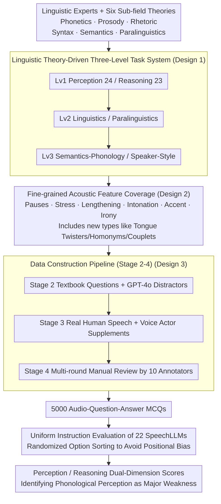

# MMSU: A Massive Multi-task Spoken Language Understanding and Reasoning Benchmark

**Conference**: ICLR 2026  
**arXiv**: [2506.04779](https://arxiv.org/abs/2506.04779)  
**Code**: [https://huggingface.co/datasets/ddwang2000/MMSU](https://huggingface.co/datasets/ddwang2000/MMSU)  
**Area**: Audio & Speech  
**Keywords**: Speech Understanding, SpeechLLM, Linguistic Benchmark, Multi-task Evaluation, Perception & Reasoning

## TL;DR
The authors propose MMSU (5,000 audio QAs, 47 tasks), the first speech understanding and reasoning benchmark to systematically integrate linguistic theories. Evaluating 22 SpeechLLMs reveals that existing models still exhibit significant performance gaps in phonological perception and complex reasoning.

## Background & Motivation

**Background**: SpeechLLMs (e.g., Qwen-Audio, Kimi-Audio, Gemini) have demonstrated the capability to process audio inputs, performing excellently in tasks like ASR and general audio understanding. However, their abilities in fine-grained speech perception and complex reasoning have not been systematically evaluated.

**Limitations of Prior Work**: Existing speech benchmarks suffer from three main deficiencies:
   - **Narrow Coverage**: They primarily focus on semantic-level tasks, ignoring common non-verbal phenomena in daily speech (pauses, irony, self-correction, prosodic changes, etc.).
   - **Insufficient Data Authenticity**: Heavy reliance on TTS-synthesized speech lacks the acoustic diversity found in authentic human speech.
   - **Lack of Linguistic Theoretical Guidance**: Evaluation designs do not consider fundamental linguistic principles such as phonetics, prosody, and rhetoric, leading to evaluation blind spots.

**Key Challenge**: True speech understanding requires not only grasping "what was said" (semantics) but also "how it was said" (prosody, emotion) and "the intended meaning" (pragmatics). Existing benchmarks fail to evaluate the latter two components.

**Goal**: To build a comprehensive speech understanding evaluation framework supported by linguistic theory to systematically assess SpeechLLM capabilities across both perception and reasoning dimensions.

**Key Insight**: Design a task classification system from the top down, based on linguistic theoretical frameworks (phonetics, prosody, rhetoric, syntax, semantics, paralinguistics).

**Core Idea**: Systematically integrate linguistic theories into speech benchmark design to create a comprehensive evaluation framework across 47 tasks, revealing key shortfalls of SpeechLLMs in phonological perception and reasoning.

## Method

### Overall Architecture
The core problem MMSU addresses is that existing speech benchmarks mostly evaluate "what was said" (semantics) while failing to assess "how it was said" (prosody, emotion) and "the intended meaning" (pragmatics). Furthermore, they rely heavily on TTS speech and lack linguistic grounding. The proposed solution follows the logic of **"establishing the framework, populating the data, and evaluating the models."** The framework is a **three-level task system** built on linguistic theory: the first level splits abilities into Perception (24 tasks) and Reasoning (23 tasks); the second level distinguishes between Linguistics and Paralinguistics; the third level drills down into Semantics/Phonology and Speaker Features/Speaking Style. Around this architecture, MMSU explicitly covers fine-grained acoustic phenomena like pauses, stress, intonation, and irony. A **four-stage pipeline** (Framework & Task Design → Question & Options → Audio Collection → Human Review) was utilized to produce 5,000 expert-annotated audio multiple-choice questions (MCQs), used to evaluate 22 SpeechLLMs via uniform instructions.

### Key Designs

**1. Linguistic Theory-Driven Three-Level Task System**: This provides the evaluation with a scientific framework. Instead of evaluating based on available data, MMSU starts from six linguistic sub-fields to derive the necessary tasks for complete understanding. Level 1 (Perception vs. Reasoning) maps to the human cognitive process of "hearing clearly, then understanding." Level 2 splits Linguistics (structure and meaning) and Paralinguistics (voice quality, pitch, etc.). This top-down design allows for precise localization of where a model fails within the linguistic hierarchy.

**2. Fine-grained Acoustic Feature Coverage**: This extends evaluation to the "how it was said" level. While most benchmarks stop at semantics, MMSU measures non-verbal signals like pauses, stress, and intonation. It introduces specialized tasks for accents (Indian, British, etc.), emotional states, and prosodic features. Furthermore, it incorporates novel formats such as tongue twisters, irony detection, and couplet matching, forcing models to utilize acoustic cues rather than just transcribed text.

**3. Four-Stage Construction Pipeline (Real Speech + Expert Quality Control)**: Synthesized speech often lacks subtle acoustic details critical for phonological tasks. MMSU uses a pipeline ensuring high fidelity: **Stage 1** involves task design with linguistic experts; **Stage 2** collects MCQs from authoritative textbooks and uses GPT-4o with "expert-in-the-loop" to generate distractions; **Stage 3** prioritizes real human speech, employing professional actors for specific prosodic tasks and recording 15 diverse real speakers; **Stage 4** involves 10 trained annotators performing multi-round filtering to eliminate ambiguity.

## Key Experimental Results

### Main Results

| Model | Size | Perception Avg | Reasoning Avg | Overall Avg |
|------|------|----------|----------|----------|
| Human | - | 91.24 | 86.77 | 89.72 |
| Gemini-2.0-Flash | - | 57.51 | 68.15 | 62.63 |
| GPT-4o-Audio | - | 57.30 | 66.62 | 61.67 |
| Qwen2.5-Omni-7B | 7B | 53.26 | 69.99 | 61.25 |
| Kimi-Audio | 7B | 43.52 | 76.03 | 59.28 |
| Qwen2.5-Omni-3B | 3B | 42.37 | 72.76 | 56.83 |
| MiniCPM-O | 8.6B | 40.54 | 73.57 | 56.53 |
| MERaLiON | 10B | 35.74 | 73.68 | 54.10 |
| SALMONN | 7B | 29.83 | 30.04 | 30.01 |
| Random Guess | - | 25.02 | 25.37 | 25.37 |

### Ablation Study

| Dimension | Best Model | Accuracy | Human Performance | Gain/Gap |
|------|----------|--------|----------|------|
| Perception-Semantics | Kimi-Audio | 57.64% | 87.10% | -29.5 |
| Perception-Phonology | Qwen2-Audio | 44.93% | 94.32% | -49.4 |
| Perception-Paralinguistics | Qwen2.5-Omni-3B | 39.19% | 92.88% | -53.7 |
| Reasoning-Semantics | Qwen2.5-Omni-7B | 81.52% | 82.16% | -0.6 |
| Reasoning-Phonology | Qwen2.5-Omni-7B | 82.39% | 87.60% | -5.2 |

### Key Findings
- **Significant Human-Machine Gap**: The best model achieves an overall accuracy of 62.63%, far behind the human score of 89.72% (a 27-point gap).
- **Phonological Perception is the Critical Bottleneck**: In the Perception-Phonology dimension, the best model reaches only 44.93%, showing a gap of nearly 50 points compared to humans.
- **Reasoning Outperforms Perception**: Models approach human levels in semantic reasoning but perform poorly in perception tasks that require integrating acoustic cues.
- **Limited Advantage for Closed-Source Models**: Gemini and GPT-4o are only slightly better than Qwen2.5-Omni-7B, suggesting that perception capability does not scale linearly with model size.
- **End-to-End > Cascade Models**: Models that process audio directly outperform systems that rely on ASR transcription followed by text understanding.

## Highlights & Insights
- First benchmark to systematically integrate linguistic theory into speech understanding; task design possesses disciplinary depth.
- Extensive coverage with 47 tasks, a significant improvement over the previous largest benchmark, MMAU (27 tasks).
- Reveals a crucial insight: The reasoning ability of SpeechLLMs is approaching human levels, but perception (especially phonological perception) is severely lagging.
- High data quality with real human speech, expert auditing, and multi-round annotation.

## Limitations & Future Work
- Currently supports only English; multi-lingual coverage needs extension.
- The 4-option MCQ format may not fully reflect open-ended speech understanding capabilities.
- Some tasks have limited sample sizes (approx. 100 per task); statistical significance warrants attention.
- Speech understanding in multi-turn dialogue scenarios is not yet included in the evaluation.
- Future work could analyze specific error patterns to guide targeted model improvements.

## Related Work & Insights
- Complements benchmarks like VoiceBench, MMAU, and AIR-Bench: MMSU is the first to cover dimensions like prosody, intonation, and rhetoric.
- The "Perception $\neq$ Reasoning" finding suggests a training direction for SpeechLLMs: focus on enhancing acoustic perception capabilities.
- Provides a new paradigm for multimodal VLM evaluation: using disciplinary theory to guide benchmark design instead of passive data collection.

## Rating
- Novelty: ⭐⭐⭐⭐ First systematic introduction of linguistics to guide speech benchmark design.
- Experimental Thoroughness: ⭐⭐⭐⭐⭐ 22 models and 47 tasks including human baselines; extremely comprehensive.
- Writing Quality: ⭐⭐⭐⭐ Clear hierarchy and well-defined task categorization.
- Value: ⭐⭐⭐⭐⭐ Identifies critical bottlenecks in SpeechLLMs and provides important evaluation infrastructure for the community.

<!-- RELATED:START -->

## Related Papers

- [\[ICLR 2026\] UALM: Unified Audio Language Model for Understanding, Generation and Reasoning](ualm_unified_audio_language_model_for_understanding_generation_and_reasoning.md)
- [\[ICLR 2026\] Stitch: Simultaneous Thinking and Talking with Chunked Reasoning for Spoken Language Models](stitch_simultaneous_thinking_and_talking_with_chunked_reasoning_for_spoken_langu.md)
- [\[NeurIPS 2025\] A Multi-Task Benchmark for Abusive Language Detection in Low-Resource Settings](../../NeurIPS2025/audio_speech/a_multitask_benchmark_for_abusive_language_detection_in_lowr.md)
- [\[AAAI 2026\] HPSU: A Benchmark for Human-Level Perception in Real-World Spoken Speech Understanding](../../AAAI2026/audio_speech/hpsu_a_benchmark_for_human-level_perception_in_real-world_spoken_speech_understa.md)
- [\[ICLR 2026\] EchoMind: An Interrelated Multi-level Benchmark for Evaluating Empathetic Speech Language Models](echomind_an_interrelated_multi-level_benchmark_for_evaluating_empathetic_speech_.md)

<!-- RELATED:END -->
