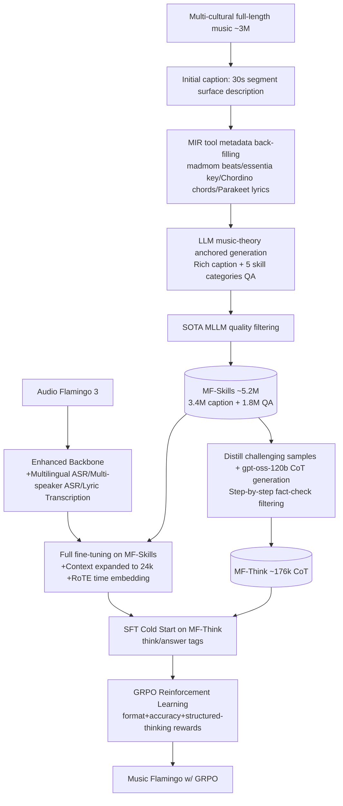

# Music Flamingo: Scaling Music Understanding in Audio Language Models

**Conference**: ICLR 2026  
**OpenReview**: [https://openreview.net/forum?id=RS7T9S16Bl](https://openreview.net/forum?id=RS7T9S16Bl)  
**Code / Project Page**: [https://research.nvidia.com/labs/adlr/MF/](https://research.nvidia.com/labs/adlr/MF/)  
**Area**: Audio Language Models / Music Understanding / Multimodal  
**Keywords**: Large Audio-Language Model, Music Understanding, Chain-of-Thought, GRPO, MF-Skills, MF-Think  

## TL;DR
By constructing a 5-million-scale multi-cultural, full-length, hierarchically-annotated music dataset (MF-Skills + MF-Think) and applying a "SFT → CoT Cold Start → GRPO Reinforcement Learning" training recipe onto an enhanced Audio Flamingo 3 backbone, Music Flamingo elevates audio language models from "identifying surface attributes" to "performing hierarchical, theory-aware music reasoning like a trained musician," achieving new SOTA results on 12+ music understanding and reasoning benchmarks.

## Background & Motivation
**Background**: Audio Language Models (ALM/LALM) have advanced significantly in speech and environmental sound understanding, but music remains a major challenge. Core musical attributes—mode, tempo, harmony, instrumentation, vocal style—do not exist in non-musical audio and require specialized reasoning; furthermore, "captioning, transcription, and retrieval" tasks migrated from speech/sound require a fresh start in music.

**Limitations of Prior Work**: The authors attribute the root cause to **data**. Current mainstream music caption data largely stems from early datasets like MusicCaps, inheriting its flaws: "short, surface-level, and generic." They only describe approximate genre/tempo/instrumentation, lack phrase-level temporal positioning, harmonic and formal structures, vocal/lyric alignment, and cultural context, while focusing heavily on instrumental clips. This prevents models from learning the hierarchical nature of music (surface attributes → mid-level structure → high-level semantics). Architecturally, many music LLMs still use encoders like CLAP that do not capture spoken content and low-level pitch, further limiting the learning of vocal timbre and lyric alignment.

**Key Challenge**: Even the most advanced LALMs often output short and vague descriptions when captioning well-known songs, misidentify tempo or mode, or rely on text priors rather than true auditory analysis. While the Audio Flamingo series from v1 to v3 saw massive growth in speech and environmental sound data, music data only increased by about 10%—**the scaling of music understanding has been bottlenecked by the scarcity of high-quality data**.

**Goal**: To **redefine traditional tasks** such as music captioning and QA into reasoning-centric forms, forcing the model to hierarchically and step-by-step connect surface and high-level information to produce coherent narratives like a musician.

**Core Idea**: **[Data + Reasoning Dual-Drive]** On one hand, develop a large-scale, multi-cultural, hierarchically annotated dataset (using MIR tools to back-fill reliable low-level attributes + LLM synthesis for rich captions/QA). On the other hand, explicitly inject reasoning capabilities using "CoT cold start + GRPO custom rewards," combined with context extension and time-aware representation to enable the model to truly "understand" full-length tracks.

## Method

### Overall Architecture
Music Flamingo consists of two pipelines: The **Annotation Pipeline** takes multi-cultural music segments through "initial caption → MIR metadata back-filling → LLM-generated rich caption/QA → quality filtering" to produce MF-Skills, and distills theory-anchored CoT data MF-Think from it. The **Training Pipeline** starts from an enhanced Audio Flamingo 3 backbone, performs full fine-tuning on MF-Skills to establish a "music foundation model," followed by SFT cold-starting with MF-Think to inject structured reasoning, and finally reinforcement learning with GRPO and custom rewards to strengthen step-by-step reasoning.

### Key Designs

**1. Enhanced Audio Flamingo 3 Backbone: Addressing spoken language gaps before music.** The authors realized the essential difference between songs and instrumentals is the "vocal"—vocals carry not just lyrics but also timbre, style, and expressive changes, requiring oral language understanding far beyond previous baselines. Consequently, on top of AF3's original training data, large-scale multilingual ASR (Emilia, CoVoST, MUST, Amazon-SIFT) was added across all fine-tuning stages to cover global vocal diversity. In the third stage, multi-speaker ASR (CHIME, Switchboard, AliMeeting) was added to allow the model to parse alternating and overlapping voices—critical for understanding duets and choruses. Phoneme recognition and lyric transcription were also supplemented to strengthen the alignment between vocal content and musical context. This step produces a stronger starting point for "music specialization" rather than the final model.

**2. MF-Skills Annotation Pipeline: Using MIR tools as "fact anchors," letting LLMs handle organization.** To prevent LLMs from hallucinating low-level attributes (misidentifying mode/tempo), a four-stage pipeline was used: first, SOTA music models generate short surface captions for 30s segments (minimizing hallucination); then, traditional MIR tools such as **madmom (beat), essentia (mode), Chordino (chord), and Parakeet (lyrics)** extract reliable low-level metadata. This "initial caption + metadata" is fed to a music-theory grounded LLM to produce rich captions (avg. 451.65 words) covering six dimensions (low-level info/instrumentation/lyrics/form/theory/mood). Targeted QA was generated for five skill categories identified as gaps in AF3: temporal understanding, attribute recognition, harmony/theory analysis, lyric/vocal grounding, and comparative/structural reasoning. Finally, SOTA MLLMs performed quality filtering. The final dataset is approximately 5.2M (3.4M caption + 1.8M QA), covering diverse cultures (e.g., Indian Raga, African polyrhythms) often ignored in Western-centric data.

**3. Long Context + RoTE Time-Aware Representation: "Hearing longer" and "aligning accurately."** The AF3 backbone's maximum context was only 8,192 tokens (~10 min audio), while full-length songs can reach 20 min and captions are much longer. The context was expanded to **24k tokens** using fully sharded training. More importantly, music understanding requires fine-grained temporal perception (chord progressions, tempo/mode changes, vocal dynamics). To this end, **Rotary Time Embeddings (RoTE)** were introduced: while standard RoPE rotation angles depend on token index $i$ ($\theta \leftarrow -i \cdot 2\pi$), RoTE uses the absolute timestamp $\tau_i$ ($\theta \leftarrow -\tau_i \cdot 2\pi$). Discrete time positions $\tau_i$ are interpolated for audio tokens generated at 40ms steps, providing a lightweight, time-anchored representation that allows the model to align descriptions to specific moments.

**4. CoT Cold Start + GRPO Custom Rewards: Forcing explicit reasoning.** Music caption generation inherently requires the model to connect surface attributes to high-level structures and organize them into a coherent narrative—a non-trivial reasoning process. The authors used gpt-oss-120b to select challenging samples from MF-Skills and generate theory-anchored reasoning chains. These were split into small steps and fact-checked against audio by a post-SFT MF model; samples with minor errors were rewritten, and those with >30% errors were discarded, resulting in ~176k MF-Think samples. Training began with SFT cold start (using `<think></think>` and `<answer></answer>` tags) as a warm-up for RL, followed by GRPO optimization. GRPO estimates advantages using the average reward of $G=5$ sampled outputs per question without a value network, with the objective:
$$J(\theta)=\mathbb{E}_{q,\{o_i\}}\Big[\frac{1}{G}\sum_{i=1}^{G}\min\Big(\frac{\pi_\theta(o_i|q)}{\pi_{\theta_{old}}(o_i|q)}A_i,\ \text{clip}\big(\tfrac{\pi_\theta(o_i|q)}{\pi_{\theta_{old}}(o_i|q)},1-\epsilon,1+\epsilon\big)A_i\Big)-\beta D_{KL}(\pi_\theta\|\pi_{ref})\Big]$$
Advantages $A_i$ are normalized within the group: $A_i=\frac{r_i-\text{mean}(\{r\})}{\text{std}(\{r\})}$. The reward design is key: **Format Reward** (1 if strictly following think/answer tags, 0 otherwise); **Accuracy Reward** (used for QA tasks comparing normalized predictions within the answer tags to ground truth); and **Structured Thinking Reward** (since open-ended captions cannot be directly judged, gpt-oss-120b creates structured ground truth metadata—Genre/BPM/Key/Meter/Structure/Instruments/Vocal Character/Lyric Themes/Theory/Mix Notes/Dynamics—and performs string matching on the generated caption for each category, normalizing the score by the number of matched categories).

## Key Experimental Results

### Main Results (Table 1, Comparison with strongest LALMs, listed baselines are top performers)

| Task Category | Dataset | Metric | Prev. SOTA | Music Flamingo |
|---|---|---|---|---|
| QA/Reasoning | MMAU-Music (full \| mini) | ACC ↑ | AF3: 73.95 \| 74.47 | **76.83 \| 76.35** |
| QA/Reasoning | MMAU-Pro-Music | ACC ↑ | Gemini-2.5 Flash: 64.90 | **65.60** |
| QA/Reasoning | MuChoMusic | ACC ↑ | Qwen3-O: 52.10 | **74.58** |
| QA/Reasoning | MMAR (Music) | ACC ↑ | Qwen2.5-O: 46.12 | **48.66** |
| QA/Reasoning | Music Instruct | GPT5 ↑ | AF3: 92.7 | **97.1** |
| QA/Reasoning | Music AVQA | ACC ↑ | AF3: **76.7** | 73.6 |
| Captioning | SongCaps (Human \| Coverage \| Correctness) | Score ↑ | AF3: 6.5 \| 6.7 \| 6.2 | **8.3 \| 8.8 \| 8.0** |
| MIR | NSynth (Source \| Instrument) | ACC ↑ | AF3: 65.5 \| 78.9 | **75.89 \| 80.76** |
| MIR | GTZAN (Genre) | ACC ↑ | Pengi: 80.00 | **84.45** |
| MIR | Medley-Solos-DB | ACC ↑ | AF2: 85.80 | **90.86** |
| MIR | MusicCaps | GPT5 ↑ | Qwen3-O: 7.2 | **8.8** |
| Lyric Transcription | Opencpop (Chinese) | WER ↓ | GPT-4o: 53.7 | **12.9** |
| Lyric Transcription | MUSDB18 (English) | WER ↓ | GPT-4o: 32.7 | **19.6** |

### Ablation Study (Gain from GRPO Reasoning)

| Setting | MMAU-Pro-Music ACC | MuChoMusic ACC |
|---|---|---|
| Without RL (No thinking traces) | 63.9 | 69.5 |
| Full Music Flamingo (w/ GRPO) | **65.6** | **74.58** |

### Key Findings
- **Comprehensive SOTA**: Surpassed both open and closed-source models across QA, Reasoning, MIR, and Lyric Transcription benchmarks, with the only significant lag being in Music AVQA (73.6 vs AF3's 76.7).
- **Major Margin in Lyric Transcription**: Chinese Opencpop WER dropped from 53.7 (GPT-4o) to 12.9; English MUSDB18 dropped from 32.7 to 19.6—verifying the value of the "multilingual/multi-speaker ASR backbone" strategy.
- **Reasoning Provides Gains**: Removing GRPO thinking traces resulted in a 1.7-point drop on MMAU-Pro-Music and a 5-point drop on MuChoMusic; harder benchmarks see larger gains from RL.
- **Expert Preferences**: Trained musicians gave SongCaps an 8.3 (AF3: 6.5). LLM-as-judge scores for coverage (8.8) and correctness (8.0) also showed leads, indicating more accurate and comprehensive outputs.

## Highlights & Insights
- **"Redefining the Task" is the true lever**: Reshaping "music captioning" from a summary to an "open exploratory task requiring layered reasoning" drives the data and training design—acknowledging that song descriptions are not single answers but interpretations shaped by theory and perception.
- **MIR Tools + LLM synergy**: Using deterministic MIR tools for "facts" (beats/keys/chords/lyrics) and delegating "organization and narrative" to the LLM suppresses low-level hallucinations at the source.
- **Structured Thinking Reward solves long-text evaluation**: Breaking open captions into matchable structural metadata categories provides a practical template for generation tasks where rewards are hard to define.
- **RoTE enables zero-cost time anchoring**: Swapping RoPE's index dependency for absolute timestamps gives the model fine-grained temporal awareness, critical for time-sensitive tasks like chord progression tracking.

## Limitations & Future Work
- **Unbalanced Cultural Coverage**: Understanding of under-represented or skewed cultural traditions remains limited, necessitating further expansion of global training data.
- **Specialized Skill Gaps**: Specific instrument skills, such as fine-grained piano technique recognition, remain weak.
- **Skill Breadth expansion**: Comprehensive music understanding requires covering more dimensions of musical skill.
- Data synthesis relies heavily on GPT and MLLM judgments, bounded by the quality and biases of these "teachers"; the regression on Music AVQA suggests specialization may cause negative transfer in certain multimodal alignment scenarios.

## Related Work & Insights
- **Continuation of Audio Flamingo**: Diagnosing and addressing music-specific gaps in the AF3 backbone represents a typical "General LALM → Domain Specialization" path.
- **Contrast with Pure MIR**: Key/chord/tempo detection and lyric transcription have long histories in MIR. This work uses those tools as "annotation engines" rather than ends, grafting their reliability onto LLMs' expressive power.
- **GRPO + Rule Reward Path**: Following the DeepSeek-R1 style of format/accuracy rules and extending them to structured-thinking rewards demonstrates the feasibility of migrating RLVR paradigms to "hard-to-define reward" generation tasks.
- **Insight**: For any "vertical domain multimodal understanding," the recipe here—using domain-specific tools for factual anchoring → LLM rich synthesis → CoT cold start → RL with verifiable rewards—is highly generalizable and valuable for fields like medicine or remote sensing.

## Rating
- **Novelty**: ⭐⭐⭐⭐ While most individual components (GRPO, RoTE, MIR back-filling) exist, the overall solution of "redefining music understanding as reasoning + large-scale multi-cultural hierarchical data + structured-thinking rewards" is pioneering for music LALMs.
- **Experimental Thoroughness**: ⭐⭐⭐⭐⭐ Covered 12+ benchmarks across categories, compared against nearly 20 LALMs, and included human experts, LLM-as-judge, and GRPO ablations.
- **Writing Quality**: ⭐⭐⭐⭐ Motivations are progressive, diagrams are clear, and methods are detailed. Qualitative comparisons are persuasive.
- **Value**: ⭐⭐⭐⭐⭐ Open-sourcing code, training recipes, and the MF-Skills/MF-Think datasets provides both new benchmarks (SongCaps) and strong foundation models, making this a high-quality public asset for the community.

<!-- RELATED:START -->

## Related Papers

- [\[ICLR 2026\] YuE: Scaling Open Foundation Models for Long-Form Music Generation](yue_scaling_open_foundation_models_for_long-form_music_generation.md)
- [\[ICLR 2026\] UALM: Unified Audio Language Model for Understanding, Generation and Reasoning](ualm_unified_audio_language_model_for_understanding_generation_and_reasoning.md)
- [\[ICLR 2026\] Measuring Audio's Impact on Correctness: Audio-Contribution-Aware Post-Training of Large Audio Language Models](measuring_audios_impact_on_correctness_audio-contribution-aware_post-training_of.md)
- [\[ICLR 2026\] Query-Guided Spatial-Temporal-Frequency Interaction for Music Audio-Visual Question Answering](query-guided_spatial-temporal-frequency_interaction_for_music_audio-visual_quest.md)
- [\[ICLR 2026\] Discovering and Steering Interpretable Concepts in Large Generative Music Models](discovering_and_steering_interpretable_concepts_in_large_generative_music_models.md)

<!-- RELATED:END -->
