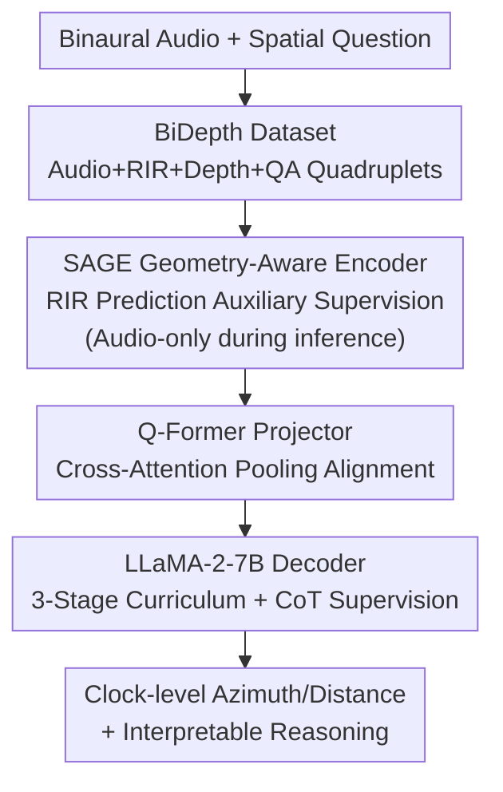

# OWL: Geometry-Aware Spatial Reasoning for Audio Large Language Models

**Conference**: ICLR 2026  
**OpenReview**: [https://openreview.net/forum?id=zPv46YKv3w](https://openreview.net/forum?id=zPv46YKv3w)  
**Code**: https://github.com/BASHLab/OWL  
**Area**: Audio & Speech / Audio Large Models / Spatial Reasoning  
**Keywords**: Binaural Audio, Spatial Reasoning, Geometry-Aware Encoder, Chain-of-Thought, Sound Event Localization

## TL;DR
This paper proposes SAGE, a geometry-aware binaural audio encoder, and OWL, a spatial audio large language model. By aligning acoustic features with 3D geometry using Room Impulse Response (RIR) and panoramic depth maps during training—and utilizing only audio during inference—combined with "spatial-anchored Chain-of-Thought (CoT) + curriculum learning," the model achieves clock-face-level azimuth estimation and interpretable multi-step spatial reasoning. It significantly outperforms BAT in DoA error and spatial QA.

## Background & Motivation
**Background**: Audio Large Language Models (ALLMs) connect audio encoders to LLMs, enabling tasks like sound event recognition, speaker attribution, and audio dialogue. However, compared to vision-language models, the audio side lags, especially in "spatial" understanding. Representative work BAT first demonstrated spatial QA capabilities from binaural audio.

**Limitations of Prior Work**: Methods like BAT have two major flaws. First, **localization is too coarse**—it divides the scene into only four quadrants (front/back/left/right), failing to support fine-grained source tracking, relative distance estimation, or multi-source disambiguation. Second, the encoder is **trained only on audio**, lacking geometric information.

**Key Challenge**: The authors attribute the problem to two root causes. (i) **Lack of geometric grounding**: Existing encoders capture spectral and temporal patterns but ignore geometric cues that determine sound propagation—Direct-to-Reverberant Ratio (DRR), reverberation time RT60, and room structure. Consequently, models identify "what the sound is" but cannot answer "which source is closer" or "whether sound comes from left or right." (ii) **Single-step reasoning**: Existing ALLMs map questions directly to answers without intermediate reasoning, failing in multi-source scenes or tasks requiring step-by-step spatial logic.

**Goal**: (1) Enable the audio encoder to learn geometry-aware acoustic representations without relying on geometric inputs during inference; (2) Enable ALLMs to decompose complex spatial questions into interpretable sub-steps; (3) Provide datasets to support large-scale training and evaluation.

**Key Insight**: The authors observe that geometric information (RIR, depth maps) is "privileged information" available during simulation training; it can be used via auxiliary supervision to "inject" geometry into the audio encoder. During actual deployment, only audio is needed. Moreover, spatial reasoning is naturally suited for CoT decomposition (localization followed by comparison, then conclusion).

**Core Idea**: Use a "Geometry-conditioned trained encoder (SAGE)" instead of a "pure audio encoder" for geometric grounding, and use "spatial-anchored CoT + three-stage curriculum" instead of "single-step mapping" to address the reasoning gap.

## Method

### Overall Architecture
OWL aims to output clock-face azimuth/distance and interpretable reasoning given binaural audio and a spatial question. The framework consists of three parts: **SAGE** encodes binaural waveforms into "geometry-aware acoustic representations"; a **Q-Former projector** compresses and aligns these features with the LLM embedding space; and a **LLaMA-2-7B decoder** generates answers integrated with text prompts. SAGE's geometric capability stems from an **auxiliary RIR prediction task** (using depth maps) during training; this geometric branch is discarded during inference, leaving only the audio encoder. OWL is then trained via a **three-stage curriculum** from perception to CoT reasoning, supported by the self-constructed **BiDepth** dataset (≈1.1 million QA quadruplets).

### Key Designs

**1. SAGE: Using RIR Prediction as an Auxiliary Task to Ground Geometry**

To address the lack of geometric grounding, SAGE introduces a **privileged supervision**: binaural RIR prediction. It consists of two jointly optimized modules: a **binaural audio encoder** $\phi_a(\cdot)$ taking binaural waveforms $B \in \mathbb{R}^{2\times L}$ and outputting embeddings $h_a \in \mathbb{R}^{C\times T}$, supporting sound event classification, DoA estimation, and distance prediction; and an **RIR prediction module** that encodes a panoramic depth map $D_i$ using ResNet-18 to get $h_d=\phi_d(D_i)$, fuses it with audio features, and reconstructs the binaural RIR $\bar R=\psi_d(h_d,h_a)$ using transposed convolutions.

The perception loss is a weighted cross-entropy $L_{\text{binaural}}=\alpha_1 L_{cls}+\alpha_2 L_{dis}+\alpha_3 L_{doa}$. The geometric loss combines an $\ell_1$ term with an **Energy Decay Curve (EDC) loss**:

$$L_{\text{geo}} = \|R-\bar R\|_1 + \lambda L_{\text{EDC}}(R,\bar R)$$

where $L_{\text{EDC}}$ measures the difference between predicted and ground-truth decay curves using Schroeder back-integration. EDC is used instead of scalar descriptors like RT60 because it is differentiable and captures rich reverberant structure (DRR, Early Decay Time). The total objective is $L=\eta_1 L_{\text{binaural}}+\eta_2 L_{\text{geo}}$. Crucially, the geometric branch exists only during training; **only $\phi_a$ is used during inference**, internalizing geometric knowledge into the audio encoder.

**2. Spatial-Anchored CoT: Decomposing Reasoning into Interpretable Steps**

To solve the single-step reasoning issue, OWL first localizes each source (e.g., "Cat at 8 o'clock, 1.5m"), performs relative comparisons, and reaches a conclusion ("8 o'clock is on the left, 1 o'clock is not, so the cat is on the listener's left"). This CoT is **anchored to source positions**, binding every intermediate step to specific coordinates. Supervision in Type IV data targets both intermediate steps and the final answer, forcing the model to rely on structured spatial comparisons.

**3. Q-Former Projection + Frozen Encoder: Aligning LLM while Preserving Geometry**

The projector $\psi(\cdot)$ uses $Q$ learnable query tokens with cross-attention pooling to project $h_a$ into $z_q\in\mathbb{R}^{Q\times d}$. Q-Former is chosen over linear/MLP adapters because its selective cross-attention better preserves spatial cues. The LLM (LLaMA-2-7B) is fine-tuned via LoRA, while the SAGE audio encoder $\phi_a$ **remains frozen** to maintain geometric features learned during pre-training.

**4. Three-Stage Curriculum Learning: From Perception to Relations to CoT**

Training directly on multi-step reasoning causes models to take "relational shortcuts," bypassing geometric perception. OWL uses a three-stage curriculum: grounded perception as the foundation, relational reasoning as the structure, and CoT as the final layer.

### Loss & Training
OWL is trained with a three-stage curriculum:

| Stage | Question Type | Source | Training Samples | Function |
|------|------|------|----------|------|
| Stage 1 | I, II | Single-source warmup → Dual-source | 270K + 270K | Perceptual Pre-training: Stabilize classification and DoA |
| Stage 2 | III | Dual-source | 300K | Relative Geometric Pre-training: Internalize left/right and distance relations |
| Stage 3 | IV | Dual-source | 250K | CoT Instruction Tuning: Supervise reasoning steps and final answer |

Each stage minimizes the standard auto-regressive cross-entropy:

$$L(\phi_a,\psi,\Pi) = \sum_{s\in\{1,2,3,4\}} \mathbb{E}_{(B^r(t),q,y)\sim D_s}\left[-\sum_{t=1}^{T}\log\Pi(y_t|y_{<t}, q, z_q)\right]$$

## Key Experimental Results

### Main Results
SAGE on SELD compared to SELDNet / Spatial-AST (BiDepth, including depth training):

| Method | mAP ↑ | ER20° ↓ | MAE ↓ | DER ↓ |
|------|-------|---------|-------|-------|
| SELDNet | 39.46 | 53.21 | 38.71 | 53.38 |
| Spatial-AST | 49.17 | 41.94 | 27.24 | 39.21 |
| **SAGE (Audio+Depth)** | **49.81** | **28.13** | **21.67** | **14.32** |

Compared to Spatial-AST, SAGE's detection improves slightly (~1.7%), but localization improves significantly: ER20° drops by 23.61%, MAE by 25.52%, and DER by 31.34%.

OWL on BiDepth compared to baseline (12-bin azimuth and reasoning accuracy):

| Method | DoA Acc (Dual) ↑ | Type III BA ↑ | Type IV BA ↑ |
|------|------------------|---------------|--------------|
| BAT | 35.29* (4-bin) | 69.46 | 61.29 |
| OWL w/o CoT | 34.24 (12-bin) | 74.29 | 65.27 |
| **OWL w/ CoT** | **34.31** | **77.89** | **76.53** |

Ours outperforms BAT in perception QA by 46.4% and in spatial reasoning by 24.9% (approx. 25%), with an average DoA error reduction of 11°.

### Ablation Study
SAGE loss component ablation (BiDepth):

| Configuration | mAP ↑ | ER20° ↓ | MAE ↓ | DER ↓ |
|------|-------|---------|-------|-------|
| $L_{\text{binaural}}$ only ($\eta_2{=}0$) | 49.75 | 36.89 | 26.32 | 17.11 |
| $\lambda=0$ (No EDC) | 49.73 | 36.79 | 26.12 | 16.71 |
| $\eta_2=1e{-}2$ | 49.81 | 28.13 | 21.67 | 14.32 |

### Key Findings
- **Geometric supervision primarily enhances localization, not detection**: mAP remains stable while ER20°/MAE/DER drop sharply, confirming that geometric cues dictate spatial reasoning.
- **EDC loss is indispensable**: Removing EDC degrades localization more than detection, indicating that differentiable decay curves transfer reverberant geometry better than scalar RT60.
- **Curriculum stages are essential**: Skipping the warmup leads to detection collapse; skipping relations prevents reasoning generalization.

## Highlights & Insights
- **Elegant Privileged Information Paradigm**: Using RIR/depth (available only at training) to distill geometric knowledge into the audio encoder allows for zero-cost deployment.
- **EDC Loss over RT60**: Replacing a non-differentiable scalar with a differentiable curve matching loss is a clever engineering choice for end-to-end geometric supervision.
- **Spatial-Anchored CoT**: Binding reasoning to specific azimuths/distances prevents "shortcuts" and provides the first effective audio CoT paradigm.

## Limitations & Future Work
- **Dependency on Simulation**: BiDepth is generated via soundscapes/Matterport3D; robustness in real-world environments with actual materials remains unverified.
- **Multi-source Density**: Experiments focused on dual-source scenarios; performance in dense multi-source (3+) or high-noise environments is uncertain.
- **Scale**: LLM and encoder sizes were fixed (LLaMA-2-7B) to match BAT; exploring larger models or joint fine-tuning may yield further gains.

## Related Work & Insights
- **vs BAT**: OWL achieves 12-bin precision and multi-step reasoning via spatial CoT, whereas BAT is limited to 4 sectors and single-step mapping.
- **vs Audio Flamingo 3**: While AF3 experimented with audio CoT, it was limited to perception; OWL introduces the first geometry-aware spatial CoT.

## Rating
- Novelty: ⭐⭐⭐⭐⭐ 
- Experimental Thoroughness: ⭐⭐⭐⭐ 
- Writing Quality: ⭐⭐⭐⭐ 
- Value: ⭐⭐⭐⭐⭐ 

<!-- RELATED:START -->

## Related Papers

- [\[ICLR 2026\] Measuring Audio's Impact on Correctness: Audio-Contribution-Aware Post-Training of Large Audio Language Models](measuring_audios_impact_on_correctness_audio-contribution-aware_post-training_of.md)
- [\[ICLR 2026\] Stitch: Simultaneous Thinking and Talking with Chunked Reasoning for Spoken Language Models](stitch_simultaneous_thinking_and_talking_with_chunked_reasoning_for_spoken_langu.md)
- [\[ICML 2026\] Two-Dimensional Quantization for Geometry-Aware Audio Coding](../../ICML2026/audio_speech/two-dimensional_quantization_for_geometry-aware_audio_coding.md)
- [\[ACL 2026\] Closing the Modality Reasoning Gap for Speech Large Language Models](../../ACL2026/audio_speech/closing_the_modality_reasoning_gap_for_speech_large_language_models.md)
- [\[NeurIPS 2025\] ThinkSound: Chain-of-Thought Reasoning in Multimodal Large Language Models for Audio Generation and Editing](../../NeurIPS2025/audio_speech/thinksound_chain-of-thought_reasoning_in_multimodal_large_language_models_for_au.md)

<!-- RELATED:END -->
## Related Papers

- [\[ICLR 2026\] Measuring Audio's Impact on Correctness: Audio-Contribution-Aware Post-Training of Large Audio Language Models](measuring_audios_impact_on_correctness_audio-contribution-aware_post-training_of.md)
- [\[ICLR 2026\] Stitch: Simultaneous Thinking and Talking with Chunked Reasoning for Spoken Language Models](stitch_simultaneous_thinking_and_talking_with_chunked_reasoning_for_spoken_langu.md)
- [\[ACL 2026\] Closing the Modality Reasoning Gap for Speech Large Language Models](../../ACL2026/audio_speech/closing_the_modality_reasoning_gap_for_speech_large_language_models.md)
- [\[ICML 2026\] Two-Dimensional Quantization for Geometry-Aware Audio Coding](../../ICML2026/audio_speech/two-dimensional_quantization_for_geometry-aware_audio_coding.md)
- [\[ICLR 2026\] UALM: Unified Audio Language Model for Understanding, Generation and Reasoning](ualm_unified_audio_language_model_for_understanding_generation_and_reasoning.md)

<!-- RELATED:END -->
