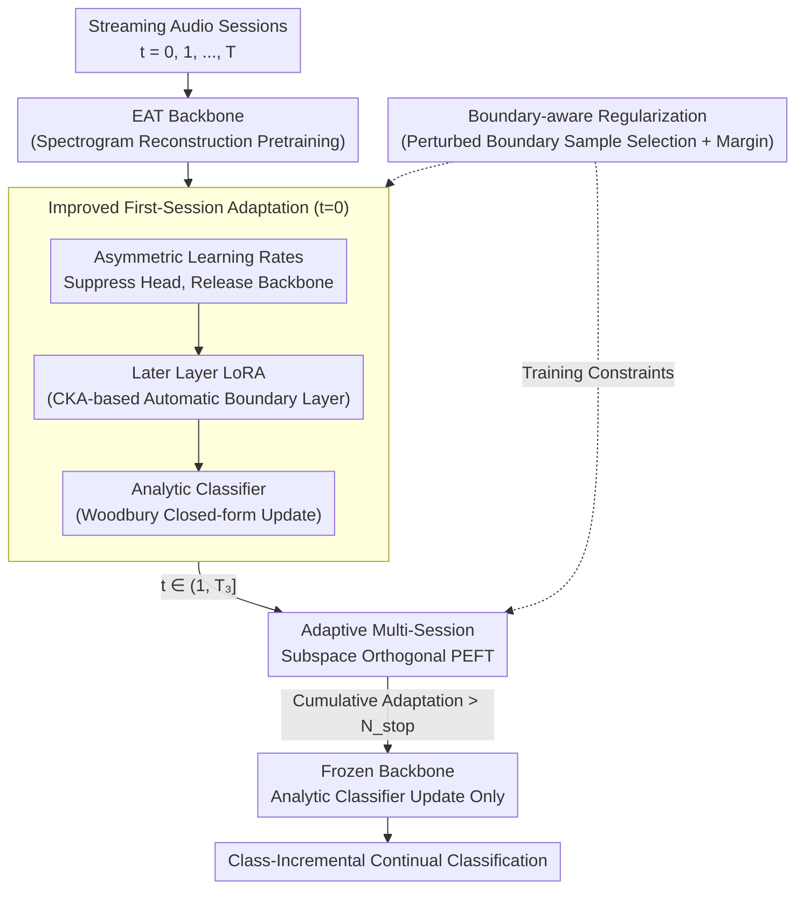

# PACE: Pretrained Audio Continual Learning

**Conference**: ICLR 2026  
**arXiv**: [2602.03355](https://arxiv.org/abs/2602.03355)  
**Code**: Yes (to be released with the paper)  
**Area**: Audio and Speech  
**Keywords**: Audio Continual Learning, Pretrained Models, Parameter-Efficient Fine-Tuning, Analytic Classifier, Catastrophic Forgetting

## TL;DR

This work systematically constructs the first audio continual learning benchmark and reveals an upstream-downstream mismatch caused by the dominance of low-level time-frequency features in pretrained audio models. The proposed PACE method (Improved First-Session Adaptation + Adaptive Subspace Orthogonal PEFT + Boundary-aware Perturbation) significantly outperforms the SOTA across 6 audio CL benchmarks.

## Background & Motivation

Pretrained audio models perform excellently on static tasks but suffer from catastrophic forgetting when facing continuously evolving data distributions. Directly migrating vision-domain continual learning (CL) methods to the audio domain faces fundamental obstacles:

**Severe Upstream-Downstream Mismatch**: Audio backbones (e.g., EAT) are pretrained via spectrogram reconstruction, emphasizing low-level time-frequency patterns rather than structured semantics. However, downstream CL requires high-level discriminative representations.

**More Intense Representation Drift**: Representation changes between adjacent sessions in the audio domain far exceed those in the vision domain (quantified by t-SNE/CKA), leading to more severe forgetting.

**Failure of PEFT Methods**: Methods like L2P and DualPrompt degrade approximately three times more in the audio domain compared to the vision domain.

The design is driven by three key findings:

| Finding | Content | Impact |
|------|------|------|
| Finding 1 | Statistical methods (FSA + Analytic Classifier) outperform PEFT prompt-based methods. | Establishes the technical route. |
| Finding 2 | Representation saturation exists at a coarse level: the first session captures most information. | Highlights the need for improved FSA. |
| Finding 3 | Gaps are larger at a fine-grained level: the first session is insufficient to bridge the semantic gap. | Highlights the need for multi-session adaptation. |

## Method

### Overall Architecture

PACE addresses the significant gap between the spectrogram reconstruction goal of pretrained audio backbones (e.g., EAT) and the discriminative requirements of downstream CL. The mechanism involves progressively adapting the backbone as sessions proceed without overwriting previously learned representations. The pipeline follows three stages indexed by session $t$: For the first session ($t=0$), it performs **Improved First-Session Adaptation**—using asymmetric learning rates to drive gradients into the deep backbone and applying LoRA to later layers, followed by a training-free analytic classifier. For intermediate sessions ($t \in (1, T_3]$), it employs **Adaptive Multi-Session Subspace Orthogonal PEFT**, where independent LoRAs are used for each session with gradients projected onto a subspace that does not interfere with old tasks. Once the cumulative adaptation exceeds a threshold $N_{stop}$, it enters the third stage, freezing the backbone and using the analytic classifier to absorb new classes in a closed-form manner. **Boundary-aware Regularization** is applied throughout training to widen the decision boundaries between new and old classes.

### Key Designs

**1. Improved First-Session Adaptation (Improved FSA): Enabling the audio backbone to fully adapt in the first session rather than only learning a classification head.**

Naive FSA jointly trains the head and backbone, often resulting in the head overfiting quickly while the backbone remains largely unchanged. This is fatal in audio since the pretraining goal is far from the downstream task. PACE implements three strategies. First is **Restricted Head learning**: using asymmetric learning rates $\eta_{head} \ll \eta_{bb}$ and a two-stage process—training only the head for $E_{head}$ epochs, then fine-tuning only the backbone for $E_0$ epochs. This is opposite to LAE/SLCA in vision CL which aims to "suppress drift," because the audio backbone needs to be encouraged to adapt. Second is **Later Layer LoRA**: CKA analysis shows shallow layers encode domain-general patterns while deep layers encode task-specific semantics. LoRA is only applied to layers $l \geq L_{tune}$:

$$W_1^l = W_0^l + A_1^l B_1^l, \quad L_{tune} \leq l \leq L$$

The boundary $L_{tune}$ is automatically determined using a CKA deviation threshold $\rho_{layer}$. Third is the **Analytic Classifier**: the trainable head is replaced by one solved via the Woodbury identity to recursively update the autocorrelation matrix:

$$R_t = R_{t-1} - R_{t-1}\hat{Z}_t^\top(I + \hat{Z}_t R_{t-1} \hat{Z}_t^\top)^{-1}\hat{Z}_t R_{t-1}$$

This non-destructive closed-form update avoids cumulative head bias without storing old samples.

**2. Adaptive Multi-Session Subspace Orthogonal PEFT: Bridging fine-grained semantic gaps through non-interfering subsequent learning.**

Finding 3 shows the first session is insufficient for fine-grained tasks. PACE introduces Multi-Session Adaptation (MSA) for $t \in (1, T_3]$: each session uses independent LoRA layers. The backbone weight is represented as the sum of historical increments:

$$W_t = W_0 + \sum_{\tau=0}^{t-1} B_\tau A_\tau + B_t A_t$$

To prevent interference, gradients are projected onto a constrained subspace:

$$g_{update} = P_{\mathcal{U}_t} \nabla_\theta \mathcal{L}_{ce}(g_t(f_t(\mathcal{X}_t)), \mathcal{Y}_t)$$

The subspace to be protected is estimated via "LoRA Subtraction" without storing historical features. An "unlearn model" $W_t^{unlearn} = W_0 - \sum_{\tau=0}^{t-1} A_\tau B_\tau$ is used to calculate the non-centered covariance matrix $X_t^{ucov}$, followed by SVD. An **Adaptive Freeze** switch stops backbone updates once $\sum_{i=0}^{T_3} N_t > N_{stop}$.

**3. Boundary-aware Regularization: Widening entangled decision boundaries in the feature space.**

To prevent misclassification between new and old classes near boundaries, PACE identifies "dangerous samples" by applying $N_p$ time-frequency mask perturbations $\tilde{x}_{i,t}^k = \mathcal{Q}(x_{i,t}, r_T, r_F)$. Samples with misclassification rates higher than $\rho_p$ are added to a boundary set $\mathcal{B}_t$. A margin-based regularization is then applied:

$$\mathcal{L}_{reg}(i) = \max(0, \delta + \frac{1}{|\mathcal{S}_i|}\sum_{u \in \mathcal{S}_i}\|f_t(u) - \mu(x_c)\|_2^2 - \min_{b \in \mathcal{B}_t}\|f_t(x_{i,t}) - b\|_2^2)$$

This pulls samples toward their class center $\mu(x_c)$ while pushing them away from boundary points.

### Loss & Training

- FSA Stage: Cross-entropy $\mathcal{L}_{ce}$ + Boundary Regularization $\mathcal{L}_{reg}$.
- MSA Stage: Cross-entropy + Regularization + Subspace Orthogonal Gradient Projection.
- Stage 3: Analytic classifier update only (closed-form, no gradient training).
- Pretrained Backbone: EAT (12-layer ViT, self-supervised on AudioSet-2M, ~5000 hours).
- Data Augmentation: Time-frequency masking (SpecAugment style).

## Key Experimental Results

### Main Results

**Table 1: Average Top-1 Accuracy (%) on 6 Audio CL Benchmarks**

| Method | ESC-50 | US8K | SC2 | TIMIT-2 | TIMIT-3 | VocalSet |
|------|--------|------|-----|---------|---------|----------|
| Joint Training (Upper Bound) | 96.50 | 98.07 | 95.91 | 95.22 | 95.22 | 76.65 |
| L2P | 39.50 | 38.75 | 14.70 | 1.50 | 2.53 | 20.39 |
| RanPAC (w/ FSA) | 92.25 | 97.08 | 90.53 | 85.63 | 89.92 | 62.82 |
| HiDe-Prompt | 83.75 | 79.89 | 40.10 | 47.78 | 49.60 | 48.36 |
| **PACE** | **95.75** | **97.49** | **91.87** | **90.95** | **94.05** | **69.08** |

**Gap with Joint Training**: Only 0.75% on ESC-50, 0.58% on US8K, and 1.17% on TIMIT-3.

**Table 2: Ablation—Improved FSA Components (Coarse-grained)**

| Strategy | ESC-50 | US8K | SC2 |
|------|--------|------|-----|
| w/o FSA | 92.50 | 96.49 | 81.22 |
| Naive FSA | 92.25 | 97.08 | 90.53 |
| + Low LR | 93.75 | 97.35 | 90.95 |
| + Later Layer LoRA | **95.75** | **97.49** | **91.87** |

### Ablation Study

PACE maintains its advantage when using the SSLAM backbone, verifying its backbone-agnostic nature.

Contributions of MSA on fine-grained benchmarks:
- FSA only → +MSA: +3.2% (TIMIT-2)
- +Subspace Orthogonality: +1.5%
- +Boundary-aware Regularization: +0.6%

### Key Findings

1.  **Fundamental Differences (Audio vs. Vision CL)**: Audio backbones emphasize low-level spectrograms, resulting in representation drift 3× higher than in vision.
2.  **Counter-intuitive FSA Finding**: Audio CL requires encouraging backbone adaptation (unlike vision CL); freezing shallow layers while tuning deep layers is key.
3.  **Stability of Analytic Classifier**: Effectively avoids the accumulation of bias and propagation of representation drift.
4.  **Innovative Use of LoRA Subtraction**: Approximates the representation subspace of old tasks without storing historical features.

## Highlights & Insights

- **First Systematic Audio CL Benchmark**: 6 benchmarks covering coarse/fine-grained tasks across speech, music, and ambient sound.
- **"Adapt, Don't Freeze"**: Contrast to the "frozen backbone is sufficient" paradigm in the vision domain, revealing the unique nature of audio pretrained models.
- **Three-stage Progressive Framework**: FSA → MSA → Frozen naturally balances plasticity and stability.
- **LoRA Subtraction for "Unlearn Models"**: An elegant and efficient way to use parameter arithmetic to approximate historical representation subspaces.

## Limitations & Future Work

1.  Approximation limits of LoRA subtraction: Subtraction is not exact forgetting; bias may increase in high-rank or strong adaptation scenarios.
2.  Boundary detection depends on the quality of the temporary model $\theta_{temp}$.
3.  The adaptive freezing threshold $N_{stop}$ requires manual setting; optimal values may vary across scenarios.
4.  Evaluated only on class-incremental settings; other CL settings like task-aware or domain-incremental are not covered.
5.  VocalSet gap remains at 7.57%, indicating severe mismatch in fine-grained music tasks.

## Related Work & Insights

- The analytic classifier from **RanPAC** serves as a technological cornerstone.
- **LoRA Subtraction** is innovatively used for null-space projection.
- The mismatch between **EAT**’s spectrogram reconstruction pretraining and downstream classification is the core problem identified.
- Insight: The degree of alignment between pretraining objectives and downstream tasks determines CL difficulty.

## Rating

- Novelty: ⭐⭐⭐⭐ — First audio CL benchmark + three-stage framework.
- Technical Depth: ⭐⭐⭐⭐⭐ — Solid theory in subspace orthogonal PEFT and boundary regularization.
- Experimental Thoroughness: ⭐⭐⭐⭐⭐ — 6 benchmarks, multiple backbones, and comprehensive ablation.
- Value: ⭐⭐⭐⭐ — Addresses practical needs in audio CL, though deployment scenarios need clarification.

<!-- RELATED:START -->

## Related Papers

- [\[ICLR 2026\] Physics-Informed Audio-Geometry-Grid Representation Learning for Universal Sound Source Localization](physics-informed_audio-geometry-grid_representation_learning_for_universal_sound.md)
- [\[ICLR 2026\] SupCLAP: Controlling Optimization Trajectory Drift in Audio-Text Contrastive Learning with Support Vector Regularization](supclap_controlling_optimization_trajectory_drift_in_audio-text_contrastive_lear.md)
- [\[CVPR 2025\] Learning to Highlight Audio by Watching Movies](../../CVPR2025/audio_speech/learning_to_highlight_audio_by_watching_movies.md)
- [\[ICLR 2026\] EmotionThinker: Prosody-Aware Reinforcement Learning for Explainable Speech Emotion Reasoning](emotionthinker_prosody-aware_reinforcement_learning_for_explainable_speech_emoti.md)
- [\[ACL 2026\] Privacy-preserving Prosody Representation Learning](../../ACL2026/audio_speech/privacy-preserving_prosody_representation_learning.md)

<!-- RELATED:END -->
