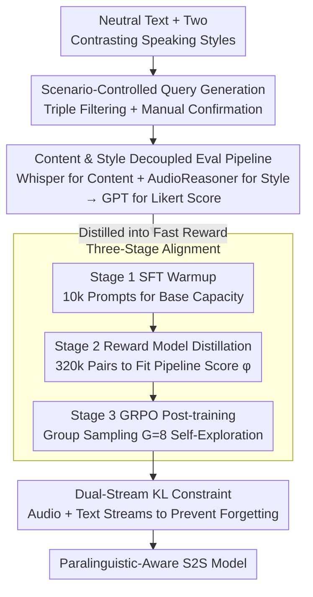

# ParaS2S: Benchmarking and Aligning Spoken Language Models for Paralinguistic-Aware Speech-to-Speech Interaction

**Conference**: ICLR 2026  
**arXiv**: [2511.08723](https://arxiv.org/abs/2511.08723)  
**Code**: [Project Page](https://paras2sbench.github.io/)  
**Area**: Speech Dialogue / Reinforcement Learning  
**Keywords**: Speech-to-Speech, Paralinguistic-Aware, Benchmark, GRPO, Reward Model

## TL;DR

The ParaS2S framework is proposed, comprising ParaS2SBench—a benchmark for evaluating paralinguistic awareness (emotion/sarcasm/age/gender) in Speech-to-Speech (S2S) interaction—and ParaS2SAlign, a GRPO-based RL alignment framework. It enables S2S models to learn the ability to adjust responses according to speaking styles with minimal annotated data.

## Background & Motivation

Speech conveys not only textual content but also rich **paralinguistic cues** (emotion, tone, speaker attributes, etc.), which together shape the true intent and guide appropriate responses. Current S2S models face several core issues:

**"Tone-deaf" Issue**: Current S2S models (including Qwen2.5-Omni, GPT-4o Voice mode, and GLM-4-Voice) exhibit almost no variation in responses when faced with different speaking styles. Experiments show they score around 3 (on a 5-point scale), performing similarly to pipeline baselines that ignore speaking styles.

**Lack of Evaluation Benchmarks**: Existing benchmarks mostly focus on speech-to-text understanding (e.g., VoiceBench) or evaluate text response quality. No benchmark directly evaluates the appropriateness of S2S model output speech in terms of both content and style.

**Data Scarcity Bottleneck**: Constructing paralinguistic-aware S2S training data requires style annotation and expressive recording, which is extremely costly. This is a primary barrier to developing such models.

Core Problem: Inspired by DeepSeek-R1—which showed that reasoning capabilities can emerge through RL without SFT demonstrations—**can paralinguistic-aware dialogue capabilities also emerge through RL with minimal supervision?**

## Method

### Overall Architecture

ParaS2S consists of two components: ParaS2SBench for evaluation and ParaS2SAlign for training. ParaS2SBench automatically generates speech test queries covering four paralinguistic dimensions (emotion, sarcasm, age, gender), each paired with two contrasting speaking styles, and directly scores the fitness of the "Input Speech—Output Speech" pair. ParaS2SAlign utilizes a three-step process—SFT warmup, reward model distillation, and GRPO post-training—to convert automated scoring into optimizable reward signals, enabling S2S models to learn style-adaptive responses without heavy reliance on human annotation. The Likert scores from the evaluation side serve as the reward source for the training side, forming a closed loop from evaluation to training.

### Key Designs

**1. Scenario-Controlled Query Generation: Forcing Models to Rely on Audio for Speaker State Analysis**

The biggest trap in testing paralinguistic awareness is that models might "guess" the appropriate response based solely on the text literal, bypassing audio understanding. Therefore, every query is constructed with neutral text, such as "I just bumped into my ex." This sentence itself does not hint at any emotional tendency. Pairing the same text with two distinct speaking styles (e.g., surprised vs. sad) ensures that a correct response can only be given by understanding the tone. ChatGPT is used for triple filtering (neutral test, rationality test, and paralinguistic relevance test) to ensure the text leaks no emotion and that the style truly changes the appropriate response, followed by manual confirmation.

**2. Content & Style Decoupled Evaluation Pipeline: Splitting "Speech Quality" into Two Automatable Sub-problems**

Directly judging if an output speech is appropriate is difficult. Thus, evaluation is decomposed into content and style branches: Whisper-v3 converts input/output speech to text for content $c_i, c_o$, and AudioReasoner analyzes speaking styles to obtain $s_i, s_o$. These are then processed by ChatGPT 4.1, combined with query requirements $r$, to generate a Likert score: $f_{\text{gpt}} = GPT(c_i, s_i, c_o, s_o, r)$. This "text-mediated" approach bypasses the difficulty of end-to-end speech scoring and allows the pipeline to run automatically, achieving a Pearson correlation with human scoring of over 0.7.

**3. Three-Stage Alignment: From Base Capacity to Distilled Rewards and RL Exploration**

Base models often lack paralinguistic awareness, making it impossible for RL to sample meaningful responses directly. Stage 1 involves SFT warmup using 10k speech prompts with expressive responses synthesized by gpt-4o-mini-tts. Since the evaluation pipeline is too slow for high-frequency RL scoring, Stage 2 generates 32 responses per query for 10k queries (320k pairs), using the pipeline scores to train a reward model $\phi$ that approximates the pipeline. Stage 3 runs GRPO on 100k unlabelled speech prompts: sampling $G=8$ responses per group, scoring them with $\phi$, and updating the policy via group-relative advantage.

**4. Dual-Stream KL Constraint: Preserving General Dialogue Intelligence During Skill Acquisition**

GRPO can easily deviate from the base distribution when chasing paralinguistic rewards, damaging general dialogue capabilities. A KL penalty is added to the loss, acting on both audio and text token streams. Ablations show that removing this term ($\beta=0$) leads to a severe drop in VoiceBench performance (catastrophic forgetting), while $\beta=0.2$ achieves the best balance between paralinguistic and general capabilities.

### Loss & Training

Each of the three stages uses a different loss: SFT uses standard next-token prediction optimizing both audio stream $a_o$ and text stream $t_o$; the Reward Model uses cross-entropy loss by treating the Likert score as a single-character prediction task; GRPO uses group-relative policy optimization with a KL penalty, with rewards provided by the distilled model $\phi$. Training uses Kimi-Audio as the base. SFT and GRPO are run on 8×NVIDIA H100 using FSDP, with SFT learning rate 1e-5 and RL learning rate 5e-4.

## Key Experimental Results

### Main Results

**Comprehensive Comparison of S2S Models** (ParaS2SBench scores, 5-point scale)

| Model | Synthetic Avg | Real Avg | Overall Avg |
|------|-------------|---------|------------|
| Whisper-GPT-TTS (Pipeline Baseline) | 3.022 | 3.487 | 3.176 |
| GPT-4o Voice mode | 3.284 | 3.639 | 3.403 |
| Qwen2.5 Omni | 3.248 | 3.612 | 3.369 |
| GLM-4-Voice | 3.033 | 3.037 | 3.034 |
| Kimi-Audio (Base) | 2.892 | 1.265 | 2.350 |
| **Kimi-Audio SFT** | **4.076** | **3.714** | **3.955** |
| **Kimi-Audio GRPO** | **4.441** | **4.161** | **4.382** |
| GPT-TTS (Topline) | 4.705 | 4.766 | 4.725 |

Key Observations:
- All existing S2S models perform similarly to the pipeline baseline (~3.0-3.4), indicating they lack paralinguistic awareness.
- SFT yields a 68% relative gain; GRPO provides an additional 11% improvement.
- The GRPO model approaches Topline (ideal TTS system) performance.

### Ablation Study

| Configuration | Key Metric | Description |
|------|---------|------|
| RL w/ 10h SFT warmup | Matches 50h SFT | RL is highly label-efficient |
| RL w/ 20h SFT warmup | Matches 100h SFT | Achieves same performance with 1/5 of the annotation |
| KL $\beta = 0$ | VoiceBench drops significantly | No KL constraint leads to catastrophic forgetting |
| KL $\beta = 0.2$ | Superior on both metrics | Optimal balance point |
| Group size $G < 8$ | Performance drops significantly | At $G=2$, samples often receive identical scores |
| Group size $G \geq 8$ | No further improvement | $G=8$ is sufficient for the learning signal |
| Resources to SFT vs. RM | SFT is more beneficial | 10h of annotation is enough to build a usable Reward Model |

### Key Findings

1. **Benchmark Aligns with Human Scoring**: Pearson correlation exceeds 0.7, and model rankings are almost identical to human evaluation.
2. **RL Label Efficiency Surpasses SFT**: 10h SFT warmup + RL matches 50h pure SFT. SFT needs >10x data to match RL levels.
3. **Generalization from Synthetic to Real Speech**: SFT and GRPO trained on synthetic data remain effective on real-world test sets (IEMOCAP, MELD).
4. **Cross-Domain Generalization**: Models trained via RL on IEMOCAP improve on MELD and vice versa.
5. **Human Subjective Evaluation**: The GRPO model out-scored SFT by 7.6% in subjective tests, even though users are generally more lenient toward paralinguistic errors.

## Highlights & Insights

1. **Discovery and Quantification of "Tone-deafness"**: Systematically reveals the deficiency of current SOTA S2S models in paralinguistic awareness for the first time.
2. **End-to-End Speech-Level Evaluation**: ParaS2SBench is the first benchmark to directly evaluate the appropriateness of S2S output speech in content and style, rather than just text.
3. **RL Unlocks Paralinguistic Capability**: Demonstrates that the RL paradigm (similar to DeepSeek-R1) works in the speech domain—minimal SFT warmup followed by self-exploration can acquire paralinguistic awareness.
4. **Extreme Data Efficiency**: 10 hours of annotated data + RL surpasses all existing models, challenging the intuition that massive high-quality annotation is required.
5. **Practical Automated Evaluation Pipeline**: Decomposes complex speech quality assessment into an ASR + style recognition + LLM scoring pipeline that is efficient and consistent with human judgment.

## Limitations & Future Work

1. **Evaluation Correlation Lower than 0.9**: While significant (>0.7), there is room for improvement, especially for fine-grained style distinction.
2. **Dependency on External Models**: The pipeline relies on Whisper-v3, AudioReasoner, and ChatGPT; biases in these models may propagate.
3. **Fidelity of TTS Synthetic Data**: Instability in gpt-4o-mini-tts requires manual filtering among candidates, and gaps in naturalness remain.
4. **Validated only on Kimi-Audio**: Although the framework is intended for any LM-based S2S model, experiments were conducted on a single base model.
5. **Computational Cost**: Stage 2 involves generating 320k speech responses and scoring them via the pipeline, incurring high compute and API costs.
6. **Scalability**: Future work includes supporting more paralinguistic dimensions (accent, speed, pauses), style consistency in multi-turn dialogues, and multi-speaker scenarios.

## Related Work & Insights

- **DeepSeek-R1**: Pioneering work showing RL can emerge reasoning without SFT; ParaS2S adapts this idea to speech.
- **StyleTalk / ParalinGPT**: Early works on paralinguistic-aware dialogue, but limited to speech-to-text and dependent on SFT.
- **GOAT-SLM**: An S2S model emphasizing paralinguistics using a multi-stage SFT pipeline. ParaS2S replaces heavy annotation with RL.
- **Align-SLM**: Uses DPO to align speech models, but focuses on long-range semantics rather than paralinguistics.
- Insight: The power of RL in modality expansion is underestimated—even "soft skills" like emotional perception can be learned efficiently via RL.

## Rating

- Novelty: ⭐⭐⭐⭐⭐ — First application of an RL framework to paralinguistic-aware S2S.
- Experimental Thoroughness: ⭐⭐⭐⭐⭐ — Comprehensive benchmark validation, model comparisons, ablations, and human evaluations.
- Writing Quality: ⭐⭐⭐⭐ — Clear structure and detailed experiments, though some sections are redundant.
- Value: ⭐⭐⭐⭐⭐ — Fills a critical gap in the S2S field; both benchmark and methodology have long-term value.

<!-- RELATED:START -->

## Related Papers

- [\[ACL 2026\] S2S-Arena: Evaluating Paralinguistic Instruction Following in Speech-to-Speech Models](../../ACL2026/audio_speech/s2s-arena_evaluating_paralinguistic_instruction_following_in_speech-to-speech_mo.md)
- [\[ICLR 2026\] JALMBench: Benchmarking Jailbreak Vulnerabilities in Audio Language Models](jalmbench_benchmarking_jailbreak_vulnerabilities_in_audio_language_models.md)
- [\[ICLR 2026\] Towards True Speech-to-Speech Models Without Text Guidance](towards_true_speech-to-speech_models_without_text_guidance.md)
- [\[ICLR 2026\] TASTE: Text-Aligned Speech Tokenization and Embedding for Spoken Language Modeling](taste_text-aligned_speech_tokenization_and_embedding_for_spoken_language_modelin.md)
- [\[ICLR 2026\] Speech-to-LaTeX: New Models and Datasets for Converting Spoken Equations and Sentences](speech-to-latex_new_models_and_datasets_for_converting_spoken_equations_and_sent.md)

<!-- RELATED:END -->
