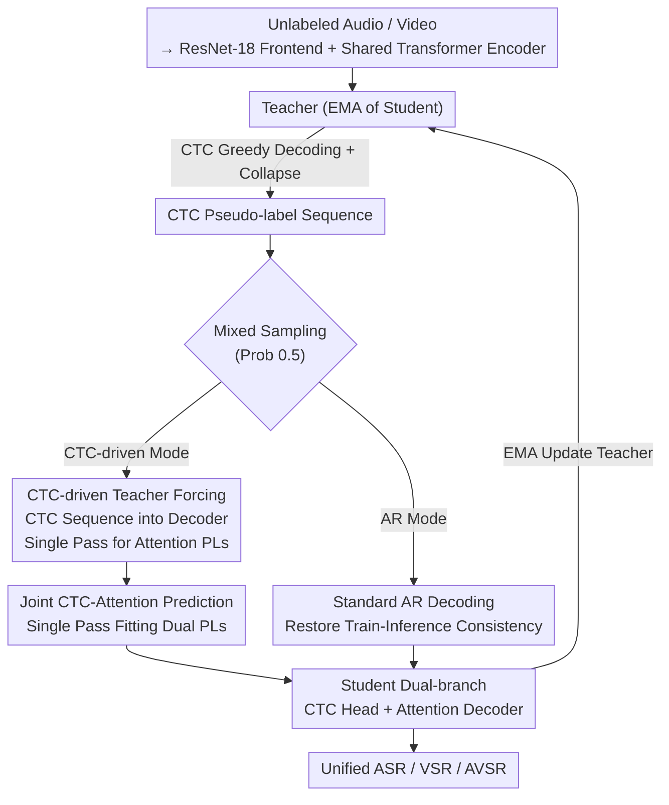

# Pay Attention to CTC: Fast and Robust Pseudo-Labelling for Unified Speech Recognition

**Conference**: ICLR 2026  
**arXiv**: [2602.19316](https://arxiv.org/abs/2602.19316)  
**Code**: None (Extended based on USR framework)  
**Area**: Audio and Speech  
**Keywords**: Unified Speech Recognition, CTC, Pseudo-labelling, AVSR, Out-of-Distribution Robustness

## TL;DR

Ours proposes USR 2.0, which replaces autoregressive pseudo-label generation with CTC-driven teacher forcing. Attention pseudo-labels are generated in a single forward pass, increasing training speed by nearly 2×. By synergizing CTC and attention predictions, it enhances out-of-distribution robustness and achieves SOTA results for unified ASR/VSR/AVSR on LRS3, LRS2, and WildVSR.

## Background & Motivation

Unified Speech Recognition (USR) performs ASR (audio), VSR (lip-reading), and AVSR (audio-visual) using a single model, achieving SOTA via semi-supervised pseudo-labelling. However, USR faces two critical bottlenecks:

**Limitations of Prior Work**: 
1. **Expensive AR Pseudo-labelling**: The attention branch requires one forward pass per token; CTC decoding is roughly 40× faster than AR.
2. **Decoupled Supervision Causes OOD Fragility**: Independent training of CTC and attention branches leads the attention decoder to produce cascading errors under long sequences, noise, or new domains, which are then amplified via EMA self-reinforcement.

**Key Insight**: CTC is significantly more robust in OOD scenarios (monotonic alignment + conditional independence), while attention provides higher quality in-domain. The goal is to combine these advantages.

## Method

### Overall Architecture

USR 2.0 addresses two persistent issues in semi-supervised USR: the extreme latency of autoregressive pseudo-label generation and the vulnerability of the decoupled attention decoder. It adopts the USR student-teacher framework: modality-specific ResNet-18 frontends followed by a shared Transformer encoder, branching into a CTC head and an attention decoder. The teacher is an EMA of the student ($\tau$ follows a 0.998→1 cosine schedule). Labeled data uses ground truth, while unlabeled data uses pseudo-labels.

The core modifications focus on the mechanism of pseudo-label generation and branch coupling. For each unlabeled input, the teacher performs CTC greedy decoding and collapse to obtain a CTC pseudo-label sequence. During training, each step switches between two modes with a 0.5 probability: **CTC-driven mode** feeds this CTC sequence into the decoder via teacher forcing to generate attention pseudo-labels in one pass; **AR mode** reverts to standard autoregressive decoding to maintain training-inference consistency. In both modes, one branch provides supervision for the other, coupling the previously independent heads—the primary source of robustness gains.

### Key Designs

**1. CTC-driven Teacher Forcing: Single-pass Attention Pseudo-labels**

Traditional pseudo-label generation for attention branches involves AR decoding, where each token requires feeding the previous prefix back into the decoder: $\tilde{y}_u^{Att} = \arg\max_{y_u} P_{Att}(y_u | \tilde{y}_{<u}^{Att}, x; \theta_T)$, which is the bottleneck. USR 2.0 uses a complete CTC greedy sequence $\tilde{y}^{CTC} = \text{collapse}(\tilde{y}_{1:L})$ as the decoder's forced input, calculating all attention targets simultaneously:

$$\tilde{y}^{CTC} = \text{collapse}(\tilde{y}_{1:L}), \quad \tilde{y}_u^{Att} = \arg\max_{y_u} P_{Att}(y_u | \tilde{y}_{<u}^{CTC}, x; \theta_T)$$

This assumes that while CTC prefixes might lack global coherence, coherence is not necessary for pseudo-labelling—as long as the teacher and student share the same prefix, knowledge transfer occurs. A crucial byproduct is length alignment: both pseudo-labels scale with the CTC sequence length $U_{CTC}$, allowing the student to fit both in a **single forward pass**.

**2. Mixed Sampling Strategy: Balancing Efficiency and Consistency**

CTC-driven teacher forcing introduces exposure bias due to the mismatch between training (CTC prefixes) and inference (AR prefixes). USR 2.0 applies a 0.5 probability switch. In CTC-driven mode, the decoder is supervised by both attention and CTC pseudo-labels, while the CTC branch relies only on the CTC pseudo-label:

$$\mathcal{L}^{CTC,m} = \text{CTC}(\hat{y}^{CTC,m}, \tilde{y}^{CTC})$$
$$\mathcal{L}^{Att,m} = 0.5 \cdot \text{CE}(\hat{y}^{Att,m}, \tilde{y}^{Att}) + 0.5 \cdot \text{CE}(\hat{y}^{Att,m}, \tilde{y}^{CTC})$$

In AR mode, standard decoding mitigates the mismatch. Here, the CTC branch is supervised by both sets of pseudo-labels:

$$\mathcal{L}^{CTC,m} = 0.5 \cdot \text{CTC}(\hat{y}^{CTC,m}, \tilde{y}^{CTC}) + 0.5 \cdot \text{CTC}(\hat{y}^{CTC,m}, \tilde{y}^{Att})$$
$$\mathcal{L}^{Att,m} = \text{CE}(\hat{y}^{Att,m}, \tilde{y}^{Att})$$

This design ensures the branches are **coupled**, allowing them to cross-correct each other.

**3. Joint CTC-Attention Prediction**

Thanks to length alignment, the student decoder predicts both the robust CTC targets and the expressive attention targets in one pass. The training naturally blends the strengths of both branches into a single decoder without requiring complex fusion during inference.

### Loss & Training

- Joint CTC-Attention training: CTC weight 0.1, Attention CE with label smoothing 0.1.
- Modality weights: Visual 0.3, Audio/AV 0.7.
- Unlabeled-to-labeled loss ratio: Visual 0.97, Audio/AV 0.75.
- Confidence filtering: Threshold 0.8; sequence-level CTC confidence = mean token log-probability.
- Inference: ESPnet joint decoding, beam=40, CTC weight 0.1.
- Vocabulary: 1000-token SentencePiece.

## Key Experimental Results

### Main Results

**Table 1: In-domain Performance (LRS3 WER%, Low-resource 30h)**

| Method | Unified | VSR↓ | ASR↓ | AVSR↓ |
|------|---------|------|------|-------|
| AV-HuBERT | ✗ | 51.8 | 4.9 | 4.7 |
| BRAVEn | ✗ | 43.4 | 4.0 | 4.0 |
| USR | ✓ | 36.0 | 3.2 | 3.0 |
| **USR 2.0** | **✓** | **36.2** | **3.0** | **2.9** |

**Table 2: Huge Model Final Results (LRS3)**

| VSR | ASR | AVSR |
|-----|-----|------|
| **17.6** | **0.9** | **0.8** |

**Table 3: OOD Robustness (Greedy Decoding WER%)**

| Method | LibriSpeech | WildVSR | AVSpeech |
|------|-------------|---------|----------|
| AV-HuBERT | 29.1 | 82.4 | 26.0 |
| USR | 25.3 | 80.0 | 34.7 |
| **USR 2.0** | **15.4** | **73.7** | **25.0** |

### Ablation Study

- **Long-sequence Robustness**: USR's WER spikes beyond 155 frames (OOD length), whereas USR 2.0 remains stable up to 600 frames.
- **Beam Size Sensitivity**: USR 2.0 shows excellent performance even with greedy/small beams. USR requires beam≥30 to match USR 2.0's greedy performance.

### Key Findings

1. **Global Coherence is Optional for PLs**: Local correctness under shared CTC prefix conditions is sufficient for teacher-student knowledge transfer.
2. **Coupling vs. Decoupling**: Coupled CTC-attention supervision is the key to OOD robustness.
3. **Speed Enables Scale**: Fast pseudo-labelling allows scaling to Huge models and larger datasets.
4. **Greedy Quality Matters**: Since pseudo-labels are generated every step, greedy decoding quality directly determines training efficacy.

## Highlights & Insights

- **"Coherence is not necessary in pseudo-labels"**: A counter-intuitive but logical finding—"incoherently correct" targets are sufficient under teacher forcing.
- **Efficiency-Quality Win-Win**: Better pseudo-labelling strategies can improve both speed and accuracy simultaneously.
- **Revisiting CTC Value**: Despite conditional independence assumptions, CTC’s robustness is invaluable for semi-supervised and OOD scenarios.
- **Practical Unified Models**: Achieving 17.6% VSR and 0.8% AVSR in a single model provides high deployment value.

## Limitations & Future Work

1. Fixed 0.5 sampling probability; adaptive scheduling might be more optimal.
2. CTC still degrades under extreme noise (-5dB), potentially propagating errors.
3. Inference still relies on beam search (beam=40) for peak performance.
4. Only validated on English; cross-lingual applicability (e.g., tonal languages) needs exploration.

## Related Work & Insights

- **USR**: Direct predecessor; ours diagnoses its decoupled supervision and AR bottlenecks.
- **AV-HuBERT**: Unified pre-training but separate models for fine-tuning.
- **Scheduled Sampling**: Inspired exposure bias mitigation but targets a different mismatch.

## Rating

- Novelty: ⭐⭐⭐⭐
- Technical Depth: ⭐⭐⭐⭐
- Experimental Thoroughness: ⭐⭐⭐⭐⭐
- Value: ⭐⭐⭐⭐⭐

<!-- RELATED:START -->

## Related Papers

- [\[ICLR 2026\] CTC-DRO: Robust Optimization for Reducing Language Disparities in Speech Recognition](ctc-dro_robust_optimization_for_reducing_language_disparities_in_speech_recognit.md)
- [\[ICLR 2026\] StableToken: A Noise-Robust Semantic Speech Tokenizer for Resilient SpeechLLMs](stabletoken_a_noise-robust_semantic_speech_tokenizer_for_resilient_speechllms.md)
- [\[ICLR 2026\] UniSS: Unified Expressive Speech-to-Speech Translation with Your Voice](uniss_unified_expressive_speech-to-speech_translation_with_your_voice.md)
- [\[ACL 2026\] Pseudo2Real: Task Arithmetic for Pseudo-Label Correction in Automatic Speech Recognition](../../ACL2026/audio_speech/pseudo2real_task_arithmetic_for_pseudo-label_correction_in_automatic_speech_reco.md)
- [\[ICLR 2026\] TangoFlux: Super-Fast and Faithful Text-to-Audio Generation with Flow Matching and CLAP-Ranked Preference Optimization](tangoflux_super_fast_and_faithful_text_to_audio_generation_with_flow_matching_an.md)

<!-- RELATED:END -->
