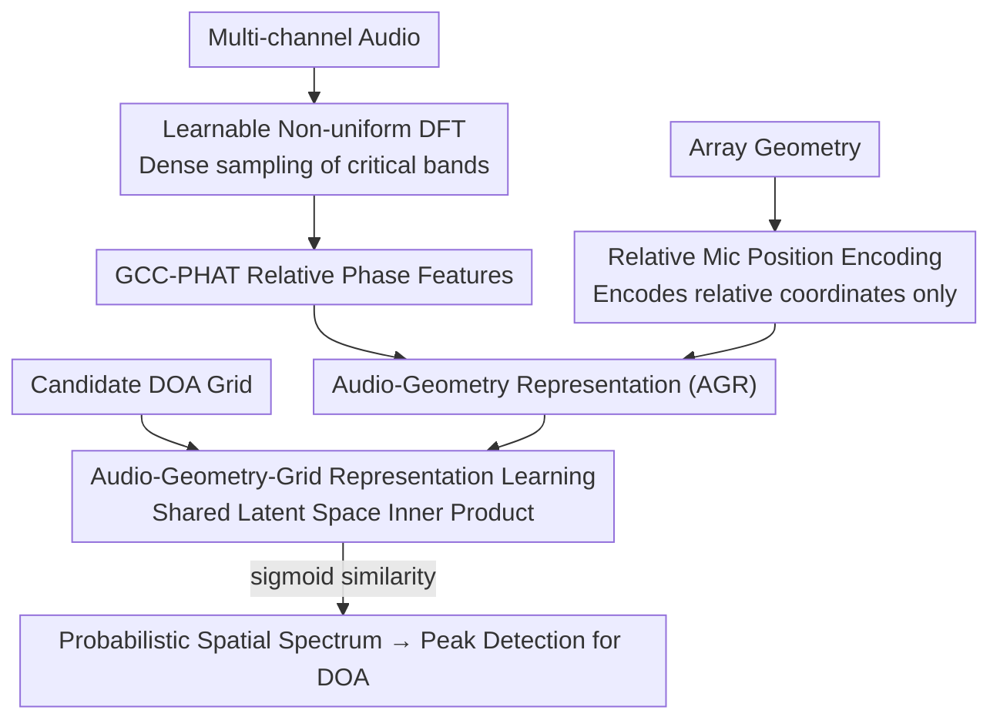

# Physics-Informed Audio-Geometry-Grid Representation Learning for Universal Sound Source Localization

**Conference**: ICLR 2026  
**OpenReview**: [https://openreview.net/forum?id=bWXpJFesLS](https://openreview.net/forum?id=bWXpJFesLS)  
**Code**: TBA  
**Area**: Audio Representation Learning / Sound Source Localization  
**Keywords**: Sound Source Localization, Representation Learning, Physical Priors, Microphone Array, Geometry Invariant

## TL;DR
This paper proposes AGG-RL, which projects "Audio-Geometry Representations" and "Grid Representations" into a shared latent space and generates spatial spectra via inner product similarity. Combined with two physical prior components (Learnable Non-uniform DFT and Relative Microphone Position Encoding), it achieves **universal sound source localization without retraining for any array geometry or DOA grid**, significantly outperforming existing methods on unseen arrays.

## Background & Motivation

**Background**: Sound Source Localization (SSL) aims to estimate the Direction of Arrival (DOA) of sound sources. Traditional methods (GCC-PHAT, MUSIC, SRP-PHAT) rely on Inter-channel Phase Differences (IPD) to infer Time Difference of Arrival (TDOA). Deep neural network methods have become mainstream as they learn more robust representations that often outperform traditional methods.

**Limitations of Prior Work**: Most DNN-based methods are "locked" by two factors: ① dependency on **specific microphone array geometries** (requiring retraining for different arrays); ② dependency on **predefined DOA grids** (requiring retraining for different grid resolutions). Existing "geometry-invariant" and "grid-flexible" methods only mitigate one half of the problem; none are robust to both arbitrary geometries and arbitrary grids simultaneously.

**Key Challenge**: The output paradigms of DNN-SSL involve inherent trade-offs. Regression-based methods directly predict 3D coordinates, offering theoretically infinite resolution but poor interpretability and constraints on the maximum number of sources. Classification-based methods discretize the space into fixed grids, outputting interpretable spatial spectra independent of the number of sources, but their resolution is capped by the grid, and they require retraining for grid changes. Template matching can work on arbitrary grids but optimizes IPD estimation rather than DOA and requires pairwise computations for every microphone pair, leading to explosive computational costs. None of the three are both flexible and accurate.

**A physical contradiction also exists in the frequency dimension**: Low frequencies are alias-free but have coarse TDOA resolution, while high frequencies offer fine resolution but are prone to **spatial aliasing** (where phases are wrapped into $[-\pi, \pi)$, causing one IPD to correspond to multiple TDOAs). The aliasing condition $f \le f_{max} = \tfrac{v}{2r}$ depends on the microphone spacing $r$. Since real-world array spacings vary greatly, the "most informative frequency range" changes with the array.

**Goal**: To create a **universal** SSL—a single model that changes array geometries and DOA grids without retraining, while maintaining the interpretability of classification-based methods.

**Key Insight**: The authors decompose the problem into "representation alignment"—to achieve grid flexibility, the grid is not hard-coded into the output layer. Instead, the model separately learns "Audio+Geometry Representations" and "Grid Representations" and compares their similarity in a shared latent space. Simultaneously, physical knowledge (TDOA depends only on relative coordinates, and critical phase information concentrates in specific frequency bands) is injected into feature extraction as **inductive biases** rather than requiring the network to learn them from scratch.

**Core Idea**: Replace "fixed-grid classification heads" with the "similarity of Audio-Geometry Representations × Grid Representations," and use two learnable physical prior components (Non-uniform DFT and Relative Position Encoding) to guide representations to converge in acoustically meaningful directions.

## Method

### Overall Architecture
AGG-RL takes three inputs: multi-channel audio signals, microphone array geometry, and candidate DOA grids. It outputs a probabilistic spatial spectrum for each candidate direction on the grid. It consists of two sub-networks: **AuGeonet** (Audio-Geometry Representation network $A(\cdot)$) extracts Audio-Geometry Representations (AGR) from audio and array geometry; **Gridnet** (Grid Representation network $G(\cdot)$) encodes candidate DOAs into Grid Representations (GR). Both representations are projected into the same latent space, and similarity is measured using a scaled inner product. Higher similarity indicates a higher probability of a sound source in that direction, passed through a sigmoid to obtain a spatial spectrum in $[0,1]$. Supervision is provided by a "soft-label oracle spatial spectrum" with varying beamwidths, allowing the model to learn the relationships between audio, geometry, and grids.

Inside AuGeonet, two physical priors are embedded: Learnable Non-uniform DFT (LNuDFT) replaces standard DFT for extracting phase features, and Relative Microphone Position Encoding (rMPE) replaces absolute position encoding to inject geometry. The entire pipeline is "Audio → LNuDFT Spectrum → GCC-PHAT Relative Phase Features + rMPE Geometry Encoding → AGR," running in parallel with "Candidate DOA → Sinusoidal Encoding → Gridnet → GR," finally meeting in the latent space.

### Key Designs

**1. Learnable Non-uniform DFT (LNuDFT): Allowing the network to densely allocate frequency bins to informative bands**

Addressing the limitation that standard DFT frequency bins are uniform, whereas frequency bands carrying phase cues for SSL change with array spacing and aliasing conditions. LNuDFT makes the "spacing between adjacent frequency bins" a learnable parameter. The frequency domain representation for channel $c$ is $X_c[k,l]=\sum_{n=0}^{N-1} x_c[n+Nl]\,w[n]\cdot e^{-j2\pi \frac{n}{N}\nu_k}$, where $\nu_k$ is the position of the $k$-th bin (mapped to physical frequency $f_k=\tfrac{\nu_k}{N}f_s$). It degenerates to standard DFT when $\nu_k=k$. To ensure monotonic ordering and respect the Nyquist limit, $\nu_k$ is defined as the cumulative sum of positive increments $\nu_k=\nu_{k-1}+a_{k-1},\ a_k>0$, where increments are clipped to $(\epsilon_{min},\epsilon_{max})$ and normalized so $\nu_k \le \tfrac{N}{2}$ after each gradient update.

Initialization is critical: a logit mapping is used to densely allocate bins in the mid-frequency range, $\hat\nu_k=\ln\!\big(\tfrac{\tilde\nu_k}{1-\tilde\nu_k}\big)$, then normalized to $[0,K-1]$. LNuDFT can be efficiently implemented as a 1D convolution (using basis functions as kernels). After training, bins automatically cluster in physically meaningful bands, preserving phase information while enhancing robustness and interpretability—ablation shows its logit initialization is particularly beneficial for generalization to "unseen arrays."

**2. Relative Phase Features + Relative Microphone Position Encoding (rMPE): Aligning geometry injection with the physical nature of TDOA**

Addressing the fact that TDOA/IPD physically **depend only on the relative coordinates of microphones**. Previous methods like GI-DOAEnet use absolute position encoding (aMPE), which contradicts this physical fact and fails to generalize across arrays. This paper replaces raw DFT coefficients with GCC-PHAT in the phase features side to emphasize phase differences and suppress amplitude variations. It also uses a **reference channel scheme** to reduce pairwise complexity from $O(C^2)$ to $O(C)$ (selecting the microphone closest to the array center as the reference), defining $\hat X^{GCC}_c[k,l]=\tfrac{X_c X_{\bar c}^*}{|X_c||X_{\bar c}|}$. Real and imaginary parts are concatenated, reducing input dimension to $C-1$.

On the geometry side, rMPE only encodes the coordinates of each microphone relative to the reference channel $\tilde x_c=x_c-x_{\bar c}$, etc., converted to spherical coordinates $(\tilde r_c,\tilde\vartheta_c,\tilde\varphi_c)$. Sinusoidal encodings (Phase Modulation PM / Frequency Modulation FM mappings $h_{PM},h_{FM}$) produce $P\in\mathbb{R}^{(C-1)\times M}$, providing positional cues aligned via Channel-Wise Multi-Head Self-Attention (CW-MHSA). Both GCC-PHAT and rMPE are "relative," which the authors suggest mitigates performance degradation when MHSA extrapolates to longer sequences (more channels) than seen during training, significantly improving generalization to unseen arrays. The FM version of rMPE is used by default.

**3. Audio-Geometry-Grid Representation Learning (AGG-RL): Replacing fixed-grid classification heads with representation similarity**

Addressing the need to retrain for grid changes. AGG-RL encodes candidate DOAs as representations for "alignment." The $d$-th candidate direction (azimuth $\theta_d$, elevation $\phi_d$) is encoded into a $G$-dimensional sinusoidal vector $\hat G_d$, then passed through Gridnet to obtain $G_{d,o}=G_o(\hat G_d;\Psi_o)$. Given the AGR $A\in\mathbb{R}^{O\times G\times L}$ from AuGeonet, the spatial spectrum is obtained via scaled inner product plus sigmoid: $\hat S_{d,o,l}=\sigma\!\big(\tfrac{G_{d,o}^\top A_{o,l}}{\sqrt{G}}\big)\in[0,1]$. Dividing by $\sqrt{G}$ controls inner product variance for stable optimization. This pushes AGR to align with GR in true source directions and deviate in non-source directions. Since GR represents candidate DOAs independently of audio and geometry, the grid can be changed arbitrarily without retraining.

Candidate DOAs use Fibonacci spherical points for approximately uniform coverage, with random grid rotation as data augmentation during training. Supervision uses oracle spatial spectra with different beamwidths as soft labels, fed into a weighted BCE loss (favoring positive samples). During inference, iterative peak detection is run on the final output layer to find multiple source DOAs. The framework maintains the interpretability of classification while achieving flexible grids and geometry invariance.

### Loss & Training
The supervision signal consists of soft labels from oracle spatial spectra with varying beamwidth parameters, using weighted Binary Cross Entropy (BCE) to emphasize positive samples. Training utilizes a Deeply Supervised Curriculum Learning (DSCL) framework with multiple output branches (number of outputs $O$). All DNN methods use the same DFT parameters ($N=512, K=257, H=128$), Hann window, and causal settings; LNuDFT initializes with $\epsilon_{start}=0.15,\epsilon_{end}=0.95$, constrained by $\epsilon_{min}=0.01,\epsilon_{max}=100$, with a default grid of $D=2048$ points.

## Key Experimental Results

### Main Results
Comparison was conducted across 4 datasets: NAO robot, Eigenmike (real LOCATA recordings, Eigenmike is an unseen array), Dynamic-S (synthetic, seen channel counts 4–12), and Dynamic-U (synthetic, unseen channel counts 13–16). Metrics include MAE (Mean Absolute Error, lower is better) and ACC10 (Accuracy within 10°, higher is better).

| Method | NAO MAE | NAO ACC10 | Eigenmike MAE | Eigenmike ACC10 | Dyn-S MAE | Dyn-U MAE |
|------|---------|-----------|---------------|-----------------|-----------|-----------|
| SRP-PHAT$_{2048}$ | 21.77 | 67.84 | 26.88 | 53.22 | 43.89 | 38.40 |
| Unet | 10.89 | 86.25 | 14.89 | 65.82 | 19.94 | 19.15 |
| Neural-SRP | 9.72 | 78.66 | 52.75 | 22.16 | 19.60 | 21.18 |
| GI-DOAEnet$_{FM}$ | 11.31 | 77.36 | 93.61 | 0.00 | 15.49 | 54.81 |
| **Ours** | **8.25** | **90.78** | **11.24** | **72.17** | **10.32** | **14.12** |

The most striking result is on the **unseen Eigenmike array**: GI-DOAEnet's MAE collapsed to 93.61° (ACC10=0), and Neural-SRP fell to 52.75°, while Ours remained stable at 11.24° with ACC10=72.17%. Ours also leads across all seen conditions. While Ours recognizes a slight seen/unseen gap, it still outperforms all baselines.

### Ablation Study

| Configuration | Eigenmike MAE | Dyn-U MAE | Description |
|------|---------------|-----------|------|
| Proposed (FM rMPE) | 11.24 | 14.12 | Full Model |
| (i) rMPE-PM | 13.42 | 12.46 | PM encoding; slightly worse on most sets |
| (ii) DFT + aMPE | 111.21 | 87.71 | Removing GCC-PHAT+rMPE; total collapse |
| (iii) DFT + GCC-PHAT | 16.53 | 17.90 | Removing LNuDFT; degradation on most sets |
| (iv) LNuDFT + Uniform Init | 15.13 | 23.03 | Significant drop on unseen sets |
| (v) NuDFT + Logit Init (Frozen) | 17.34 | **11.83** | Best on Dyn-U; indicates init is informative |
| (vi) Fixed Grid (D=2048) | 13.58 | 13.84 | Removing AGG-RL; worse on real datasets |
| (viii) Gridnet with Cartesian | 11.87 | 23.10 | Large drop on Dyn-U |

### Key Findings
- **Relative representation is mandatory for generalization**: Experiment (ii) shows that replacing GCC-PHAT and rMPE with standard DFT + absolute encoding causes Eigenmike MAE to surge from 11.24° to 111.21°, proving that "relative phase + relative position encoding" is key to mitigating CW-MHSA extrapolation issues across more channels.
- **LNuDFT aids unseen arrays**: Experiments (iii) and (iv) show that removing LNuDFT or using uniform initialization leads to significant degradation on unseen conditions (Eigenmike/Dynamic-U). Visualization confirms that trained bins cluster in physically informative bands.
- **AGG-RL benefits real-world data**: Experiment (vi) shows that using a fixed grid performs well on Dynamic-S (matching training conditions) but degrades on real datasets, suggesting the flexible grid mechanism is vital for real-world generalization.

## Highlights & Insights
- **Embedding physical facts as inductive biases**: TDOA depends only on relative coordinates $\rightarrow$ use relative position encoding; critical phase info is in specific bands $\rightarrow$ let DFT bins learn to cluster there. This "Physical Prior + Trainable Adaptation" trade-off is elegant and transferable to any task dependent on geometry/frequency structures.
- **Decoupling output grids via representation similarity**: Removing "grids" from the output layer and turning them into encodable, comparable representations mirrors the CLIP-style dual-tower alignment. This is a clever workaround for "grid-specific retraining" and inspires other discrete prediction tasks requiring flexible output spaces.
- **The reference channel scheme** reduces GCC-PHAT from $O(C^2)$ to $O(C)$, providing genuine engineering value for scalability to large arrays (e.g., the 32-channel Eigenmike).

## Limitations & Future Work
- The authors admit the logit initialization mapping for LNuDFT and its hyperparameters were **chosen empirically**; the optimal initialization strategy remains an open question. Experiment (v) even shows frozen logit initialization works best on Dynamic-U, suggesting the impact of initialization is not yet fully understood.
- A noticeable **seen/unseen performance gap** exists; while Ours beats baselines on unseen arrays, it is still worse than on seen ones.
- Evaluation only covered static sources and up to two speakers; performance under moving sources or higher source counts has not been fully verified.
- Physical priors currently only cover "frequency non-uniformity" and "relative geometry"; other acoustic factors like reverberation and noise are not explicitly modeled in the priors.

## Related Work & Insights
- **vs. GI-DOAEnet (aMPE)**: Ours is built directly upon it but replaces absolute position encoding (aMPE) with relative rMPE and standard DFT with LNuDFT. While GI-DOAEnet performs okay in seen conditions, its MAE collapses to 90°+ on unseen arrays; Ours' "relativization" fills this gap.
- **vs. Template Matching (IPDnet)**: Template matching also allows arbitrary grids without retraining, but it optimizes IPD rather than direct DOA and requires pairwise computations (23.2 GFLOPs for only 2 channels). Ours predicts candidate DOAs directly without manual templates or pairwise costs.
- **vs. Regression (Neural-SRP)**: Regression offers theoretically infinite resolution but is constrained by maximum source counts and lacks interpretability. Ours retains interpretable spatial spectra while gaining flexible grid capabilities.

## Rating
- Novelty: ⭐⭐⭐⭐⭐ Combining physical priors (LNuDFT, rMPE) with dual-tower representation alignment for universal SSL is novel and well-motivated.
- Experimental Thoroughness: ⭐⭐⭐⭐ Covers 4 datasets (seen/unseen, real/synthetic) and 8 ablation studies; moving/multi-source scenarios slightly lacking.
- Writing Quality: ⭐⭐⭐⭐ Clear physical derivations; ablations map to each component. Formulas are dense but logically consistent.
- Value: ⭐⭐⭐⭐⭐ "No retraining for changes in array/grid" is a high-demand requirement for real-world deployment. The order-of-magnitude improvement on unseen arrays is highly convincing.

<!-- RELATED:START -->

## Related Papers

- [\[CVPR 2026\] How Far Can We Go With Synthetic Data for Audio-Visual Sound Source Localization?](../../CVPR2026/audio_speech/how_far_can_we_go_with_synthetic_data_for_audio-visual_sound_source_localization.md)
- [\[CVPR 2025\] Object-aware Sound Source Localization via Audio-Visual Scene Understanding](../../CVPR2025/audio_speech/object-aware_sound_source_localization_via_audio-visual_scene_understanding.md)
- [\[CVPR 2025\] Improving Sound Source Localization with Joint Slot Attention on Image and Audio](../../CVPR2025/audio_speech/improving_sound_source_localization_with_joint_slot_attention_on_image_and_audio.md)
- [\[ICLR 2026\] OWL: Geometry-Aware Spatial Reasoning for Audio Large Language Models](owl_geometry-aware_spatial_reasoning_for_audio_large_language_models.md)
- [\[ICLR 2026\] PACE: Pretrained Audio Continual Learning](pace_pretrained_audio_continual_learning.md)

<!-- RELATED:END -->
