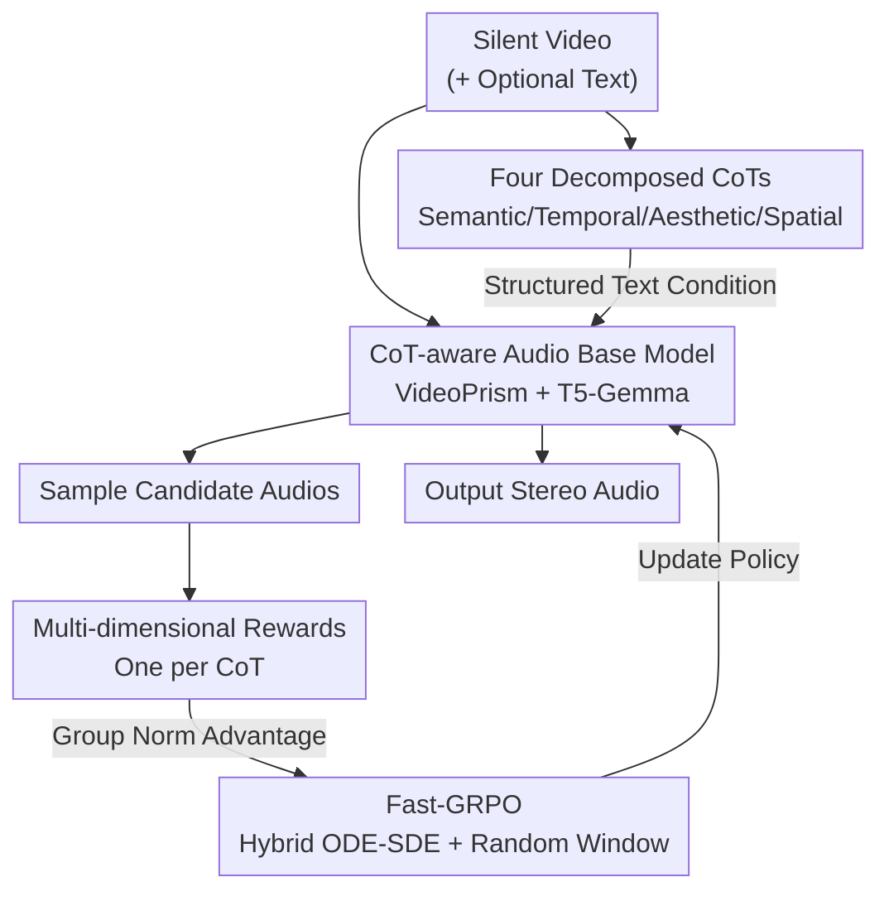

# PrismAudio: Decomposed Chain-of-Thought and Multi-dimensional Rewards for Video-to-Audio Generation

**Conference**: ICLR 2026  
**OpenReview**: [https://openreview.net/forum?id=cIfDKEbAky](https://openreview.net/forum?id=cIfDKEbAky)  
**Code**: Project Page https://PrismAudio.github.io (Code TBD)  
**Area**: Video-to-Audio Generation / Multimodal  
**Keywords**: Video foley, Decomposed Chain-of-Thought, Multi-dimensional rewards, GRPO, Flow matching diffusion

## TL;DR
PrismAudio decomposes video-to-audio (V2A) generation into four specialized Chains-of-Thought (CoT): semantic, temporal, aesthetic, and spatial. Each CoT is paired with a corresponding reward function, and the model is optimized via multi-dimensional reinforcement learning using efficient Fast-GRPO. It achieves SOTA across four perceptual dimensions on VGGSound and the self-built AudioCanvas with fewer parameters and faster inference.

## Background & Motivation
**Background**: Video-to-audio generation (V2A, also known as video foley) synthesizes sound from silent video (with optional text). A "good" foley must simultaneously satisfy four human perceptual dimensions: semantic consistency (sound matches objects/events), temporal synchronization (sound onset/rhythm matches action), aesthetic quality (natural, high production value), and spatial accuracy (left/right panning matches visual position). Mainstream methods have evolved from early visual-only conditions (Diff-Foley, V2A-Mapper) to explicit text conditioning (MMAudio, MovieGen Audio). Recently, ThinkSound introduced CoT reasoning from Multimodal LLMs to perform structured "audio planning" before rendering, significantly improving interpretability.

**Limitations of Prior Work**: The authors identify three critical flaws in existing methods (especially ThinkSound). First is **monolithic planning**—all audio analysis is generated in a single reasoning path, conflating semantic, temporal, spatial, and aesthetic tasks, which often leads to multi-modal hallucinations or neglect of specific dimensions in complex scenes. Second is **objective entanglement**—competing perceptual goals are compressed into a unified reconstruction loss, preventing the model from learning context-dependent trade-offs and degrading into signal-level reconstruction. Third is **lack of human preference alignment**—training solely on text matching lacks a mechanism to learn what "sounds satisfying to a human ear," resulting in technically correct but perceptually mediocre outputs.

**Key Challenge**: The four perceptual objectives are interdependent yet mutually restrictive. For instance, focusing solely on semantic consistency might produce a matching but dull sound (poor aesthetics), or a correct sound type that is out of sync. A single loss or reward cannot find the optimal balance between these competing goals.

**Goal**: To enable the model to generate high-quality reasoning and optimize human preferences across all four dimensions **simultaneously**, rather than improving one at the expense of others.

**Key Insight**: Different perceptual dimensions require fundamentally different analytical frameworks (semantics rely on content identification, spatiality on localization logic, aesthetics on subjective quality). Therefore, they should not be mixed in a single reasoning path. By decomposing reasoning and aligning each part with a specialized reward signal, multi-dimensional reinforcement learning can optimize both "reasoning" and "preference" together.

**Core Idea**: Replace "monolithic reasoning + single reconstruction loss" with "decomposed CoT + dimension-aligned multi-rewards + efficient Fast-GRPO," allowing each dimension to be managed independently while jointly aligning with human preferences.

## Method

### Overall Architecture
PrismAudio is built upon a CoT-aware audio foundation model via a three-step pipeline: first, upgrade an **audio foundation model** to handle structured reasoning text; second, decompose monolithic reasoning into **four specialized CoTs** (semantic, temporal, aesthetic, spatial) by generating data with Gemini 2.5 Pro and fine-tuning VideoLLaMA2; finally, perform post-training using **Fast-GRPO** for multi-dimensional RL—mapping each CoT to a corresponding reward function, sampling candidate audios, calculating multi-dimensional weighted advantages via group normalization, and updating the policy using efficient hybrid ODE-SDE sampling.

### Key Designs

**1. CoT-aware Audio Base Model: Replacing Encoders That Cannot Understand Video or Reasoning**

Models like ThinkSound use backbones based on Multi-diffusion Transformers and flow matching, but two bottlenecks hinder multi-dimensional reasoning: insufficient video understanding and text encoders that fail to process structured CoTs. PrismAudio makes two targeted replacements. On the video side, it replaces per-frame CLIP encoders with **VideoPrism**—a unified ViT encoder pre-trained on massive video datasets, which captures the temporal semantics needed for multi-dimensional reasoning. On the text side, it upgrades T5 to **T5-Gemma**, which distills the reasoning capability of decoder-only LLMs into an encoder-decoder architecture, allowing it to condition the generation on CoT text containing logical structures and causal relationships.

**2. Multi-dimensional CoT Decomposition: Splitting Monolithic Planning**

This step addresses the "monolithic planning" issue. The authors use **Gemini 2.5 Pro** to construct high-quality CoT training data and fine-tune **VideoLLaMA2** to generate four independent reasoning paths for a video: **Semantic CoT** identifies audio events and characteristics; **Temporal CoT** determines rhythm and timing; **Aesthetic CoT** focuses on sound quality (clarity, reverb, loudness); **Spatial CoT** analyzes stereo image positioning. These four CoTs are concatenated as a structured prompt. Ablations show this decomposition significantly outperforms monolithic CoT in semantic (CLAP 0.52 vs 0.46) and aesthetic (CE 4.26 vs 3.79) metrics.

**3. Multi-dimensional Reward Functions: Specialized Evaluators for Each CoT**

To solve "objective entanglement," the authors design a reward for each dimension using established specialized models: **Semantic Reward** uses MS-CLAP for audio-text alignment; **Temporal Reward** uses Synchformer for sync detection; **Aesthetic Reward** uses Meta Audiobox Aesthetics (no-reference MOS prediction); **Spatial Reward** uses StereoCRW for localization accuracy. These $K=4$ reward heads $\{R_k\}$ correspond directly to the four CoTs. This **CoT-Reward Correspondence** is key to joint improvement across all dimensions.

**4. Fast-GRPO: Efficient Multi-dimensional RL via Random Windows**

Applying GRPO to flow matching models is computationally expensive because the deterministic ODE must be converted to a stochastic SDE for RL optimization. Standard Flow-GRPO performs SDE sampling at every denoising step, incurring massive overhead. **Fast-GRPO** restricts stochasticity and optimization to a small, computationally cheap segment. It uses a **Hybrid ODE-SDE Sampler**: for each iteration, a starting point $\ell$ and a small window $w \ll T$ are randomly sampled. Outside the window $W(\ell)$, the model uses deterministic ODE steps; inside the window, it uses noisy SDE steps. The SDE steps induce an analytical Gaussian policy $\pi_\theta(x_{t+1}\mid x_t,c)$, allowing a closed-form solution for the GRPO policy ratio $r_t(\theta)$. **Random Window Scheduling** ensures the entire trajectory is explored over multiple iterations while reducing the number of function evaluations (NFE) from $T$ to $w$.

For multi-dimensional optimization, a weighted total reward is calculated for each candidate: $R_{\text{total}}^i=\sum_{k=1}^{K}\lambda_k R_k(x_T^i,c)$. The advantage $A_i$ is then derived via group normalization:

$$A_i = \frac{R_{\text{total}}^i - \mu_{\text{group}}}{\sigma_{\text{group}} + \epsilon}$$

The final objective optimizes the clipped GRPO loss restricted to the window $W(\ell)$:

$$\mathcal{J}_{\text{Fast-GRPO}}(\theta)=\mathbb{E}\Big[\tfrac{1}{N}\sum_{i}\tfrac{1}{w}\sum_{t\in W(\ell)}\min\big(r_t^i(\theta)A_i,\ \mathrm{clip}(r_t^i(\theta),1-\varepsilon,1+\varepsilon)A_i\big)\Big]$$

## Key Experimental Results

### Main Results
On the VGGSound test set, PrismAudio (518M) outperforms all baselines with fewer parameters and faster inference (0.63s):

| Method | Params | CLAP↑ (Sem) | DeSync↓ (Temp) | CRW↓ (Spat) | MOS-Q↑ | MOS-C↑ | Time(s)↓ |
|------|------|------|------|------|------|------|------|
| MMAudio | 1.03B | 0.40 | 0.46 | - | 3.95 | 4.03 | 1.30 |
| ThinkSound (Prev. SOTA) | 1.3B | 0.43 | 0.55 | 13.47 | 4.05 | 4.18 | 1.07 |
| **Ours (PrismAudio)** | **518M** | **0.47** | **0.41** | **7.72** | **4.21** | **4.22** | **0.63** |
| Ours w/o CoT-RL | 518M | 0.42 | 0.51 | 10.29 | 4.02 | 4.11 | 0.63 |

On the out-of-distribution (OOD) AudioCanvas benchmark, PrismAudio maintains stability while others degrade:

| Method | CLAP↑ | DeSync↓ | CE↑ | CRW↓ | MOS-Q↑ | MOS-C↑ |
|------|------|------|------|------|------|------|
| ThinkSound | 0.48 | 0.80 | 4.10 | 22.82 | 3.79 | 3.80 |
| **Ours (PrismAudio)** | **0.52** | **0.36** | **4.26** | **12.87** | **4.12** | **4.01** |

### Ablation Study

**CoT Strategy** (AudioCanvas):

| Configuration | CLAP↑ | DeSync↓ | CE↑ | CRW↓ |
|------|------|------|------|------|
| Baseline (No CoT) | 0.42 | 0.44 | 3.81 | 15.30 |
| Monolithic CoT | 0.46 | 0.38 | 3.79 | 13.02 |
| **MultiCoT (Ours)** | **0.52** | **0.36** | **4.26** | **12.87** |

**Multi-dimensional vs. Single-dimensional Rewards** (Target Entanglement):

| Reward Focus | CLAP↑ | DeSync↓ | PQ↑ | CRW↓ | FD↓ |
|------|------|------|------|------|------|
| Baseline (No RL) | 0.47 | 0.42 | 6.45 | 15.30 | 1.90 |
| Semantic Only | **0.54** | 0.58 | 6.62 | 11.89 | 1.84 |
| Aesthetic Only | 0.46 | 0.42 | **7.06** | 13.51 | 4.50 |
| **Multi-dimensional** | 0.52 | **0.36** | 6.68 | 12.87 | 1.53 |

### Key Findings
- **Decomposed Reasoning + Multi-rewards is the Main Driver**: Adding CoT-RL improves all dimensions simultaneously. Without it, the base model is strong but fails to reach human preference peaks.
- **Single Rewards Cause Trade-offs**: Rewarding only aesthetics doubles the distribution error (FD), meaning the sound is "pretty" but decoupled from content. Only multi-dimensional rewards achieve balanced improvement.
- **Fast-GRPO Efficiency**: Fast-GRPO reaches a higher reward ceiling (~0.51) in 200 steps compared to Flow-GRPO which plateaus at 600+ steps (~0.47).

## Highlights & Insights
- **Reasoning-Reward Alignment**: The 1:1 mapping between decomposed CoT and specialized reward heads is a clean solution for disentanglement.
- **Efficient Diffusion RL**: Fast-GRPO reduces NFE from $T$ to $w$ using the random window trick, which is applicable to any flow matching/diffusion task.
- **Reusing Specialized Evaluators**: Using existing models (MS-CLAP, Synchformer) as rewards bypasses the need for training custom reward models and ensures alignment between training objectives and evaluation metrics.

## Limitations & Future Work
- Risk of overfitting to proxy reward models; "surpassing ground truth" in some metrics suggests the model relies on specific proxy biases.
- Reward weights $\lambda_k$ are manually tuned; adaptive weight learning could be a future improvement.
- High engineering complexity and dependency on multiple external models (Gemini, VideoLLaMA2, four evaluators).

## Related Work & Insights
- **vs ThinkSound**: PrismAudio solves the dimension interference and entanglement issues of ThinkSound's monolithic reasoning and reconstruction loss via decomposition and multi-dimensional RL.
- **vs Flow-GRPO**: Fast-GRPO is significantly more efficient by restricting stochastic exploration to a random window rather than the full trajectory.

## Rating
- Novelty: ⭐⭐⭐⭐⭐ 
- Experimental Thoroughness: ⭐⭐⭐⭐⭐ 
- Writing Quality: ⭐⭐⭐⭐ 
- Value: ⭐⭐⭐⭐⭐ 

<!-- RELATED:START -->

## Related Papers

- [\[ICLR 2026\] Incentivizing Consistent, Effective and Scalable Reasoning Capability in Audio LLMs via Reasoning Process Rewards](incentivizing_consistent_effective_and_scalable_reasoning_capability_in_audio_ll.md)
- [\[NeurIPS 2025\] ThinkSound: Chain-of-Thought Reasoning in Multimodal Large Language Models for Audio Generation and Editing](../../NeurIPS2025/audio_speech/thinksound_chain-of-thought_reasoning_in_multimodal_large_language_models_for_au.md)
- [\[ICLR 2026\] SyncTrack: Rhythmic Stability and Synchronization in Multi-Track Music Generation](synctrack_rhythmic_stability_and_synchronization_in_multi-track_music_generation.md)
- [\[ICLR 2026\] Flow2GAN: Hybrid Flow Matching and GAN with Multi-Resolution Network for Few-step High-Fidelity Audio Generation](flow2gan_hybrid_flow_matching_and_gan_with_multi-resolution_network_for_few-step.md)
- [\[ICLR 2026\] AC-Foley: Reference-Audio-Guided Video-to-Audio Synthesis with Acoustic Transfer](ac-foley_reference-audio-guided_video-to-audio_synthesis_with_acoustic_transfer.md)

<!-- RELATED:END -->
