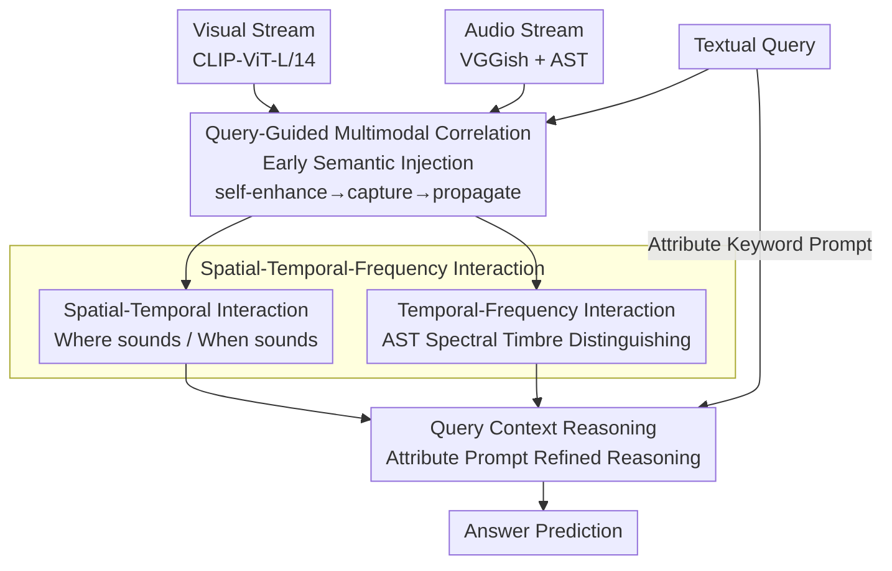

# Query-Guided Spatial-Temporal-Frequency Interaction for Music Audio-Visual Question Answering

**Conference**: ICLR 2026  
**arXiv**: [2601.19821](https://arxiv.org/abs/2601.19821)  
**Code**: Publicly available after publication  
**Area**: Audio & Speech  
**Keywords**: Audio-Visual QA, Frequency-domain Interaction, Query Guidance, Spatial-Temporal Awareness, Multimodal Reasoning

## TL;DR

The QSTar framework is proposed, which embeds Query Guidance throughout the entire processing pipeline and introduces a spatial-temporal-frequency interaction module (specifically utilizing spectral features to distinguish timbre), significantly enhancing Music Audio-Visual Question Answering (Music AVQA) performance.

## Background & Motivation

**AVQA Task Challenges**: Audio-visual question answering requires the joint understanding of auditory, visual, and textual information, which is more challenging than pure visual QA as audio cues are often more critical in many scenarios.

**Audio Modality Underestimated**: Existing AVQA methods (e.g., PSTP, APL) primarily focus on visual information processing, treating audio merely as a "supplement" to video analysis, while ignoring unique frequency-domain features.

**Insufficient Query Involvement**: Textual questions are usually integrated only in the final reasoning stage through simple multiplication, leading to a lack of semantic specificity in audio-visual representations.

**Necessity of Frequency-Domain Analysis**: For orchestral instruments (e.g., flute, clarinet), visual cues can be very subtle (minimal performance movement), yet their spectral features (overtone distribution, harmonic structure) are distinct. Frequency-domain analysis is essential for distinguishing timbre.

**Challenges in Polyphonic Scenarios**: When multiple instruments play simultaneously, temporal or spatial features alone cannot effectively differentiate the contributions of different instruments.

## Method

### Overall Architecture

The core concept of QSTar is to have question semantics participate in shaping audio-visual features from beginning to end, rather than performing a simple fusion at the end of reasoning. This process is decomposed into three sequential modules: first, QGMC injects query semantics into audio and visual features at an early stage; second, spatial-temporal-frequency interactions (STI + TFI) align "where it sounds, when it sounds, and what timbre it is"; finally, QCR injects task-attribute prompts to complete precise reasoning.

### Key Designs

**1. Query-Guided Multimodal Correlation: Injecting Query at the Source**

Prior methods reserve textual questions for the final step using simple multiplicative fusion, resulting in audio-visual representations lacking semantic relevance. Since a question often concerns only one or two specific instruments, early injection of this intent allows the model to focus and avoid redundant representations. QGMC follows three steps: first, Self-enhancing, where each modality uses self-attention to strengthen internal relations; then Capturing, using word-level text features as Queries to capture shared semantics $F_{qv}, F_{qa}$ from visual and audio streams via cross-attention; finally, Propagating, where the aggregated query-guided semantic context $F_{qg}$ is back-propagated to the visual and audio streams via cross-attention.

**2. Spatial-Temporal Interaction: Answering "Where" and "When"**

Video naturally possesses spatial and temporal dimensions, which require separate modeling followed by fusion. Spatial interaction aligns patch-level visual features with query-guided audio features via cross-attention to locate the actual sounding area in the frame. Temporal interaction computes temporal attention by performing a dot product between visual and audio query-guided features followed by a softmax to capture global dependencies across frames.

**3. Temporal-Frequency Interaction: Distinguishing Visually Similar Instruments via Spectra**

Instruments like the flute and clarinet involve minimal movement and appear visually similar, but their overtone distributions and harmonic structures differ significantly in the frequency domain—a discriminative cue missing in visual and temporal features. TFI introduces the Audio Spectrogram Transformer (AST) to extract time-frequency representations $F_{ast} \in \mathbb{R}^{T \times F \times D}$. It aggregates across the time dimension for frequency representation and calculates frequency attention weights $a_f$ based on question embeddings to highlight relevant frequency bands. Finally, the weighted AST features are fused with query-guided audio features via convolution.

**4. Query Context Reasoning: Reasoning Constraints via Attribute Prompts**

Different question types focus on different aspects—comparison questions look at loudness and quantity, while temporal questions look at sequence. QCR encodes instrument-related attribute keywords (category, duration, location, temporal, loudness) into prompt embeddings $F_{prompt}$. These are concatenated with sentence-level query embeddings and passed through self-attention to produce a query context $F_{qc}$ fused with task context, which then guides the final refinement of visual and audio features via cross-attention.

### Loss & Training

Standard cross-entropy classification loss is used with the AdamW optimizer. The initial learning rate is 1e-4, decaying by 0.1 every 10 epochs. The batch size is 64, with training lasting 30 epochs. Feature extraction uses CLIP-ViT-L/14 for vision and VGGish + AST for audio, with all modalities projected to 512 dimensions.

## Key Experimental Results

### Main Results

Accuracy on MUSIC-AVQA test set (%):

| Method | Audio QA | Visual QA | Audio-Visual QA | Average |
|------|----------|-----------|----------------|------|
| PSTP | 70.91 | 77.26 | 72.57 | 73.52 |
| APL | 78.09 | 79.69 | 70.96 | 74.53 |
| TSPM | 76.91 | 83.61 | 73.51 | 76.79 |
| QA-TIGER | 78.58 | 85.14 | 73.74 | 77.62 |
| **Ours (QSTar)** | **80.63** | 84.17 | **75.98** | **78.98** |

QSTar outperforms the previous SOTA, QA-TIGER, by 1.36% in overall accuracy, including 2.05% in Audio QA and 2.24% in Audio-Visual QA.

### Ablation Study

| Ablation Setting | Audio QA | Visual QA | A-V QA | Average |
|----------|----------|-----------|--------|------|
| w/o all | 73.87 | 79.15 | 70.33 | 73.29 |
| w/o QGMC | 79.08 | 83.44 | 72.92 | 76.80 |
| w/o QCR | 79.33 | 83.24 | 75.43 | 78.19 |
| w/o STI | - | -1.55% | - | -1.18% |
| w/o TFI | -2.42% | - | -1.59% | Signif. Drop |
| **Full QSTar** | **80.63** | **84.17** | **75.98** | **78.98** |

### Key Findings

1. **Frequency Interaction (TFI) is critical for audio questions**: Removing TFI leads to a 2.42% drop in Audio QA and 1.59% in Audio-Visual QA, proving spectral features are irreplaceable for distinguishing timbre.
2. **Importance of full-pipeline Query Guidance**: Removing early guidance ($M_b^-$) leads to a 1.05% drop, while removing final prompts ($M_f^-$) leads to a 0.73% drop.
3. **Significant gains in Comparison and Temporal types**: Gains exceeding 5% highlight the advantages of 3D spatial-temporal-frequency interaction.
4. **No object detector required**: QSTar achieves strong performance without pre-trained object detectors, trailing QA-TIGER by only 0.97% in Visual QA, indicating robust inherent visual understanding.

## Highlights & Insights

- **Frequency analysis fills a gap in AVQA**: Prior methods almost entirely ignored the frequency-domain characteristics of audio signals. This paper systematically utilizes spectral features (via AST) for music-scene QA.
- **End-to-end Query Guidance** is significantly superior to late fusion, as semantic information guides feature extraction early to reduce redundant representations.
- **Frequency Attention Mechanism** cleverly utilizes question text to filter spectra, allowing the model to focus on frequency bands relevant to the query.
- The case study on flute performance is intuitive: visual changes are nearly invisible, but the attenuation in high-frequency bands clearly signals the cessation of playing.

## Limitations & Future Work

1. **Dependency on pre-trained extractors**: CLIP, VGGish, and AST are frozen; end-to-end fine-tuning might yield further gains.
2. **Validation limited to musical scenes**: MUSIC-AVQA is specialized; generalization to general AVQA (dialogue, natural sounds) remains to be verified.
3. **Slightly weaker Visual QA performance**: The absence of an object detector results in lower spatial localization precision than QA-TIGER; a lightweight localization module could be introduced.
4. **Explainability of frequency attention**: While spectral visualizations are provided, the semantic meaning of frequency attention weights requires deeper analysis.
5. **QA template constraints**: MUSIC-AVQA uses predefined templates, leaving the model's capacity for open-ended questions unknown.

## Related Work & Insights

- **TSPM**: Introduced temporal and spatial awareness but remained vision-centric; QSTar promotes audio to an equally important modality.
- **QA-TIGER**: The current SOTA but relies on complex visual processing; QSTar achieves better overall results with simpler visual processing through frequency analysis.
- **Audio Spectrogram Transformer (AST)**: Effectively utilized as a frequency feature extractor, inspiring the use of spectral representations in other multimodal tasks.
- **Inspiration for Video Understanding**: The query-guided feature refinement approach can be extended to tasks like Video QA and video grounding.

## Rating

- **Novelty**: ⭐⭐⭐⭐ Frequency-domain interaction is a novel contribution to AVQA, though the framework (cross-attention stacking) is conventional.
- **Experimental Thoroughness**: ⭐⭐⭐⭐ Ablation studies cover all modules and stages of query guidance, though evaluation is limited to MUSIC-AVQA.
- **Writing Quality**: ⭐⭐⭐⭐ Motivation is clearly articulated (the flute case is excellent), description is systematic but formula-heavy.
- **Value**: ⭐⭐⭐⭐ Achieves sub-stantial SOTA on music AVQA; the introduction of frequency-domain analysis is valuable for multimodal understanding.

<!-- RELATED:START -->

## Related Papers

- [\[ACL 2026\] Music Audio-Visual Question Answering Requires Specialized Multimodal Designs](../../ACL2026/audio_speech/music_audio-visual_question_answering_requires_specialized_multimodal_designs.md)
- [\[ACL 2026\] Retrieving to Recover: Towards Incomplete Audio-Visual Question Answering via Semantic-consistent Purification](../../ACL2026/audio_speech/retrieving_to_recover_towards_incomplete_audio-visual_question_answering_via_sem.md)
- [\[ACL 2026\] Jamendo-MT-QA: A Benchmark for Multi-Track Comparative Music Question Answering](../../ACL2026/audio_speech/jamendo-mt-qa_a_benchmark_for_multi-track_comparative_music_question_answering.md)
- [\[ICLR 2026\] OWL: Geometry-Aware Spatial Reasoning for Audio Large Language Models](owl_geometry-aware_spatial_reasoning_for_audio_large_language_models.md)
- [\[ICLR 2026\] AC-Foley: Reference-Audio-Guided Video-to-Audio Synthesis with Acoustic Transfer](ac-foley_reference-audio-guided_video-to-audio_synthesis_with_acoustic_transfer.md)

<!-- RELATED:END -->
