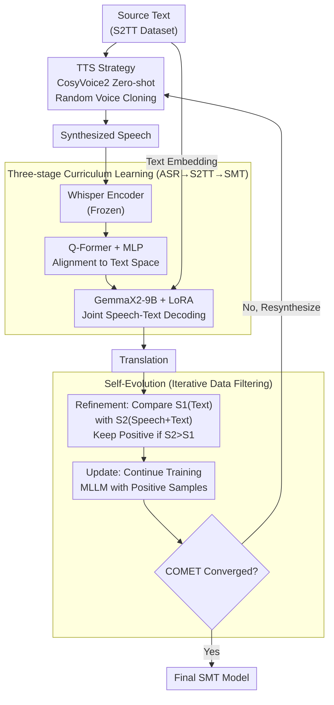

# Scalable Multilingual Multimodal Machine Translation with Speech-Text Fusion

**Conference**: ICLR 2026  
**arXiv**: [2602.21646](https://arxiv.org/abs/2602.21646)  
**Code**: [https://github.com/yxduir/LLM-SRT](https://github.com/yxduir/LLM-SRT)  
**Area**: Multimodal Translation / Speech  
**Keywords**: Speech-guided translation, Multimodal LLM, Self-evolution, TTS, Multilingual translation

## TL;DR
The authors propose the Speech-guided Machine Translation (SMT) framework, which utilizes TTS to synthesize speech from source text as a joint input with text for MLLM translation. A self-evolution mechanism automatically filters beneficial synthesized speech samples for continuous training. Ours achieves SOTA on Multi30K, surpassing all MMT methods, and reaches average SOTA across 108 translation directions in FLORES-200 with only 9B parameters.

## Background & Motivation

**Background**: Traditional multimodal machine translation (MMT) relies on images to assist in disambiguation (e.g., "bank" having different translations in different visual contexts). **Limitations of Prior Work**: Image-based MMT suffers from fundamental limitations: ① Multilingual image-text pair data is extremely scarce, with existing datasets mostly covering only a few languages like English, German, and French; ② In general translation, images often provide no help and even introduce noise (experiments show image guidance can decrease COMET scores on general translation benchmarks).

**Key Insight**: The speech modality offers natural advantages: it is inherently aligned with text information (content is identical), and cross-lingual speech data covers over 100 languages (e.g., FLEURS, CoVoST-2). More critically, the prosodic information (stress, intonation, rhythm) in speech provides disambiguation cues not present in text—such as a rising intonation in questions helping the model select the correct grammatical mood.

**Key Challenge**: Real speech data is scarce and expensive to obtain. Can TTS-synthesized speech replace it? How can the system automatically identify which synthesized speech helps translation rather than introducing noise? This leads to the design of the Self-Evolution mechanism.

## Method

### Overall Architecture

SMT addresses the challenge of providing a prosody-carrying auxiliary modality for text translation without relying on scarce real parallel speech. **Mechanism**: The system first uses TTS to synthesize the source text into speech, then feeds both speech and text into a multilingual LLM for joint decoding. The inference pipeline consists of three modules: a frozen Whisper encoder (~635M) to encode speech into acoustic representations, a trainable Q-Former+MLP adapter (~80.5M) to align acoustic representations with the text embedding space, and GemmaX2-28-9B (~9.2B) with LoRA to process both modalities and generate the translation. This pipeline is trained via **three-stage curriculum learning** (ASR → S2TT → SMT). To handle inconsistent TTS quality, a **Self-Evolution** iterative loop is applied: translations are used to automatically filter out detrimental speech samples, retaining only beneficial ones for continued training until COMET scores converge.

### Key Designs

**1. TTS Synthesis Strategy: Scaling Speech Modality with Zero-shot Multilingual TTS**

The scarcity of real parallel speech data is the main barrier to replacing images with speech. SMT uses CosyVoice2 for zero-shot multilingual synthesis, converting any source text into speech to eliminate reliance on real recordings. To ensure the synthesized speech carries rich prosody, the system randomly clones different speaker timbres from the training set to increase diversity. The prompt text and predicted durations are strictly aligned with real "speech-text pairs" to ensure semantic and rhythmic consistency with the source text. Ablations show that the resulting synthesized speech provides translation gains nearly equivalent to real speech (synthesis even performs slightly better in S2TT due to the lack of background noise) while covering over 100 languages.

**2. Three-stage Curriculum Learning: From "Hearing" to "Translating with Speech"**

Feeding speech and text simultaneously to a translation LLM creates a difficult optimization problem involving both cross-modal alignment and cross-lingual translation. SMT decomposes this into three progressive stages: Stage I performs ASR (Speech → Same Language Text) to let the adapter learn to map acoustic representations into the text space; Stage II performs S2TT (Speech → Target Language Text) to add cross-lingual capability atop modal alignment; Stage III enters SMT, where speech and text are jointly input for final translation. Modules are unfrozen gradually: Whisper remains frozen, the adapter is trainable throughout, and GemmaX2 is fine-tuned with LoRA only in Stage III.

**3. Self-Evolution Mechanism: Automatically Filtering Detrimental Synthesized Speech**

Not all synthesized speech is beneficial; experiments indicate about one-third actually introduces noise. SMT transforms the question of "when is speech helpful" into an automated binary classification problem within a four-step iterative cycle: ① Collection—Using TTS for synthesis; ② Refinement—Calculating COMET scores for text-only ($S_1$) and speech+text ($S_2$) translations. A sample is "positive" only if $S_2 > S_1$; ③ Update—Continuous training of the MLLM using only positive samples; ④ Evaluation—Measuring COMET on a valuation set synthesized with fixed reference voices. Gains are largest in the first round and stabilize around the third round, with significant COMET improvements in low-resource directions like khm (+1.9), lao (+2.0), and mya (+1.7).

### Loss & Training

The training objective is the standard cross-entropy translation loss. Stage III utilizes LoRA (r=16, alpha=32) for GemmaX2-28-9B, while the rest of the trainable components are in the adapter. Hardware consists of 4×A100 GPUs. The AdamW optimizer is used with a learning rate of 1e-4, employing a linear warmup of 1K steps followed by linear decay. Training completes within one week. For consistent evaluation during self-evolution, fixed reference voices are used to avoid speaker-driven noise in positive/negative sample determination.

## Key Experimental Results

### Main Results

| Dataset | Metric | SMT-9B (Ours) | Prev. SOTA (Image) | Gain |
|--------|------|--------|----------------|------|
| Multi30K eng→deu | BLEU | 47.0 | 45.3 | +1.7 |
| Multi30K eng→fra | BLEU | 67.0 | 67.5 | -0.5 |
| FLORES-200 eng→27 Avg. | spBLEU | 40.5 | 39.3 | +1.2 |
| FLORES-200 108 Dir. | COMET | SOTA | - | Outperforms all baselines |

### Ablation Study

| Configuration | Effect | Description |
|------|------|------|
| Text only | COMET 87.0 | Baseline |
| + Real Speech | COMET 87.8 | Speech is beneficial |
| + Synthesized Speech | COMET 87.7 | Nearly equivalent to real speech |
| + Synth + Self-Evolution | COMET 88.2 | Further improvement after filtering |
| Image-guided | COMET 86.5 | Introduces noise—verifies speech superiority |

### Key Findings
- The performance gap between synthesized and real speech is negligible (verified on CoVoST-2), proving the feasibility of TTS as a substitute.
- Self-Evolution converges in 1-2 rounds, with a positive sample ratio of approximately 60-70%.
- Low-resource languages benefit more, as speech prosody provide crucial auxiliary signals when text data is scarce.
- SMT-9B achieves average SOTA across 108 directions in FLORES-200 with 1/67th the parameters of DeepSeek-V3.
- Prosodic cues contribute most to polysemy disambiguation—e.g., "lead" translated as a metal vs. a verb based on pronunciation.

## Highlights & Insights
- **Novelty**: Replacing images with speech for MMT represents a pragmatic paradigm shift: speech data scalability far exceeds image-text pairs (102 languages vs. 3).
- **Function**: The self-evolution mechanism elegantly solves the judgement problem of "when speech helps"—acknowledging that ~30-40% of synthesized speech may be harmful.
- **Value**: Prosodic cues are most valuable for polysemy disambiguation, which is typically the most difficult scenario for text-only MT.
- The "Modality-Agnostic Hypothesis" serves as a theoretical framework: any auxiliary modality that provides semantically relevant information and can be aligned to text space can potentially enhance translation.

## Limitations & Future Work
- **Limitations**: Inference requires an additional TTS step (CosyVoice2), adding approximately 0.5-1s of latency.
- It remains unexplored whether larger models benefit equally from speech assistance beyond the 9B scale.
- Potential bias in COMET scores may affect the quality of positive sample filtering in self-evolution.
- TTS synthesis quality sets the upper bound for speech assistance; low-quality TTS in very low-resource languages may limit gains.

## Related Work & Insights
- **vs. Image-guided MMT (Soul-Mix, Bridge, etc.)**: Speech data coverage exceeds image-text pairs; SMT outperforms all baselines across 108 FLORES-200 directions.
- **vs. Text-only MT (DeepSeek-V3, NLLB-54B)**: SMT-9B outperforms NLLB-54B and DeepSeek-V3 on FLORES-200 despite having significantly fewer parameters.
- **Insight**: Speech modality may have untapped value in other NLP tasks requiring prosodic cues, such as sentiment analysis or sarcasm detection.

## Rating
- Novelty: ⭐⭐⭐⭐ (Pragmatic paradigm shift, elegant self-evolution design)
- Experimental Thoroughness: ⭐⭐⭐⭐⭐ (Multi30K, FLORES-200, CoVoST-2, WMT24++)
- Writing Quality: ⭐⭐⭐⭐ (Clear structure, intuitive flowcharts)
- Value: ⭐⭐⭐⭐ (First systematic framework using speech for multilingual MT enhancement)

<!-- RELATED:START -->

## Related Papers

- [\[ACL 2026\] From Flat Language Labels to Typological Priors: Structured Language Conditioning for Multilingual Speech-to-Speech Translation](../../ACL2026/audio_speech/from_flat_language_labels_to_typological_priors_structured_language_conditioning.md)
- [\[ICLR 2026\] UniSS: Unified Expressive Speech-to-Speech Translation with Your Voice](uniss_unified_expressive_speech-to-speech_translation_with_your_voice.md)
- [\[ICML 2026\] Multimodal Fusion via Self-Consistent Task-Gradient Fields](../../ICML2026/audio_speech/multimodal_fusion_via_self-consistent_task-gradient_fields.md)
- [\[ICLR 2026\] TripleSumm: Adaptive Triple-Modality Fusion for Video Summarization](triplesumm_adaptive_triple-modality_fusion_for_video_summarization.md)
- [\[ICLR 2026\] Towards True Speech-to-Speech Models Without Text Guidance](towards_true_speech-to-speech_models_without_text_guidance.md)

<!-- RELATED:END -->
