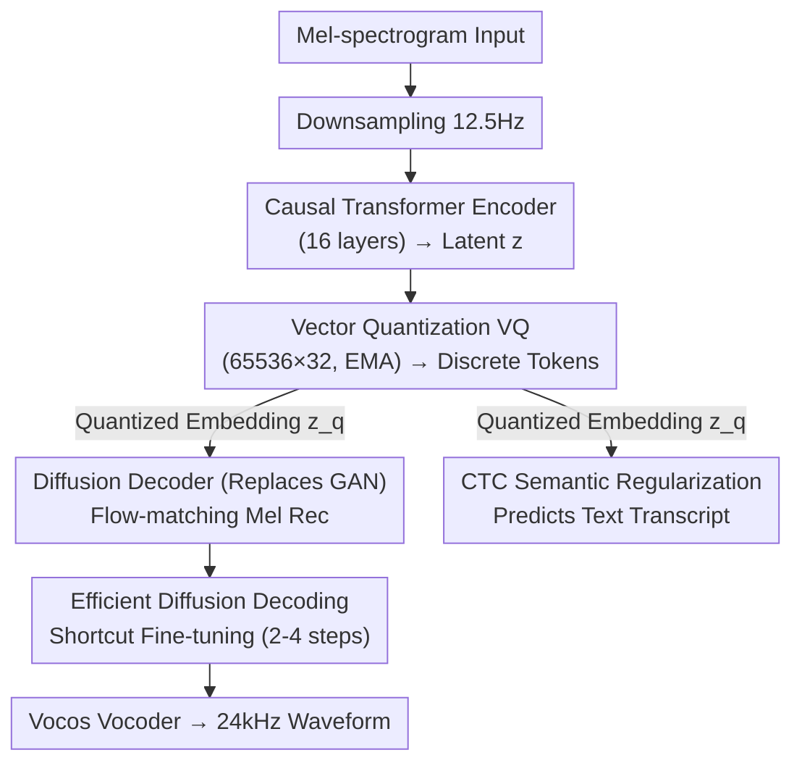

# Scaling Speech Tokenizers with Diffusion Autoencoders

**Conference**: ICLR 2026  
**arXiv**: [2602.06602](https://arxiv.org/abs/2602.06602)  
**Code**: None (Demo: [https://sitok-demo.github.io/](https://sitok-demo.github.io/))  
**Area**: Speech / Tokenization  
**Keywords**: Speech Tokenizer, Diffusion Autoencoder, Semantic Regularization, Low Bitrate, CTC Loss

## TL;DR

Ours proposes SiTok (Speech Diffusion Tokenizer), which utilizes a diffusion autoencoder to jointly train the encoder-quantizer-decoder (as a single-stage process). By incorporating CTC semantic regularization, it ensures that discrete tokens retain linguistic information. Scaled to 1.6B parameters and 22 million hours of speech data, SiTok achieves strong performance with a 3.34% WER (reconstruction) and 4.95 WER (LLM ASR) at an extremely low token rate (12.5Hz / 200bps).

## Background & Motivation

**Background**: Speech tokenizers serve as the fundamental interface for speech language models, determining how speech is discretized. An ideal speech tokenizer must simultaneously satisfy three goals: (1) extreme compression for efficient language modeling; (2) high-fidelity reconstruction for natural speech generation; and (3) semantically rich representations for downstream understanding tasks.

**Limitations of Prior Work**: Existing methods handle the tension between these three objectives through heuristic compromises rather than principled solutions: (1) Poor reconstruction quality at low bitrates—many methods use RVQ (Residual Vector Quantization) to increase codebook layers or frame rates to maintain quality, which inflates token counts (e.g., Mimi 75 TPS, DualCodec 75 TPS), violating compression goals; (2) Neglecting semantics in favor of acoustic fidelity—leading to tokens unsuitable for understanding tasks (e.g., high ASR WER); (3) Two-stage training schemes—quantizing speech representations using SSL models first and independently training diffusion/vocoder decoders, where the quantizer cannot be optimized for reconstruction, forcing the decoder to adapt to suboptimal discrete codes.

**Key Challenge**: Under traditional acoustic reconstruction targets, simply increasing model size or data yields diminishing returns at low token rates—a structural bottleneck of vector quantization. Deterministic reconstruction losses force the discrete latent space to "collapse uncertainty," prioritizing low-level signal details over semantic structures, which results in greater semantic loss as compression becomes more aggressive.

**Key Insight**: The uncertainty introduced by low token rate quantization requires a **generative framework** for modeling—diffusion models are naturally suited to handle information loss caused by quantization as they learn to reverse stochastic degradation processes. Furthermore, directly supervising the quantized latent space with a CTC loss injects semantic information more directly than SSL distillation.

**Core Idea**: Utilize a diffusion autoencoder (instead of adversarial training) to jointly optimize quantization and reconstruction, supplemented by CTC semantic regularization, to achieve dual preservation of semantics and acoustics at extremely low token rates.

## Method

### Overall Architecture

SiTok uses mel-spectrograms as both input and reconstruction targets (rather than raw waveforms) to avoid handling excessively long sequences and unstable adversarial training. The entire pipeline is an end-to-end jointly trained autoencoder: mel-spectrograms are first downsampled to 12.5Hz, passed through a Llama-style causal Transformer encoder (16 layers) to obtain latent features $\mathbf{z}$, and then vector-quantized (65,536 codebook size, 32 dimensions, EMA updates) into discrete tokens $\mathbf{q}$. The quantized embeddings $\mathbf{z}_q$ are used in two paths: the primary path feeds into a non-causal Llama Transformer diffusion decoder (16 layers), which reconstructs the mel-spectrogram from noise using a flow-matching objective, followed by an external Vocos vocoder to generate 24kHz waveforms; the auxiliary path connects to a lightweight CTC decoder (4 layers) to directly predict text transcripts, forcing semantic information into the discrete tokens. During deployment, the diffusion decoder undergoes shortcut fine-tuning to compress multi-step sampling into 2-4 steps.

### Key Designs

**1. Diffusion Autoencoder Replacing Adversarial Training: Modeling Information Loss Generatively**

Deterministic reconstruction collapses under aggressive compression—it is inherently impossible to cram all speech information into 200bps; deterministic losses only force the latent space to prioritize low-level signal details at the expense of semantic structure. SiTok instead acknowledges that "not all details can be recovered from tokens," allowing the decoder to learn the conditional distribution $p(\mathbf{x}|\mathbf{z}_q)$. Specifically, a flow-matching objective is used: constructing noisy samples $\mathbf{x}_t = t\mathbf{x} + (1-t)\epsilon$, the velocity field $v_\phi(\mathbf{x}_t, t, \mathbf{z}_q)$ is trained to approximate the true velocity $(\mathbf{x} - \epsilon)$, with the decoder reconstructing the mel-spectrogram from noise conditioned on the quantized embedding $\mathbf{z}_q$.

Compared to adversarial training, this approach offers three advantages: it eliminates the need for discriminators and complex loss balancing, making training more stable; diffusion models learn the data distribution and can "hallucinate" missing details from limited quantized representations; and it scales better—as mel-spectrograms are more compact than waveforms, making it easier to scale up to 1.6B parameters.

**2. CTC Semantic Regularization: Forcing Discrete Tokens to be Decodable into Text**

Optimizing only for acoustic fidelity makes tokens unsuitable for understanding tasks. Previous methods aligned tokens with SSL features like HuBERT/WavLM using MSE/cosine losses, but this is indirect, second-hand supervision. SiTok uses the most direct signal: a lightweight CTC decoder $\mathcal{D}_{\phi_{\text{ctc}}}$ (4 Transformer layers) attached to the quantized embeddings $\mathbf{z}_q$ to directly predict the transcript $\mathbf{y}$. The total loss is:

$$\mathcal{L}_{\text{total}} = \mathcal{L}_{\text{rec}} + \lambda_{\text{ctc}} \cdot \text{CTC}(\mathcal{D}_{\phi_{\text{ctc}}}(\mathbf{z}_q), \mathbf{y}) + \mathcal{L}_{\text{vq}}$$

The key is that the supervision signal is placed **after** quantization, directly shaping the semantic properties of the discrete tokens. The entire pipeline is end-to-end and does not rely on external SSL models. $\lambda_{\text{ctc}}$ is a sensitive hyperparameter: $0.1$ was found to be optimal; larger values (e.g., $1.0$) over-constrain the latent space and damage reconstruction (WER increases from 4.06 to 10.1).

**3. Efficient Diffusion Decoding (Shortcut Fine-tuning): Accelerating via Self-taught Step Skipping**

Multi-step sampling in diffusion decoding is a deployment bottleneck. SiTok freezes the encoder and VQ modules and fine-tunes only the decoder using a shortcut model objective: the network receives an additional step size $d$ as a condition and optimizes two terms—the flow-matching loss ($d=0$ corresponding to true velocity) and a self-consistency loss (the result of one large step $2d$ should approximately equal two consecutive small steps of size $d$). This allows the model to learn to "skip intermediate steps," providing more flexibility than traditional distillation. Consequently, inference steps are reduced from standard multi-step to 2-4 steps, and the measured RTF drops from 0.041 (16 steps) to 0.013 (4 steps), a 3.2x speedup.

### Loss & Training

Total loss: $\mathcal{L}_{\text{total}} = \mathcal{L}_{\text{rec}} + 0.1 \cdot \mathcal{L}_{\text{ctc}} + \mathcal{L}_{\text{vq}}$. Training uses AdamW with lr=8e-5, 32K warmup steps, for a single epoch (~450K steps) on 22 million hours of internal speech data. Optional refinements: (1) Decoder fine-tuning (freezing encoder+VQ); (2) Token CFG (10% probability of dropping tokens to train the unconditional path, combining conditional and unconditional predictions during inference).

## Key Experimental Results

### Main Results (Reconstruction Quality Comparison)

| Model | FPS/TPS | # Codebooks | Bitrate | WER↓ | SIM↑ | UTMOS↑ |
|------|---------|-------|-------|------|------|--------|
| Ground Truth | - | - | - | 2.14 | 0.730 | 3.53 |
| DualCodec | 12.5/75 | 6 | 0.925 | 2.63 | 0.624 | 3.78 |
| X-codec 2 | 50/50 | 1 | 0.80 | 2.63 | 0.620 | 3.68 |
| Mimi | 12.5/75 | 6 | 0.825 | 4.51 | 0.527 | 3.09 |
| FireRedTTS | 25/25 | 1 | 0.35 | 3.35 | 0.597 | 3.40 |
| CosyVoice | 25/25 | 1 | 0.30 | 5.63 | 0.465 | 3.65 |
| **SiTok (CN=1)** | **12.5/12.5** | **1** | **0.20** | **4.06** | **0.641** | **3.44** |
| + Decoder FT | 12.5/12.5 | 1 | 0.20 | 3.79 | **0.682** | 3.48 |
| + Token CFG | 12.5/12.5 | 1 | 0.20 | **3.34** | 0.635 | **3.60** |

At only 200bps (the lowest bitrate among all baselines), SiTok achieves highly competitive results with a WER of 3.34% and SIM of 0.682.

### Ablation Study (Effect of Semantic Regularization)

| CTC Reg. | TPS | Rec. WER↓ | SIM↑ | UTMOS↑ | LLM ASR↓ | ER↑ | SV↓ | KS↑ |
|-----------|-----|----------|------|--------|----------|-----|-----|-----|
| ✓ (λ=0.1) | 12.5 | 4.06 | 0.641 | 3.44 | 4.95 | 63.5 | 13.8 | 96.9 |
| ✗ | 12.5 | **33.0** | 0.495 | 2.68 | 29.4 | 57.9 | 18.9 | 86.1 |
| ✓ (λ=0.1) | 50 | 2.80 | 0.660 | 3.46 | 4.49 | 64.4 | 8.59 | 97.7 |
| ✗ | 50 | 5.17 | 0.611 | 2.84 | 7.27 | 60.4 | 13.5 | 92.8 |

The WER of the 12.5 TPS model without CTC regularization surges to 33.0%, proving that semantic regularization is not merely an enhancement but is indispensable.

### Key Findings

- **Non-monotonic effects of model scaling**: Increasing from 0.63B (S) to 1.61B (XL) consistently improves reconstruction quality (WER 4.18→3.84), but performance on understanding tasks peaks at 1.12B (L). Larger models actually degrade on SV (13.8→14.7), suggesting that excessive capacity might over-encode acoustic details rather than abstract semantics.
- **Complementarity of Token CFG and Decoder FT**: CFG primarily reduces WER (3.34), while FT primarily improves speaker similarity (0.682); they can be combined as needed.
- **Sensitivity of CTC weight $\lambda_{\text{ctc}}$**: 0.1 is optimal; 0.02 yields good reconstruction but poor understanding, while 0.5-1.0 degrades both (due to over-constraining the latent space).
- **Poor performance of tokenizers trained only with regression loss (R)**: Training results in a WER of 4.66 and a decline across all understanding metrics; diffusion loss (D) is core.

## Highlights & Insights

- **Profound insight on generative modeling for uncertainty**: Information loss is inevitable in low token rate quantization. Attempting "perfect recovery" through deterministic reconstruction is destined to fail. Diffusion models acknowledge uncertainty and learn the conditional distribution, which is the correct modeling philosophy. This insight is transferable to any high-compression discretization scenario.
- **Ministerial effectiveness of CTC supervision**: It eliminates the need for external SSL models or complex feature alignment designs; a 4-layer CTC head predicting text is sufficient. The key is placing the supervision after quantization to directly shape the semantic nature of discrete tokens.
- **Pragmatic choice of Mel-spectrogram as intermediate representation**: This avoids the long sequences and unstable training associated with waveform-level modeling. Although it requires an external vocoder, the decoupled design allows the tokenizer and vocoder to be optimized and upgraded independently.

## Limitations & Future Work

- **Dependence on external Vocoder**: Mel-to-waveform conversion relies on Vocos, making the overall quality bounded by vocoder limitations.
- **Internal training data**: The 22 million hours of speech data are not public, limiting reproducibility.
- **English-centric**: Although claimed to cover multiple languages, English dominates the dataset, and multilingual generalization has not been fully verified.
- **Diffusion decoding latency**: Even after shortcut fine-tuning, 2-4 iterations are required, which may not be low enough for real-time interactive scenarios.
- **Understanding performance regression in L and XL models**: Larger models are not necessarily better for understanding tasks, suggesting a need for better training strategies or architectures to balance acoustics and semantics.

## Related Work & Insights

- **vs Mimi (Défossez et al., 2024)**: Mimi uses 8-layer RVQ to achieve 1.1kbps and 23.1 LLM ASR WER. SiTok uses a single codebook at 200bps to achieve 4.95 LLM ASR WER, offering a 5.5x higher compression ratio and significantly better understanding performance.
- **vs CosyVoice / FireRedTTS**: Two-stage methods quantize SSL features before training a diffusion decoder. SiTok's end-to-end joint optimization avoids the objective mismatch between the quantizer and decoder.
- **vs StableCodec / GLM4-Voice**: Like these low-token-rate designs (0.2-0.4 kbps), SiTok’s understanding performance (especially LLM ASR) is significantly superior to these baselines.

## Rating

- Novelty: ⭐⭐⭐⭐ The combination of diffusion autoencoder and CTC is innovative, though individual components are not entirely new; the core contribution lies in large-scale validation and systemic design.
- Experimental Thoroughness: ⭐⭐⭐⭐⭐ Covers reconstruction, understanding, and generation scenarios with extensive ablations (losses, codebooks, model scales, decoding steps) and comprehensive comparisons.
- Writing Quality: ⭐⭐⭐⭐ Clear structure, well-argued motivation, and accurate mathematical descriptions.
- Value: ⭐⭐⭐⭐⭐ Unifying understanding and generation in a speech tokenizer at extremely low bitrates significantly advances the development of speech language models.

<!-- RELATED:START -->

## Related Papers

- [\[ICLR 2026\] MambaVoiceCloning: Efficient and Expressive Text-to-Speech via State-Space Modeling and Diffusion Control](mambavoicecloning_efficient_and_expressive_text-to-speech_via_state-space_modeli.md)
- [\[ICLR 2026\] Music Flamingo: Scaling Music Understanding in Audio Language Models](music_flamingo_scaling_music_understanding_in_audio_language_models.md)
- [\[ICLR 2026\] VibeVoice: Expressive Podcast Generation with Next-Token Diffusion](vibevoice_expressive_podcast_generation_with_next-token_diffusion.md)
- [\[ICML 2026\] Sparse Autoencoders for Interpretable Emotion Control in Text-to-Speech](../../ICML2026/audio_speech/sparse_autoencoders_for_interpretable_emotion_control_in_text-to-speech.md)
- [\[ICLR 2026\] YuE: Scaling Open Foundation Models for Long-Form Music Generation](yue_scaling_open_foundation_models_for_long-form_music_generation.md)

<!-- RELATED:END -->
