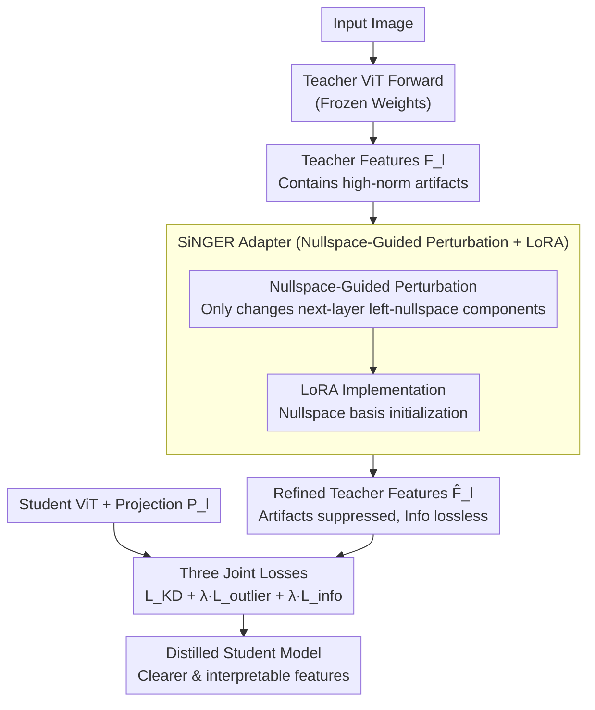

# SiNGER: A Clearer Voice Distills Vision Transformers Further

**Conference**: ICLR 2026  
**arXiv**: [2509.20986](https://arxiv.org/abs/2509.20986)  
**Code**: [github.com/AIRLABkhu/SiNGER](https://github.com/AIRLABkhu/SiNGER)  
**Area**: Audio & Speech  
**Keywords**: Vision Transformer, Knowledge Distillation, High-norm artifacts, Nullspace guidance, LoRA adapters  

## TL;DR
The SiNGER (Singular Nullspace-Guided Energy Reallocation) framework is proposed to suppress high-norm artifacts in ViTs by imposing perturbations in the nullspace direction of teacher features while preserving information signals. Combined with lightweight LoRA adapters for efficient distillation, it achieves SOTA performance across multiple downstream tasks and generates clearer, more interpretable representations.

## Background & Motivation

**Background**: Vision Transformers (ViTs) have become the backbone of Vision Foundation Models (VFMs), achieving outstanding performance in various visual tasks through self-attention mechanisms and strong scalability. However, the quadratic complexity of ViTs severely limits the practical deployment of large models, making model compression a critical necessity. Among various compression methods (pruning, quantization, distillation), Knowledge Distillation (KD) is the most reliable solution due to its structural and numerical stability.

**Limitations of Prior Work**: High-norm artifacts exist in ViT token representations—the norms of some patch features are abnormally high, particularly concentrated in background areas. When conducting KD using standard MSE loss, gradients are dominated by these high-norm tokens, causing the student model to overfit to artifacts while ignoring truly meaningful information signals, which significantly diminishes distillation gains.

**Key Challenge**: There is a fundamental trade-off between artifact suppression and information retention. Previous methods like ViTKD reduce artifact influence by randomly masking teacher features, but such indiscriminate masking inevitably discards valuable information signals. The root of the problem is that artifacts are "singular deficiencies" caused by cumulative effects similar to power iterations in residual blocks—tokens align along the dominant left singular vectors of pre-trained weights.

**Goal**: How can high-norm artifacts in ViT distillation be effectively suppressed without losing teacher information? This is divided into two sub-problems: (a) finding a mathematically guaranteed way to separate artifacts from information signals; (b) designing an efficient implementation scheme that is easy to integrate into existing KD pipelines.

**Key Insight**: The authors observe that if only the components of teacher features falling within the left-nullspace of the next Transformer block are modified, the modification will not affect the downstream output (as nullspace components are mapped to zero by the next layer's weights). This is an elegant mathematical property: the nullspace direction provides "free" space for modification.

**Core Idea**: Utilize the left-nullspace of the next layer's weight matrix to guide perturbations of teacher features, achieving artifact suppression while mathematically guaranteeing zero loss of information.

## Method

### Overall Architecture

SiNGER addresses a specific pain point in ViT distillation: the teacher features themselves contain high-norm artifacts (outlier tokens). Using them directly as distillation targets misleads the student—under MSE loss, the gradient is dominated by these large-norm tokens, causing the student to focus on fitting a few artifacts rather than learning useful information signals. Instead of modifying the student, SiNGER "purifies" the teacher: a lightweight LoRA adapter is attached to the teacher at selected layers (intermediate layers $l_{\text{inter}}$ plus the final layer $l_{\text{final}}$) to apply a **nullspace-guided perturbation** to the teacher feature $F^T_l$. This suppresses the energy of artifact tokens while ensuring the information perceived by the next layer remains unchanged.

The workflow is as follows: The teacher forward pass (with frozen weights) generates original features $F^T_l$. Each SiNGER adapter refines them into $\hat F^T_l = F^T_l + \Delta F^T_l$. These refined features then serve as distillation targets for the student (equipped with projection heads $P_l$). Training simultaneously optimizes the student, projection heads, and adapters, constrained by three joint losses that force the student to approximate the refined teacher, explicitly suppress outliers, and maintain feature directional structure via Gram matrices. Ultimately, the student inherits teacher knowledge while producing cleaner and more interpretable feature maps than direct distillation.

### Key Designs

**1. High-norm Artifact Analysis and Gradient Bias Modeling**

To suppress artifacts, one must first clarify how they cause harm. The authors attribute artifacts to the continuous cumulative effect of residual blocks—as token features pass through each block, they accumulate energy along the direction of the weight matrix's dominant left singular vector. This layer-wise accumulation forms "singular deficiencies," manifesting as abnormally high-norm outlier patches in background regions. By splitting patches into an outlier set $O_l$ and an inlier set $I_l$, the KD loss also splits into outlier and inlier terms. Since outlier norms are much larger than inlier norms, the loss and gradient are dominated by the outlier terms. Specifically, looking at the gradient $\nabla_{P_l(F^S_{l,i})}\mathcal{L} = \tfrac{2}{n}\big(P_l(F^S_{l,i}) - F^T_{l,i}\big)$, tokens with larger norms lead to larger updates, causing optimization to be led by a few artifacts while failing to learn the primary structures of information. Defining this "gradient bias" mechanism provides the theoretical grounding for refining the teacher.

**2. Nullspace-Guided Perturbation: Finding Directions that Don't Affect Downstream**

The conflict between artifact suppression and information retention arises because conventional methods (like random masking or direct norm reduction) affect useful signals. SiNGER breaks through by finding a "free" modification space. Writing the refinement as $\hat F^T_l = F^T_l + \Delta F^T_l$, the goals are: reduce outlier token norms while keeping the information fed into the next layer unchanged. If the next layer transformation is $W_{l+1}$, the necessary and sufficient condition for information preservation is:

$$(F^T_l + \Delta F^T_l)\,W_{l+1} = \hat F^T_l\,W_{l+1} \iff \Delta F^T_l\, W_{l+1} = 0$$

This requires the row space of perturbation $\Delta F^T_l$ to lie in the left-nullspace $\mathcal{N}\big((W_{l+1})^\top\big)$ of the next layer. As long as the perturbation stays within this nullspace, the output of the next layer is **completely unchanged**. This allows the energy of high-norm artifacts to be "moved" and redistributed along nullspace directions (hence the name Energy Reallocation), suppressing artifacts with mathematically zero loss of information.

**3. LoRA Adapters and Nullspace Initialization**

Nullspace guidance is the theoretical direction; implementation requires solving two issues: the high cost of computing exact nullspaces layer-by-layer, and the fact that the next layer is actually a **non-linear** block without a strict nullspace. SiNGER solves both with LoRA: a low-rank module is attached after selected teacher layers, where the perturbation is $\Delta F^T_l = (F^T_l\,\Phi_{\text{down},l})\,\Phi_{\text{up},l}$ with $\Phi_{\text{down},l}\in\mathbb{R}^{d_T\times r}$, $\Phi_{\text{up},l}\in\mathbb{R}^{r\times d_T}$, and rank $r\ll d_T$. This adds negligible parameters. Crucially, in initialization, the non-linear next layer is linearized as $\tilde W_{l+1}$, and its $r$ left singular vectors $\tilde{\mathcal{N}}_{l+1}$ corresponding to the smallest singular values are taken. Setting $\Phi_{\text{down},l}:=\tilde{\mathcal{N}}_{l+1}$ and $\Phi_{\text{up},l}:=\tilde{\mathcal{N}}_{l+1}^\top$ ensures the perturbation strictly follows nullspace directions at the start of training, after which the adapter learns more flexible perturbations near the nullspace.

### Loss & Training

Adapters operate on selected distillation layers $D = l_{\text{inter}}\cup\{l_{\text{final}}\}$. Training **jointly optimizes** student parameters $\theta_S$, projection heads $\{P_l\}$, and adapter parameters $\{\Phi_{\text{down},l},\Phi_{\text{up},l}\}$ while the teacher backbone remains frozen. The total loss is:

$$\mathcal{L}_{\text{total}} = \mathcal{L}_{\text{KD}} + \lambda_{\text{outlier}}\,\mathcal{L}_{\text{outlier}} + \lambda_{\text{info}}\,\mathcal{L}_{\text{info}}$$

- **Distillation Loss $\mathcal{L}_{\text{KD}}$**: The student (after dimension alignment via projection heads) approximates the **refined** teacher features: $\mathcal{L}_{\text{KD}} = \sum_{l\in D}\text{MSE}\big(\hat F^T_l,\, P_l(F^S_l)\big)$.
- **Outlier Suppression Loss $\mathcal{L}_{\text{outlier}}$**: Explicitly penalizes patch norms in refined features that exceed a $\gamma$-quantile threshold $q_{\gamma,l}$ to push artifact norms down.
- **Information Preservation Loss $\mathcal{L}_{\text{info}}$**: Uses Gram matrix matching to preserve directional feature structure—intermediate layers align $G(\hat F^T_{l+1})$ with $G(F^T_{l+1})$, and the final layer aligns $G(\hat F^T_l)$ with $G(F^T_l)$.
- Training overhead is virtually unchanged relative to standard KD due to minimal adapter parameters.

## Key Experimental Results

### Main Results: Comparison Across Downstream Tasks

The paper validates SiNGER across multiple tasks using ViT-Large as the teacher and ViT-Tiny as the student:

| Distillation Method | Classification (Top-1↑) | Detection (mAP↑) | Segmentation (mIoU↑) | Feature Quality |
|---------|--------------|-------------|-------------|---------|
| No Distillation (Baseline) | Low | Low | Low | Artifacts present |
| FitNet | Moderate | Moderate | Moderate | Severe artifacts |
| ViTKD (Random Mask) | Higher | Higher | Higher | Reduced artifacts, info loss |
| **SiNGER (Ours)** | **Highest** | **Highest** | **Highest** | **Clear & Interpretable** |

SiNGER consistently outperforms all baseline methods across classification, object detection, and semantic segmentation, demonstrating comprehensive performance gains as shown in radar charts (Figure 1b).

### Ablation Study

| Configuration | Performance Change | Description |
|------|---------|------|
| Full SiNGER | Optimal | Complete model, nullspace initialization + LoRA. |
| w/o Nullspace Init | Significant Drop | Randomly initialized LoRA cannot guide perturbation directions. |
| w/o LoRA Adapter | Significant Drop | Degenerates to standard KD; artifacts dominate optimization. |
| Random Masking only (ViTKD) | Moderate Level | Reduces artifacts but simultaneously loses information. |
| Different LoRA rank $r$ | Increase then decrease | Low rank lacks expression; high rank introduces noise. |

### Key Findings
- **Nullspace initialization is core**: Performance drops significantly without nullspace-guided initialization, confirming that perturbing in nullspace directions is the key to success.
- **Significant boost in interpretability**: Qualitative analysis (Figure 2) shows student feature maps distilled by SiNGER have the highest semantic consistency with the teacher and the most coherent patch-wise cosine similarity patterns.
- **Cross-task consistency**: Unlike methods that excel in specific tasks, SiNGER shows consistent improvements across classification, detection, and segmentation, indicating it refines general representation quality.
- **Robustness to teacher scale**: As teacher models grow larger, artifact issues exacerbate and standard KD gains provide diminishing returns, whereas SiNGER better utilizes knowledge from larger teachers.

## Highlights & Insights

- **Nullspace as free operation space**: This is the most ingenious design. Realizing the nullspace of the next layer's weight provides a "free" modification space—where any change does not impact downstream computation—transforms the "artifact suppression vs. info retention" conflict into a solvable problem.
- **LoRA Nullspace Initialization**: Initializing the LoRA down-projection matrix with nullspace basis vectors elegantly bridges parameter-efficient fine-tuning with theoretical guarantees.
- **Revisiting the "Teacher is Always Right" Assumption**: Traditional KD treats teacher output as the gold standard. This paper argues that teacher features themselves have defects (artifacts), and "purifying" the teacher before distillation yields better results.
- **Transferability to LLMs**: Long-context LLMs also suffer from attention sinks and high-norm tokens. The nullspace guidance concept might be transferable to LLM distillation.

## Limitations & Future Work

- **Computational Overhead**: Computing SVD for sterilized layers to obtain nullspace bases incurs a one-time computational cost for very large models.
- **Approximated Nullspace**: Since the next layer is non-linear, no strict nullspace exists. The method relies on linearizing $\tilde W_{l+1}$, meaning information retention is approximately rather than strictly lossless.
- **Limited to ViT Architecture**: The theory is designed specifically for the residual block accumulation mechanism in ViTs; applicability to CNNs or hybrid architectures requires validation.
- **Unexplored Scenarios**: The paper focuses on classic supervised distillation. The impact of artifacts and SiNGER's efficacy in zero-shot or few-shot transfer scenarios are not discussed.
- **LoRA Rank Selection**: The optimal rank $r$ requires experimental searching; an adaptive rank selection strategy is currently lacking.

## Related Work & Insights

- **vs ViTKD**: ViTKD uses random masking to reduce high-norm token influence, which is simple but discards useful information. SiNGER achieves selective artifact suppression with theoretical info-preservation guarantees.
- **vs FitNet**: FitNet directly aligns intermediate features without considering ViT-specific artifacts, leading to poorer performance in ViT distillation.
- **vs Register Tokens**: Register tokens add extra tokens to absorb artifact energy at the architecture level. SiNGER is a post-processing/distillation level solution requiring no teacher architecture changes.
- **vs SiNDer**: SiNDer analyzed the SVD mechanism of ViT artifacts; SiNGER builds on this theory to propose an actionable distillation framework.

## Rating

- Novelty: ⭐⭐⭐⭐ Elegant application of linear algebra to KD artifact suppression.
- Experimental Thoroughness: ⭐⭐⭐⭐ Comprehensive multi-task validation and visualization.
- Writing Quality: ⭐⭐⭐⭐⭐ Clear structure with a strong progression from theory to practice.
- Value: ⭐⭐⭐⭐ Provides a theoretically grounded improvement for ViT KD with high transfer potential.

<!-- RELATED:START -->

## Related Papers

- [\[ECCV 2024\] Siamese Vision Transformers are Scalable Audio-Visual Learners](../../ECCV2024/audio_speech/siamese_vision_transformers_are_scalable_audio-visual_learners.md)
- [\[ICLR 2026\] WearVox: An Egocentric Multichannel Voice Assistant Benchmark for Wearables](wearvox_an_egocentric_multichannel_voice_assistant_benchmark_for_wearables.md)
- [\[ICLR 2026\] UniSS: Unified Expressive Speech-to-Speech Translation with Your Voice](uniss_unified_expressive_speech-to-speech_translation_with_your_voice.md)
- [\[ICLR 2026\] TVTSyn: Content-Synchronized Time-Varying Timbre for Streaming Voice Conversion and Anonymization](tvtsyn_content-synchronous_time-varying_timbre_for_streaming_voice_conversion_an.md)
- [\[ICLR 2026\] DrVoice: Parallel Speech-Text Voice Conversation Model via Dual-Resolution Speech Representations](drvoice_parallel_speech-text_voice_conversation_model_via_dual-resolution_speech.md)

<!-- RELATED:END -->
