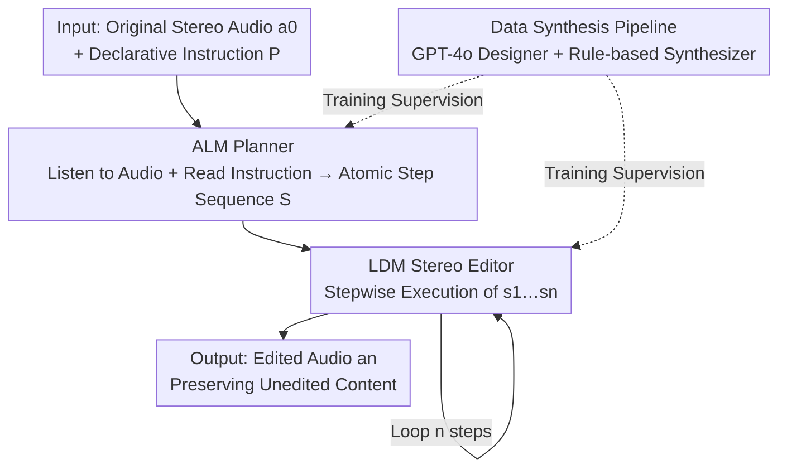

# SmartDJ: Declarative Audio Editing with Audio Language Model

**Conference**: ICLR 2026  
**OpenReview**: [https://openreview.net/forum?id=eNmANCkefl](https://openreview.net/forum?id=eNmANCkefl)  
**Paper**: [Project Page](https://waves.seas.upenn.edu/projects/smartdj)  
**Code**: TBD  
**Area**: Audio Editing / Audio Language Models / Diffusion Models  
**Keywords**: Declarative editing, Stereo audio, Audio Language Model, Latent Diffusion, Atomic editing operations  

## TL;DR
SmartDJ proposes a "declarative audio editing" paradigm — where users specify only the desired outcome (e.g., "transform this recording into a sunny forest"). An Audio Language Model (ALM) acts as a planner to decompose high-level instructions into a sequence of atomic editing steps, which are then incrementally executed by a Stereo Latent Diffusion Model (LDM). It significantly outperforms previous audio editing methods in perceptual quality, spatial realism, and semantic alignment.

## Background & Motivation
**Background**: Text-driven audio generation and editing have seen rapid progress, with several diffusion-based methods emerging (Audit, WavCraft, AudioEditor, etc.) that can add, remove, or modify audio based on text instructions.

**Limitations of Prior Work**: Existing methods suffer from two major flaws. First, they only recognize "templated" low-level instructions, such as "add the sound of birds" or "remove the sound of rain" — users must devise the procedural steps themselves. Second, they focus almost exclusively on monaural (mono) audio, discarding spatial auditory cues like interaural time/intensity differences, which results in "flat" sounding audio that fails to support the immersion required for VR/AR.

**Key Challenge**: Declarative editing requires the system to bridge the gap between "goals" and "operation sequences" automatically. When a user says "put me in a concert hall," the system must reason: which sounds to remove, which to keep, how to adjust volume, when to introduce new events, and how to shift spatial positions. Pure diffusion models lack this reasoning capability and cannot interpret abstract instructions; pure language models can parse text but lack grounding in the audio itself, making them unable to determine which events in the original audio should be suppressed or retained. Both lack a critical component.

**Goal**: Build a unified framework that understands natural language declarative instructions, perceives audio content, and produces stereo editing results.

**Key Insight**: Drawing inspiration from the success of "VLM-guided diffusion models" in visual editing, the authors introduce an Audio Language Model (ALM) into the audio editing loop. It simultaneously "hears" the original audio and "reads" the instructions to act as a planner.

**Core Idea**: By partitioning labor between a "Planner ALM" and an "Executor LDM," audio editing is transformed from a procedural task into a declarative one — the ALM is responsible for "planning the steps" (expressed in natural language for user inspection/modification), while the LDM is responsible for "precisely executing each step."

## Method

### Overall Architecture
SmartDJ aims to solve the following: given an original stereo audio $a_0$ and a high-level declarative instruction $P$, produce a target audio $a_n$ that satisfies $P$ while preserving unedited content. This is split into two serial stages: "Planning" and "Execution."

In the first stage, the ALM processes both the original audio $a_0$ and instruction $P$ to output a sequence of atomic editing steps $S=\{s_1,s_2,\dots,s_n\}$, where each step is a concrete executable operation (add, remove, extract, adjust volume, change direction, time shift, add reverb, change timbre). In the second stage, the LDM editor executes these steps sequentially, producing intermediate results $a_1,a_2,\dots,a_n$, where $a_n$ is the final edited audio. The process is formalized as:

$$\{s_1,\dots,s_n\}=\mathrm{ALM}(a_0;P),\qquad a_i=\mathrm{LDM}(a_{i-1};s_i),\ i=1,\dots,n$$

Critically, the ALM and LDM are **trained separately**, with natural language atomic steps serving as the intermediate representation — allowing users to intervene, inspect, or rewrite the plan before the LDM executes. To train this system, the authors designed an extensible data synthesis pipeline to generate supervised signals for "declarative instruction ↔ atomic step sequence ↔ audio trajectory."

### Key Designs

**1. ALM Planner: Translating Declarative Goals into Executable Atomic Steps**

This step directly addresses the inability of diffusion models to understand abstract instructions. The ALM first uses a pre-trained audio encoder (CLAP) to encode $a_0$ into an audio embedding $z_a$, injected into the LLM via an adapter layer; the instruction $P$ is tokenized into an embedding sequence $(p_1,\dots,p_k)$ as text context. The model generates the token sequence for the corresponding atomic steps $S$ autoregressively, with the training objective being standard next-token prediction:

$$L_{\mathrm{ALM}}=-\sum_{t=1}^{l}\log P_\theta(r'_t=r_t\mid z_a,r_{1:t-1},p_{1:k})$$

where $r$ and $r'$ are the ground truth and predicted tokens of the atomic step text. For efficient fine-tuning, the CLAP encoder is frozen, LoRA is applied to a subset of LLM layers, and the adapter layer is fully fine-tuned. The ALM is initialized from AF2 (Audio Flamingo 2, 3B parameters). This design ensures the ALM can "hear" events in the source audio and "understand" user goals, enabling it to reason about what to delete or add — a feat neither pure text LLMs (lacking audio grounding) nor pure diffusion models (lacking reasoning) can achieve.

**2. Stereo Latent Diffusion Editor: Stepwise Execution and Preserving Spatial Cues**

This step solves "how to precisely execute a single operation without destroying other content or spatiality." The editor uses a stereo audio VAE (based on 1D-CNN, continuous VAE bottleneck, and snake activation, similar to DAC / Stable-Audio-Open) to compress stereo $a\in\mathbb{R}^{2\times L}$ into latents $\hat a\in\mathbb{R}^{C\times L'}$, with $C=128$, $L'=L/480$, and an $7.5\times$ compression ratio. During the $i$-th editing step, the previous latent $\hat a_{i-1}$ and a random noise latent $\hat a'_i$ are concatenated along the channel dimension as $[\hat a_{i-1};\hat a'_i]\in\mathbb{R}^{2C\times L'}$ and fed into a Diffusion Transformer (DiT). The step text $s_i$ is encoded by FLAN-T5 and injected via cross-attention, while the timestep $t$ is injected via AdaLN. The training uses a denoising loss:

$$L_{\mathrm{LDM}}=\mathbb{E}_{\epsilon,t,s_i,\hat a_{i-1},\hat a'_i}\big\|\epsilon-\epsilon_\theta(t,E_{\text{text}}(s_i),[\hat a_{i-1};\hat a'_i])\big\|^2$$

Inference uses DDIM sampling with classifier-free guidance, where the guidance scale $\omega$ interpolates between conditional and unconditional predictions. Concatenating $\hat a_{i-1}$ as a condition ensures the "editing is based on the original audio" rather than regenerating from scratch, thus preserving unedited content. Using DiT + Stereo VAE (preserving phase information) allows the editing to be semantically precise and spatially coherent — something Audit's VAE (operating on Mel-spectrograms while losing phase) cannot achieve.

**3. Designer-Synthesizer Data Pipeline: Scaling Declarative Editing Supervision**

Training data for declarative editing (Instruction ↔ Atomic Sequence ↔ Audio Trajectory) is virtually non-existent in the real world. This pipeline scales its creation. The pipeline consists of two roles mirroring the model's "Planning-Execution" structure. **GPT-4o as Designer**: Randomly samples $K$ labeled single-event audio clips (e.g., car engine, bell ring, goat bleat), feeds the labels to GPT-4o, and tasks it to design a declarative instruction $P$ (e.g., "Make this sound like a countryside morning") and decompose it into an atomic step sequence $S$. **Signal Processing as Synthesizer**: First overlays $K$ clips to synthesize the original audio $a_0$ (rendering spatial effects using direction-dependent phase and amplitude across two channels), then incrementally re-synthesizes following each $s_i$ — adjusting volume/direction if $s_i$ modifies an existing event, or retrieving a new clip by label to overlay if it's an "add" operation. Since each event is an independently editable parameter, modifying one does not affect other sources, allowing for the precise generation of the complete editing trajectory $a_1,\dots,a_n$. This "event-level parametric synthesis" is the key to scalability, yielding 240k training pairs and 2k evaluation pairs for declarative tasks, with single-step pairs expanded to 1M.

### Loss & Training
ALM and LDM are trained separately. The ALM is trained on 240k declarative editing pairs for 20 epochs with a batch size of 24 and a learning rate of 1e-5. The LDM is trained on 1M single-step pairs for 500k iterations with a batch size of 256 and a learning rate of 5e-5, using velocity prediction and CFG rescaling to suppress overexposure. 10% of text is replaced with empty strings to learn the unconditional distribution. Both use the AdamW optimizer on 4 NVIDIA L40S GPUs.

## Key Experimental Results

### Main Results
Declarative Instruction Editing: All methods are guided by the same ALM-generated atomic steps (as no other method can directly interpret declarative instructions), compared against 1k reference audios.

| Framework | Method | Traionable | Speed | FD ↓ | FAD ↓ | KL ↓ | LSD ↓ | CLAP ↑ |
|------|------|:---:|------|------|------|------|------|------|
| w/o ALM | Audit (End-to-End) | ✓ | 2.07s | 28.56 | 10.00 | 3.07 | 1.93 | 0.11 |
| w/ ALM | SDEdit | ✗ | 301s | 19.66 | 3.71 | 3.25 | 2.22 | 0.17 |
| w/ ALM | ZETA | ✗ | 356s | 20.74 | 3.73 | 2.92 | 2.21 | 0.20 |
| w/ ALM | AudioEditor | ✗ | 406s | 19.91 | 4.99 | 3.21 | 2.08 | 0.19 |
| w/ ALM | Audit | ✓ | 11.6s | 21.50 | 5.67 | 2.80 | 1.49 | 0.18 |
| w/ ALM | **SmartDJ** | ✓ | 13.1s | **10.60** | **1.52** | 2.84 | **1.40** | **0.21** |

SmartDJ achieves the lowest FD, FAD, and LSD, and the highest CLAP (best semantic alignment). KL is also low. Speed (13.1s for a full instruction) is significantly faster than training-free baselines (300s+) and only slightly slower than end-to-end Audit, while crushing it in quality.

Single-step editing (Selected indices for Add and Remove/Extract, including spatial metrics GCC/CRW/FSAD):

| Method | Task | FD ↓ | FAD ↓ | KL ↓ | GCC ↓ | CRW ↓ | FSAD ↓ |
|------|------|------|------|------|------|------|------|
| Audit | Add | 27.82 | 5.11 | 1.94 | 74.37 | 217.49 | 0.21 |
| **SmartDJ** | Add | **17.74** | **2.07** | **1.38** | **39.05** | **65.90** | **0.02** |
| Audit | Remove/Extract | 42.48 | 6.73 | 1.96 | 62.06 | 132.72 | 0.67 |
| **SmartDJ** | Remove/Extract | **20.27** | **2.29** | **0.95** | **5.22** | **16.55** | **0.01** |

SmartDJ also leads significantly across Volume / Time / Reverb / Timbre / Change Direction, with spatial metrics (GCC, CRW, FSAD) showing order-of-magnitude advantages — attributed to Audit's phase loss in Mel-spectrograms versus SmartDJ's DiT + Stereo VAE.

### Ablation Study

| Configuration / Experiment | Key Metric | Description |
|------|---------|------|
| ALM Step Generation Quality | BERTScore F1 = 91.5% | High semantic consistency between generated plans and ground truth across operations. |
| Round-trip Multi-round Editing | Lowest LSD Throughout | In "Add A then Remove A" cycles (5 rounds), SmartDJ deviates least from the original audio. |
| User Study (19 subjects × 20 pairs) | 77%–96% Win Rate | Significantly outperformed SDEdit/ZETA/AE/Audit in quality and alignment ($p<0.001$). |

### Key Findings
- **Spatial cues are the core differentiator for SmartDJ**: In GCC/CRW/FSAD metrics, it often leads by orders of magnitude because of the phase-preserving Stereo VAE + DiT, whereas Mel-spectrogram baselines fundamentally lose phase.
- **No drift in multi-round editing**: Round-trip experiments prove that unedited content remains preserved across multiple steps, thanks to "editing conditional on $\hat a_{i-1}$" rather than regeneration.
- **ALM "hallucinates" on contradictory instructions**: Appendix failure analysis indicates ALM struggle to fully comprehend self-contradictory instructions, highlighting a current limitation of the planner.

## Highlights & Insights
- **Paradigm shift from "Procedural to Declarative"**: Splitting the task into ALM planning and LDM execution, using natural language atomic steps as an interface, naturally supports human-in-the-loop intervention. This "planner outputs readable intermediate representation" approach is transferable to vision, 3D, and other editing tasks.
- **Isomorphism between data pipeline and model structure**: Using GPT-4o for instruction design and a rule-based synthesizer mirrors the Planning-Execution split. Event-level parametric independence ensures that modifying one part doesn't affect the rest, elegantly solving the lack of supervised data for declarative editing.
- **Stereo + Spatial Metrics**: By treating spatial auditory cues as first-class citizens and introducing GCC/CRW/FSAD for evaluation, the work fills a gap left by prior mono-only audio editing research.

## Limitations & Future Work
- **Dependency on synthetic data**: Training supervision relies on GPT-4o and rule-based synthesis. The gap between synthetic distributions and complex real-world acoustic environments (overlapping reverb, non-independent sources) remains to be fully tested.
- **Limited reasoning for contradictory/ambiguous instructions**: The authors admit the ALM planner can fail on self-contradictory declarative instructions.
- **Separate training stages**: While allowing modularity, planning errors from the ALM propagate to the LDM without end-to-end feedback; sequential multi-step editing also risks error accumulation.
- **Future directions**: Incorporating joint ALM-LDM fine-tuning or feedback loops, domain adaptation on real recordings, and enabling the ALM to seek clarification for ambiguous instructions.

## Related Work & Insights
- **vs. Audit**: Audit uses end-to-end diffusion with fixed-template instructions and mono Mel-spectrograms (lossy phase). SmartDJ uses ALM planning + stereo latent diffusion to preserve phase, excelling in both declarative understanding and spatial realism.
- **vs. WavCraft**: WavCraft uses GPT APIs to parse instructions but requires users to provide fully specified procedural prompts. SmartDJ truly accepts high-level abstract declarative goals and auto-decomposes them.
- **vs. AudioEditor / ZETA / SDEdit**: These are training-free methods porting image editing tricks (DDPM inversion, null-text inversion, attention manipulation) to mono audio. They require token-level precision, struggle with declarative goals, and are extremely slow (>300s). SmartDJ's trained stereo editor is both faster and better.

## Rating
- Novelty: ⭐⭐⭐⭐⭐ First declarative stereo audio editing framework; ALM+LDM labor division and isomorphic data pipeline are highly original.
- Experimental Thoroughness: ⭐⭐⭐⭐⭐ Covers declarative tasks, 8 single-step operation types, spatial metrics, user studies, and multi-round stability.
- Writing Quality: ⭐⭐⭐⭐ Clear framework and strong motivation; some details (acoustic field synthesis, failure cases) are deferred to the appendix.
- Value: ⭐⭐⭐⭐⭐ The paradigm shift has direct value for immersive audio applications in VR/AR and film post-production.

<!-- RELATED:START -->

## Related Papers

- [\[ICLR 2026\] UALM: Unified Audio Language Model for Understanding, Generation and Reasoning](ualm_unified_audio_language_model_for_understanding_generation_and_reasoning.md)
- [\[ICLR 2026\] From Text to Talk: Audio-Language Model Needs Non-Autoregressive Joint Training](from_text_to_talk_audio-language_model_needs_non-autoregressive_joint_training.md)
- [\[ICLR 2026\] Measuring Audio's Impact on Correctness: Audio-Contribution-Aware Post-Training of Large Audio Language Models](measuring_audios_impact_on_correctness_audio-contribution-aware_post-training_of.md)
- [\[ACL 2025\] Towards Reliable Large Audio Language Model](../../ACL2025/audio_speech/towards_reliable_large_audio_language_model.md)
- [\[ICLR 2026\] JALMBench: Benchmarking Jailbreak Vulnerabilities in Audio Language Models](jalmbench_benchmarking_jailbreak_vulnerabilities_in_audio_language_models.md)

<!-- RELATED:END -->
