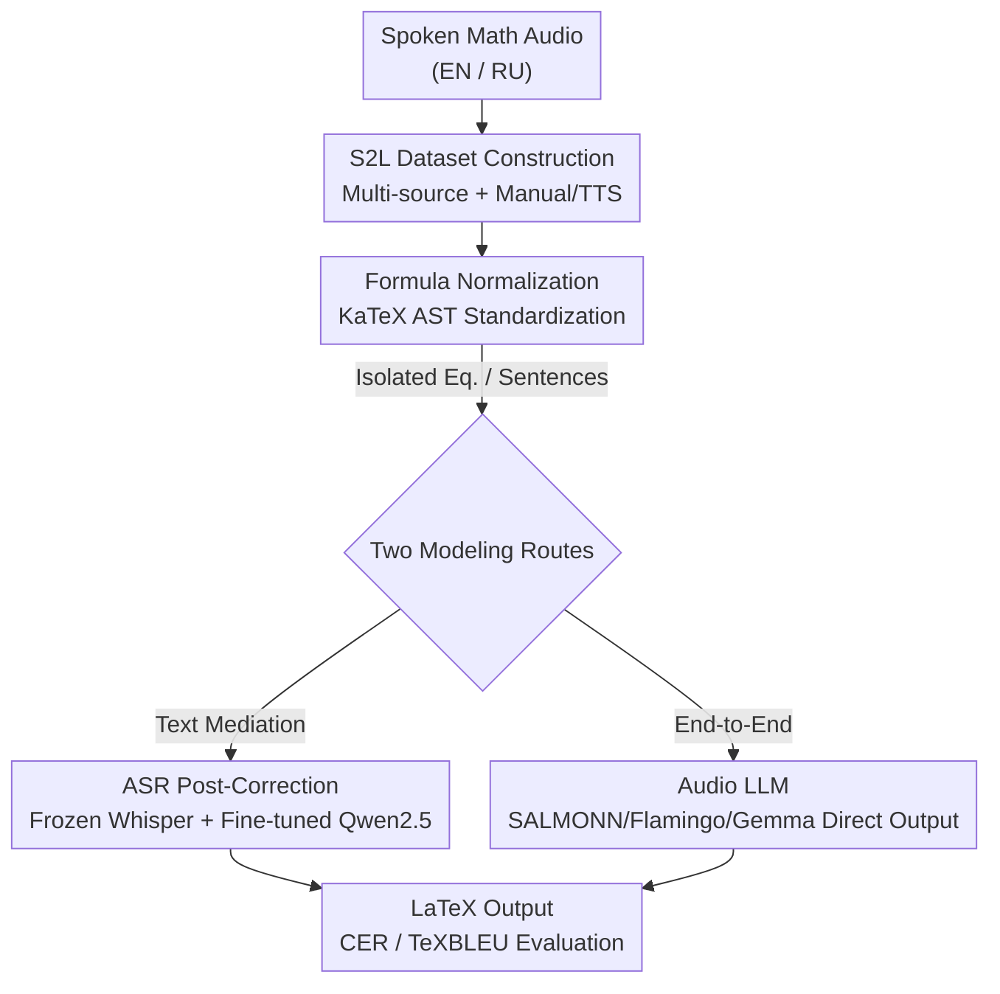

# Speech-to-LaTeX: New Models and Datasets for Converting Spoken Equations and Sentences

**Conference**: ICLR 2026  
**OpenReview**: [https://openreview.net/forum?id=gk8WMxzIQP](https://openreview.net/forum?id=gk8WMxzIQP)  
**Code**: https://github.com/dkorzh10/speech2latex (Available)  
**Area**: Speech Recognition / Multimodal / Datasets  
**Keywords**: Speech-to-LaTeX, Spoken Math Expressions, ASR Post-Correction, Audio LLMs, Multilingual Datasets

## TL;DR
This paper addresses the neglected task of converting spoken mathematical formulas/sentences into LaTeX. It constructs the first large-scale open-source dataset (English and Russian, 66k manual annotations + 571k synthetic audio) and systematically compares "ASR Post-Correction" and "End-to-End Audio LLM" approaches. Notably, SALMONN reduces the Character Error Rate (CER) from MathSpeech's 64% to 17.5% on the self-built S2L-equations benchmark.

## Background & Motivation
**Background**: Modern automatic speech recognition (Whisper, Wav2Vec2) performs strongly on general speech but fails on mathematical content. While simple symbols ($+$, $\pi$, $\sqrt{\ }$) might be recognized, complex or nested expressions (fractions inside square roots, subscripts/superscripts, Greek letters) are nearly impossible. Speech-to-LaTeX (S2L) is a critical requirement for automated classroom transcription, research notes, and multimodal assistants, yet it has lacked systematic study.

**Limitations of Prior Work**: The only systematic predecessor, MathSpeech, uses an "ASR Post-Correction" approach but suffers from four major flaws: (1) It relies on **dual-stream ASR** transcriptions as input, which is heavy and slow; (2) It only supports **isolated formulas** and does not handle mathematical sentences with context; (3) It lacks multilingual support; (4) The test set consists of only 1.1k entries with no public training data, and its training corpus (generated via TTS from MathBridge) is not open-sourced. The field lacks both data and modern end-to-end modeling solutions.

**Key Challenge**: Spoken mathematics is inherently **ambiguous**—the same phrase can correspond to multiple valid LaTeX strings. For instance, "kappa" could be $\kappa$ or $\varkappa$; "one over x plus two" could be $\frac{1}{x}+2$, $\frac{1}{x+2}$, or $1/x+2$. This implies the task is not merely "transcription" but inferring a strict symbolic structure from audio. Furthermore, evaluation metrics (like CER) are artificially inflated by this ambiguity, making it difficult to reflect true quality.

**Goal**: (1) Create a sufficiently large, diverse, and **open-source** spoken math dataset covering both isolated equations and contextual sentences in English and Russian; (2) Systematically compare multiple modeling routes to establish reproducible baselines.

**Key Insight**: The primary bottleneck of S2L is the "lack of data." Therefore, the authors first solve the data problem and then evaluate both "ASR Post-Correction" and "End-to-End Audio LLM" routes rather than betting on a single approach.

**Core Idea**: By combining "manual annotation + large-scale TTS synthesis" for data construction with "frozen ASR + fine-tuned small LLM post-correction" and "End-to-end direct LaTeX generation" routes, this work establishes S2L as a complete task with data, benchmarks, and strong baselines.

## Method

### Overall Architecture
The work is divided into data construction and two modeling routes. On the data side, formulas and sentences are collected from sources like MathBridge, TextTeller, and Proof-Pile-2. These are processed with reference readings, cleaned via KaTeX normalization, and recorded using both crowdsourced manual efforts and multiple TTS systems. This results in two subsets: S2L-equations (isolated formulas) and S2L-sentences (contextual sentences). On the modeling side, given an audio clip, the system either takes the **ASR Post-Correction** route (Whisper transcribes to text, then a fine-tuned Qwen2.5 rewrites it to LaTeX) or the **End-to-End Audio LLM** route (audio encoder + adapter feeds the waveform directly to an LLM, bypassing explicit transcription). Both output LaTeX, evaluated by CER and TeXBLEU.

### Key Designs

**1. S2L Dual-Subset Dataset: Solving "Data Scarcity" via Hybrid Annotation**

The primary contribution is the data rather than the model. The authors sourced content from MathBridge (large-scale formula-reading pairs, but with poor quality requiring filtering of seven types of errors), TextTeller (complex formulas from OCR research, 9.4k sampled with 4 GPT-4 generated readings each), and Proof-Pile-2 (arXiv subset for contextual math sentences). After heuristic filtering and LaTeX compilation checks, 1.5 million valid samples remained from MathBridge, with 400k synthesized via TTS. The final dataset includes **S2L-equations** (~10.7k isolated formulas) and **S2L-sentences** (~12.4k contextual sentences). Annotation used two tracks: crowdsourcing (33 annotators, 66k manual audio clips) and TTS synthesis (primarily XTTSv2 and commercial APIs like SaluteSpeech, 571k clips). This combination of "small high-quality manual data + large-scale synthetic data" ensures acoustic diversity and sufficient scale.

**2. KaTeX AST-based Formula Normalization: Mitigating "Synonymous Writing" Noise**

Ambiguity in spoken math is amplified by LaTeX's flexibility—`\int_{a}^{b} f(x) dx` and `\int_a^bf(x)dx` are identical in meaning but yield high CER. Authors used a KaTeX fork to parse formulas into Abstract Syntax Trees (AST) and rebuild them, unifying notations, removing redundant spaces, and standardizing operator names (e.g., `\underset{\xi}{\max}` becomes `\max_{\xi}`). This step alone reduced CER on S2L-equations by ~1% and ensured fair comparison with MathSpeech by normalizing both predictions and references.

**3. Complementary ASR Post-Correction and End-to-End Routes**

The authors evaluated two paradigms. **ASR Post-Correction**: Uses a frozen Whisper-Large v3 to transcribe audio to text (found to be the most accurate for Greek letters), followed by a **fine-tuned Qwen2.5 / Qwen2.5-Math (0.5B/1.5B/7B)** to rewrite transcriptions into LaTeX. This leverages LLM priors but is capped by ASR quality. **End-to-End Audio LLM**: Uses SALMONN-13B, Qwen-Audio, Gemma-3n, and Audio Flamingo-3. Waveforms are mapped to the LLM's token space via an adapter to directly decode LaTeX, bypassing the text bottleneck. These models are fine-tuned using LoRA. Results showed SALMONN significantly outperformed others, suggesting that direct inference from acoustic signals is more effective for high-ambiguity tasks.

### Loss & Training
Audio was resampled to 16kHz. For ASR, Whisper was frozen while only the post-correction LLMs were fine-tuned (full fine-tuning for small models, LoRA for 7B). For Audio LLMs, audio encoders and adapters were frozen, with LoRA applied to the LLM. Generalization was tested via three strategies: (i) **Formula-disjoint split** (no overlap between train/test formulas), (ii) **Source-based split** (manual-only test set to check synthetic-to-real generalization), and (iii) **Monolingual vs. Multilingual** training.

## Key Experimental Results

### Main Results
S2L-equations (English Test Set, CER - lower is better, TeXBLEU - higher is better):

| Model | Training Data | CER (Mix) | TeXBLEU (Mix) |
|------|---------|-----------|---------------|
| MathSpeech | MS-train | 64.04 | 83.71 |
| Qwen2.5-0.5B | Mix-full | 27.21 | 90.20 |
| Qwen2.5-1.5B | Mix-full | 25.69 | 90.70 |
| Flamingo-3-8B | Mix | 23.25 | 91.32 |
| Gemma-3n-8B | Mix-full | 34.24 | 89.15 |
| **SALMONN-13B** | Mix-full | **17.50** | **93.68** |

Cross-benchmark comparison with MathSpeech (CER):

| Model | MathSpeech benchmark | S2L-equations |
|------|----------------------|---------------|
| MathSpeech | 27.7% | 64.0% |
| Qwen2.5-0.5B | 30.0% | 27.2% |
| SALMONN | 27.7% | 17.5% |

The results show that while the models are competitive on the MathSpeech benchmark, SALMONN leads by over 46 percentage points on the more diverse S2L-equations set.

### Ablation Study
S2L-sentences (Manual Test Set, CER, "Eq." = internal formulas, "Text" = plain text):

| Model | Training | Sent. CER | Text CER | Eq. CER |
|------|------|-----------|----------|---------|
| Qwen2.5-0.5B | H | 29.18 | 23.13 | 56.93 |
| Qwen2.5-Math-1.5B | H | 23.78 | 18.80 | 45.48 |
| Qwen2.5-7B (LoRA) | Mix | 18.75 | 12.36 | 43.75 |
| **SALMONN-13B** | Mix | **15.43** | **9.57** | **39.68** |

### Key Findings
- **End-to-End > Post-Correction**: SALMONN-13B performed best across all subsets. Skipping text mediation is advantageous for high-ambiguity tasks.
- **Synthetic Data utility is language-dependent**: Adding 400k TTS samples Improved English performance but degraded Russian, potentially due to language imbalance.
- **Fine-tuning ≫ Few-shot**: Few-shot prompting significantly underperformed compared to fine-tuning.
- **Sentential formulas are harder than isolated ones**: CER for the same formula increases significantly when embedded in a sentence (Isolated 17.5% → Sentential 39.7%).
- **Math-specific models lack clear advantages**: Qwen2.5-Math did not consistently outperform baseline Qwen2.5, likely because the input is natural language reading rather than raw math.
- **High Compilation Rate**: Predicted LaTeX strings had a compilation success rate of 98%–99.5%.

## Highlights & Insights
- **Honest Discussion on Metric Distortion**: The authors emphasize that "high CER does not equate to low quality" due to inherent one-to-many ambiguity.
- **Sample Efficiency**: A 0.5B model with 550k samples outperformed the 120M MathSpeech trained on 8M samples, proving that data quality/diversity outweighs raw volume.
- **Data-First Paradigm**: The "Manual + TTS + AST Normalization" pipeline provides a blueprint for other low-resource structured-transcription tasks (e.g., spoken code or chemical formulas).
- **Reusable Trick**: Using KaTeX AST reconstruction for normalization is a valuable tool for any LaTeX evaluation task to filter stylistic noise.

## Limitations & Future Work
- **Unresolved Ambiguity**: Models still struggle to recover structural brackets if they are not explicitly spoken (e.g., "2 squared from x plus 1").
- **Synthetic Data Bias**: Heavy reliance on GPT-4 for formula/reading generation may introduce distributional bias.
- **Limited Linguistic Coverage**: Only English and Russian are covered.
- **Fragility in Sentences**: The high CER for sentential formulas (near 40%) suggests that formulas are still easily disrupted by context.

## Related Work & Insights
- **vs MathSpeech**: MathSpeech uses dual ASR and is not open; this work supports sentences, multilingualism, and is fully open-source with superior performance.
- **vs MathBridge**: While MathBridge focuses on Text-to-LaTeX, this work cleans and adapts that data for the S2L audio task.
- **vs Spoken-MQA**: That field focuses on arithmetic reasoning; this work focuses on symbolic transcription.
- **vs General Audio LLMs**: The authors prove that with the right data and adapters, models like SALMONN can be repurposed for precision symbolic tasks.

## Rating
- Novelty: ⭐⭐⭐⭐ First large-scale open S2L dataset; addresses sentential math.
- Experimental Thoroughness: ⭐⭐⭐⭐⭐ Comprehensive benchmarking across scales, paradigms, and data splits.
- Writing Quality: ⭐⭐⭐⭐ Logical flow with insightful discussions on task-specific challenges like ambiguity.
- Value: ⭐⭐⭐⭐⭐ Establishes the essential infrastructure (data + benchmark) for future S2L research.

<!-- RELATED:START -->

## Related Papers

- [\[ICLR 2026\] ParaS2S: Benchmarking and Aligning Spoken Language Models for Paralinguistic-Aware Speech-to-Speech Interaction](paras2s_benchmarking_and_aligning_spoken_language_models_for_paralinguistic-awar.md)
- [\[ICLR 2026\] Stitch: Simultaneous Thinking and Talking with Chunked Reasoning for Spoken Language Models](stitch_simultaneous_thinking_and_talking_with_chunked_reasoning_for_spoken_langu.md)
- [\[ICLR 2026\] TASTE: Text-Aligned Speech Tokenization and Embedding for Spoken Language Modeling](taste_text-aligned_speech_tokenization_and_embedding_for_spoken_language_modelin.md)
- [\[ICLR 2026\] Towards True Speech-to-Speech Models Without Text Guidance](towards_true_speech-to-speech_models_without_text_guidance.md)
- [\[ICML 2025\] Long-Form Speech Generation with Spoken Language Models](../../ICML2025/audio_speech/long-form_speech_generation_with_spoken_language_models.md)

<!-- RELATED:END -->
