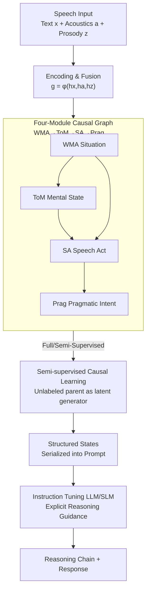

# Speech World Model: Causal State–Action Planning with Explicit Reasoning for Speech

**Conference**: ICLR 2026  
**OpenReview**: [https://openreview.net/forum?id=YGUKPGO182](https://openreview.net/forum?id=YGUKPGO182)  
**Code**: https://github.com/eureka235/eureka235.github.io  
**Area**: Speech Understanding / Multimodal / World Models  
**Keywords**: Speech Language Models, Causal Graphs, World Models, Explicit Reasoning, Semi-supervised Learning

## TL;DR
This paper proposes the Speech World Model (SWM), which decomposes speech understanding into four modules: World Model Activation, Theory of Mind, Speech Act, and Pragmatic Intent. These modules infer states through a Causal Directed Acyclic Graph (DAG). The resulting structured states serve as explicit prompts for instruction-tuned Speech Language Models (SLMs), achieving speech reasoning performance comparable to Gemini 2.5 Pro at a low cost of only 20 GPU-hours.

## Background & Motivation
**Background**: Current mainstream Speech Language Models (SLMs) follow a cascaded paradigm of "Speech Encoder + Large Language Model," treating speech understanding as a black box. The encoder compresses audio into tokens, and the LLM performs tasks like recognition, emotion classification, and intent identification, concatenating these outputs as the "reasoning result."

**Limitations of Prior Work**: This assembly-style approach has two major flaws. First, it treats ASR, emotion recognition, speech act recognition, and intent recognition as independent tasks, **ignoring the inherent dependencies between these speech components**. For example, a speaker changing from neutral to angry can directly alter the speech act (e.g., from statement to complaint). Second, real-world speech data often has **annotations for only some modules** (e.g., WMA labels are frequently missing). Cascaded models perform poorly under sparse supervision, leading to hallucinations and "text-dominant bias"—focusing on what was said while ignoring how it was said.

**Key Challenge**: Is it true reasoning or advanced pattern matching? The authors argue the root cause is that existing systems **fail to explicitly model the causal structure between different speech dimensions**. Chain-of-Thought (CoT) prompting is a parallel approach that improves reasoning by expanding the search space, but the search process **is not grounded in human speech perception principles** and is computationally expensive.

**Goal**: (1) Construct a structure that explicitly represents latent speech states and characterizes the causal flow between them; (2) reliably infer missing modules even on partially annotated data; (3) use this structure to constrain LLM reasoning chains for better interpretability and fewer hallucinations.

**Key Insight**: Drawing from cognitive science, human speech perception is considered **hierarchical and modular** (acoustic, linguistic, paralinguistic processing), with modules interacting through causal and reciprocal relationships. Furthermore, World Model theory posits that the "next state is conditionally predicted by the current state." Combining these, speech understanding naturally possesses a causal dependency structure.

**Core Idea**: Factorizing speech understanding into four module states using a **cognitively-grounded causal graph**. "Action" is redefined as the "causal influence exerted by one state on another." This graph is first trained as a "cognitive state search space," and its outputs are then used as explicit guidance for instruction-tuned SLMs.

## Method

### Overall Architecture
SWM is a **two-stage** system. The first stage trains a causal graph of the Speech World Model: text $x$, acoustics $a$, and prosody $z$ are encoded and fused as $g=\phi(h_x,h_a,h_z)$. Each of the four nodes (WMA / ToM / SA / Prag) is a neural network classifier, where the state $S_v$ of a node is inferred from its parent states in the causal graph plus the fused features, turning speech understanding into an interpretable state inference chain. The second stage freezes this graph, serializes the structured states (nodes and information flow) into a prompt, and performs instruction tuning on an LLM/SLM to generate a transparent causal reasoning trace and a user-oriented response.

The pipeline takes speech (and its transcript) as input and outputs "discrete states of four modules + reasoning chain + response." The core is the causal graph, which serves both as a modular framework for speech perception and a generative structure for "filling in" missing labels under semi-supervised settings.

### Key Designs

**1. Four-Module Cognitive Causal Graph: Factorizing Speech into "Where/Who/What/Why"**

To address the issue of cascaded models treating speech as a black box, the authors explicitly split speech understanding into four latent variable modules arranged in a DAG $G=(V,E)$. The modules are: World Model Activation (WMA, situational grounding, e.g., SmartHome/Finance), Theory of Mind (ToM, speaker's internal emotional/personality state), Speech Act (SA, the illocutionary act, e.g., question/command), and Pragmatic Intent (Prag, the true underlying purpose). These follow a "where → who → what → why" cognitive chain. Each node is a discrete classifier determined by its parents:

$$S_v = f_v\big(\{S_u : u \in \mathrm{Pa}(v)\},\, A_{u\to v}\big)$$

where $A_{u\to v}$ is the "action" of parent $u$ on $v$. The joint posterior is factorized via the DAG: $p(Z|X)=p(z_{WMA}|X)\cdot p(z_{ToM}|X)\cdot p(z_{SA}|z_{WMA},z_{ToM},X)\cdot p(z_{Prag}|z_{SA},z_{ToM},z_{WMA},X)$.

**2. Redefining "Action" as Causal Influence between States: A World Model Perspective**

Traditional world models define "action" as an external command. The authors instead view the system as a **forward dynamics model** where the "action" is the **causal influence one state node exerts on another**. For instance, a shift in ToM from neutral to angry is an "action" that may transition the downstream SA from Statement-opinion to Complaint. This integrates speech understanding into the World Model framework, where the "ΔState → Action" structure allows the causal graph to function as a generative model for latent variables.

**3. Semi-supervised Causal Training + Edge-level Teacher Forcing**

To handle partially annotated data, a joint multi-task and semi-supervised training strategy is used. Supervised loss is calculated only for labeled nodes: $L_{sup}=\sum_{i=1}^{N}\sum_{v\in V} m_{i,v}\,\mathrm{CE}(y_{i,v},S_{i,v})$. During training, edge-level teacher forcing is applied: a child node receives the ground truth parent state with probability $\tau_{i,u\to v}$, otherwise it receives the parent's predicted distribution. Crucially, if a parent $j$ is unlabeled and its child $k$ is labeled, **teacher forcing for that edge is disabled** ($p_{j\to k}=0$). This forces the child to depend on the parent's continuous prediction $S_{i,j}$, allowing gradients to propagate back to the unlabeled parent's parameters $\theta_j$.

**4. Causal Graph-Guided Explicit Reasoning Instruction Tuning**

The structured outputs of the frozen causal graph are serialized into prompts for instruction tuning. Two settings are provided: **language-only**, using an LLM (Llama3.1-8B) on the symbolic output $I(G(x))$, with target $L_{IT}(\theta)=-\sum\log p_\theta(y\,|\,\mathrm{Instr},\,I(G(x)))$; and **multi-modal**, using an SLM (Qwen2-Audio) to ground symbolic states in the original acoustic signals. This forces the SLM to combine "what was said," "how it was said," and "why" (from the graph), reducing hallucinations.

### Loss & Training
Two-stage training: Stage 1 involves training the causal graph with temporal-attention MLP classifiers using $L_{sup}$ and semi-supervised chain gradients, converging in 2.07h on a single A6000. Stage 2 involves LoRA instruction tuning for Llama3.1-8B (19h) and Qwen2-Audio (24.6h). Labels are generated using a Vicuna-13b-v1.5 teacher model via a two-stage pipeline.

## Key Experimental Results

Datasets: MELD, IEMOCAP (Emotion), SLURP (Spoken Language Understanding), VoxCeleb (Speaker ID). Metrics: Accuracy/Weighted F1 for nodes; Average Causal Effect (ACE) and Intervention Consistency Score (ICS) for edges. Instruction tuning is evaluated via GPT-4o ("Model-as-Judge") with a Total Score $= 0.6\times R_s + 0.4\times R_p$ (Reasoning $R_s$, Response $R_p$).

### Main Results
Speech understanding and reasoning comparison (Total Score as main metric, EM=Emotion Mention Rate, EA=Emotion Accuracy):

| Method | Prompt Style | Total ↑ | Reasoning $R_s$ | Response $R_p$ | EM(%) | EA(%) |
|------|---------|--------|------|------|-------|-------|
| **Ours (Llama3.1-8B)** | CoT | **7.81** | 7.84 | 7.76 | 97.80 | 66.26 |
| **Ours (Qwen2-Audio)** | CoT | 7.59 | 7.26 | 8.08 | 91.80 | **71.02** |
| Tuned Baseline (Qwen2-Audio-CoT) | CoT | 5.18 | 4.76 | 5.82 | 92.11 | 34.72 |
| Qwen2-Audio | Direct | 2.63 | 2.08 | 3.47 | 5.14 | 15.38 |
| Voxtral | CoT | 2.92 | 2.52 | 3.52 | 10.89 | 5.56 |
| GPT-4o | CoT | 7.41 | 6.98 | 8.06 | 68.20 | 45.16 |
| Gemini 2.5 Pro | CoT | 8.12 | 8.02 | 8.28 | 82.47 | 51.29 |

Ours significantly outperforms open-source SLMs and approaches Gemini 2.5 Pro, while exceeding all proprietary models in emotion recognition accuracy (EA) (71.02%).

### Ablation Study
Node accuracy and edge validity:

| Setting | WMA | ToM | SA | Prag | Ave. ACE(%) | Ave. ICS(%) |
|------|-----|-----|-----|------|------|------|
| Full Supervision | 69.4 | 73.5 | 65.3 | 81.4 | 23.57 | 43.29 |
| Semi-sup (WMA Latent) | 34.8 | 75.0 | 70.7 | 83.2 | 21.71 | 26.9 |
| Semi-sup (ToM Latent) | 69.1 | 43.3 | 69.6 | 83.5 | 21.98 | 28.9 |
| Random Graph | 69.7 | 74.0 | 67.5 | 83.6 | – | – |

### Key Findings
- **Causal vs. Random Graph**: Both achieve similar node accuracy, but the causal graph trains 5x faster and provides stable causal effects, whereas the Random Graph relies on spurious correlations.
- **Decoupling**: When a module (e.g., ToM) is unsupervised, the drop in ACE is localized to its connected edges, proving the modules learn decoupled representations.
- **Explicit Guidance**: The Tuned Baseline improves over open-source models, but the full SWM leads by a large margin, confirming that explicit causal guidance is the primary driver of reasoning performance.

## Highlights & Insights
- **Redefining "Action"**: Treating state transitions as actions allows World Model principles to apply to speech without external commands.
- **Edge-level Semi-supervised Trick**: Disabling teacher forcing to let child nodes "train" parent nodes is a robust mechanism for partially labeled structured data.
- **Efficiency**: Matching Gemini 2.5 Pro with only 20 GPU-hours demonstrates that structural cognitive priors are a cost-effective alternative to scaling.
- **Interpretability**: The system supports counterfactual interventions, allowing researchers to observe how changing one state (e.g., emotion) affects downstream reasoning.

## Limitations & Future Work
- The current model uses only four modules; more states could capture complex speech dynamics.
- The DAG structure is predefined; future work could involve learning adaptive causal structures.
- Instruction tuning relies on teacher model (Vicuna) labels, which may propagate errors.
- Node accuracy is relatively low (especially for latent modules in semi-supervised settings), suggesting reasoning benefits largely from the LLM amplifying the structural anchors.

## Related Work & Insights
- **vs. CoT**: CoT expands search space without human perception grounding; SWM constrains it to cognitively aligned regions.
- **vs. Cascaded SLMs**: SWM explicitly models dependencies instead of concatenating isolated task outputs.
- **vs. Vision/Language World Models**: SWM is the first to apply "latent forward dynamics" to discrete cognitive states in speech, providing a graph-based modular reasoning framework.

## Rating
- Novelty: ⭐⭐⭐⭐⭐ 
- Experimental Thoroughness: ⭐⭐⭐⭐ 
- Writing Quality: ⭐⭐⭐⭐ 
- Value: ⭐⭐⭐⭐⭐ 

<!-- RELATED:START -->

## Related Papers

- [\[ICLR 2026\] MambaVoiceCloning: Efficient and Expressive Text-to-Speech via State-Space Modeling and Diffusion Control](mambavoicecloning_efficient_and_expressive_text-to-speech_via_state-space_modeli.md)
- [\[ICLR 2026\] UALM: Unified Audio Language Model for Understanding, Generation and Reasoning](ualm_unified_audio_language_model_for_understanding_generation_and_reasoning.md)
- [\[AAAI 2026\] HPSU: A Benchmark for Human-Level Perception in Real-World Spoken Speech Understanding](../../AAAI2026/audio_speech/hpsu_a_benchmark_for_human-level_perception_in_real-world_spoken_speech_understa.md)
- [\[AAAI 2026\] DeformTrace: A Deformable State Space Model with Relay Tokens for Temporal Forgery Localization](../../AAAI2026/audio_speech/deformtrace_a_deformable_state_space_model_with_relay_tokens_for_temporal_forger.md)
- [\[ICLR 2026\] DrVoice: Parallel Speech-Text Voice Conversation Model via Dual-Resolution Speech Representations](drvoice_parallel_speech-text_voice_conversation_model_via_dual-resolution_speech.md)

<!-- RELATED:END -->
