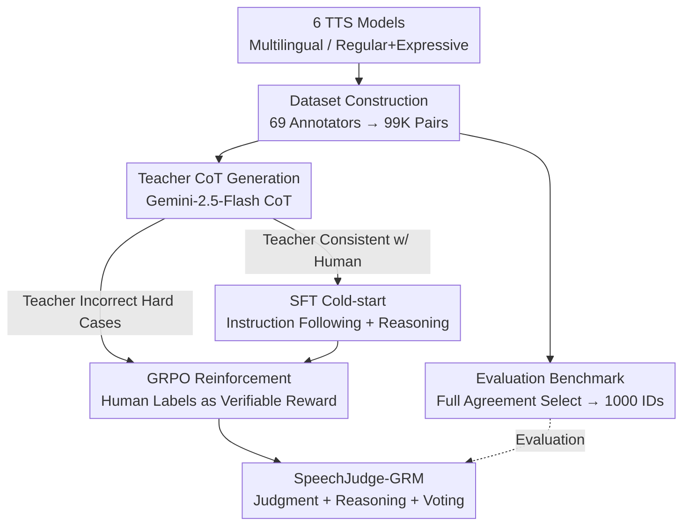

# SpeechJudge: Towards Human-Level Judgment for Speech Naturalness

**Conference**: ICLR 2026  
**OpenReview**: [https://openreview.net/forum?id=I9ED9VWZq6](https://openreview.net/forum?id=I9ED9VWZq6)  
**Code**: https://github.com/AmphionTeam/SpeechJudge  
**Area**: Speech Synthesis / Reward Models / Human Preference Alignment  
**Keywords**: Speech Naturalness, Human Preference Dataset, Generative Reward Model, GRPO, AudioLLM

## TL;DR
To fill the missing puzzle piece of "large-scale human preference corpora for naturalness" in speech synthesis, this paper introduces a comprehensive toolkit: a dataset (99K preference pairs), a benchmark (1000 high-consistency samples), and a reward model. By utilizing a "SFT cold-start + GRPO reinforcement" two-stage strategy, Qwen2.5-Omni-7B is trained into a generative reward model, SpeechJudge-GRM. It achieves a 77.2% accuracy rate (79.4% with inference-time voting) in judging speech naturalness, significantly outperforming the classic Bradley-Terry reward model (72.7%).

## Background & Motivation
**Background**: Text, image, and video generation have long possessed large-scale human preference corpora like Pick-a-Pic, ImageReward, and VideoReward, which use RLHF/reward models to align generative models with human taste. In speech synthesis, "naturalness" has always been the most core and universal subjective metric for quality, yet the preference data component has remained absent.

**Limitations of Prior Work**: Existing human feedback corpora in the speech domain are either early MOS datasets (using outdated TTS models, relying on individual scoring rather than pairwise preferences, and small in scale) or focused on narrow attributes—low-level acoustic quality, intelligibility, or instruction following in spoken dialogues. Large-scale pairwise preference corpora built specifically around "overall naturalness," and reward models trained accordingly, are almost non-existent.

**Key Challenge**: Without human preference corpora, it is impossible to train automatic judges that truly align with human perception. Meanwhile, existing objective metrics (WER, SIM, FAD) and MOS predictors (UTMOS, DNSMOS) show only weak correlation with human preferences. When faced with two speech samples generated by modern advanced TTS models, these metrics often achieve only 50%~60% accuracy, which is close to random guessing. Even the strongest AudioLLM—Gemini-2.5-Flash—exhibits an alignment rate with humans of less than 70%. Automatic judgment of speech naturalness is far from being practical.

**Goal**: To bridge this gap by addressing three sub-problems: (1) Creating a large-scale, pairwise naturalness preference dataset covering multiple models, languages, and styles; (2) Filtering a high-quality subset to create a discriminative benchmark to quantify how far existing methods fall short; (3) Training a reward model that can truly approach human judgment.

**Key Insight**: The authors observe that while existing AudioLLMs achieve only around 60% accuracy in zero-shot naturalness judgment, they demonstrate "significant potential" (faring much better than the random level of objective metrics). This suggests that AudioLLMs possess inherent audio understanding capabilities; what is missing is the ability to "elicit" and align these capabilities with human preferences.

**Core Idea**: Use "99K self-built human preference data" to post-train a general AudioLLM into a Generative Reward Model (GRM). First, perform SFT cold-start using the Chain-of-Thought (CoT) from a strong teacher model. Then, use human labels as verifiable rewards to perform GRPO reinforcement on hard cases where even the teacher failed. This allows the model to provide both judgments and interpretable reasoning, while supporting inference-time voting for performance amplification.

## Method

### Overall Architecture
SpeechJudge is a tripartite project consisting of "Dataset → Benchmark → Reward Model." First, 6 zero-shot TTS models with different architectures are used to synthesize speech pairs across multiple languages and styles (regular/expressive). 69 annotators spent two months performing "item-wise intelligibility labeling + pairwise naturalness labeling" to obtain 99K preference pairs (SpeechJudge-Data). From this, 1000 samples with high annotator consistency were selected to form the benchmark (SpeechJudge-Eval), systematically evaluating objective metrics, MOS predictors, Deepfake detectors, and various AudioLLMs. Finally, human preferences were fed into a two-stage post-training pipeline to refine Qwen2.5-Omni-7B into the SpeechJudge-GRM. The reward model training is the core pipeline: Gemini-2.5-Flash generates CoT for each sample, and data is split based on whether the teacher's judgment matches humans—matching cases go to SFT cold-start, while mismatched cases (hard cases) are reserved for GRPO reinforcement using human labels as verifiable rewards.

### Key Designs

**1. SpeechJudge-Data: 99K Naturalness Preference Corpus via Diverse Synthesis and Pairwise Human Labeling**

To address the lack of large-scale pairwise naturalness preference data, the authors maximized data diversity. For synthesis, 6 zero-shot TTS models covering three architectures were selected: Autoregressive (ARS, CosyVoice2, CosyVoice2-INTP, Ints-INTP), Flow Matching (F5-TTS), and Masked Generative (MaskGCT). Reference audio included both regular (Emilia-Large) and expressive (emotion, accent, whisper, game characters) types. Target text covered Chinese, English, and mixed code-switching, with both intra-lingual (en2en, zh2zh) and cross-lingual (zh2en, en2zh) scenarios. For a triplet $(t, a_1, a_2)$, annotators performed two tasks: binary classification for intelligibility and a five-grade CMOS (Comparative MOS) pairwise score for naturalness. Each sample averaged 2.49 annotations, with a third person brought in for disagreements. The final 99K pairs represent a scale and format previously missing in MOS datasets.

**2. SpeechJudge-Eval: High-Quality Ground Truth via "Full Agreement" to Reveal the Ceiling of Existing Methods**

The authors refined the task into a simple binary "win/loss" classification: given text $t$ and a pair of speech samples $(a_1, a_2)$, determine which is more natural. Accuracy is defined as $\text{Accuracy} = \frac{1}{|D|}\sum_{d} \mathbb{I}(y_M = y_H)$, where $y_M$ and $y_H$ are the model and human answers, respectively. To ensure reliability, the authors removed "Tie" samples and retained only samples where all annotators were in "Full Agreement." These were sampled across styles and languages to create a 1000-sample benchmark. Evaluation results showed that objective metrics and MOS predictors generally score below 60%. Deepfake detectors excel at "machine vs. human" but struggle with comparing two machine-generated samples. AudioLLMs are the most promising, with several exceeding 60%, though even Gemini-2.5-Flash only reached 69.1%.

**3. Two-stage Post-training (SFT Cold-start + GRPO Reinforcement): Refining a General AudioLLM into a Generative Reward Model**

Initial attempts to apply RL directly to Qwen2.5-Omni (using human preferences as verifiable rewards) failed due to weak instruction-following and reasoning. The authors shifted to a "SFT + RL" two-stage approach (LoRA fine-tuning based on Qwen2.5-Omni-7B). In the SFT stage, Gemini-2.5-Flash acts as a teacher: for each sample, it generates an output $O_{teacher}$ with reasoning via a CoT prompt $I_{CoT}$. If the teacher aligns with humans ($y_M = y_H$), $[I_{CoT}, O_{teacher}]$ is used as an SFT sample. In the RL stage, human labels serve as verifiable rewards. GRPO is run on the SFT model for hard cases: for each hard case, the policy model rolls out multiple times, and a reward $r = +1$ is given if $y_M^i = y_H$, and $-1$ otherwise. This design focuses training resources on the most valuable boundary cases. Since the GRM is generative, it supports majority voting (Voting@10) during inference to further boost accuracy.

### Loss & Training
The SFT stage uses standard next-token prediction, but loss is only calculated on the teacher's output segment $O_{teacher}$. The RL stage uses GRPO with a regularized reward $r = +1\,(y_M^i = y_H)$ or $-1$ otherwise. For SpeechJudge-Data (train), samples with full disagreement (FD) were removed, and labels for FA/WA/WD were determined by majority vote. SFT and RL stages both utilized LoRA fine-tuning. A baseline SpeechJudge-BTRM was trained by adding a linear layer for scalar reward on the same Qwen2.5-Omni-7B base with the same data and LoRA.

## Key Experimental Results

### Main Results: Performance of Existing Methods on SpeechJudge-Eval (Selected)
| Category | Model | Regular | Expressive | Overall |
|----------|-------|---------|------------|---------|
| Objective Metric | WER | 59.3 | 57.0 | 57.9 |
| Objective Metric | SIM | 47.5 | 42.5 | 44.5 |
| MOS Predictor | UTMOS | 54.0 | 53.5 | 53.7 |
| Deepfake | AASIST | 40.5 | 50.8 | 46.7 |
| Open-source AudioLLM | Kimi-Audio-7B | 65.5 | 68.0 | 67.0 |
| Closed-source AudioLLM | GPT-4o Audio | 71.5 | 64.7 | 67.4 |
| Closed-source AudioLLM | **Gemini-2.5-Flash** | 73.5 | 66.2 | **69.1** |

The strongest model, Gemini-2.5-Flash, achieved an overall accuracy of only 69.1%; objective metrics and MOS predictors were generally close to random guessing.

### Ablation Study: Reward Model Comparison
| Model | Regular | Expressive | Overall |
|-------|---------|------------|---------|
| Qwen2.5-Omni-7B (Zero-shot) | 62.0 | 59.7 | 60.6 |
| Gemini-2.5-Flash (Teacher) | 73.5 | 66.2 | 69.1 |
| SpeechJudge-BTRM | 77.5 | 69.5 | 72.7 |
| SpeechJudge-GRM (SFT) | 77.8 | 73.7 | 75.3 |
| &nbsp;&nbsp;w/ Voting@10 | 77.4 | 77.6 | 77.6 |
| **SpeechJudge-GRM (SFT+RL)** | 79.0 | 76.0 | **77.2** |
| &nbsp;&nbsp;**w/ Voting@10** | 80.5 | 78.7 | **79.4** |

### Key Findings
- **Generative + Reinforcement Contributions**: Accuracy improved from BTRM's 72.7% to GRM(SFT)'s 75.3% (generative CoT contribution), and then to 77.2% with SFT+RL (hard case GRPO contribution). The expressive subset saw the most significant gains (69.5 $\rightarrow$ 76.0).
- **Inference-time Voting Gains**: Voting@10 raised the SFT model from 75.3% to 77.6% and the SFT+RL model from 77.2% to 79.4%.
- **Effective as Reward Function for TTS**: Using GRM as an online DPO reward to post-train a Qwen2.5-0.5B-TTS led to the highest naturalness improvement (N-CMOS 0.25) without sacrificing speaker similarity.
- **Expressive Speech is Harder**: Both human annotation consistency and model accuracy were significantly lower for expressive subsets compared to regular ones.

## Highlights & Insights
- **"Teacher Correctness" Splits Data Naturally**: Using teacher consistency with humans to split data into "simple samples for imitation (SFT)" and "hard cases for reinforcement (RL)" allows training resources to be precisely concentrated on boundary cases.
- **Generative Reward Model Dividends**: Unlike scalar BTRMs, the GRM provides interpretable CoT and allows for "free" accuracy boosts through inference-time majority voting.
- **"Full Agreement" Benchmark Filtering**: Retaining only samples with full annotator consistency makes the 1000-sample benchmark clean and discriminative.
- **Closing the Loop from Evaluation to Generation**: Plugging the reward model back into TTS post-training (offline/online DPO) proves that "accurate judgment" translates to "better generation."

## Limitations & Future Work
- **Focus on a Single Dimension**: While intelligibility was labeled, the reward model primarily targets naturalness; multi-dimensional joint modeling (prosody, emotional fidelity) is not yet explored.
- **Dependency on Closed-source Teachers**: SFT cold-start relies heavily on Gemini-2.5-Flash for CoT, which may inherit teacher biases.
- **Language Bias**: Data is concentrated on Chinese, English, and code-switching samples; generalization to other languages/dialects is unverified.
- **Downstream TTS Validation Scale**: Post-training experiments were conducted on a 0.5B small model; scalability to larger TTS models remains to be observed.

## Related Work & Insights
- **vs. MOS Datasets**: Unlike traditional MOS datasets with outdated TTS and scalar scores, ours uses 6 advanced TTS models and 99K pairwise preferences.
- **vs. AudioJudge (Concurrent Work)**: AudioJudge focuses on evaluating AudioLLM capabilities as judges; ours goes further by post-training an aligned reward model and applying it to TTS generation.
- **vs. SpeechJudge-BTRM**: GRM's superiority over the scalar BTRM (77.2% vs 72.7%) demonstrates the advantages of generative structures for speech naturalness judgment.
- **vs. Text/Image RLHF**: This work systematically migrates the "Preference Corpus + Reward Model + RLVR" paradigm to speech synthesis.

## Rating
- Novelty: ⭐⭐⭐⭐ Filling the gap in speech naturalness preference data with a complete benchmark and reward model suite is highly valuable.
- Experimental Thoroughness: ⭐⭐⭐⭐⭐ Comprehensive benchmarking across four categories, step-by-step ablation, and downstream validation.
- Writing Quality: ⭐⭐⭐⭐ Clear motivation, solid data tables, and well-explained logic for the two-stage training.
- Value: ⭐⭐⭐⭐⭐ Open-sourcing the dataset, benchmark, and model provides essential infrastructure for speech alignment research.

<!-- RELATED:START -->

## Related Papers

- [\[ICLR 2026\] VowelPrompt: Hearing Speech Emotions from Text via Vowel-level Prosodic Augmentation](vowelprompt_hearing_speech_emotions_from_text_via_vowel-level_prosodic_augmentat.md)
- [\[AAAI 2026\] HPSU: A Benchmark for Human-Level Perception in Real-World Spoken Speech Understanding](../../AAAI2026/audio_speech/hpsu_a_benchmark_for_human-level_perception_in_real-world_spoken_speech_understa.md)
- [\[ICLR 2026\] TTSDS2: Resources and Benchmark for Evaluating Human-Quality Text to Speech Systems](ttsds2_resources_and_benchmark_for_evaluating_human-quality_text_to_speech_syste.md)
- [\[ICLR 2026\] Human Behavior Atlas: Benchmarking Unified Psychological and Social Behavior Understanding](human_behavior_atlas_benchmarking_unified_psychological_and_social_behavior_unde.md)
- [\[ICLR 2026\] Beyond Instance-Level Alignment: Dual-Level Optimal Transport for Audio-Text Retrieval](beyond_instance-level_alignment_dual-level_optimal_transport_for_audio-text_retr.md)

<!-- RELATED:END -->
