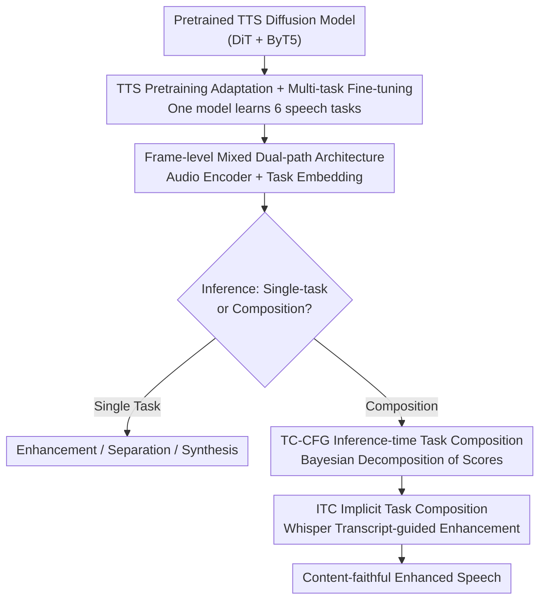

# SpeechOp: Inference-Time Task Composition for Generative Speech Processing

**Conference**: ICLR 2026  
**OpenReview**: [https://openreview.net/forum?id=eLsEjjFODE](https://openreview.net/forum?id=eLsEjjFODE)  
**Project Page**: [https://justinlovelace.github.io/projects/speechop](https://justinlovelace.github.io/projects/speechop)  
**Area**: Speech Processing / Diffusion Models / Generative Speech  
**Keywords**: Latent Diffusion, Multi-task Speech Processing, TTS Pretraining, Inference-time Task Composition, Classifier-Free Guidance

## TL;DR
SpeechOp transforms a pretrained TTS diffusion model into a "universal speech processor." By using a single multi-task latent diffusion model, it simultaneously handles synthesis, enhancement, and separation. Crucially, it introduces the TC-CFG guidance strategy, allowing independently learned capabilities to be freely combined at **inference time** (e.g., using ASR-generated transcripts to guide enhancement), achieving SOTA in content fidelity for speech enhancement (WER reduced by 46% relative to HiFi-GAN-2).

## Background & Motivation

**Background**: Generative Text-to-Speech (TTS) has advanced rapidly, primarily because it leverages massive "in-the-wild" datasets—tens of thousands of hours from audiobooks and podcasts—enabling models to learn robust speech representations across various acoustic conditions and speakers.

**Limitations of Prior Work**: Speech-to-Speech (S2S) tasks—such as speech enhancement, speaker separation, and foreground/background separation—have not benefited similarly. These tasks typically require paired "degraded ↔ clean" data, which is expensive to collect at scale, forcing models to train on small-scale datasets with simulated degradations. Due to data scarcity, generative S2S models often "hallucinate," altering the original speaker identity and speech content. In tasks like speech enhancement, **faithful preservation of content and timbre is paramount**.

**Key Challenge**: TTS possesses rich speech understanding from massive data, while S2S tasks are bottlenecked by data scarcity. Although both model the same speech latent space, they are typically trained in isolation. Furthermore, even when attempting to combine "enhancement" with "text-based content restoration," mainstream approaches (like score averaging in Fugatto) mix the broad acoustic prior of TTS (learned for generation) with the narrow studio-quality prior of enhancement (learned for reconstruction), often degrading the output quality.

**Goal**: (1) Enable S2S tasks to leverage speech understanding from TTS pretraining; (2) Correctly compose multiple independently trained speech capabilities at **inference time** rather than using crude averaging.

**Key Insight**: The authors first conducted a motivational experiment by initializing single-task enhancement/separation models with a pretrained DiT TTS backbone. They found that enhancement converged $4\times$ faster and separation $8\times$ faster, with significant improvements in MCD/WER for separation. This indicates a strong positive transfer from TTS pretraining to S2S. Consequently, it is beneficial to fine-tune a TTS model directly into a unified multi-task processor.

**Core Idea**: Adapt a pretrained TTS into a multi-task latent diffusion model (SpeechOp). Use TC-CFG based on Bayesian decomposition to clean-sum the "enhancement score" and "discriminative TTS content guidance" at inference time, avoiding the mixture of two different generative priors.

## Method

### Overall Architecture

SpeechOp is a multi-task latent diffusion model built on a compressed audio latent space. Audio is first compressed into low-dimensional latent representations using a DAC variational autoencoder. The core is a 20-layer Diffusion Transformer (DiT, 419M), extended to process both TTS (input text transcripts) and S2S (input source audio, e.g., noisy speech) paths. The text path uses a frozen ByT5-base encoder for character-level representations injected via cross-attention. The audio path utilizes an additional 8-layer Audio Encoder (71M, randomly initialized) to process source audio. A learnable Task Embedding modulates both the Audio Encoder and DiT via Adaptive Layer Norm (AdaLN), specifying the current task (enhancement, separation, matching, etc.). Training occurs in two stages: TTS pretraining followed by multi-task fine-tuning (balanced sampling of TTS and S2S, with $3\times$ upsampling for challenging enhancement and separation tasks).

The primary innovation lies in the inference phase: while tasks are learned separately, they share the same diffusion framework. Multiple task score functions can be combined via the TC-CFG formula to "create" new tasks not seen during training (e.g., text-guided enhancement, personalized enhancement). A particularly practical pipeline is ITC—using Whisper/WhisperX to automatically transcribe noisy speech and using the transcript as content guidance for enhancement via TC-CFG.

### Key Designs

**1. TTS Pretraining Adaptation + Two-stage Multi-task Fine-tuning: Bridging S2S Data Scarcity**

S2S tasks suffer from a lack of paired data, whereas TTS benefits from tens of thousands of hours of speech understanding. The authors transfer this knowledge by using a pretrained DiT TTS backbone as a starting point. Following TTS pretraining, multi-task fine-tuning optimizes the Audio Encoder and DiT backbone. Experimental results show that TTS initialization allows enhancement to converge $4\times$ faster and separation $8\times$ faster. Separation MCD dropped from 22.95 to 4.46, and WER from 17.8% to 8.5%, as it eliminates artifacts caused by "content decoupling" in randomly initialized models. Conversely, multi-task training benefits TTS itself: after learning acoustic operations like enhancement and separation, SpeechOp’s zero-shot TTS improved across all MOS metrics and speaker similarity.

**2. Frame-level Mixed Dual-path Architecture + Task Embedding: Multi-task Unified Diffusion**

To integrate TTS (text-to-speech) and S2S (speech-to-speech) in one network, the model must handle distinct inputs. The text side uses ByT5 cross-attention. For the audio side, since source and target audio are naturally frame-aligned, the authors use a simple "frame-level mixing"—the Audio Encoder's output is **directly added** to the diffusion latent variables before entering the DiT. Task identity is managed by a learnable Task Embedding: the DiT adds this to the timestep embedding and applies AdaLN modulation, while the Audio Encoder uses it for adaptive normalization. For tasks requiring extra prompts (e.g., speaker separation or acoustic matching), the prompt is concatenated before the source audio and noise latents, maintaining frame alignment. This design allows seamless task switching via the Task Embedding.

**3. TC-CFG: Replacing "Prior Mixing" with "Discriminative Guidance"**

To perform "enhancement + text-based content restoration" simultaneously, previous methods (e.g., Fugatto) used a weighted average of scores: $s^{avg}_\theta(z_t|y,w) = (1-\alpha)s^{enh}_\theta(z_t|y) + \alpha s^{tts}_\theta(z_t|w)$. This forces the broad TTS prior into the narrow enhancement prior, polluting the output. The authors apply Bayesian rules to decompose the target score (assuming transcript $w$ and noisy audio $y$ are conditionally independent given $z_t$):

$$\nabla_{z_t}\log p(z_t|y,w) = \nabla_{z_t}\log p(z_t|y) + \nabla_{z_t}\log p(w|z_t)$$

The first term is the enhancement score (acoustic quality). The second term $\nabla_{z_t}\log p(w|z_t)$ is **discriminative guidance**—it asks "how likely does latent $z_t$ correspond to transcript $w$?" rather than "how would TTS generate this?" This second term is approximated via Classifier-Free Guidance (CFG): $\nabla_{z_t}\log p(w|z_t) \approx \gamma(s^{tts}_\theta(z_t|w) - s^{tts}_\theta(z_t))$, leading to the final composition score:

$$s^{CFG}_\theta(z_t|y,w) \approx s^{enh}_\theta(z_t|y) + \gamma(s^{tts}_\theta(z_t|w) - s^{tts}_\theta(z_t))$$

The authors term this TC-CFG (Task-Composition CFG). The key difference is that the CFG difference term **isolates the direction of the text condition**, canceling out the full acoustic prior of TTS, thereby achieving content alignment without polluting the enhancement prior. The guidance strength $\gamma$ allows tuning between content restoration (higher $\gamma$) and acoustic fidelity (lower $\gamma$).

**4. ITC: Leveraging Whisper Transcripts for Automatic Enhancement Guidance**

Traditional "transcript-conditioned S2S" models face two issues: a lack of paired "noisy-clean-transcript" data and sensitivity to ASR errors. ITC (Implicit Task Composition) avoids these by not requiring transcripts during enhancement training. At inference, a SOTA ASR (Whisper/WhisperX) transcribes noisy audio, and this transcript is used as content guidance via TC-CFG. This bridges ASR's large-scale content understanding with SpeechOp's generative capabilities. The $\gamma$ knob allows the model to balance acoustic information and text guidance when transcripts are imperfect. Even with noisy Whisper transcripts, the WER dropped from 8.1% (no transcript) to 2.9%, approaching the gold transcript result of 2.1%.

### Loss & Training
The model uses Denoising Score Matching (DSM) loss: $L_{DSM}(x) = \mathbb{E}_{t,x,\epsilon}[w(\lambda_t)\cdot\|s_\theta(z_t;\lambda) - \nabla_{z_t}\log q(z_t|x)\|_2^2]$, with velocity parametrization $v=\alpha_t\epsilon - \sigma_t x$ for stable training. The noise schedule uses a shifted cosine (s=0.5), and loss weighting uses a Sigmoid weight (bias=-2.5) to focus on perceptually relevant noise levels. To support inference-time CFG, conditions are randomly dropped with a 10% probability during training.

## Key Experimental Results

### Main Results

Speech Enhancement (Content Fidelity - WER):

| Model | PESQ ↑ | MCD ↓ | SpBS ↑ | WER ↓ |
|------|--------|-------|--------|-------|
| Noisy Source | 1.12 | 11.22 | .888 | 3.3 |
| SGMSE+ | 1.98 | 5.28 | .923 | 5.7 |
| HiFi-GAN-2 | 2.23 | 4.40 | .934 | 5.4 |
| SpeechOp (No Transcript) | 2.00 | 4.83 | .908 | 8.1 |
| SpeechOp + ITC (Whisper) | 2.05 | 4.85 | .928 | **2.9** |
| + Speaker Personalization | 2.12 | 4.69 | .926 | **2.4** |
| SpeechOp (Gold Transcript, Upper Bound) | 2.06 | 4.83 | .931 | 2.1 |

ITC reduces the WER to 2.9%, a 46% reduction relative to HiFi-GAN-2’s 5.4%. While subjective MOS (3.89) is comparable to HiFi-GAN-2 (3.90), content accuracy is significantly improved.

Zero-shot TTS: SpeechOp improved over its own TTS baseline in MOS-Q (+0.22), MOS-VS (+0.36), MOS-SS (+0.32), and speaker similarity SIM (+0.05), with almost no loss in intelligibility.

### Ablation Study

Task Composition Comparison (Gold Transcripts, TC-CFG vs. Score Averaging TC-Avg):

| Configuration | PESQ ↑ | MCD ↓ | SpBS ↑ | WER ↓ | Description |
|------|--------|-------|--------|-------|------|
| SpeechOp (No Transcript) | 2.00 | 4.83 | .908 | 8.1 | Enhancement Baseline |
| SpeechOp (TC-Avg) | 1.88 | 5.24 | .909 | 3.4 | Better content, degraded acoustics |
| SpeechOp (TC-CFG, Ours) | 2.06 | 4.83 | .931 | **2.1** | Superior overall |
| Δ (TC-CFG vs TC-Avg) | +.18 | -0.42 | +.022 | -1.3 | — |

TC-Avg improved WER (8.1% to 3.4%) but worsened MCD (4.83 to 5.24) and PESQ (2.00 to 1.88), confirming that the broad TTS prior pollutes the enhancement prior. TC-CFG improves both WER (2.1%) and acoustic fidelity.

### Key Findings
- **TC-CFG is the core methodological contribution**: Unlike score averaging which trades acoustics for content, TC-CFG uses discriminative guidance to decouple the two.
- **Mismatch between Signal Metrics and Perceived Quality**: In speaker separation, SpeechOp significantly outperformed SepFormer in MOS (3.57 vs 3.28), despite lower objective SI-SDRi/MCD. This is a known phenomenon where generative models prioritize naturalness over exact waveform consistency.
- **Controllability via $\gamma$**: The model can slide between "acoustic fidelity" and "content restoration" by adjusting guidance strength at inference time.

## Highlights & Insights
- **Correcting Composition via Discriminative Guidance**: The Bayesian decomposition of TC-CFG provides an elegant solution. The insight is that the TTS model should contribute its discriminative power (is $z_t$ likely for transcript $w$?) rather than its generative prior.
- **ITC as Decoupled Enhancement**: Enhancement models do not need transcripts during training; they "borrow" ASR knowledge at inference. This bypasses data scarcity and tolerates ASR errors.
- **Multi-task Synergies**: Exposing the TTS model to noisy data tasks like enhancement/separation makes the TTS generation process more robust and natural.

## Limitations & Future Work
- **Objective Signal Metrics**: Performance on SI-SDRi and MCD lags behind discriminative models like SepFormer; generative approaches still struggle with exact signal reconstruction.
- **Idealized Separation**: Current evaluations use fully overlapped mixtures (LibriMix); the authors acknowledge that real-world partial overlap scenarios require diarization-assisted ASR.
- **Scale**: With 419M parameters and ~45k hours of data, the model is smaller than SOTA models like DiTTo-TTS (740M, 56k hours).
- **ASR Dependency**: The upper bound of ITC is limited by Whisper's transcription quality; efficacy may drop in extreme noise.

## Related Work & Insights
- **vs. Fugatto / Compositional Diffusion**: These use score averaging, which mixes generative priors. SpeechOp uses TC-CFG’s Bayesian decomposition to keep priors separate and superior.
- **vs. UniAudio / SpeechFlow**: These focus on broad task coverage. SpeechOp focuses on efficient reuse of TTS pretraining for S2S via task composition.
- **vs. Conditioned S2S Models**: Those models fix the transcript condition during training, leading to issues with ASR error propagation. ITC + TC-CFG treats transcripts as an adjustable inference-time guide.

## Rating
- Novelty: ⭐⭐⭐⭐⭐ (TC-CFG + ITC decoupling is theoretically sound and practical)
- Experimental Thoroughness: ⭐⭐⭐⭐ (Extensive coverage, though real-world separation needs more validation)
- Writing Quality: ⭐⭐⭐⭐⭐ (Clear logical progression from motivation to theory to results)
- Value: ⭐⭐⭐⭐⭐ (Proposes a data-efficient, controllable paradigm for speech processing)

<!-- RELATED:START -->

## Related Papers

- [\[ICLR 2026\] Automatic Stage Lighting Control: Is it a Rule-Driven Process or Generative Task?](automatic_stage_lighting_control_is_it_a_rule-driven_process_or_generative_task.md)
- [\[ICLR 2026\] Confident and Adaptive Generative Speech Recognition via Risk Control](confident_and_adaptive_generative_speech_recognition_via_risk_control.md)
- [\[ICLR 2026\] Improving Black-Box Generative Attacks via Generator Semantic Consistency](improving_black-box_generative_attacks_via_generator_semantic_consistency.md)
- [\[ICLR 2026\] MMSU: A Massive Multi-task Spoken Language Understanding and Reasoning Benchmark](mmsu_a_massive_multi-task_spoken_language_understanding_and_reasoning_benchmark.md)
- [\[ICLR 2026\] When and Where to Reset Matters for Long-Term Test-Time Adaptation](when_and_where_to_reset_matters_for_long-term_test-time_adaptation.md)

<!-- RELATED:END -->
