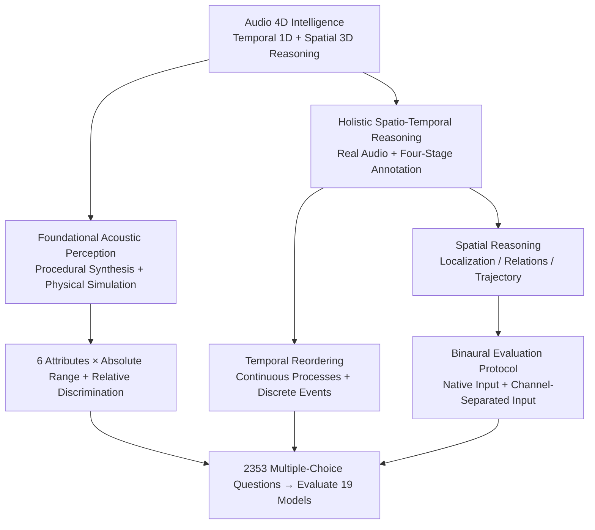

# STAR-Bench: Probing Deep Spatio-Temporal Reasoning as Audio 4D Intelligence

**Conference**: ICLR 2026  
**OpenReview**: [https://openreview.net/forum?id=Ts6j3GoZDE](https://openreview.net/forum?id=Ts6j3GoZDE)  
**Code**: https://github.com/InternLM/StarBench  
**Area**: Audio Understanding / Multimodal Evaluation  
**Keywords**: Audio 4D Intelligence, Spatio-Temporal Reasoning, Auditory Perception Benchmark, Binaural Spatial Reasoning, LALM Evaluation

## TL;DR
This paper introduces the concept of "Audio 4D Intelligence" (physical reasoning of sound source dynamics in 1D time + 3D space) and constructs the STAR-Bench benchmark. Using a dual pipeline of procedural synthesis and four-stage human annotation, 2,353 questions were generated to specifically test fine-grained auditory cues that are "difficult to describe in text." Evaluation of 19 large audio models reveals that even the strongest model, Gemini 2.5 Pro, achieves only 49.6% average accuracy, far below the human level of approximately 79%.

## Background & Motivation
**Background**: Multimodal Large Language Models (MLLM) and Large Audio Language Models (LALM) are developing rapidly. The community has seen various audio benchmarks (AIR-Bench, MMAU, MMAR, etc.) covering tasks from ASR and sound event classification to "audio reasoning." Superficially, models achieve high scores on these leaderboards, appearing to "understand" audio.

**Limitations of Prior Work**: The authors conducted an experiment to expose a limitation: using Gemini 2.5 Pro to convert audio from MMAU/MMAR into detailed text captions, then asking the model to answer based **only on the caption**. Accuracy dropped by only 5.9% / 9.0% compared to using the original audio. This suggests current benchmarks primarily test "semantic content that can be losslessly transcribed into text" (what the sound/event is) rather than audition itself. Human hearing is far more sophisticated; humans can infer water levels from the dynamic changes in pouring sounds or deduce vehicle trajectories and distances from engine sounds—deep auditory cues that are **difficult to verbalize**.

**Key Challenge**: Existing benchmarks are bypassable through "semantic transcribability," masking real defects in fine-grained perception and physical reasoning. Additionally, almost all LALMs **average multi-channel audio into mono** during preprocessing, discarding binaural cues essential for spatial reasoning, making "spatial audition" unmeasurable.

**Goal**: ① Formally define "Audio 4D Intelligence"; ② Create a benchmark specifically testing non-verbalizable auditory cues covering deep reasoning in time and 3D space; ③ Systematically evaluate existing models and locate their specific bottlenecks.

**Key Insight**: To truly measure 4D intelligence, one must select questions where captions are insufficient. If a question can be answered from a text description alone, it is disqualified. The primary design principle is that **performance should drop significantly when using captions** (in this paper, temporal tasks dropped by 31.5% and spatial tasks by 35.2%, far greater than the single-digit drops in older benchmarks), proving the benchmark focuses on non-verbalizable cues.

**Core Idea**: Auditory intelligence is decomposed into two levels: "Foundational Acoustic Perception" (absolute range and relative discrimination of six attributes) and "Holistic Spatio-Temporal Reasoning" (temporal reordering and 3D spatial reasoning). These are generated via procedural synthesis (precise control) and real audio four-stage annotation (ecological validity), forcing models to synthesize "fine-grained perception, world knowledge, and multi-step reasoning."

## Method

### Overall Architecture
STAR-Bench is a **hierarchical evaluation benchmark**, not a model. It divides "Audio 4D Intelligence" into two complementary levels: the bottom layer is **Foundational Acoustic Perception**, using fully parameterized synthetic audio to quantitatively measure perception of six core attributes (pitch, loudness, duration, azimuth, elevation, distance). The top layer is **Holistic Spatio-Temporal Reasoning**, using real-world audio to test temporal reasoning (audio segment reordering) and spatial reasoning (static localization, multi-source relations, dynamic trajectories). These levels are produced via two different pipelines and unified into 2,353 multiple-choice questions evaluated by classification accuracy.

The philosophy is pyramidal: foundational perception is the base for high-level reasoning. If a model cannot accurately discern "which of these two sounds has a higher pitch," it cannot correctly answer questions like "reconstructing a car trajectory via the Doppler effect." Each holistic reasoning task is designed to require "fine-grained perception + world knowledge + multi-step reasoning" simultaneously.

### Key Designs

**1. Foundational Acoustic Perception: Auditory Tests for Large Models**

The bottleneck is that to test reasoning, one must first ensure the model can "hear" accurately, yet existing benchmarks rarely test this quantitatively. **Ours** uses "targeted synthesis" to create controlled samples. Non-spatial attributes (loudness/pitch/duration) use pure sine waves with specified parameters; spatial attributes (azimuth/elevation/distance) are rendered using the Pyroomacoustics physical simulation engine. Two sub-tasks are established: **Absolute Perception Range**, inspired by human audiograms, synthesizes sine waves (125 Hz–8,000 Hz, −10 to 110 dB HL) to let the model judge if a beep is in the first half, second half, or absent. Spatially, models must classify sources into four 90° quadrants and judge elevation (above/level/below) and distance (near/medium/far, 0–10m). **Relative Discrimination Sensitivity**, analogous to the human "Just Noticeable Difference" (JND), provides audio with two sounds and asks the model to compare them based on an attribute across 4–6 difficulty levels. Level 1 is a control group ($\Delta=0$ for non-spatial, sub-threshold for spatial) to detect guessing. Subsequent levels increase the difference $\Delta$. Analyzing accuracy across $\Delta$ allows for quantifying the model's perception range and sensitivity.

**2. Holistic Spatio-Temporal Reasoning: Forcing Deep Cues via "Segment Reordering" and "Binaural" Input**

The top-level bottleneck is that older "temporal tasks" often stay at the perception level (when a sound occurs, which comes first), and "spatial tasks" are mostly single-source localization, neither requiring true physical causality or stereo reasoning. For temporal tasks, **Audio Segment Reordering** is introduced: events with strong temporal uniqueness and clear logic are cut into 3 segments and shuffled. The model must restore the original order based only on audio content. Tasks include **Continuous Processes** (e.g., pouring water, boiling water, a car passing, relying on continuous acoustic evolution like Doppler shifts and energy decay) and **Discrete Event Sequences** (e.g., tool operation, daily scripts, causal triggers, relying on functional/causal knowledge). Spatial reasoning covers single-source static localization, multi-source spatial relations, and dynamic trajectory tracking, increasing in difficulty to combine spatial and temporal cues.

Crucially, the **Binaural Evaluation Protocol** identifies a major flaw: in 20 pseudo-stereo samples (original audio in left, phase-inverted in right), humans easily classify sound events, but models fail completely due to signal cancellation from mono-averaging (Gemini 2.5 Pro 20%, GPT-4o-audio and Qwen-2.5-Omni 0%). Spatial tasks thus use two inputs: **Native Input** (raw stereo) to test the default pipeline, and **Channel-Separated Input** (left and right channels provided separately as "Audio 1" and "Audio 2"), used as an ablation to see if spatial capability exists when binaural information is preserved.

**3. Four-Stage Data Pipeline + Human Performance Verification**

To ensure high-quality real audio tasks are difficult (non-verbalizable) yet solvable (avoiding noise), a four-stage pipeline is used: ① **Taxonomy Construction and Sourcing**—Domain experts and Gemini 2.5 Pro design the task hierarchy, sourcing from Clotho, FSD50K (temporal), STARSS23, and web audio (spatial). ② **AI-Aided Filtering**—A three-stage funnel filters by duration/energy, uses an LLM (DeepSeek-V3) for initial screening based on metadata, and uses a multimodal model (Gemini 2.5 Pro) to judge quality and classification. ③ **Manual Annotation and Quality Control**—10 trained annotators perform two rounds of review (consensus-based cross-validation + random expert spot checks). ④ **Final Human Verification**—Domain experts act as examinees; **only questions answered correctly by at least 2/3 of experts are retained**, ensuring tasks are well-defined and human-solvable.

### Key Findings
- The **caption-based performance drop experiment** is the core evidence of benchmark validity: while performance on older benchmarks (MMAU/MMAR) dropped only 5.9%/9.0%, STAR-Bench temporal tasks dropped 31.5% and spatial dropped 35.2%, proving its focus on non-verbalizable auditory cues.

## Key Experimental Results

### Main Results
19 models (16 open-source + 3 closed-source) were evaluated. Metrics include Average Accuracy (AA, %), Mean Accuracy (MA), and Overall Accuracy (OA).

| Model | Foundational Perception MA | Temporal Reasoning MA | Spatial Reasoning OA | Overall Mean |
| :--- | :--- | :--- | :--- | :--- |
| Human | 75.60 | 88.00 | 73.72 | **79.11** |
| Gemini 2.5 Pro (Best Model) | 46.64 | 58.52 | 43.62 | **49.59** |
| Gemini 2.5 Flash | 39.72 | 30.70 | 28.35 | 32.92 |
| GPT-4o Audio | 31.76 | 19.44 | 41.70 | 30.97 |
| MiDashengLM (Best Open-source) | 33.24 | 16.30 | 44.29 | 31.28 |
| Qwen-2.5-Omni | 30.90 | 16.96 | 37.25 | 28.37 |
| BAT (Spatial Specialist) | 12.87 | 0.00 | 0.00 | 4.29 |
| Random Guessing | 25.33 | 14.29 | 33.33 | 24.32 |

Conclusions: ① **The benchmark is challenging**: even Gemini 2.5 Pro (~50%) lags behind humans (~79%) by 30 points; most open-source models perform near random. ② **Closed-source vs. Open-source gap**: Closed-source models lead in temporal tasks due to better knowledge/reasoning (Gemini 2.5 Pro: 58.52%), but spatial performance is poor across the board. ③ **"Think" mode can be worse**: "Think" variants of Audio Flamingo 3 and Xiaomi-MiMo-Audio performed worse than standard versions, suggesting reasoning is harmful without a solid foundation of perception and knowledge.

### Key Findings
- **Closed-source bottleneck has shifted to "fine-grained perception"**: Gemini 2.5 Pro's errors are 84% perception-based. It is the only model capable of providing detailed acoustic descriptions to solve problems, confirming that world knowledge is rooted in fine-grained audio-to-text grounding.
- **Open-source models are weak across three dimensions (perception/knowledge/reasoning)**: For Qwen-2.5-Omni, 54% of temporal errors are knowledge gaps; reasoning often appears plausible but lacks physical grounding.
- **Widespread lack of spatial capability**: Except for BAT, almost all models discard binaural cues. "Visual centralism hallucinations" often occur (e.g., referring to car trajectories from non-existent video), suggesting spatial reasoning is misapplied from visual training.

## Highlights & Insights
- **Defining benchmark quality via "caption-solvability"**: Using the degradation in performance from captions as a hard validity test is a clever, transferable principle for benchmark design.
- **Adopting human audiology paradigms (audiogram, JND)**: Using pure sine waves and difficulty scaling makes vague "perceptual ability" as quantifiable as a human hearing test.
- **Pseudo-stereo cancellation experiment**: A simple 20-sample experiment elegantly proved that "mono-averaging" is a fundamental bottleneck for spatial reasoning, leading to the dual native/channel-separated protocol.

## Limitations & Future Work
- **Ours** focuses on evaluation and diagnosis, suggesting three directions (enhancing dense audio description, improving multi-audio reasoning, abandoning mono-averaging), but does not provide a specific training solution.
- **Scale and Coverage**: 2,353 questions is relatively small compared to the model's capability space. Potential data leakage from real-world audio sources (FSD50K/Clotho) remains a risk, though task formats are intentionally differentiated from traditional QA.
- **Evaluation Format**: The reliance on multiple-choice questions with string matching may underestimate or overestimate the true quality of open-ended generative reasoning.

## Related Work & Insights
- **vs. MMAU / MMAR / MMAU-Pro**: While these contain temporal/spatial questions, their temporal tasks stay at "when/who" levels, and spatial tasks rarely require stereo cues. STAR-Bench requires understanding cross-segment physical principles and causal dynamics, explicitly emphasizing stereo reasoning and providing quantitative attribute evaluation.
- **vs. BAT (Spatial Audio Model)**: BAT can classify 100% in the pseudo-stereo experiment, showing native multi-channel processing is key. However, BAT scores near 0 on STAR-Bench holistic tasks, proving "stereo processing" is not equivalent to "4D reasoning."

## Rating
- Novelty: ⭐⭐⭐⭐⭐ First to formalize "Audio 4D Intelligence" and strictly define evaluation scope via caption-drop experiments.
- Experimental Thoroughness: ⭐⭐⭐⭐⭐ 19 models evaluated with error attribution, ablation, and human baselines.
- Writing Quality: ⭐⭐⭐⭐ Clear structure and strong motivation; many task sub-categories require careful reference to tables.
- Value: ⭐⭐⭐⭐⭐ Reveals systemic shortcomings in fine-grained perception and spatial reasoning in current large audio models.

<!-- RELATED:START -->

## Related Papers

- [\[ICLR 2026\] Unmute the Patch Tokens: Rethinking Probing in Multi-Label Audio Classification](unmute_the_patch_tokens_rethinking_probing_in_multi-label_audio_classification.md)
- [\[ICLR 2026\] Incentivizing Consistent, Effective and Scalable Reasoning Capability in Audio LLMs via Reasoning Process Rewards](incentivizing_consistent_effective_and_scalable_reasoning_capability_in_audio_ll.md)
- [\[ICLR 2026\] UALM: Unified Audio Language Model for Understanding, Generation and Reasoning](ualm_unified_audio_language_model_for_understanding_generation_and_reasoning.md)
- [\[ICLR 2026\] Query-Guided Spatial-Temporal-Frequency Interaction for Music Audio-Visual Question Answering](query-guided_spatial-temporal-frequency_interaction_for_music_audio-visual_quest.md)
- [\[ICLR 2026\] OWL: Geometry-Aware Spatial Reasoning for Audio Large Language Models](owl_geometry-aware_spatial_reasoning_for_audio_large_language_models.md)

<!-- RELATED:END -->
