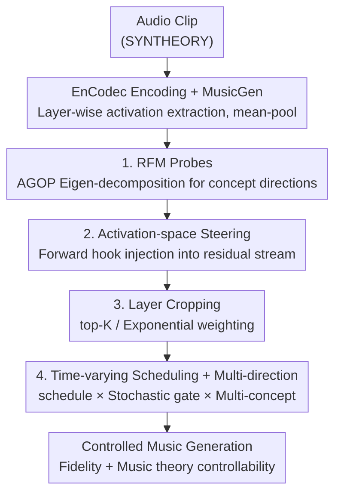

# Steering Autoregressive Music Generation with Recursive Feature Machines

**Conference**: ICLR 2026  
**OpenReview**: [https://openreview.net/forum?id=NaHzPMaCY9](https://openreview.net/forum?id=NaHzPMaCY9)  
**Code**: https://github.com/astradzhao/music-rfm  
**Area**: Audio/Music Generation  
**Keywords**: Controllable music generation, Activation-space steering, Recursive Feature Machines, Concept directions, MusicGen

## TL;DR
This paper proposes MusicRFM, which utilizes Recursive Feature Machines (RFM) to extract "concept directions" corresponding to music theory concepts such as notes, chords, and scales from the hidden activations of MusicGen. During inference, these directions are directly injected into the residual stream to steer generation in real-time—requiring no retraining or step-wise optimization. The method increases the target note hit rate from 0.23 to 0.82 while maintaining text alignment (CLAP) with only a marginal drop (approx. 0.02 compared to baseline).

## Background & Motivation
**Background**: Autoregressive (AR) text-to-music (TTM) models, represented by MusicGen, utilize neural audio codecs (EnCodec) to quantize audio into discrete tokens, followed by Transformer-based autoregressive prediction. While these models achieve high musical fidelity and coherence, several works have explored "time-varying control" for dynamics, polyphonic melody, and piano-roll steering.

**Limitations of Prior Work**: Existing approaches for fine-grained control over musical content (specific pitches, chord qualities, scales, and tempo changes over time) either require heavy fine-tuning of base models—which is computationally expensive (dozens to hundreds of GPU hours even for PEFT) and risks damaging inherent generation capabilities—or rely on per-step optimization during inference, which is prohibitively slow.

**Key Challenge**: A trade-off exists between control precision and generation quality. Forcing intervention in internal representations often introduces audible artifacts or degrades loyalty to text prompts, while gentle prompt engineering is largely ineffective for specific music theory concepts—experiments show that prompts alone achieve near-random accuracy for most categories.

**Goal**: To achieve fine-grained, interpretable, and high-quality music theory control on a **frozen** pre-trained music model, supporting time-varying scheduling and multi-concept simultaneous control.

**Key Insight**: The authors argue that more direct controllability arises from **activation-space intervention**. If stable directions corresponding to human-understandable concepts like "pitch/chord/tempo" can be identified in the hidden states, generation can be steered along these axes without retraining or altering the decoding pipeline. The key question is how to discover these semantic directions robustly and interpretably.

**Core Idea**: The paper addresses this using Recursive Feature Machines (RFM). RFM constructs an Average Gradient Outer Product (AGOP) matrix via lightweight probes and identifies orthogonal, sensitivity-ranked concept directions through eigenvalue decomposition. Injecting these directions back into activations steers the frozen model toward target attributes. This paradigm is applied to AR music generation for the first time, supplemented by layer, time, and multi-direction control mechanisms.

## Method

### Overall Architecture
MusicRFM aims to steer a frozen MusicGen-Large (48 decoder blocks) toward specific musical concepts (e.g., a specific note, a chord type, slow/fast tempo) without modifying weights. The pipeline consists of two stages: **offline probe training** (training RFM probes layer-wise on SYNTHEORY synthetic data to extract concept directions) and **online steering** (injecting directions into the residual stream via forward hooks during inference). Three mechanisms are layered during injection to manage the trade-off between quality and control: layer cropping, time-varying scheduling, and multi-concept parallelism.

The data flow is as follows:

### Key Designs

**1. RFM Probes: Extracting Interpretable Concept Directions via AGOP**

To steer in activation space, one must first identify which direction represents "C#" or a "Major Triad." This paper uses RFMs for discovery. Given training data $\{(x_i, y_i)\}$ and a lightweight predictor $f$, the gradient $g_i = \nabla_x f(x_i)$ is computed for each sample to construct the Average Gradient Outer Product (AGOP) matrix:

$$M = \frac{1}{n}\sum_{i=1}^{n} g_i g_i^\top \in \mathbb{R}^{d\times d}.$$

$M$ is positive semi-definite. After eigenvalue decomposition $M = Q\Lambda Q^\top$, the orthogonal eigenvectors $\{q_j\}$ represent the axes the model is most sensitive to for a concept, with eigenvalues $\lambda_j = q_j^\top M q_j$ measuring sensitivity. RFM performs feature learning by iterating through "training base learner (Kernel Ridge Regression) → calculating AGOP → reweighting features with $T=Q\Lambda^\alpha Q^\top$," all **without backpropagation**. For music, the authors train 15-iteration RFM probes for 7 categories (tempo, notes, chord progressions, chord types, scales, intervals, time signatures) on the SYNTHEORY dataset. The top eigenvector $q_{\ell,j}$ from the best-performing layer serves as the steering axis. Unlike FFN probes, RFM naturally produces orthogonal, ranked directions, making it fundamentally more suitable for steering.

**2. Activation-space Steering: Injecting Directions into the Residual Stream**

During inference, forward hooks are registered on a selected set of layers $S$ to add a broadcasted control vector to each residual stream:

$$h'_{t,\ell} = h_{t,\ell} + \eta_\ell(t)\, q_{\ell,j^\star},$$

where $q_{\ell,j^\star}$ is the primary component of the concept direction (reshaped to $(1,1,d_\ell)$ and broadcasted to all tokens), and $\eta_\ell(t)$ is the steering strength. This is achieved entirely at inference time with a frozen model. Critically, feature extraction uses **mean-pooling** (averaging activations across tokens) rather than the last-token pooling common in text RFMs. Since music is a continuous time-series signal, mean-pooling better captures temporal structures for attributes like tempo and chord progressions.

**3. Layer Cropping: Selective Injection for Quality Preservation**

Uniform injection across all 48 layers tends to degrade audio quality and text alignment because directions from lower-performing layers introduce noise. Two filtering strategies are introduced: **top-K selection** (injecting only in the top-K layers based on probe AUC) and **exponential weighting**, where layer weights are defined as $w_\ell = w_0 \cdot \hat s_\ell^{1/\kappa}$ ($\kappa\in(0,1)$) based on normalized probe scores $\hat s_\ell$. This concentrates steering on high-performance layers while suppressing noise.

**4. Time-varying Scheduling & Multi-direction Control**

To support complex control, the strength coefficient is defined as $\eta_\ell(t) = \eta_0\, w_\ell\, \phi(t)\, \psi_p(t)$. $\eta_0$ is the global coefficient, $w_\ell$ is the layer weight, $\phi(t)$ is a deterministic schedule (e.g., linear/logistic ramp, exponential decay, sinusoidal modulation) for fading concepts in/out, and $\psi_p(t)$ is an optional stochastic gate (Bernoulli sample with probability $p$). Multi-direction steering allows $M$ concepts to be injected in parallel: $h'_{t,\ell} = h_{t,\ell} + \sum_{m=1}^{M}\big(\eta_{0,m} w_\ell \phi_m(t)\psi_p(t)\big) q_{\ell,j_m}$. This enables **simultaneous** enforcement (e.g., note + tempo) or **interleaved** control (e.g., starting with tempo followed by harmonic structure).

## Key Experimental Results

### Main Results

**Probe Classification (vs. SYNTHEORY FFN Probe, Table 1)**:

| Model | Notes | Intervals | Scales | Chords | Prog. | Time Sig. | Tempos | Average |
|-------|-------|-----------|--------|--------|-------|-----------|--------|---------|
| MusicRFM (mean-pool, Ours) | 0.850 | 0.975 | 0.956 | 0.984 | 0.943 | 0.900 | 0.985 | **0.942** |
| RFM (last-token) | 0.734 | 0.743 | 0.546 | 0.866 | 0.811 | 0.771 | 0.959 | 0.776 |
| Linear Probe | 0.761 | 0.618 | 0.158 | 0.834 | 0.725 | 0.729 | 0.972 | 0.685 |
| SYNTHEORY FFN | 0.866 | 0.972 | 0.905 | 0.989 | 0.901 | 0.905 | 0.965 | 0.929 |

(Tempos column shows $R^2$; others show accuracy.) MusicRFM with mean-pooling outperforms the original FFN probe (0.942 vs. 0.929 Avg) and is significantly superior to last-token pooling.

**Single-direction Steering (Table 2, Notes)**: As the global coefficient $\eta_0$ increases from 0.15 to 0.60, note accuracy rises monotonically from **0.23 to 0.82**. CLAP text alignment remains stable (approx. 0.30–0.34, baseline MusicGen-Large is 0.332), while distributional metrics (FD/MMD) increase with steering strength. Prompt-only baselines achieve near-random accuracy across most categories, highlighting that such control cannot be achieved via prompt engineering.

### Ablation Study

**Listening Test (Table 3, 12 subjects, scores 1–100 Mean±SD)**:

| Steering Method | Chords | Intervals | Notes | Tempo |
|-----------------|--------|-----------|-------|-------|
| No Steering (Baseline) | 59.71 | 54.75 | 57.08 | 55.75 |
| Naïve RFM (Uniform Injection) | 69.21 | 62.58 | 68.13 | 73.33 |
| MusicRFM (Opt. Layer/Time) | **73.46** | **70.33** | **72.88** | **73.38** |

MusicRFM (using $p=0.3$ and exponential layer weighting) significantly outperforms the baseline and Naïve uniform injection across all attributes.

### Key Findings
- **Mean-pooling is essential**: Music features are temporal; last-token pooling fails to capture attributes like scales and progressions.
- **Layer selection determines quality**: Concentrating steering in high-AUC layers via weighting/cropping improves listening scores over uniform injection.
- **RFM provides control that prompts cannot**: Prompts are ineffective for specific musical theory concepts, whereas RFM provides a monotonic control knob.
- **Transfer to real music is feasible but attenuated**: On the MusicBench dataset, RFM probes maintain high accuracy for notes (75.3%) and keys (67.5%), though tempo regression is more difficult ($R^2$ 0.862 MSE). Steering trends remain consistent with synthetic data.

## Highlights & Insights
- **Transferring LLM activation steering to audio AR models**: The paper demonstrates that music theory concepts have stable linear directions in hidden states, which can be extracted via AGOP without backpropagation.
- **Natural suitability of AGOP for steering**: RFM provides orthogonal axes ranked by sensitivity, resulting in cleaner steering and higher interpretability than FFN or linear probes.
- **Control vs. Fidelity as adjustable knobs**: By decoupling "where," "when," and "how many" through layer cropping, scheduling, and multi-direction mechanisms, the trade-off becomes manageable.
- **Zero-training cost**: The base model remains frozen, and probes are extremely lightweight, offering a massive cost advantage over fine-tuning methods.

## Limitations & Future Work
- **Dependency on synthetic training data**: SYNTHEORY represents simplified music theory; generalization to complex real-world music remains limited, especially for continuous attributes like tempo.
- **Distributional shift under strong steering**: High $\eta_0$ values eventually degrade fidelity (increased FD/MMD), requiring manual coefficient tuning.
- **Relative nature of probe metrics**: Probing accuracy on synthetic labels may not fully reflect generalization to natural MusicGen outputs.
- **Future directions**: Training probes on real-world datasets, designing adaptive $\eta_0$ schedules, and incorporating waveform evaluators into a closed-loop selection for optimal layers and strength.

## Related Work & Insights
- **Vs. Controllable TTM via Fine-tuning**: Previous methods modify base weights and are costly. MusicRFM is frozen, inference-only, and lower risk.
- **Vs. LLM Activation Steering (ActAdd, CAA)**: While derived from LLM research, MusicRFM introduces mean-pool, layer weighting, and temporal scheduling specifically for the continuous nature of audio.
- **Vs. Inference-time Optimization**: MusicRFM avoids the high cost of per-step optimization by using pre-identified directions for one-time injection.

## Rating
- Novelty: ⭐⭐⭐⭐⭐ 
- Experimental Thoroughness: ⭐⭐⭐⭐ 
- Writing Quality: ⭐⭐⭐⭐ 
- Value: ⭐⭐⭐⭐⭐ 

<!-- RELATED:START -->

## Related Papers

- [\[ICLR 2026\] Discovering and Steering Interpretable Concepts in Large Generative Music Models](discovering_and_steering_interpretable_concepts_in_large_generative_music_models.md)
- [\[ICLR 2026\] SyncTrack: Rhythmic Stability and Synchronization in Multi-Track Music Generation](synctrack_rhythmic_stability_and_synchronization_in_multi-track_music_generation.md)
- [\[ICLR 2026\] YuE: Scaling Open Foundation Models for Long-Form Music Generation](yue_scaling_open_foundation_models_for_long-form_music_generation.md)
- [\[ICML 2026\] Towards Streaming Synchronized Spatial Audio Generation via Autoregressive Diffusion Transformer](../../ICML2026/audio_speech/towards_streaming_synchronized_spatial_audio_generation_via_autoregressive_diffu.md)
- [\[CVPR 2026\] FoleyDirector: Fine-Grained Temporal Steering for Video-to-Audio Generation via Structured Scripts](../../CVPR2026/audio_speech/foleydirector_fine-grained_temporal_steering_for_video-to-audio_generation_via_s.md)

<!-- RELATED:END -->
