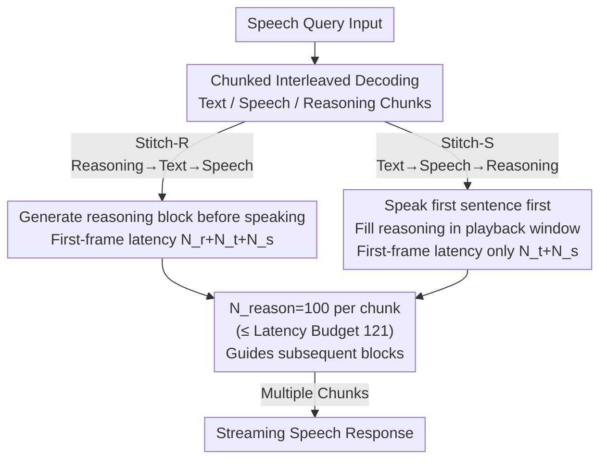

# Stitch: Simultaneous Thinking and Talking with Chunked Reasoning for Spoken Language Models

**Conference**: ICLR 2026  
**arXiv**: [2507.15375](https://arxiv.org/abs/2507.15375)  
**Code**: [https://d223302.github.io/STITCH](https://d223302.github.io/STITCH)  
**Area**: Audio & Speech  
**Keywords**: Spoken Language Models, Chain-of-Thought, Simultaneous thinking and talking, Chunked reasoning, Latency optimization

## TL;DR
Stitch is proposed to enable "thinking while talking" in Spoken Language Models (SLMs) by interleaving silent reasoning tokens with speech tokens in chunks. It leverages the idle computation time during audio playback to perform reasoning. Stitch-S achieves first-frame latency identical to non-reasoning baselines while improving mathematical reasoning accuracy by approximately 15 percentage points.

## Background & Motivation

**Background**: Current mainstream Spoken Language Models (SLMs, such as GLM-4-Voice and Qwen-2.5-Omni) follow a pipeline where they generate text tokens (as transcripts) and speech tokens (for waveform synthesis) in an interleaved decoding manner. While this allows streaming speech output, models lack internal reasoning before speaking—they simply output the first answer that comes to mind.

**Key Challenge**: Humans often reason silently in their minds before or while expressing complex thoughts, which leads to higher accuracy and conciseness. Implementing a similar "unspoken Chain-of-Thought (CoT)" in SLMs is intuitive but faces a trade-off with latency.

**Limitations of Prior Work**: The most straightforward approach is TBS (Think Before Speaking), which generates a full reasoning sequence $\mathbf{z}$ before the speech response $\mathbf{y}$. While TBS significantly improves mathematical reasoning (79.1% vs. 63.0%), reasoning can be excessively long (e.g., up to 360 tokens on GSM8K), resulting in uncontrollable user wait times for the first frame of audio.

**Key Insight**: Stitch observes that generating a chunk of text and speech tokens ($N_{text} + N_{speech} = 39$) takes only about 0.49 seconds at 80 tps on an A100, while the synthesized audio for $N_{speech}=26$ lasts about 2 seconds. The remaining ~1.5 seconds of playback time is "idle." Stitch utilizes this window to generate the next reasoning chunk, achieving "thinking while talking." The theoretical limit is $80 \times 2 - 39 = 121$ reasoning tokens per chunk, with a practical setting of $N_{reason}=100$.

## Method

### Overall Architecture
Stitch introduces a third token type—reasoning tokens—alongside text and speech tokens, arranged in interleaved chunks. Reasoning tokens are wrapped in special [SOPR]/[EOPR] tags and are used only for internal computation without being sent to the vocoder. By placing reasoning within the window of the previous audio chunk's playback, the computation cost is hidden from the user. The paper proposes two sequences—Stitch-R (Reasoning-first) and Stitch-S (Speech-first)—constrained by a latency budget inequality. Training data is derived by chunking existing TBS data.

### Key Designs

**1. Stitch-R (Reasoning-first): Prioritizing Quality with Reduced Latency**
This variant follows a loop of "reasoning chunk $\to$ text chunk $\to$ speech chunk." The model thinks before the first sentence, ensuring quality. Although users still wait for the first reasoning chunk ($N_{reason}+N_{text}+N_{speech}$ tokens), this is far shorter than TBS, which waits for the entire reasoning sequence (up to 360 tokens).

**2. Stitch-S (Speech-first): Zero Extra Latency Reasoning**
Stitch-S reorders the chunks to "text chunk $\to$ speech chunk $\to$ reasoning chunk." The model speaks the first sentence immediately (without reasoning), then generates reasoning in the background while the audio plays to guide subsequent sentences. The first-frame latency is $N_{text}+N_{speech}$, identical to the baseline without reasoning. The reasoning cost is entirely "absorbed" by the audio playback time.

**3. Latency Budget: Deriving the Upper Bound of $N_{reason}$**
To ensure reasoning does not delay speech, each reasoning chunk must be generated before the previous audio chunk finishes playing. Given 80 tps on an A100, an audio duration $t_{chunk}\approx 2$s, and $N_{text}+N_{speech}=39$ non-reasoning tokens per block, the budget for reasoning is approximately $80 \times 2 - 39 = 121$ tokens. The authors set $N_{reason}=100$ as a safety margin. This also implies that Stitch's advantage depends on hardware performance.

**4. Data Construction: Reusing TBS Data**
Stitch does not require new annotations. It transforms TBS triplets $(\mathbf{x}, \mathbf{z}, \mathbf{y})$ by splitting the full reasoning $\mathbf{z}$ into chunks of $N_{reason}=100$ and interleaving them with aligned text-speech pairs. Samples where reasoning chunks outnumber text chunks (thinking slower than speaking) are discarded to maintain real-time performance. Data includes general dialogue (VoiceAssistant400K), mathematical reasoning (Tulu-3), and QA (NQ/TriviaQA), with CoT generated by GPT-4o.

### Loss & Training
The training objective is standard cross-entropy language modeling. The GLM-4-Voice-9B backbone is fine-tuned on ~400K interleaved samples, with speech encoders and decoders frozen. CoT is generated by GPT-4o, and speech is synthesized using GPT-4o-mini-TTS. Evaluation is conducted using vLLM on A100-80G GPUs.

## Key Experimental Results

### Main Results (Average of 5 Math Reasoning Datasets)

| Method | AddSub | MultiArith | SinglEq | SVAMP | GSM8K | Average | Latency Type |
|--------|--------|-----------|---------|-------|-------|------|---------|
| GLM-4-Voice | 59.4 | 62.0 | 71.0 | 44.0 | 29.0 | 53.1 | $N_t+N_s$ |
| No reasoning | 66.1 | 70.7 | 78.0 | 64.4 | 35.7 | 63.0 | $N_t+N_s$ |
| TBS | 79.8 | 85.6 | 89.9 | 75.3 | 64.9 | 79.1 | $N_{full}+N_t+N_s$ |
| Stitch-R | 78.9 | 88.5 | 93.6 | 73.8 | 58.7 | 78.7 | $N_r+N_t+N_s$ |
| **Stitch-S** | **81.7** | **87.9** | **91.7** | 72.2 | 56.7 | **78.0** | $N_t+N_s$ |

Stitch-S maintains the same latency as the non-reasoning baseline while improving math accuracy by 15 percentage points.

### Non-reasoning Tasks
Stitch-S performs comparably to baselines on non-reasoning tasks, indicating that reasoning capability does not come at the cost of dialogue quality.

| Method | Llama Q | TriviaQA | WebQ | AlpacaEval | Average |
|--------|---------|---------|------|-----------|------|
| GLM-4-Voice | 74.3 | 47.1 | 51.0 | 48.6 | 55.2 |
| TBS | 74.3 | 51.5 | 52.2 | 56.3 | 58.6 |
| Stitch-S | 72.0 | 49.3 | 49.0 | 56.1 | 56.6 |

### Ablation Study

| Configuration | Math Avg | Notes |
|------|---------|------|
| Full model (Stitch-S) | 78.0 | Zero-latency reasoning |
| Mix reasoning (Inference w/o reasoning) | 67.4 | Training with reasoning yields +4.4% gain even when reasoning is disabled during inference |
| Mix reasoning (Inference w/ reasoning) | 77.5 | Performance close to TBS |

### Key Findings
- Stitch-S achieves reasoning performance close to TBS (78.0 vs. 79.1) with **zero extra latency**.
- On non-reasoning tasks, performance remains stable (56.6 vs. 55.2).
- Exposure to reasoning data during training improves performance even if reasoning is not used at inference (67.4 vs. 63.0).
- TBS reasoning can take ~4.5 seconds for 360 tokens on GSM8K; Stitch eliminates this wait.
- The performance gap between Stitch-R and Stitch-S is minimal (78.7 vs. 78.0), but Stitch-S has significantly lower first-frame latency.

## Highlights & Insights
- **Novelty**: First introduced the concept of "silent reasoning" in SLMs, mimicking the human cognitive process of "thinking while talking."
- **Mechanism**: Stitch-S is an elegant system design that utilizes the "free" computation window during audio playback—a window that exists in all SLMs but remained unexploited.
- **Value**: Clear mathematical derivation of the latency budget, providing an upper bound for $N_{reason}$ ($121$ on A100).
- The transition from TBS $\to$ Stitch-R $\to$ Stitch-S demonstrates a logical progression from feasibility to efficiency to zero overhead.

## Limitations & Future Work
- Evaluation was limited to GLM-4-Voice (9B); scalability to larger models or thinker-talker architectures is unverified.
- $N_{reason}$ is currently fixed; adaptive budget allocation (less for simple tasks, more for complex ones) might be superior.
- Reasoning quality is bounded by the GPT-4o CoT data used for training.
- Significant gains were primarily observed in math; other logic-intensive tasks like coding or science QA require further exploration.
- If token generation speed falls below audio playback speed (e.g., on weaker GPUs), the latency advantage of Stitch may diminish.
- Current metrics focus on text accuracy; speech quality (MOS, naturalness) has not been systematically evaluated.

## Related Work & Insights
- **vs. Qwen-2.5-Omni (Thinker-Talker)**: While thinker-talker uses two specialized models, Stitch achieves interleaved reasoning within a single model.
- **vs. Text-domain CoT (e.g., o1)**: In text models, latency equals reasoning + response tokens. In SLMs, the "audio playback time >> token generation time" creates a unique computation window that Stitch exploits.
- **Insight**: Any scenario where "generation is fast but consumption is slow" (e.g., video rendering, 3D streaming) can similarly utilize consumption-side idle time for auxiliary computation.

## Rating
- Novelty: ⭐⭐⭐⭐ (First silent reasoning in SLM; elegant zero-latency design)
- Experimental Thoroughness: ⭐⭐⭐⭐ (Extensive math and QA data; detailed latency analysis)
- Writing Quality: ⭐⭐⭐⭐⭐ (Clear diagrams and logical design progression)
- Value: ⭐⭐⭐⭐ (Practical design for existing SLM inference pipelines)

<!-- RELATED:START -->

## Related Papers

- [\[ICLR 2026\] OWL: Geometry-Aware Spatial Reasoning for Audio Large Language Models](owl_geometry-aware_spatial_reasoning_for_audio_large_language_models.md)
- [\[ICLR 2026\] MMSU: A Massive Multi-task Spoken Language Understanding and Reasoning Benchmark](mmsu_a_massive_multi-task_spoken_language_understanding_and_reasoning_benchmark.md)
- [\[ICLR 2026\] ParaS2S: Benchmarking and Aligning Spoken Language Models for Paralinguistic-Aware Speech-to-Speech Interaction](paras2s_benchmarking_and_aligning_spoken_language_models_for_paralinguistic-awar.md)
- [\[ICLR 2026\] UALM: Unified Audio Language Model for Understanding, Generation and Reasoning](ualm_unified_audio_language_model_for_understanding_generation_and_reasoning.md)
- [\[ICLR 2026\] TASTE: Text-Aligned Speech Tokenization and Embedding for Spoken Language Modeling](taste_text-aligned_speech_tokenization_and_embedding_for_spoken_language_modelin.md)

<!-- RELATED:END -->
