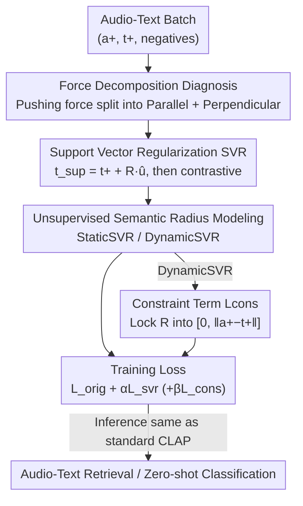

# SupCLAP: Controlling Optimization Trajectory Drift in Audio-Text Contrastive Learning with Support Vector Regularization

**Conference**: ICLR 2026  
**OpenReview**: [https://openreview.net/forum?id=S1CW6PLsqS](https://openreview.net/forum?id=S1CW6PLsqS)  
**Code**: None  
**Area**: Audio & Speech / Multimodal Contrastive Learning  
**Keywords**: CLAP, Contrastive Learning, Optimization Trajectory Drift, Support Vector Regularization, Semantic Radius

## TL;DR
This paper decomposes the gradient of contrastive learning into "pulling force" and "pushing force". It discovers that the component of the negative sample pushing force perpendicular to the pulling force contains rich information but is uncontrolled, leading to optimization trajectory drift. Therefore, it proposes Support Vector Regularization (SVR): constructing a text support vector shifted towards the positive sample and using a semantic radius $R$ to adaptively suppress this perpendicular component. This improves InfoNCE / SigLIP on audio-text retrieval and zero-shot classification without adding any inference overhead.

## Background & Motivation
**Background**: CLAP (Contrastive Language-Audio Pretraining) learns a unified audio-text embedding space by pulling paired audio-text samples closer and pushing unpaired ones further apart, serving as the foundation for cross-modal retrieval and multimodal large models. Mainstream training objectives are based on the symmetric contrastive loss of InfoNCE.

**Limitations of Prior Work**: Representations trained with standard InfoNCE are far from ideal—exhibiting poor temporal alignment of audio events and inconsistent multilingual alignment. The authors shift the perspective to the optimization process itself and identify a widely overlooked phenomenon: **optimization trajectory drift**. By viewing contrastive learning as a game between the positive sample "pulling force" $F_\text{pull}$ and the negative sample "pushing force" $F_\text{push}$, the authors prove that the pushing force is generally **not collinear with the pulling force**. Thus, the pushing force can be decomposed into a parallel component $f_{\|}$ and a perpendicular component $f_{\perp}$. The parallel component only affects convergence speed and carries redundant information with the pulling force; however, the perpendicular component carries unique complementary information from negative samples, but its magnitude is **unconstrained**.

**Key Challenge**: This perpendicular component is a double-edged sword—it is useful in direction (extra signals to distinguish negative samples), but if its magnitude is out of control, it continuously pushes text embeddings away from the "ideal linear trajectory". The authors further split it into two layers: **Global Perpendicular Component** (even when considering negative samples of the entire dataset, the resultant force direction will almost never align with the pulling force of a positive sample, causing systematic drift) and **Local Perpendicular Component** (mini-batches only sample random subsets of negative samples, causing direction and magnitude to fluctuate violently at each step, resulting in high-frequency oscillation). The superposition of both slows down convergence and limits final alignment accuracy.

**Goal**: To **suppress** the uncontrolled magnitude of the perpendicular component while **retaining** its information, without introducing extra training data or inference overhead.

**Key Insight**: Since the problem lies in the "uncontrollable magnitude of the perpendicular component," can an auxiliary regularization term be used to directionally scale only this perpendicular component without affecting the parallel component?

**Core Idea**: Construct a **text support vector** $t_\text{sup}$ that shifts the original text embedding along the "pulling direction" by a semantic radius $R$. By performing another contrastive task between it and the audio, a controllable contraction factor $(1-\frac{R}{\|a^+-t^+\|})$ is multiplied to the perpendicular component in the gradient, achieving "retaining information while suppressing drift."

## Method

### Overall Architecture
SupCLAP adds a support vector regularization term $L_\text{svr}$ on top of the standard symmetric CLAP training objective $L_\text{orig}$ (sum of text-to-audio and audio-to-text InfoNCE terms), making the total objective $L_\text{SupCLAP}=L_\text{orig}+\alpha L_\text{svr}$. The SVR approach involves: taking the unit pulling direction $\hat{u}=\frac{a^+-t^+}{\|a^+-t^+\|}$, shifting the text embedding along it to obtain $t_\text{sup}=t^+ + R\hat{u}$, and then calculating the contrastive loss between $t_\text{sup}$ and the audio embeddings. The gradient of this term precisely scales only the perpendicular component of the negative pushing force, thereby controlling drift. The success of the entire SVR depends on the semantic radius $R$. Since the dataset provides no supervision signal for $R$, the authors model it as an unsupervised problem, providing two versions: StaticSVR (a global learnable scalar) and DynamicSVR (per-sample prediction), with a constraint term for DynamicSVR to ensure $R$ falls within a reasonable range. **The inference stage is exactly the same as standard CLAP**—relying only on sorting audio-text embedding similarity without calculating any support vectors, resulting in zero extra inference overhead.

### Key Designs

**1. Force Decomposition Diagnosis: Attributing "Poor Training" to the Perpendicular Pushing Component**

This is the diagnostic starting point of the paper and the basis for all subsequent designs. For text-to-audio InfoNCE, the gradient with respect to text embedding $t^+$ is $\nabla_t L_\text{orig}=\frac{1}{\tau}\big[(P^+-1)a^+ + \sum_j P^-_j a^-_j\big]$, where $P^+,P^-_j$ are softmax probabilities. The first term $F_\text{pull}=\frac{1}{\tau}(P^+-1)a^+$ is equivalent to pulling $t^+$ towards the positive audio $a^+$ under gradient descent since $P^+-1<0$; the second term $F_\text{push}=\frac{1}{\tau}\sum_j P^-_j a^-_j$ is the weighted average of all negative samples, pushing $t^+$ away. The key observation is: the pushing force of a single negative sample $f_{\text{push},j}=\frac{P^-_j}{\tau}a^-_j$ can be decomposed along the pulling direction $\hat{u}$ into parallel $f_{\|,j}=(f_{\text{push},j}\cdot\hat{u})\hat{u}$ and perpendicular $f_{\perp,j}=f_{\push,j}(I-\hat{u}\hat{u}^\top)$ parts. The parallel component aligns with the pulling force, only changing convergence speed without adding new information. **The perpendicular component is the carrier of unique negative sample information, but its magnitude is uncontrolled**, causing systematic drift globally and high-frequency oscillation locally (batch randomness). Researchers measured drift using "cosine similarity between the update vector and pulling vector" (higher similarity means less drift), confirming that InfoNCE indeed suffers from significant drift. By accurately targeting the "uncontrolled magnitude of the perpendicular component," the regularization remains focused.

**2. Support Vector Regularization SVR: Directionally Shrinking the Perpendicular Component with an Auxiliary Contrastive Term**

Addressing the pain points diagnosed in Design 1, SVR does not touch the pulling force or crudely remove the pushing force. Instead, it constructs a text support vector $t_\text{sup}=t^+ + R\hat{u}$—moving the text embedding towards the positive audio along the pulling direction by $R$ and adding an auxiliary contrastive loss $L_\text{svr}=-\log\frac{\exp(s(t_\text{sup},a^+))}{\sum_j \exp(s(t_\text{sup},a^-_j))}$. The total loss is $L_\text{SupCLAP}=L_\text{orig}+\alpha L_\text{svr}$. Why does it work directionally? The authors derive that after adding SVR, the parallel component of the $j$-th negative pushing force becomes $\big(\frac{P^-_j}{\tau}+\alpha\frac{P^-_{\text{sup},j}}{\tau}\big)a^-_{\|,j}$, which is preserved, while the perpendicular component becomes

$$F_{\perp,\text{push},j}=\Big(\frac{P^-_j}{\tau}+\alpha\frac{P^-_{\text{sup},j}}{\tau}\Big)\Big(1-\frac{R}{\|a^+-t^+\|}\Big)a^-_{\perp,j}.$$

The key is this **contraction factor** $(1-\frac{R}{\|a^+-t^+\|})$ **which only multiplies the perpendicular component**: the parallel component is not scaled, preserving information, while the perpendicular component is selectively suppressed based on $R$. Thus, SVR achieves a controllable trade-off between "retaining supplementary negative information" and "suppressing trajectory drift" rather than a one-size-fits-all approach. Experimentally, the bilateral version (adding to both a2t and t2a) is better than the unilateral version.

**3. Unsupervised Semantic Radius Modeling: StaticSVR for Global Drift, DynamicSVR for Local Drift**

The strength of the contraction factor depends entirely on $R$, but the dataset has no ground truth for $R$. Thus, the authors treat it as an unsupervised modeling problem, offering two paths corresponding to the two levels of drift in Design 1. **StaticSVR** models $R$ as a globally shared learnable scalar, optimized alongside other parameters to minimize $L_\text{SupCLAP}$—it targets suppressing the **global** perpendicular component. Its advantage is simplicity and stability; its disadvantage is that a "constant radius for all samples" is too ideal and cannot adapt to the varying alignment difficulties of different audio-text pairs. **DynamicSVR** uses a lightweight 3-layer MLP predictor $f_\theta:\mathbb{R}^N\to\mathbb{R}$, taking the local similarity vector $S=[s(t^+,a^+),s(t^+,a^-_1),\dots,s(t^+,a^-_{N-1})]$ as input and outputting an instance-level radius $R=f_\theta(S)$—it targets suppressing the **local** perpendicular component because $S$ characterizes the local geometry of the current mini-batch (e.g., high similarity with a negative sample implies a high drift risk), allowing the predictor to provide a customized radius. The cost is that its effectiveness highly depends on the prediction accuracy of $R$; it may perform worse than the simpler StaticSVR if predictions are inaccurate under noisy data or weak pretrained models.

**4. Constraint Term $L_\text{cons}$ for DynamicSVR: Locking the Predicted Radius within a Reasonable Interval**

Without constraints, the DynamicSVR predictor might fail in two ways: first, **excessive magnitude**, where $R\gg\|a^+-t^+\|$ makes the contraction factor negative, reversing the direction of the perpendicular component and destroying negative sample information, causing instability; second, **opposite direction**, where a predicted $R<0$ makes the factor greater than 1, amplifying the perpendicular component and exacerbating drift. The authors use a hinge-style constraint term to block both ends:

$$L_\text{cons}=\mathrm{ReLU}(R-\|a^+-t^+\|)+\mathrm{ReLU}(-R).$$

The first term penalizes $R$ exceeding $\|a^+-t^+\|$ to prevent overshoot, and the second term penalizes $R<0$ to encourage the radius to align with the pulling force. The total loss becomes $L_\text{orig}+\alpha L_\text{svr}+\beta L_\text{cons}$, with a default $\beta=0.01$ to provide a slight penalty, confining $R$ to the reasonable interval $[0,\|a^+-t^+\|]$ without overshadowing the main objective. Ablations show that adding the constraint makes DynamicSVR radius modeling more accurate and further improves performance.

### Loss & Training
The final objective is $L_\text{SupCLAP-Cons}=L_\text{orig}+\alpha L_\text{svr}+\beta L_\text{cons}$, with defaults $\alpha=1$ and $\beta=0.01$. The audio encoder uses CED-Base, and the text encoder uses the multilingual SONAR-TE. The radius predictor is a 3-layer MLP. All models are initialized from pretrained weights and trained for 10 epochs on a single H800 using Adam with a learning rate of $5\times10^{-5}$, batch size 24, and temperature $\tau=0.07$. Checkpoints with the highest recall on the test set are selected for evaluation. SVR requires no extra data and zero inference overhead, with negligible training overhead.

## Key Experimental Results

### Main Results
Monolingual audio-text retrieval (R@1 / R@10) on AudioCaps and Clotho. SVR improves both InfoNCE and SigLIP baselines, with bi-DynamicSVR being the strongest:

| Dataset/Direction | Metric | InfoNCE | +bi-StaticSVR | +bi-DynamicSVR |
|------|------|------|------|------|
| AudioCaps T2A | R@1 | 41.87 | 43.89 | **44.16** |
| AudioCaps A2T | R@1 | 56.72 | 57.77 | **59.66** |
| AudioCaps A2T | R@10 | 92.33 | 92.75 | **93.49** |
| Clotho T2A | R@1 | 18.67 | 19.50 | **19.75** |
| Clotho A2T | R@1 | 22.61 | 24.93 | **25.31** |

It is equally effective for the SigLIP baseline (AudioCaps T2A R@1: 36.74 → 42.54 → 43.09). For zero-shot classification, bi-DynamicSVR also performs best: ESC-50 89.6→92.1, US8K 81.63→83.74, VGGSound 24.57→25.11. The authors also note that InfoNCE generally outperforms SigLIP because the softmax competition mechanism provides stronger discriminative gradients in audio data containing many hard negatives.

### Ablation Study
Deconstructing SVR components on AudioCaps monolingual T2A / A2T retrieval (R@1):

| ID | Configuration | T2A R@1 | A2T R@1 | Description |
|------|------|------|------|------|
| 0 | InfoNCE | 41.87 | 56.72 | Baseline |
| 1 | bi-DynamicSVR | **44.16** | **59.66** | Full model |
| 2 | bi-DynamicSVR w/o constraints | 44.01 | 59.24 | Drop with no constraints |
| 3 | uni-DynamicSVR | 43.63 | 58.51 | Unilateral |
| 5 | bi-StaticSVR | 43.89 | 57.77 | Global radius |
| 6 | uni-StaticSVR | 43.28 | 57.56 | Unilateral + Global |

### Key Findings
- **Bilateral > Unilateral, Dynamic > Static, Constrained > Unconstrained**: Overlaying the three dimensions, bi-DynamicSVR (with constraints) is optimal. Unilateral SVR already surpasses the baseline, and bilateral further amplifies gains.
- **Constraints are indeed useful**: Removing $L_\text{cons}$ (ID 2) leads to a drop in both T2A/A2T compared to the full model, confirming that constraints improve radius prediction accuracy.
- **Semantic radius decreases as training progresses**: Both StaticSVR and DynamicSVR radii $R$ decrease across epochs, indicating that unsupervised modeling learns a trade-off between "suppressing the perpendicular component" and "retaining negative information". The StaticSVR curve is smoother (global stability), while DynamicSVR fluctuates more due to per-batch local modeling.
- **Hyperparameters & Overhead**: $\alpha=1$ is optimal. SVR improves performance across different batch sizes. Extra training time and memory overhead are negligible, with zero inference overhead.

## Highlights & Insights
- **Focus on optimization dynamics rather than data/architecture**: While most CLAP improvements focus on data scaling or changing encoders, this work returns to the gradients, attributing "poor training" to a resolvable geometric quantity—the perpendicular pushing component. The diagnosis is clear and the solution precise.
- **Controllable trade-off of "Retaining Information + Suppressing Drift"**: The contraction factor $(1-\frac{R}{\|a^+-t^+\|})$ acts only on the perpendicular component while leaving the parallel component intact. This "directional scaling" is much more elegant than simply weakening the pushing force or adding noise, and its physical meaning is explicit.
- **Clever construction of support vectors**: Shifting the text embedding by $R$ along the pulling direction for contrastive comparison is equivalent to introducing a tunable contraction at the gradient level at almost zero cost (since $t_\text{sup}$ is not calculated at inference). This "regularized at training, transparent at inference" design is well worth porting to other contrastive learning scenarios (e.g., CLIP image-text).
- **Two layers of drift (Global/Local) correspond to two radius modeling approaches**: After layering the problem, StaticSVR addresses global drift while DynamicSVR addresses local drift. Theory and method align one-to-one, ensuring logical consistency.

## Limitations & Future Work
- **Relatively modest gains**: Most metric improvements are in the 1-3 point range, and comprehensive comparisons with specialized methods like Cacophony in the same training setting are missing (in the main table, Cacophony's A2T R@1 remains higher than several configurations in this paper). SVR acts more as a general plug-and-play regularizer than a SOTA-beating tool.
- **DynamicSVR depends on prediction accuracy**: The authors admit that DynamicSVR may perform worse than StaticSVR under noisy data or weak pretrained models; the robustness of the predictor is a potential concern.
- **Theory based on several simplifying assumptions**: The derivation assumes all embeddings are L2 normalized and uses scaled cosine similarity. The perpendicular component analysis is also expanded under unilateral SVR. Actual multimodal distributions are more complex, and the tightness of the conclusions needs broader validation.
- **Only validated on Audio-Text**: While the method is modality-agnostic, whether it can similarly improve performance in large-scale contrastive learning such as Image-Text (CLIP) or Video-Text has not yet been demonstrated, which is a natural direction for extension.

## Related Work & Insights
- **vs InfoNCE**: This paper does not replace InfoNCE but adds SVR regularization to it. InfoNCE provides the primary alignment signal, while SVR specifically addresses the perpendicular component drift it leaves behind, making the two complementary.
- **vs SigLIP**: SigLIP uses a sigmoid pairwise loss to avoid softmax normalization. Experiments in this paper show that on audio data containing many hard negatives, InfoNCE's softmax competition mechanism is more discriminative. SVR benefits both, indicating that drift is a common issue in contrastive learning rather than specific to one loss.
- **vs Standard CLAP / Big Data Routes**: Methods like CompA-CLAP, LAION-CLAP, and Cacophony mostly improve via larger data or stronger encoders. This paper takes an orthogonal route of "optimization process regularization," requiring zero extra data and zero inference overhead, allowing it to be superimposed with those methods.

## Rating
- Novelty: ⭐⭐⭐⭐ Proposing "optimization trajectory drift" from a force decomposition perspective and providing an analytical contraction factor is novel and mechanistically clear.
- Experimental Thoroughness: ⭐⭐⭐⭐ Covers retrieval + classification, monolingual + multilingual, and complete ablations of bilateral/dynamic/constraints, but the comparison with the strongest specialized methods in identical settings is slightly lacking.
- Writing Quality: ⭐⭐⭐⭐ Theoretical derivation and motivation are connected smoothly, and the global/local layering is well-explained.
- Value: ⭐⭐⭐⭐ A plug-and-play general contrastive learning regularizer with zero inference overhead, easily transferable to scenarios like CLIP with high practical value.

<!-- RELATED:START -->

## Related Papers

- [\[ECCV 2024\] CoLeaF: A Contrastive-Collaborative Learning Framework for Weakly Supervised Audio-Visual Video Parsing](../../ECCV2024/audio_speech/coleaf_a_contrastive-collaborative_learning_framework_for_weakly_supervised_audi.md)
- [\[ICLR 2026\] PACE: Pretrained Audio Continual Learning](pace_pretrained_audio_continual_learning.md)
- [\[ICLR 2026\] AVERE: Improving Audiovisual Emotion Reasoning with Preference Optimization](avere_improving_audiovisual_emotion_reasoning_with_preference_optimization.md)
- [\[ACL 2026\] Data-efficient Targeted Token-level Preference Optimization for LLM-based Text-to-Speech](../../ACL2026/audio_speech/data-efficient_targeted_token-level_preference_optimization_for_llm-based_text-t.md)
- [\[ICLR 2026\] Physics-Informed Audio-Geometry-Grid Representation Learning for Universal Sound Source Localization](physics-informed_audio-geometry-grid_representation_learning_for_universal_sound.md)

<!-- RELATED:END -->
