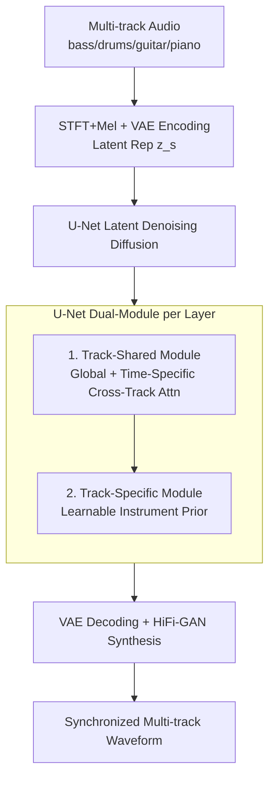

# SyncTrack: Rhythmic Stability and Synchronization in Multi-Track Music Generation

**Conference**: ICLR 2026  
**arXiv**: [2603.01101](https://arxiv.org/abs/2603.01101)  
**Code**: [https://synctrack-v1.github.io](https://synctrack-v1.github.io)  
**Area**: Music Generation / Audio  
**Keywords**: Multi-track music generation, rhythmic synchronization, diffusion models, cross-track attention, evaluation metrics

## TL;DR
SyncTrack is proposed with a unified architecture featuring track-shared modules (dual cross-track attention to ensure rhythmic synchronization) and track-specific modules (learnable instrument priors to preserve timbre differences). Together with three new rhythmic consistency evaluation metrics (IRS/CBS/CBD), it significantly improves multi-track music generation quality (FAD from 6.55 → 1.26, subjective MOS 3.42 vs. 1.57).

## Background & Motivation

**Background**: Multi-track music generation allows independent control over instrument tracks (mixing, re-arrangement). Methods like MSDM and MSG-LD use diffusion models to learn the joint distribution of multiple tracks.

**Limitations of Prior Work**: Existing methods treat multi-track generation as multivariate time series or video generation, overemphasizing inter-track differences while ignoring shared rhythms—leading to rhythmic instability and inter-track desynchronization. The FAD of MSDM is as high as 6.55, with a subjective score of only 1.57/5.0.

**Key Challenge**: Rhythmic information is shared across tracks (all instruments follow the same beat), but timbre information is track-independent (bass is deep, piano is bright)—these two types of information need to be processed separately.

**Core Idea**: track-shared modules (shared rhythm) + track-specific modules (independent timbre) + new evaluation metrics.

## Method

### Overall Architecture
SyncTrack is built on long-latent space diffusion models: multi-track audio is first encoded via STFT+Mel and a VAE into latent representations $z^s \in \mathbb{R}^{C \times T \times F}$. A U-Net performs denoising diffusion in the latent space, followed by VAE decoding and HiFi-GAN waveform synthesis. Four tracks (bass, drums, guitar, piano) are generated in parallel. The key lies in splitting each layer of the U-Net's input/mid/output blocks into two types of modules: track-shared modules align all tracks to the same rhythm, while track-specific modules preserve unique instrument timbres. Additionally, the authors propose three rhythmic consistency metrics (IRS/CBS/CBD) to quantify "rhythmic stability and inter-track alignment," dimensions that FAD fails to measure.

### Key Designs

**1. Track-Shared Modules: Enforcing Rhythmic Alignment via Two Complementary Cross-Track Attentions**

The core pain point of multi-track generation is beat drift and inter-track desynchronization during independent denoising, whereas in reality, all instruments follow the same beat. In addition to ResBlocks and intra-track attention, SyncTrack adds two cross-track attention paths to each shared layer, handling synchronization at different time scales. Global cross-track attention allows each time-frequency element $z_{t,f}^s$ to attend to all time-frequency positions across all tracks, exchanging rhythmic information across the entire musical segment to maintain a stable global beat framework. Time-specific cross-track attention constrains attention to the same time step $t$, attending only across the frequency dimensions of all tracks to achieve fine-grained, beat-by-beat alignment and chord synchronization. The former prevents "global rhythm drift," while the latter ensures "each beat hits together."

**2. Track-Specific Modules: Preserving Timbre Differences via Learnable Instrument Priors**

While shared attention synchronizes rhythm, it may blur track-specific timbre and frequency range information (e.g., deep bass vs. bright piano). To address this, track-specific modules inject a learnable instrument prior into each track: an instrument's one-hot ID passes through positional encoding and a two-layer MLP, and the resulting instrument embedding is added directly to the ResBlock output of that track. This extremely lightweight branch allows the network to differentiate spectral features based on instrument identity while sharing rhythm, avoiding "identical-sounding" instrument generation.

**3. Three Rhythmic Consistency Metrics: Addressing Missing Temporal Dimensions in FAD**

FAD only compares the overall fidelity of audio distributions and fails to capture "rhythmic stability or inter-track alignment." Thus, the authors designed three complementary metrics based on beat detection. IRS (Inner-track Rhythmic Stability) calculates the standard deviation of adjacent beat intervals within a single track and averages it across tracks to characterize rhythmic stability (lower is better). CBS (Cross-track Beat Synchronization) uses a sliding tolerance window to count the proportion of beat points across tracks that fall within the tolerance (higher is better). CBD (Cross-track Beat Dispersion) averages the normalized errors of cross-track beat points (lower is better). These three metrics quantify rhythmic quality from the perspectives of "single-track stability," "cross-track alignment," and "cross-track dispersion," showing a high correlation with human subjective preferences.

### Loss & Training
Training follows the standard DDPM noise prediction objective $\|\epsilon - \epsilon_\theta(\{z_l^s\}, l)\|^2$, where $l$ denotes the track identity. Weights are initialized from a pre-trained MusicLDM to leverage existing audio generation knowledge. The model is trained for 320K steps with a batch size of 16, using 200-step DDIM sampling for inference.

## Key Experimental Results

### Main Results

| Method | FAD↓ | IRS↓ | CBS↑ | CBD↓ |
|------|------|------|------|------|
| MSDM | 6.55 | 0.167 | 0.428 | 0.156 |
| MSG-LD | 1.31 | 0.148 | 0.434 | 0.147 |
| **Ours** | **1.26** | **0.125** | **0.487** | **0.120** |
| Ground Truth | - | 0.049 | 0.592 | 0.079 |

Ours is closest to Ground Truth across all metrics. Improvements in IRS and CBS particularly indicate a significant enhancement in rhythmic consistency.

### Ablation Study

| Configuration | FAD↓ | IRS↓ | CBS↑ | Description |
|------|------|------|------|------|
| Full SyncTrack | 1.26 | 0.125 | 0.487 | Complete |
| w/o Global cross-track attn | ~1.8 | ~0.14 | ~0.45 | Global rhythm degradation |
| w/o Time-specific cross-track attn | ~1.6 | ~0.13 | ~0.46 | Fine-grained alignment degradation |
| w/o Instrument prior | ~1.4 | ~0.13 | ~0.47 | Reduced timbre distinctiveness |

### Key Findings
- FAD dropped from 6.55 (MSDM) to 1.26 (-80%), and from 1.31 (MSG-LD) to 1.26 (-3.8%).
- Per-track FAD showed the largest improvement in Piano (MSG-LD 2.04 → 1.11, -45.6%), due to its wide range and complex spectra.
- IRS decreased from 0.148 (MSG-LD) to 0.125, and CBS increased from 0.434 to 0.487, showing significantly improved rhythmic consistency.
- In subjective evaluation, Ours' mix MOS was 3.42 vs. 1.57 (MSG-LD) vs. 4.48 (GT).
- Ablation: Global cross-track attention contributes most to global rhythmic stability, while time-specific attention contributes most to beat-by-beat synchronization.
- The proposed three metrics are highly correlated with human preference—effectively quantifying temporal structures that FAD cannot capture.

## Highlights & Insights
- The design philosophy of **separating shared and specific modules** can be extended to other multi-channel generation tasks wherever "shared attributes + unique attributes" exist.
- **Rhythmic evaluation metrics fill a gap**—IRS/CBS/CBD provide complementary dimensions to FAD, which fails to capture temporal structures.
- Clear division of labor in dual cross-track attention: Global → beat framework, Time-specific → beat-by-beat synchronization.
- Learnable instrument priors require only one-hot + positional encoding + MLP, making them extremely lightweight yet effective in defining timbre.
- The massive gap in subjective evaluation (3.42 vs. 1.57) highlights that rhythmic synchronization is a core factor in human auditory perception.
- Initializing from MusicLDM pre-training effectively utilizes existing audio generation knowledge and accelerates convergence.

## Limitations & Future Work
- Only validated on Slakh2100 (4 tracks: bass/drums/guitar/piano); more complex arrangements (orchestra, choir) and higher track counts are untested.
- Conditional generation (text/melody guidance) has not been explored; currently focused on unconditional generation.
- Evaluation metrics (IRS/CBS/CBD) rely on beat detection algorithms; their reliability is influenced by detection accuracy.
- The computational complexity of global cross-track attention in the track-shared module may become a bottleneck as the number of tracks increases.
- The sampling rate of generated audio (16kHz) is significantly lower than commercial standards (44.1kHz); performance at higher sampling rates remains to be verified.

## Related Work & Insights
- **vs. MSDM**: MSDM uses a unified model for joint distribution without separating shared/specific information; the FAD reduction from 6.55 to 1.26 represents a major leap.
- **vs. MSG-LD**: While stronger, MSG-LD still neglects rhythmic synchronization; SyncTrack outperforms it across IRS/CBS/CBD.
- **vs. StemGen/JEN-1 Composer**: These use Transformers/LDMs but lack explicit cross-track synchronization mechanisms.
- **Insight**: The principle of separating shared and specific modules applies to all multi-channel generation tasks, such as multi-speaker speech generation and multi-instrument arrangement.

## Rating
- Novelty: ⭐⭐⭐⭐ Separation of shared/specific modules + Dual cross-track attention + New rhythmic metrics.
- Experimental Thoroughness: ⭐⭐⭐⭐ Objective + Subjective evaluation + Ablation; comprehensive metric design.
- Writing Quality: ⭐⭐⭐⭐ Clear motivation and intuitive diagrams.
- Value: ⭐⭐⭐⭐ Fills a gap in multi-track rhythmic evaluation; design principles are generalizable.

<!-- RELATED:START -->

## Related Papers

- [\[AAAI 2026\] Diff-V2M: A Hierarchical Conditional Diffusion Model with Explicit Rhythmic Modeling for Video-to-Music Generation](../../AAAI2026/audio_speech/diff-v2m_a_hierarchical_conditional_diffusion_model_with_explicit_rhythmic_model.md)
- [\[ACL 2026\] Jamendo-MT-QA: A Benchmark for Multi-Track Comparative Music Question Answering](../../ACL2026/audio_speech/jamendo-mt-qa_a_benchmark_for_multi-track_comparative_music_question_answering.md)
- [\[ICLR 2026\] Steering Autoregressive Music Generation with Recursive Feature Machines](steering_autoregressive_music_generation_with_recursive_feature_machines.md)
- [\[NeurIPS 2025\] Unifying Symbolic Music Arrangement: Track-Aware Reconstruction and Structured Tokenization](../../NeurIPS2025/audio_speech/unifying_symbolic_music_arrangement_track-aware_reconstruction_and_structured_to.md)
- [\[ICLR 2026\] YuE: Scaling Open Foundation Models for Long-Form Music Generation](yue_scaling_open_foundation_models_for_long-form_music_generation.md)

<!-- RELATED:END -->
