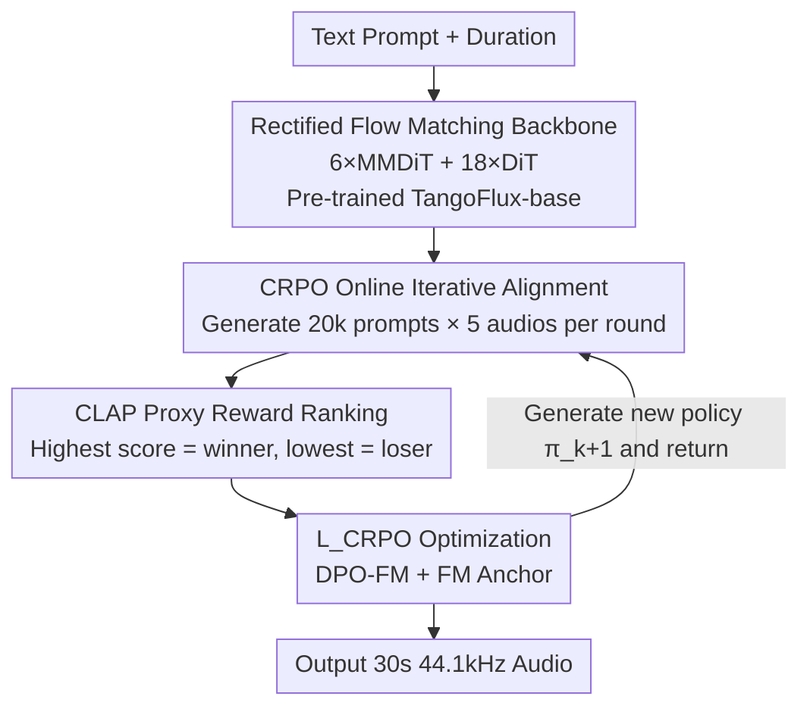

# TangoFlux: Super-Fast and Faithful Text-to-Audio Generation with Flow Matching and CLAP-Ranked Preference Optimization

**Conference**: ICLR 2026  
**OpenReview**: [https://openreview.net/forum?id=qgNs5NmQB7](https://openreview.net/forum?id=qgNs5NmQB7)  
**Code**: https://tangoflux.github.io/ (Available, including generation samples)  
**Area**: Audio Generation / Text-to-Audio / Flow Matching / Preference Optimization  
**Keywords**: Text-to-Audio, Rectified Flow Matching, Preference Optimization, CLAP, Online Self-Iterative Alignment

## TL;DR
TangoFlux utilizes a 515M parameter rectified flow matching model to generate 30-second 44.1kHz audio in just 3.7 seconds on an A40. It proposes CRPO—using CLAP as a proxy reward to generate self-improving preference pairs online—enabling this compact model to achieve SOTA across objective and subjective text-to-audio metrics.

## Background & Motivation

**Background**: Text-to-audio (TTA) generation has progressed rapidly, allowing direct synthesis of sound effects, music, and podcasts from text descriptions. Prevailing approaches are largely based on diffusion models (e.g., Tango, AudioLDM 2, Stable Audio Open), which restore audio from noise via multi-step denoising.

**Limitations of Prior Work**: Diffusion-based TTA faces two primary issues. First, it is **slow**—producing high-quality audio often requires hundreds of denoising steps; AudioLDM 2-large takes 24.8 seconds per inference, and Tango 2 takes 22.8 seconds, incurring high computational costs. Second, it is **unfaithful**—models frequently fail to capture details in complex prompts, particularly those describing multiple events or temporal relations (e.g., "thunder after birds chirping"), leading to missing events, incorrect ordering, or "hallucinated" audio not present in the prompt.

**Key Challenge**: To "align" models with human preferences (generating more faithful audio), preference optimization like RLHF or DPO is a natural choice. However, TTA suffers from a structural gap: **constructing preference pairs is difficult**. Unlike LLM alignment, which benefits from reward models or verifiable answers, audio lacks reliable reward models. Manual annotation (e.g., BATON's binary labeling) is too expensive to scale, and feedback from audio-language models is often too noisy for reliable preference pairs.

**Goal**: (1) Develop a fast, compact, and faithful open-source TTA model; (2) Address the bottleneck of preference pair construction for alignment.

**Key Insight**: The authors observe that CLAP, a joint text-audio embedding model, can calculate the cosine similarity between text and audio—which serves as a suitable proxy reward for "description faithfulness." Since no ready-made reward model exists, the model can **generate its own candidate audio, rank them using CLAP, and construct its own preference pairs**, iterating like a self-improvement algorithm.

**Core Idea**: Replace multi-step diffusion with rectified flow matching for speed, and use CLAP-Ranked Preference Optimization (CRPO) for self-iterative alignment to improve faithfulness.

## Method

### Overall Architecture

The backbone of TangoFlux is a FluxTransformer (6 MMDiT blocks + 18 DiT blocks). It learns a **rectified flow trajectory** from Gaussian noise to target audio latent representations within the latent space of a frozen Stable Audio Open VAE. Conditions include FLAN-T5 text encodings and a duration embedding (controlling the proportion of actual audio versus silence within the fixed 30-second latent space).

Training proceeds in two stages. **Stage 1: Pre-training**: Trained on WavCaps + AudioCaps using a flow matching loss $\mathcal{L}_{\text{FM}}$ to produce TangoFlux-base. **Stage 2: CRPO Online Iterative Alignment**: Treating the base model as the initial policy $\pi_0$, a three-step cycle is repeated—sampling generation, CLAP-ranking to construct preference pairs, and fine-tuning $\pi_k$ into $\pi_{k+1}$ using $\mathcal{L}_{\text{CRPO}}$. Crucially, new synthetic data is **regenerated online** at the start of each iteration rather than reusing static data.

### Key Designs

**1. Rectified Flow Matching + Hybrid MMDiT/DiT Backbone: Achieving Speed and Faithfulness**

Addressing the slowness and noise-schedule sensitivity of diffusion TTA, TangoFlux adopts **rectified flow**. Flow matching learns a time-varying vector field mapping a simple prior (Gaussian) to a complex target distribution. Rectified flow specifically takes the **straight-line path** (shortest path) from noise to data. At inference, it starts from $\tilde{x}_0\sim\mathcal{N}(0,I)$ and integrates the predicted velocity field $u(\cdot;\theta)$ using an Euler solver. This straight path significantly reduces the required steps; TangoFlux generates 30s of audio in 50 steps (3.7s), whereas diffusion baselines typically require hundreds of steps and over 20 seconds.

The backbone uses a **hybrid architecture** inspired by the success of FLUX in image generation: while MMDiT (Multi-modal Diffusion Transformer) blocks are powerful, simplifying some into single-stream DiT blocks improves scalability and efficiency. It uses 6 MMDiT + 18 DiT blocks (515M parameters)—significantly smaller yet more powerful than Tango 2 (866M) or AudioX (1.1B).

**2. CRPO Online Iterative Alignment: Self-Correcting with Self-Generated Data**

This directly addresses the difficulty of creating audio preference pairs. Existing methods (Audio-Alpaca, BATON) rely on **static** datasets, which limit alignment generalization. CRPO adopts a **dynamic online** strategy: at each iteration, the current policy $\pi_k$ generates fresh synthetic preference pairs. Specifically, 20k prompts are sampled from a prompt bank, 5 audios are generated per prompt, and CLAP is used to rank them to form preference pairs $\mathcal{D}_k=\{(x_i^w, x_i^l, y_i)\}$. 

This cycle of "generate training data → align → regenerate" is a **self-improvement algorithm** inspired by STaR and Self-Rewarding LLMs. Experiments (Figure 2) show online generation is critical: repeating updates on the same static data leads to **reward overoptimization**, where CLAPscore drops and KLpasst spikes after 2 rounds. Online updates allow the CLAPscore to improve steadily through 4 iterations.

**3. CLAP as Proxy Reward Model: Scaling Alignment without Human Labels**

In the absence of dedicated audio reward models, CLAP’s text-audio similarity serves as the reward signal. Similarity measures how well the audio matches the description. CRPO uses CLAP to automate the identification of the winner $x_i^w$ and loser $x_i^l$ among candidate generations. This step replaces expensive human effort with a zero-cost, scalable automated ranking, enabling the self-iterative loop.

**4. $\mathcal{L}_{\text{CRPO}}$ Loss: Preventing Quality Drift with the FM Anchor**

Optimizing DPO on rectified flow can lead to cases where both winner and loser likelihoods decrease, provided the margin between them grows. To prevent the absolute quality of the winner from degrading, CRPO adds the **flow matching loss of the winner** as an anchor:

$$\mathcal{L}_{\text{CRPO}} := \mathcal{L}_{\text{DPO-FM}} + \mathcal{L}_{\text{FM}}$$

where $\mathcal{L}_{\text{FM}}$ is calculated on the winning audio. This prevents semantic and structural drift by "pinning" the model to high-quality winner attributes. Experiments demonstrate that this anchor stabilizes training and yields superior CLAPscores compared to using DPO alone.

### Loss & Training
Pre-training occurs on WavCaps for 80 epochs using AdamW ($5\times10^{-4}$). The alignment stage also uses AdamW (batch size 48, $10^{-5}$). Data includes ~400k WavCaps and ~45k AudioCaps. Audio less than 30s is padded with silence, while longer clips are center-cropped to 30s. Mono audio is duplicated to pseudo-stereo for the VAE. Inference uses a CFG scale of 4.5 and 50 steps.

## Key Experimental Results

### Main Results

Objective comparison on the AudioCaps test set (886 samples) shows TangoFlux exceeding all baselines across most metrics (except where Tango 2 performs better on 16kHz-based FDP, which the authors attribute to FDP downsampling TangoFlux’s high-frequency details):

| Model | Params | Duration | Steps | FDopenl3 ↓ | KLpasst ↓ | CLAPscore ↑ | IS ↑ | Inference Time (s) |
|--------|--------|------|------|-----------|-----------|-------------|------|-----------|
| AudioLDM 2-large | 712M | 10s | 200 | 108.3 | 1.81 | 0.419 | 7.9 | 24.8 |
| Tango 2 | 866M | 10s | 200 | 108.4 | 1.11 | 0.447 | 9.0 | 22.8 |
| Stable Audio Open | 1056M | 47s | 100 | 89.2 | 2.58 | 0.291 | 9.9 | 8.6 |
| AudioX | 1.1B | 10s | 250 | 77.6 | 1.56 | 0.380 | 10.0 | 9.6 |
| GenAU-Full-L | 1.25B | 10s | 100 | 93.2 | 1.37 | 0.447 | 12.0 | 5.3 |
| TangoFlux-base | 516M | 30s | 50 | 80.2 | 1.22 | 0.431 | 11.7 | **3.7** |
| **TangoFlux** | 516M | 30s | 50 | **75.1** | **1.15** | **0.480** | **12.2** | **3.7** |

Despite having half the parameters of top competitors, TangoFlux is the fastest and achieves the highest CLAPscore (faithfulness). In human evaluations (50 OOD prompts), it ranks first in both Overall (OVL) and Relevance (REL).

### Ablation Study

CRPO vs. Static Preference Datasets (aligned starting from TangoFlux-base):

| Config | FDopenl3 ↓ | CLAPscore ↑ | KLpasst ↓ | OVL Elo | REL Elo |
|------|-----------|-------------|-----------|---------|---------|
| TangoFlux (Multi-round CRPO) | **75.1** | **0.480** | **1.15** | **1546** | **1520** |
| TangoFlux-crpo-1 (Single-round) | 79.1 | 0.453 | 1.18 | 1446 | 1467 |
| TangoFlux-alpaca (Audio-Alpaca Static) | 80.0 | 0.448 | 1.20 | 1428 | 1366 |
| TangoFlux-baton (BATON Static) | 80.5 | 0.437 | 1.20 | 1253 | 1392 |
| TangoFlux-base (Baseline) | 80.2 | 0.431 | 1.22 | 1325 | 1253 |

### Key Findings
- **Online Iteration is Vital**: Reusing offline data causes performance to degrade after round 2 due to reward overoptimization. Online regeneration allows for continuous improvement up to round 4.
- **CRPO > Static Datasets**: Even a single round of CRPO outperforms Audio-Alpaca and BATON, demonstrating the benefit of the self-iterative process.
- **FM Anchor Effectiveness**: Adding the $\mathcal{L}_{\text{FM}}$ anchor to DPO-FM stabilizes training and ensures that the "winner" maintains absolute quality.

## Highlights & Insights
- **Adapting Self-Improvement for Audio**: CRPO successfully migrates the "Self-Rewarding" LLM framework to rectified flow matching, using CLAP to bridge the gap in reward modeling.
- **Efficiency Meets Performance**: 515M parameters and 3.7s inference significantly outperform 1B+ parameter diffusion models, highlighting the high efficiency of the rectified flow + preference alignment route.
- **Universal Trick**: The use of an FM anchor alongside DPO-FM to prevent quality drift is a valuable insight for any generative model alignment task.

## Limitations & Future Work
- **Dependency on CLAP**: The alignment quality is bounded by CLAP's ability to rank faithfulness correctly; any biases in CLAP will propagate to the model.
- **Online Generation Cost**: While inference is fast, generating and ranking 100k audios (20k prompts × 5) per iteration across multiple rounds adds significant training overhead.
- **Iterative Ceiling**: Gains diminish after approximately 4 rounds of CRPO, suggesting self-iteration has an upper bound.
- **Evaluation Scale**: Subjective human evaluations were conducted on a limited set of 50 prompts due to resource constraints.

## Related Work & Insights
- **vs. Tango 2**: Tango 2 uses a **static** preference set via prompt perturbation. TangoFlux's CRPO avoids the saturation/degradation of static data through **dynamic** online regeneration.
- **vs. BATON**: BATON relies on expensive human binary labels. CRPO replaces this with automated CLAP ranking, enabling zero-cost, scalable preference data.
- **vs. Diffusion TTA**: Unlike multi-step, scheduler-sensitive diffusion models, TangoFlux uses the straight paths of rectified flow to achieve high faithfulness and speed (50 steps/3.7s).

## Rating
- Novelty: ⭐⭐⭐⭐⭐ First application of CLAP proxy rewards and online self-iterative alignment to rectified flow audio generation.
- Experimental Thoroughness: ⭐⭐⭐⭐⭐ Comprehensive objective metrics, human evaluations, and extensive ablations.
- Writing Quality: ⭐⭐⭐⭐ Clear motivation and methodology with well-explained design choices.
- Value: ⭐⭐⭐⭐⭐ SOTA performance in a fast, open-source model; CRPO framework provides a blueprint for other generative alignment tasks.

<!-- RELATED:START -->

## Related Papers

- [\[ICLR 2026\] AVERE: Improving Audiovisual Emotion Reasoning with Preference Optimization](avere_improving_audiovisual_emotion_reasoning_with_preference_optimization.md)
- [\[CVPR 2026\] Hear What You See: Video-to-Audio Generation with Diffusion Transformer and Semantic-Temporal Alignment-Ranked Direct Preference Optimization](../../CVPR2026/audio_speech/hear_what_you_see_video-to-audio_generation_with_diffusion_transformer_and_seman.md)
- [\[ICLR 2026\] Flow2GAN: Hybrid Flow Matching and GAN with Multi-Resolution Network for Few-step High-Fidelity Audio Generation](flow2gan_hybrid_flow_matching_and_gan_with_multi-resolution_network_for_few-step.md)
- [\[ICLR 2026\] SupCLAP: Controlling Optimization Trajectory Drift in Audio-Text Contrastive Learning with Support Vector Regularization](supclap_controlling_optimization_trajectory_drift_in_audio-text_contrastive_lear.md)
- [\[ACL 2026\] ZipVoice-Dialog: Non-Autoregressive Spoken Dialogue Generation with Flow Matching](../../ACL2026/audio_speech/zipvoice-dialog_non-autoregressive_spoken_dialogue_generation_with_flow_matching.md)

<!-- RELATED:END -->
