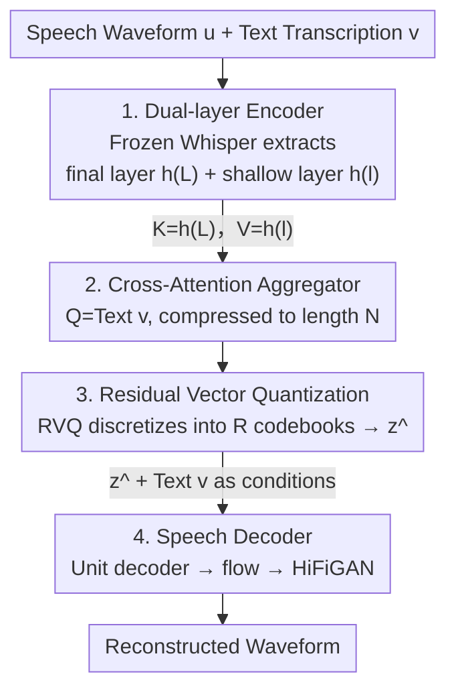

# TASTE: Text-Aligned Speech Tokenization and Embedding for Spoken Language Modeling

**Conference**: ICLR 2026  
**arXiv**: [2504.07053](https://arxiv.org/abs/2504.07053)  
**Code**: [GitHub](https://mtkresearch.github.io/TASTE-SpokenLM.github.io)  
**Area**: LLM Pre-training  
**Keywords**: speech tokenization, spoken language model, text-speech alignment, joint modeling, speech reconstruction

## TL;DR

Ours proposes TASTE (Text-Aligned Speech Tokenization and Embedding), which aligns speech tokens with text transcriptions through a cross-attention mechanism. This achieves high-quality speech reconstruction at an extremely low bitrate (~150 bps) and makes joint text-speech modeling direct and efficient. The 1.3B parameter TASLM outperforms 7B pre-trained SLMs.

## Background & Motivation

The Core Problem in Spoken Language Models (SLM) lies in speech tokenization. Existing methods face two major issues:

**Length Mismatch**: Speech token sequences are typically 10-50 times longer than corresponding text (e.g., 50 Hz vs ~3 Hz), making joint modeling difficult.

**Information Redundancy**: Existing speech tokens (SSL quantization or codec) are extracted independently of text, inevitably overlapping with information encoded by text tokens.

Common mitigation strategies include:
- Token interleaving (Spirit LM)
- Padding to synchronized sequence lengths (Moshi, MiniOmni)
- Additional alignment training stages

These solutions increase complexity and are essentially remedies applied after tokenization.

The Core Idea of TASTE is: **resolve the alignment problem during the tokenization stage**. Speech tokens should:
1. Avoid redundant encoding of textual content (already carried by text tokens) and focus on paralinguistic information.
2. Have a one-to-one correspondence with text tokens, enabling joint modeling without heuristic rules or explicit alignment.

## Method

### Overall Architecture

The Key Challenge TASTE addresses is the 10–50x length discrepancy between speech and text sequences, which hinders joint modeling. Unlike prior work that tries to align lengths post-tokenization, TASTE solves it at the source—ensuring the number of speech tokens matches the number of text tokens from the start.

The system consists of two parts. The first is a **text-aligned speech tokenizer**: a frozen Whisper encoder extracts "alignment clues" and "acoustic details" simultaneously. A **cross-attention aggregator** uses text transcriptions $\mathbf{v}$ as queries to compress high-frequency speech representations to text length. Finally, **Residual Vector Quantization (RVQ)** discretizes these continuous vectors into modelable tokens. The second part is a **speech decoder**: it reconstructs the waveform using the quantized speech tokens and text tokens. Since length alignment and the "text for semantics, speech for paralinguistics" division are fixed during tokenization, downstream joint LMs require no interleaving or padding tricks.

### Key Designs

**1. Dual-layer Encoder: Separating Alignment Clues and Acoustic Details**

The Key Insight is that single-layer outputs from an ASR encoder either favor alignment or acoustic detail. TASTE extracts hidden representations from two different depths simultaneously: the final layer $\mathbf{h}^{(L)}$ contains rich alignment clues (its attention weights can serve as soft word alignments), while the shallow layer $\mathbf{h}^{(l)}$ (from the first half) retains acoustic details necessary for high-quality reconstruction.

**2. Cross-Attention Aggregator: Text as Query for Natural Compression**

The Design Motivation is to eliminate the 10-50x length gap. The aggregator uses cross-attention where:

$$Q = \mathbf{v}\ (\text{text transcription}), \quad K = \mathbf{h}^{(L)}\ (\text{final layer}), \quad V = \mathbf{h}^{(l)}\ (\text{shallow layer})$$

This uses alignment clues from the final layer as Keys to guide attention, aggregating acoustic information from the shallow layer Values. The output $\mathbf{z}\in\mathbb{R}^{N\times d_z}$ naturally matches the text token length $N$, reducing speech sequences from ~50 Hz to ~3 Hz. K/V separation allows the alignment prior and acoustic content to serve distinct roles.

**3. Residual Vector Quantization: Discretizing Aligned Continuous Vectors**

Continuous vectors $\mathbf{z}$ are discretized via RVQ using $R$ codebooks to produce codewords and reconstructed vectors:

$$\mathbf{q}, \hat{\mathbf{z}} = \text{Quantizer}(\mathbf{z}), \quad \mathbf{q} = [\mathbf{q}^{(1)}, \ldots, \mathbf{q}^{(R)}], \quad \hat{\mathbf{z}} = \sum_{r=1}^R \hat{\mathbf{z}}^{(r)}$$

Ours uses $R=4$ levels with a codebook size of 512. Since text carries semantic content, the quantizer only needs to encode word-level paralinguistic "residuals" (duration, pitch, etc.). Even at ~150 bps, reconstruction accuracy remains high (0.76 vs 0.65 for text-only).

**4. Speech Decoder: Reconstructing Waveform via Multi-modal Conditioning**

The decoder comprises a Transformer unit decoder and a vocoder. The unit decoder takes $\hat{\mathbf{z}}$ and $\mathbf{v}$ as conditions to autoregressively predict speech units $\mathbf{y}=\text{UnitDecoder}(\hat{\mathbf{z}}, \mathbf{v})$, followed by a flow model and HiFiGAN. This ensures the division of labor—semantics from text and paralinguistics from speech tokens—is maintained during synthesis.

### Loss & Training

The tokenizer training objective is $\mathcal{L}_{\text{taste}} = \mathcal{L}_{\text{ce}} + \mathcal{L}_{\text{rvq}}$. The reconstruction term is:

$$\mathcal{L}_{\text{ce}}(\theta) = \frac{1}{|T'|} \sum_{t=1}^{T'} -\log p_\theta(y_t^{\text{target}} \mid \hat{\mathbf{z}}, \mathbf{v}; \mathbf{y}_{<t}^{\text{target}})$$

The quantization term handles commitment loss for RVQ:

$$\mathcal{L}_{\text{rvq}}(\theta) = \sum_{r=1}^R \|\mathbf{z}^{(r)} - \hat{\mathbf{z}}^{(r)}\|$$

For joint LM training, two variants are used: $\text{TASLM}_{\text{token}}$ predicts text and $R$ RVQ codes via multiple heads; $\text{TASLM}_{\text{emb}}$ predicts continuous embedding parameters $\mu_i, \sigma_i$ with KL divergence loss. Both utilize LoRA for efficient fine-tuning.

## Key Experimental Results

### Main Results

**Speech Reconstruction Quality** (LibriSpeech test-clean):

| Method | Freq. | Bitrate | WER↓ | UTMOS | DNSMOS | ViSQOL | Dur. Corr. | Spk. Sim. | MUSHRA |
|------|------|--------|------|-------|--------|--------|-----------|-----------|--------|
| Encodec (75Hz, 2RVQ) | 75 | 3000 | 2.6% | 2.35 | 3.48 | 3.81 | 0.96 | 0.78 | 25.6 |
| SpeechTokenizer (2RVQ) | 50 | 2000 | 3.0% | 3.56 | 3.60 | 3.65 | 0.97 | 0.80 | 53.9 |
| Mimi | 12.5 | 1000 | 3.1% | 3.60 | 3.60 | 3.62 | 0.96 | 0.82 | 67.6 |
| S3 token (topline) | 25 | 600 | 3.0% | 4.18 | 3.90 | 3.30 | 0.96 | 0.82 | 70.2 |
| Text-only (baseline) | ~3 | ~50 | 5.9% | 4.31 | 4.11 | 2.44 | 0.57 | 0.78 | 42.6 |
| **TASTE** | **~3** | **~150** | **4.4%** | **4.29** | **4.10** | 3.05 | **0.91** | 0.80 | **68.3** |

TASTE achieves quality comparable to or better than high-bitrate methods at the **lowest frequency and bitrate**.

**Spoken LM Performance** (Speech Continuation + Likelihood):

| Method | Params | GPT-4o | UTMOS | Human MOS | SALMON | StoryCloze | Overall |
|------|--------|--------|-------|---------|--------|-----------|---------|
| TWIST 7B | 7B | 1.44 | 3.27 | 2.04 | 63.4 | 64.7 | 64.1 |
| Spirit LM 7B | 7B | 2.79 | 3.41 | 2.38 | 59.1 | 72.0 | 65.6 |
| Spirit LM Expr. 7B | 7B | 1.90 | 3.40 | 2.41 | 69.0 | 66.2 | 67.6 |
| **TASLM 1B (token)** | **45M/1.3B** | **3.08** | **4.07** | **3.93** | 60.8 | **76.5** | **68.7** |
| **TASLM 1B (embed.)** | **45M/1.3B** | **3.16** | **4.22** | **4.16** | 57.7 | 76.7 | 67.2 |

The 1.3B TASLM **completely outperforms 7B-level pre-trained SLMs** while using only LoRA.

### Ablation Study

**Tokenizer Module Ablation** (S3 token top-5 reconstruction accuracy):

| Module | Freq. | Accuracy |
|------|------|--------|
| Encoder only | 50Hz | 0.98 |
| Encoder + Aggregator | ~3Hz | 0.88 |
| Encoder + Agg + Quantizer | ~3Hz | 0.76 |
| Encoder (Final layer only) | 50Hz | 0.84 |
| Encoder + Agg (Final layer only) | ~3Hz | 0.78 |
| Text-only | ~3Hz | 0.65 |

### Key Findings

1. **Value of Text-Aligned Tokenization**: Joint modeling with S3 tokens performs poorly despite better reconstruction quality, proving tokenization design is more critical than reconstruction quality for LLMs.
2. **Simplified Joint Modeling**: TASTE eliminates the need for interleaving, padding, or delayed decoding.
3. **Text-Aligned Speech Editing**: Swapping TASTE tokens between utterances with identical transcripts allows precise exchange of word-level paralinguistic features.
4. **Few-shot Speech QA**: TASLM is the first pre-trained SLM to demonstrate few-shot speech QA capabilities.
5. **LLM Performance Preservation**: TASLM is the only SLM that maintains or exceeds the base text LLM performance.

## Highlights & Insights

1. **Elegant Design Philosophy**: Ours treats the length mismatch at the tokenization level rather than patching it during modeling, reflecting the principle of "solving the problem at the right level of abstraction."
2. **K/V Separation**: Using the final layer for alignment priors and the shallow layer for acoustic details is highly effective.
3. **Low Bitrate Efficiency**: ~150 bps demonstrates that speech tokens effectively encode only the "residual" paralinguistic information.
4. **LoRA Effectiveness**: The 1.3B model's superiority suggests that joint modeling is much easier with the right tokens.
5. **Speech Editing**: Directly validates that TASTE tokens encode word-level paralinguistics rather than semantics.

## Limitations & Future Work

1. Validated only on English data; multilingual generalization is unknown.
2. Lacks turn-taking and instruction-following capabilities.
3. Limited to single-speaker lexical speech; multi-speaker or non-lexical events are not covered.
4. Dependency on ASR quality—ASR errors propagate to TASTE tokens.
5. Applicability to pure speech tasks (e.g., TTS) without joint modeling is unexplored.

## Related Work & Insights

- Comparison with Moshi: While Moshi trains custom codecs to reduce frequency, TASTE achieves it fundamentally through text alignment.
- Compared to Spirit LM’s interleaving, TASTE’s one-to-one mapping is more natural.
- Insight: Joint tokenization could extend to other multimodal scenarios (e.g., video+text).
- The dual-depth information architecture might be valuable for other Transformer encoders.

## Rating

- **Novelty**: ⭐⭐⭐⭐⭐
- **Experimental Thoroughness**: ⭐⭐⭐⭐
- **Value**: ⭐⭐⭐⭐
- **Writing Quality**: ⭐⭐⭐⭐
- **Overall**: ⭐⭐⭐⭐⭐ (4.5/5)

<!-- RELATED:START -->

## Related Papers

- [\[ICLR 2026\] ParaS2S: Benchmarking and Aligning Spoken Language Models for Paralinguistic-Aware Speech-to-Speech Interaction](paras2s_benchmarking_and_aligning_spoken_language_models_for_paralinguistic-awar.md)
- [\[ICLR 2026\] MambaVoiceCloning: Efficient and Expressive Text-to-Speech via State-Space Modeling and Diffusion Control](mambavoicecloning_efficient_and_expressive_text-to-speech_via_state-space_modeli.md)
- [\[ICLR 2026\] MMSU: A Massive Multi-task Spoken Language Understanding and Reasoning Benchmark](mmsu_a_massive_multi-task_spoken_language_understanding_and_reasoning_benchmark.md)
- [\[ICLR 2026\] Stitch: Simultaneous Thinking and Talking with Chunked Reasoning for Spoken Language Models](stitch_simultaneous_thinking_and_talking_with_chunked_reasoning_for_spoken_langu.md)
- [\[ICLR 2026\] Incentive-Aligned Multi-Source LLM Summaries](incentive-aligned_multi-source_llm_summaries.md)

<!-- RELATED:END -->
