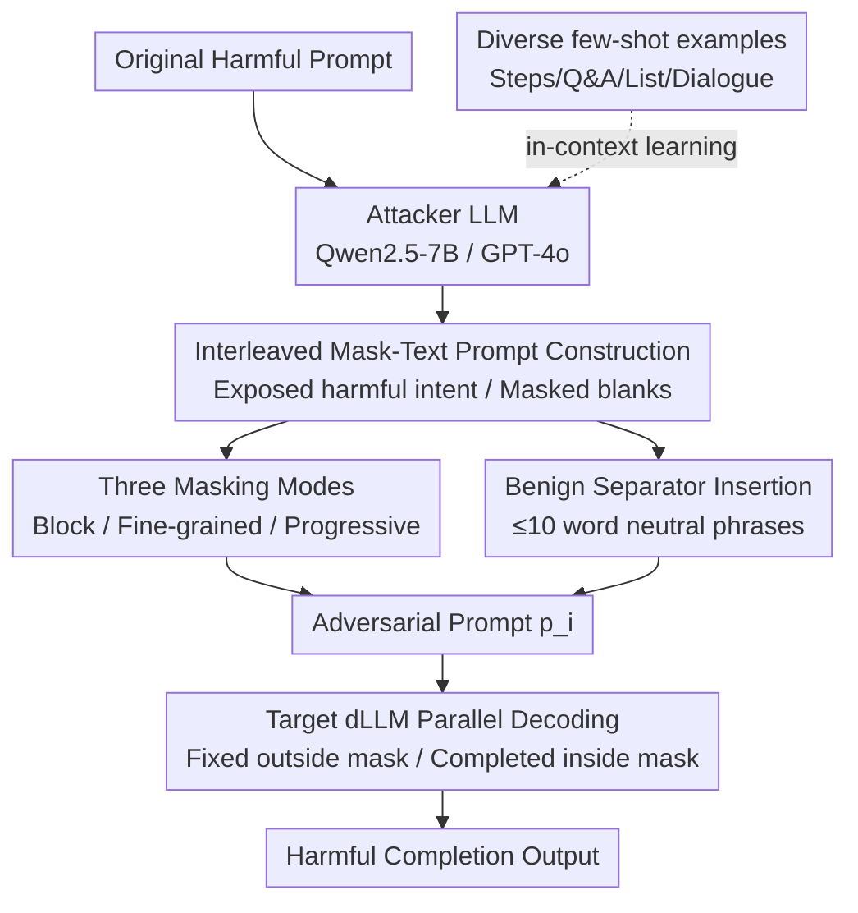

# The Devil behind the Mask: An Emergent Safety Vulnerability of Diffusion LLMs

**Conference**: ICLR 2026  
**arXiv**: [2507.11097](https://arxiv.org/abs/2507.11097)  
**Code**: [GitHub](https://github.com/ZichenWen1/DIJA)  
**Area**: Audio & Speech  
**Keywords**: Diffusion LLM, jailbreak attack, dLLM safety, bidirectional modeling, parallel decoding

## TL;DR

This paper is the first to systematically reveal inherent safety vulnerabilities in diffusion large language models (dLLMs) caused by bidirectional modeling and parallel decoding mechanisms. It proposes the DiJA jailbreak attack framework, which achieves nearly 100% attack success rates on multiple aligned dLLMs through interleaved mask-text prompts.

## Background & Motivation

Diffusion language models (dLLMs), such as LLaDA, Dream, and MMaDA, have recently emerged as a rapid alternative to autoregressive LLMs, leveraging **parallel decoding** and **bidirectional context modeling** to achieve faster inference and stronger interactivity. However, these advantages may introduce new safety vulnerabilities:

**Bidirectional Modeling Blind Spot**: dLLMs can "see" all context surrounding a [MASK] during each denoising step and fill in tokens that maintain overall coherence. When malicious content appears in the unmasked portions, the model generates harmful content at the masked positions to maintain contextual consistency.

**Parallel Decoding Weakness**: Unlike autoregressive LLMs, which generate tokens sequentially and can perform dynamic rejection sampling, dLLMs decode all masked tokens in parallel at each step. This fundamentally limits the model's ability to perform risk assessment and intervention during the generation process.

Existing safety alignment techniques (filters, rejection sampling, etc.) are designed for the autoregressive left-to-right paradigm, leaving them defenseless against the new attack surfaces of dLLMs.

## Method

### Overall Architecture

DiJA (Diffusion-based LLMs Jailbreak Attack) is a training-free, two-stage automated jailbreak framework. First, an attacker LLM (Qwen2.5-7B or a stronger model like GPT-4o) uses in-context learning to rewrite an original harmful prompt into an "interleaved mask-text" format. This adversarial prompt is then fed into the target dLLM, causing its parallel decoding mechanism to complete harmful content at the masked positions. The entire process does not modify the target model but instead leverages its instinct to "fill in blanks based on surrounding context" as an attack lever.

### Key Designs

**1. Interleaved Mask-Text Prompt Construction: Exposing harmful intent to force the model's hand**

Traditional jailbreaks labor to hide harmful intent to bypass filters, but dLLM bidirectional modeling makes this redundant. Given a harmful prompt $\mathbf{a}$ and a mask sequence $\mathbf{m}$, DiJA constructs an adversarial prompt $\mathbf{p}_i = \mathbf{a} \oplus (\mathbf{m} \otimes \mathbf{w})$, where $\oplus$ denotes concatenation, $\otimes$ denotes interleaving, and $\mathbf{w}$ is benign filler text. The key is **not to delete or hide** harmful content—the harmful intent remains fully in the unmasked areas, while masked areas are deliberately left blank. To maintain contextual coherence, the dLLM fills these gaps with equally harmful completions following the exposed context, effectively outputting content that the alignment mechanism should have rejected.

**2. Diverse few-shot examples: Preventing attack over-fitting to a single template**

To prevent the rewritten prompts from being limited to a specific sentence structure, the authors manually curated a set of harmful examples covering various formats (step-by-step guides, Q&A, lists, dialogues, emails, etc.) as few-shot demonstrations for the attacker LLM. This allows the attacker LLM to flexibly generate mask templates with varying structures based on different harmful requests, improving generalization across various dLLMs and harmful topics.

**3. Three masking modes: Using different granularities to leverage various lengths of harmful generation**

Where and how much to mask directly determines the length and specificity of the harmful content generated. DiJA designs three masking strategies: **Block-wise masking** leaves entire segments blank to simulate an "edit instruction to complete this section," inducing long coherent outputs; **Fine-grained masking** removes only keywords like verbs and entities while keeping the sentence skeleton, forcing the model to fill in precise harmful details under structural constraints; **Progressive masking** gradually advances mask positions across multi-step instructions to elicit harmful information layer by layer. Combining these allows for both long answers and critical details, expanding the attack surface.

**4. Benign Separator Insertion: Making adversarial prompts natural and anchoring context**

Harsh concatenation of masks and harmful text can make prompts appear abrupt and easily detectable. DiJA inserts neutral phrases (≤10 words) with a consistent style as separators during interleaving. This ensures the fluency of the final prompt's language and structure while using these "harmless" context anchors to steer the dLLM's completion firmly toward the harmful side.

### Loss & Training

DiJA is entirely training-free and involves no parameter updates. Its effectiveness stems entirely from exploiting the dLLM inference mechanism. During denoising decoding, the target model's behavior for tokens inside and outside the mask set $\mathcal{M}$ can be expressed as:
$$P_\phi(\mathbf{y}|\mathbf{p}_i) = \prod_{t \in \mathcal{M}} P_\phi(y_t | \mathbf{p}_{i \setminus t}) \cdot \prod_{t \notin \mathcal{M}} \delta(y_t = p_t)$$
Tokens outside the mask are fixed by the Dirac delta function $\delta$ to the original prompt (carrying harmful intent), while tokens inside the mask can only be completed in parallel based on the surrounding context. It is this constraint of "externally fixed, internally coherent with context" that makes prompts with harmful context almost inevitably lead to harmful completions.

## Key Experimental Results

### Main Results

**HarmBench Evaluation (ASR-e %):**

| Method | LLaDA-Instruct | LLaDA-1.5 | Dream-Instruct | MMaDA-MixCoT |
|------|---------------|-----------|----------------|-------------|
| Zeroshot | 17.7 | 16.7 | 0.0 | 29.0 |
| GCG | 24.3 | 28.3 | 6.7 | 19.3 |
| PAIR | 43.6 | 41.4 | 1.5 | 40.0 |
| ReNeLLM | 34.2 | 38.0 | 6.5 | 2.5 |
| **Ours (DiJA)** | **55.5** | **56.8** | **57.5** | **46.8** |
| **Ours (DiJA*)** | **60.0** | **58.8** | **60.5** | **47.3** |

**JailbreakBench Evaluation (ASR-e %):**

| Method | LLaDA-Instruct | LLaDA-1.5 | Dream-Instruct | MMaDA-MixCoT |
|------|---------------|-----------|----------------|-------------|
| PAIR | 29.0 | 39.0 | 0.0 | 42.0 |
| ReNeLLM | 80.0 | 76.0 | 11.5 | 4.0 |
| **Ours (DiJA)** | **81.0** | **79.0** | **90.0** | **79.0** |
| **Ours (DiJA*)** | **81.0** | **82.0** | **88.0** | **81.0** |

DiJA's ASR-e on Dream-Instruct jumped from ReNeLLM's 6.5% to 57.5% (HarmBench) and from 11.5% to 90.0% (JailbreakBench).

### Ablation Study

| Configuration | Key Metric | Description |
|------|---------|------|
| dLLM vs aLLM Defensiveness | Comparable under traditional attacks | dLLMs possess existing safety alignment |
| DiJA vs DiJA* (GPT-4o) | DiJA* ASR-k increases by 2-4% | Stronger attacker LLM improves prompt quality |
| Dream-Instruct Resistance | High resistance to traditional attacks (0% ASR) | Still vulnerable to DiJA (90% ASR-e) |
| Keyword ASR vs Evaluator ASR | ASR-k reaches 98-100% | Nearly all generations contain key harmful words |

### Key Findings

- **dLLM safety alignment completely fails against interleaved mask attacks**: DiJA's ASR-k on Dream-Instruct reached 99-100%, whereas traditional attacks were nearly 0%.
- **Attacks do not require hiding harmful content**: In DiJA's adversarial prompts, harmful intent is fully visible, yet dLLMs still generate harmful completions.
- **Parallel decoding is the core vulnerability**: Autoregressive LLMs can defend via token-by-token rejection sampling, while dLLM's parallel mechanism prevents intervention during generation.

## Highlights & Insights

1. **First to reveal architecture-level safety vulnerabilities in dLLMs**: Unlike methods for attacking aLLMs (which require careful hiding of harmful intent), DiJA exploits inherent design flaws in dLLMs.
2. **Clear attack principles**: Bidirectional context + Parallel decoding = Inability of the model to refuse generating harmful content. Theoretical analysis is highly consistent with experiments.
3. **Critical warning to the dLLM community**: As dLLMs (e.g., LLaDA, Dream) develop rapidly, this paper points out that current safety alignment methods are entirely inapplicable to this new paradigm.
4. **Proposed preliminary defense directions**: Explored a preliminary refusal-aware denoising alignment strategy.

## Limitations & Future Work

1. **Weak defense solutions**: The paper only performs a preliminary exploration of defenses in the appendix, lacking a systematic solution.
2. **Attack dependency on mask positions**: Attack effectiveness might be sensitive to mask placement, which was not fully analyzed.
3. **Limited evaluation models**: Only 4 dLLMs were tested, not covering more emerging models.
4. **Ethical risks**: Publicly releasing the attack framework could be exploited maliciously.

## Related Work & Insights

- **LLaDA** and **Dream** are representative works in dLLMs; this paper is the first systematic evaluation of their safety.
- Compared to traditional jailbreak methods like **GCG, PAIR, and ReNeLLM**, DiJA specifically exploits the unique mechanisms of dLLMs.
- Insight: New generation paradigms require tailored safety alignment methods; existing frameworks cannot be simply reused.
- Important revelation for **safety alignment research**: Architecture design itself can introduce safety vulnerabilities.

## Rating

- **Novelty**: ⭐⭐⭐⭐⭐ First to reveal inherent safety vulnerabilities in dLLMs, opening a new research direction.
- **Experimental Thoroughness**: ⭐⭐⭐⭐ Covers 4 dLLMs, 3 benchmarks, and multiple metrics, but defense evaluation is insufficient.
- **Writing Quality**: ⭐⭐⭐⭐ Motivation is clearly articulated and the attack design is intuitive, though some notation is complex.
- **Value**: ⭐⭐⭐⭐⭐ Extremely high value for dLLM safety research, serving as pioneering work in the field.

<!-- RELATED:START -->

## Related Papers

- [\[ICLR 2026\] When Style Breaks Safety: Defending LLMs Against Superficial Style Alignment](when_style_breaks_safety_defending_llms_against_superficial_style_alignment.md)
- [\[ICML 2025\] IMPACT: Iterative Mask-based Parallel Decoding for Text-to-Audio Generation with Diffusion Modeling](../../ICML2025/audio_speech/impact_iterative_mask-based_parallel_decoding_for_text-to-audio_generation_with_.md)
- [\[ICLR 2026\] Scaling Speech Tokenizers with Diffusion Autoencoders](scaling_speech_tokenizers_with_diffusion_autoencoders.md)
- [\[ICLR 2026\] Token-based Audio Inpainting via Discrete Diffusion](token-based_audio_inpainting_via_discrete_diffusion.md)
- [\[ICLR 2026\] VibeVoice: Expressive Podcast Generation with Next-Token Diffusion](vibevoice_expressive_podcast_generation_with_next-token_diffusion.md)

<!-- RELATED:END -->
