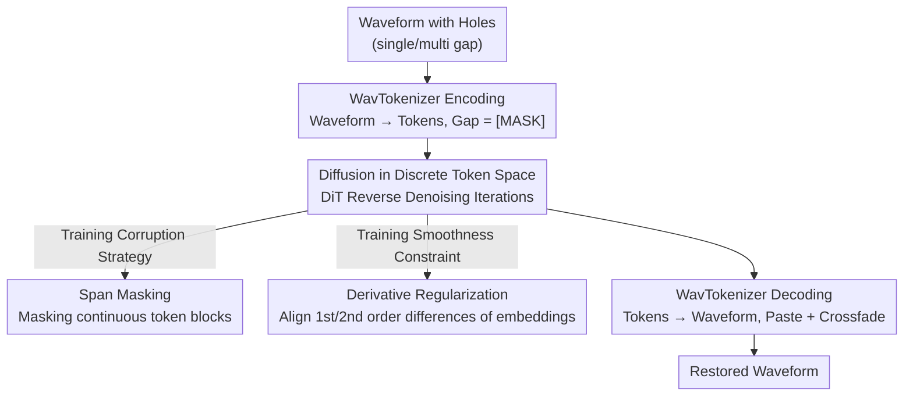

# Token-based Audio Inpainting via Discrete Diffusion

**Conference**: ICLR 2026  
**OpenReview**: [https://openreview.net/forum?id=9ZogqiyWXm](https://openreview.net/forum?id=9ZogqiyWXm)  
**Code**: https://github.com/iftachShoham/AIDD  
**Area**: Audio & Speech / Diffusion Models / Audio Inpainting  
**Keywords**: Audio Inpainting, Discrete Diffusion, Audio Tokenizer, Span Masking, Smoothing Regularization

## TL;DR
This paper proposes AIDD, which compresses audio into discrete token sequences using a pretrained tokenizer (WavTokenizer) and then performs absorbing state discrete diffusion within this token space to fill missing segments. With training improvements including span masking and derivative smoothing regularization, AIDD achieves higher stability and lower distortion on medium-to-long gaps (150–750 ms) in MusicNet/MAESTRO compared to strong diffusion baselines (like CQT-Diff+), while being smaller and faster.

## Background & Motivation

**Background**: Audio inpainting (restoring missing or corrupted segments in recordings) is a classic inverse problem. Early signal modeling methods like autoregression, sparse representation, and linear prediction were only effective for very short gaps (< 100 ms) under local stationarity assumptions. Recently, deep generative models have taken over this task: VAEs, GANs (GACELA, bin2bin), and especially diffusion models (DiffWave in the waveform domain; CQT-Diff+/MAID in the CQT/spectrogram domain) have extended the restorable gap to several hundred milliseconds using iterative denoising and strong generative priors.

**Limitations of Prior Work**: These methods face weaknesses on long gaps. Waveform-level diffusion (DiffWave) operates at the original sampling rate, requiring massive receptive fields to capture long-range structures. Spectrogram/CQT methods (MAID, CQT-Diff+) rely on phase reconstruction, which often fails to maintain inter-regional coherence as gaps lengthen. VAEs preserve local continuity but lose semantic consistency as the gap grows. Fundamentally, it is difficult to simultaneously maintain **fine-grained temporal details and high-level structure** in continuous audio representations.

**Key Challenge**: Continuous-domain diffusion performs smooth interpolation on real numbers. For large gaps, it lacks high-level semantic constraints, resulting in outputs that become "blurry" or deviate significantly from the context.

**Goal**: To find a representation that compresses high-dimensional waveform redundancy while preserving semantic structure, allowing the model to remain stable and coherent across long gaps.

**Key Insight**: The authors observe that discrete diffusion has become highly effective in natural language generation—treating tokens as categorical variables for "mask/replace" style diffusion, which is naturally suited for "sequence completion" tasks. By converting audio into discrete tokens, inpainting is transformed into a **discrete sequence completion** problem, leveraging mature discrete diffusion mechanisms from linguistics.

**Core Idea**: Use a pretrained audio tokenizer to quantize waveforms into compact token sequences, then **perform absorbing state diffusion entirely within the discrete token space** to complete missing tokens before decoding back to a waveform. This is the first work to apply discrete diffusion to (musical) audio inpainting.

## Method

### Overall Architecture
AIDD reformulates audio inpainting as "discrete token sequence completion." The input is a waveform with silent holes (single or multiple gaps), and the output is a completed waveform. The pipeline consists of three stages: **Encoding (WavTokenizer Encoder quantizes waveform to discrete tokens, holes correspond to [MASK]) → Discrete Diffusion Completion (DiT predicts masked tokens via iterative reverse diffusion) → Decoding (WavTokenizer Decoder restores tokens to waveform, with only the restored segments pasted into the original gaps using 10 ms crossfade).** The core innovations lie in the discrete diffusion stage and its two customized training strategies: span masking to modify the forward corruption process and derivative loss to constrain the temporal smoothness of predicted tokens.

During inference, only the gap regions are replaced, while intact regions are preserved without re-encoding. During training, token sequences are corrupted at random timesteps using span masking, and the DiT learns to restore the corrupted sequences using the DWDSE objective and derivative regularization.

### Key Designs

**1. Absorbing Discrete Diffusion in Token Space: Transforming Inpainting into Token Completion**

To address the issue of continuous diffusion losing high-level structure in long gaps, AIDD leaves the continuous domain entirely. It uses **WavTokenizer** (single quantizer, codebook size ~4k) to compress high-resolution waveforms into compact discrete token sequences (truncated to 300 tokens ≈ 4s during training), maintaining high-fidelity reconstruction and rich semantics under extreme compression. Missing segments naturally correspond to a sequence of [MASK] tokens. The completion engine is a **DiT** (Diffusion Transformer, encoder-only transformer with time conditioning and RoPE) operating on discrete tokens.

The diffusion process follows **absorbing discrete diffusion**: in the forward process, each token either remains unchanged with probability $e^{-\bar\sigma(t)}$ or is replaced by the absorbing state [MASK] with probability $1-e^{-\bar\sigma(t)}$, where $\bar\sigma(t)=\int_0^t \sigma(s)\,ds$ is the cumulative noise. The reverse process estimates the concrete-score $s_\theta(x,t)\approx [p_t(y)/p_t(x)]$, trained with the DWDSE (Diffusion Weighted Denoising Score Entropy) objective. The advantage is that the token space is low-dimensional and semantic; the model does not need to struggle with raw waveform or spectrogram phase, leading to superior long-range semantic consistency—the fundamental reason it outperforms CQT-Diff+ on medium-to-long gaps.

**2. Span-based Masking: Aligning Corruption with Real-world "Blocky" Missing Data**

Standard discrete diffusion (e.g., SEDD) samples whether to mask each token **independently** during the forward process, resulting in scattered holes. However, real audio gaps are **continuous blocks of missing data**. This mismatch between training corruption and inference tasks prevents the model from learning to "fill a whole block." AIDD introduces structured span masking: at each timestep, a budget $B(t)=\big(1-e^{-\bar\sigma(t)}\big)\cdot L$ is determined (expected number of tokens to mask, for sequence length $L$). Then, **continuous spans are sampled iteratively** until the budget is met.

The length of each span is sampled from a geometric distribution $\ell\sim \mathrm{Geo}(p_\sigma)$, where $p_\sigma=\dfrac{p_0}{1+\alpha\sigma}$. The base parameter $p_0$ and scaling factor $\alpha$ control how span length changes with noise level $\sigma$: **early timesteps (low noise) favor short spans for fine-grained local corruption, while later timesteps favor long spans for large-scale semantic perturbations**, capped at $\ell_{max}$ (set to 30). This "local-to-semantic" progressive corruption aligns the corruption ratio of the forward process with diffusion-induced transition probabilities and trains the model to handle block-wise missing data.

**3. Derivative-based Regularization: Constraining Temporal Smoothness of Predicted Tokens**

DWDSE only ensures that the score correctly learns transition ratios for masked tokens, but it **does not constrain the temporal continuity between predicted token embeddings at adjacent positions**. This can lead to unnatural local jitter in restored segments. AIDD adds a derivative regularization term to explicitly constrain the smoothness of token trajectories in the embedding space. Let $e_i$ be the ground truth embedding at position $i$ and $\hat e_i$ be the predicted embedding. Defining the first-order difference $\Delta_1 e_i=e_{i+1}-e_i$ and the second-order difference (capturing local curvature) $\Delta_2 e_i=e_{i+1}-2e_i+e_{i-1}$, the regularization aligns the differences of predicted and ground truth values at masked positions:

$$\mathcal{L}_{deriv}=\frac{1}{|M|}\sum_{i\in M}\big\|\Delta_k\hat e_i-\Delta_k e_i\big\|^2,\quad k\in\{1,2\}$$

where $M$ is the set of indices involving masked tokens. The total objective is $\mathcal{L}_{total}=\mathcal{L}_{DWDSE}+\lambda\,\mathcal{L}_{deriv}$, where $\lambda$ balances the terms (experimentally set to 200–800). This penalizes irregular local fluctuations in predicted embeddings, encouraging the reverse process to reconstruct sequences that respect the inherent temporal smoothness of natural audio token trajectories.

### Loss & Training
The total loss is $\mathcal{L}_{total}=\mathcal{L}_{DWDSE}+\lambda\,\mathcal{L}_{deriv}$. During training, waveforms are tokenized and truncated to 300 tokens (≈4 s). Timesteps are selected randomly to apply span masking, and the DiT learns to predict concrete scores. The AdamW optimizer is used ($10^{-6}$ learning rate) with a batch size of 128. On MusicNet, the base model (DWDSE only) is trained for 400k steps (approx. 2 days on a single A6000), while other variants are trained for 100k steps. MAESTRO is trained for 150k steps (approx. 24 h).

## Key Experimental Results

### Main Results
On MusicNet, AIDD is compared against LPC, A-SPAIN-L, and CQT-Diff+ (prior SOTA for $\leq 300$ ms). Metrics include FAD↓ / LSD↓ / ODG↑ (ODG: 0 is best, -4 is worst).

| Dataset / Gap | Metric | AIDD | CQT-Diff+ | Note |
|--------------|------|------|-----------|------|
| MusicNet 300 ms | FAD ↓ | **3.549** | 4.652 | FAD reduced by ~25% for long gaps |
| MusicNet 300 ms | LSD ↓ | **0.297** | 0.324 | Lower distortion |
| MusicNet 300 ms | ODG ↑ | **-3.284** | -3.711 | Significantly better perceptual quality |
| MusicNet 150 ms | FAD ↓ | 1.866 | **1.525** | CQT-Diff+ slightly better FAD for short gaps |
| MusicNet 150 ms | ODG ↑ | **-3.215** | -3.559 | But AIDD still leads in ODG/LSD |

On MAESTRO (ODG PEA-Q, single gap), AIDD achieves **-2.303 / -2.596** at 375 ms / 750 ms, respectively, outperforming GACELA (-3.232/-3.318), bin2bin (-2.892/-3.039), and bin2bin-MIDI (-2.800/-2.976). Subjective MOS (MAESTRO) shows AIDD (3.64) > GACELA/CQT-Diff+ (3.51) against an Original of 4.12.

Efficiency: AIDD (WavTokenizer) has ~90M parameters (81M on the encoder side), 1 day of training, and an average inference time of 5.25 s; CQT-Diff+ has 242M parameters, 4 days of training, and 12.54 s inference time—making AIDD smaller and faster.

### Ablation Study
On MusicNet, the three training strategies (base DWDSE / span masking / derivative regularization / combination) were disassembled for 200 ms and 300 ms gaps:

| Configuration | 200 ms FAD ↓ | 300 ms FAD ↓ | Note |
|------|--------------|--------------|------|
| Base (DWDSE only) | 2.802 | 4.015 | Without proposed improvements |
| + Span Masking ($p_0{=}0.6, \alpha{=}0.5$) | 2.438 | 3.573 | Span masking alone cuts FAD significantly |
| + Derivative Reg. ($\lambda{=}200, \Delta_1 e$) | 2.455 | 3.439 | Derivative loss is also effective alone |
| Combination ($\lambda{=}500, p_0{=}0.8, \alpha{=}0.5, \Delta_1 e$) | **2.391** | 3.549 | Best overall performance |

Tokenizer Comparison (MAESTRO, Table 5): WavTokenizer consistently outperforms UniCodec (e.g., 375 ms FAD 0.042 vs 0.12, ODG -2.303 vs -2.753). The authors suggest UniCodec's codebook (~16k) might be too large for the model capacity, whereas WavTokenizer (~4k) is more suitable for smooth transitions.

### Key Findings
- Both proposed improvements contribute independently to lowering FAD, and their combination yields the most stable results—demonstrating that span masking (addressing training-inference mismatch) and derivative regularization (addressing temporal jitter) are complementary.
- The longer the gap, the greater AIDD's advantage over CQT-Diff+ (FAD reduction of ~25% at 300 ms). While CQT-Diff+ slightly leads in FAD for short gaps (150 ms), AIDD remains superior in ODG/LSD, suggesting the semantic prior of discrete diffusion is more valuable for long gaps.
- The tokenizer sets the upper bound: codebook size must match model capacity. Blindly switching to "higher quality" large codebooks can degrade performance.
- AIDD is the only compared method that does not require a fixed input length.

## Highlights & Insights
- **Reformulating Audio Inpainting as Discrete Sequence Completion**: By using WavTokenizer to transform waveforms into tokens, the authors borrow mature absorbing discrete diffusion from language modeling, bypassing the difficult problem of phase reconstruction in waveforms/spectrograms—this "changing the representation, changing the battlefield" strategy is elegant.
- **Span Masking Aligns Training Corruption with Real Tasks**: Standard discrete diffusion creates scattered holes, which differs from real "blocky" audio gaps. Iteratively sampling continuous spans based on a budget and scaling lengths with noise is a small but effective trick portable to other block-wise missing data tasks.
- **Derivative Regularization as a Plug-and-Play Smoothness Constraint**: Aligning 1st/2nd order differences in the embedding space suppresses temporal jitter with almost zero extra structural cost, making it applicable to other discrete diffusion generation tasks.
- Achieving superior results on medium-to-long gaps with a smaller model and shorter training time suggests that "choosing the right representation space" is more critical than "increasing model scale."

## Limitations & Future Work
- **Dependency on Tokenizer Quality and Bandwidth**: Performance is capped by the underlying codec. AIDD inherits WavTokenizer's 24 kHz bandwidth; high-sample-rate recordings must be downsampled, and output is limited to 24 kHz, potentially losing fidelity.
- **Cross-Domain Comparison Bias**: Since AIDD generates discrete tokens while baselines generate waveforms/spectrograms, differences in reconstruction bandwidth and preprocessing introduce bias. The authors advocate for unified benchmarks across token, latent, and continuous models.
- **Training-Inference Mismatch**: While span masking helps, the distribution of training spans versus real inference gaps may still not be perfectly aligned.
- Evaluation is concentrated on classical/piano music (MusicNet, MAESTRO); generalization to vocals, complex mixes, and highly non-stationary audio has not been fully verified.

## Related Work & Insights
- **vs CQT-Diff+ (Continuous CQT Diffusion, Prev. SOTA $\leq 300$ ms)**: CQT-Diff+ performs continuous diffusion on CQT spectrograms and depends on phase reconstruction, which loses coherence in long gaps. AIDD operates on discrete tokens, offering lower distortion and faster inference for mid-to-long gaps.
- **vs DiffSound (Discrete Diffusion on Quantized Spectrogram Tokens)**: While both use discrete diffusion, DiffSound targets quantized spectrogram tokens. AIDD uses single-quantizer wave tokens from WavTokenizer and introduces span masking and derivative regularization specifically for inpainting.
- **vs GACELA / bin2bin (GAN-based Long Gap Inpainting)**: GAN methods rely on multi-scale discriminators or pix2pix with STFT/MIDI losses. AIDD uses a diffusion generative prior, resulting in better ODG/MOS on MAESTRO without requiring fixed input lengths.
- **vs SEDD (Discrete Diffusion by Lou et al.)**: AIDD adopts the DWDSE and concrete-score framework but modifies independent masking to span masking and adds derivative regularization to adapt general discrete diffusion for audio inpainting.

## Rating
- Novelty: ⭐⭐⭐⭐⭐ First to apply discrete diffusion to (musical) audio inpainting; insightful choice of representation space.
- Experimental Thoroughness: ⭐⭐⭐⭐ Complete across two datasets, objective/subjective metrics, ablations, and tokenizer/latency analysis, though limited to classical/piano music.
- Writing Quality: ⭐⭐⭐⭐ Clear motivation, comprehensive formulas and figures, slightly verbose in some descriptions.
- Value: ⭐⭐⭐⭐ More stable and efficient for mid-to-long gap restoration, providing two portable improvements for discrete diffusion training.

<!-- RELATED:START -->

## Related Papers

- [\[ICLR 2026\] VibeVoice: Expressive Podcast Generation with Next-Token Diffusion](vibevoice_expressive_podcast_generation_with_next-token_diffusion.md)
- [\[ICLR 2026\] Efficient Audio-Visual Speech Separation with Discrete Lip Semantics and Multi-Scale Global-Local Attention](efficient_audio-visual_speech_separation_with_discrete_lip_semantics_and_multi-s.md)
- [\[ICLR 2026\] Scaling Speech Tokenizers with Diffusion Autoencoders](scaling_speech_tokenizers_with_diffusion_autoencoders.md)
- [\[ICLR 2026\] Hierarchical Semantic-Acoustic Modeling via Semi-Discrete Residual Representations for Expressive End-to-End Speech Synthesis](hierarchical_semantic-acoustic_modeling_via_semi-discrete_residual_representatio.md)
- [\[ICLR 2026\] The Devil behind the Mask: An Emergent Safety Vulnerability of Diffusion LLMs](the_devil_behind_the_mask_an_emergent_safety_vulnerability_of_diffusion_llms.md)

<!-- RELATED:END -->
