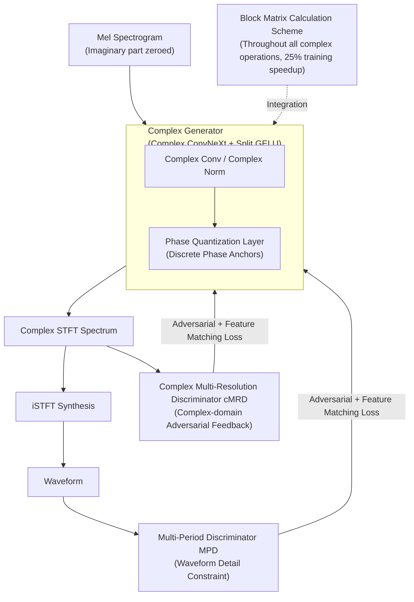

# Toward Complex-Valued Neural Networks for Waveform Generation

**Conference**: ICLR 2026  
**arXiv**: [2603.11589](https://arxiv.org/abs/2603.11589)  
**Code**: [https://hs-oh-prml.github.io/ComVo/](https://hs-oh-prml.github.io/ComVo/)  
**Area**: Speech Synthesis / Vocoder  
**Keywords**: Complex-valued Neural Networks, iSTFT Vocoder, Phase Quantization, GAN, Waveform Generation

## TL;DR
ComVo is proposed as the first iSTFT vocoder utilizing Complex-Valued Neural Networks (CVNN) in both the generator and discriminator. It stabilizes training via a Phase Quantization layer and introduces a block matrix calculation scheme to reduce training time by 25%, achieving synthesis quality superior to real-valued baselines such as Vocos on LibriTTS.

## Background & Motivation

**Background**: iSTFT vocoders (e.g., Vocos, iSTFTNet) directly predict complex-valued spectrograms in the frequency domain and synthesize waveforms through iSTFT, avoiding the complexity and latency associated with sample-by-sample generation and learned upsampling.

**Limitations of Prior Work**: All existing iSTFT vocoders use Real-Valued Neural Networks (RVNN), treating the real and imaginary parts of the complex spectrogram as two independent channels. This separation breaks the inherent coupling between the real and imaginary components, which jointly determine both magnitude and phase.

**Key Challenge**: Real-valued networks cannot directly model the algebraic structures in the complex domain (such as complex multiplication and rotation), leading to inaccurate phase modeling. Controlled experiments indicate that CVNN achieves a Jensen-Shannon Divergence (JSD) for synthesizing complex-valued distributions that is 64% and 81% lower than RVNN for magnitude and phase, respectively.

**Key Insight**: Complex-Valued Neural Networks (CVNN) represent inputs, activations, and weights as complex numbers, naturally capturing cross-dependencies between real and imaginary parts. However, CVNNs have never been explored in vocoders—primary difficulties involve the design of complex-domain nonlinear transformations and training efficiency.

**Core Idea**: Construct the generator and discriminator using CVNNs to form a complete complex-domain adversarial training framework; use phase quantization as an inductive bias to stabilize training; and employ a block matrix calculation scheme to improve efficiency.

## Method

### Overall Architecture
ComVo migrates the entire iSTFT vocoder pipeline into the complex domain: it takes the Mel-spectrogram as input (with the imaginary part initialized to zero) and feeds it into a complex-valued ConvNeXt generator. The generator directly predicts the complex-valued STFT spectrum, from which the waveform is synthesized via iSTFT. On the adversarial training side, two types of discriminators are used—a complex multi-resolution discriminator (cMRD) that directly processes the complex-valued spectrum, and a Multi-Period Discriminator (MPD) operating on the time-domain waveform—ensuring the generator receives both complex-domain structural feedback and waveform detail constraints. A phase quantization layer is embedded within the generator to stabilize complex-domain training, while all complex-valued linear operations utilize a block matrix calculation scheme to compress training overhead to levels comparable with real-valued networks.

### Key Designs

**1. Complex-Valued Generator: Coupling Real and Imaginary Parts End-to-End**

RVNN vocoders treat the real and imaginary parts of the complex spectrum as two independent channels, destroying the coupling relationship that jointly determines magnitude and phase. ComVo follows the ConvNeXt backbone of Vocos but replaces its Conv1d and LayerNorm with complex-valued versions; weights, activations, and features are all carried as complex numbers, allowing algebraic structures like complex multiplication and rotation to be expressed natively by the network. For non-linearity, Split GELU is used—applying GELU separately to the real and imaginary parts—preserving the ConvNeXt block structure while providing stable element-wise activation in the complex domain. Consequently, the cross-dependency of real-imaginary parts is never dismantled throughout the forward path, leading to more accurate phase modeling.

**2. Phase Quantization Layer: Anchoring Phase and Stabilizing Training with Discretization**

The biggest challenge in complex-domain training is that the phase easily drifts, making convergence difficult. For an intermediate complex feature $z = re^{i\theta}$, ComVo quantizes only its phase by discretizing the continuous phase into $N_q$ uniform levels $\theta_q = \frac{2\pi}{N_q} \cdot \text{round}(\frac{N_q}{2\pi}\theta)$, while the magnitude $r$ remains unchanged. Since the round function is non-differentiable, a Straight-Through Estimator (STE) is used to pass gradients back as usual. Essentially, this is a regularization acting on the phase: it restricts intermediate representations to the vicinity of a finite number of "phase anchors," suppressing phase inconsistency and guiding the network to learn more structured phase patterns. Ablations show that removing this layer results in a UTMOS drop of approximately 0.12, confirming it as a critical inductive bias for stable complex-valued training.

**3. Complex Multi-Resolution Discriminator (cMRD): Respecting Complex Domain Structure in Adversarial Feedback**

Multiple sub-discriminators operate at different STFT resolutions, but unlike conventional methods, they directly take complex-valued spectrograms as input instead of concatenating real/imaginary parts into independent channels. Adversarial losses are calculated separately on the real and imaginary parts, ensuring the feedback provided by the discriminator preserves complex-domain geometry rather than being flattened by real-valuation. Coupled with the MPD operating in the waveform domain, the generator is supervised by both frequency-domain complex structures and time-domain waveform details; without cMRD, UTMOS drops to 3.58.

**4. Block Matrix Calculation Scheme: Reducing Complex Computation to Real-Valued Computational Costs**

A naive implementation of a complex-valued linear operation $z' = Wz$ (where $W = W_r + iW_i$ and $z = x + iy$) requires four independent real-valued matrix multiplications, doubling the overhead. ComVo rewrites this as a single block matrix multiplication:

$$\begin{bmatrix} \text{Re}(z') \\ \text{Im}(z') \end{bmatrix} = \begin{bmatrix} W_r & -W_i \\ W_i & W_r \end{bmatrix} \begin{bmatrix} x \\ y \end{bmatrix}$$

This uses a single structured matrix multiplication to absorb redundancy. By using a custom autograd function, both forward and backward passes follow this path. It is mathematically equivalent to the naive implementation and yields identical synthesis quality, but reduces training time by approximately 25%, bringing the seemingly expensive computational demand of complex-valued networks back to a level comparable with real-valued ones.

### Loss & Training
The total loss consists of adversarial losses from cMRD (complex domain) and MPD (waveform domain), feature matching losses, and multi-resolution STFT reconstruction losses. These constrain the generator from the perspectives of complex spectral structure, discriminator intermediate features, and multi-scale frequency spectra. The training data includes LibriTTS train-clean-100/360 and train-other-500, with a sampling rate of 24kHz.

## Key Experimental Results

### Main Results (LibriTTS test-clean + test-other)

| Model | UTMOS↑ | PESQ↑ | MR-STFT↓ | MOS↑ | CMOS↑ |
|------|--------|-------|----------|------|-------|
| HiFi-GAN | 3.35 | 2.94 | 1.05 | 4.00 | -0.09 |
| iSTFTNet | 3.36 | 2.81 | 1.10 | 3.98 | -0.04 |
| BigVGAN | 3.52 | 3.61 | 0.90 | 4.00 | -0.01 |
| Vocos (RVNN) | 3.60 | 3.72 | 0.87 | 4.04 | +0.02 |
| **Ours (CVNN)** | **3.75** | **3.89** | **0.83** | **4.07** | **+0.10** |
| Ground Truth | 3.87 | - | - | 4.08 | +0.14 |

### Ablation Study

| Configuration | UTMOS↑ | PESQ↑ | Description |
|------|--------|-------|------|
| ComVo Complete | 3.75 | 3.89 | All CVNN + Phase Quantization + Block Matrix |
| w/o Phase Quantization | 3.63 | 3.75 | Unstable training, phase drift |
| w/o cMRD (MPD only) | 3.58 | 3.68 | Lack of complex-domain adversarial feedback |
| RVNN Baseline (Same Params) | 3.60 | 3.72 | Fair comparison: clear complex advantage |
| Block Matrix vs. Naive | Same Quality | Same Quality | Mathematically equivalent but 25% faster training |

### Key Findings
- CVNN outperforms RVNN with matched parameter counts across both subjective and objective metrics (UTMOS +0.15, PESQ +0.17).
- Phase Quantization is a crucial component—removing it leads to a 0.12 drop in UTMOS, indicating that phase regularization is essential for complex-valued training.
- The block matrix scheme reduces training time by 25% without any loss in synthesis quality.

## Highlights & Insights
- **First All-Complex Vocoder**: Utilizes CVNN in both the generator and discriminator, establishing a paradigm for complex-domain adversarial training.
- **Phase Quantization** serves as a simple and effective inductive bias: discretizing the continuous phase acts as "phase anchors" for the network, preventing phase inconsistency issues during training.
- **Block Matrix Calculation** cleverly exploits the structural characteristics of complex-valued operations, transforming seemingly inefficient complex requirements into computational costs comparable to real-valued operations.
- Preliminary experiments (synthesizing complex distributions with GANs) validate the theoretical advantages of CVNN in complex-domain modeling, providing controlled experimental support for future vocoder designs.

## Limitations & Future Work
- The parameter count of CVNN layers is approximately 2× that of RVNN (real and imaginary parts require independent weights); although block matrices optimize computation, memory overhead remains high.
- A strictly fair comparison was only conducted with Vocos; comparisons with more vocoders (e.g., BigVGAN v2, Descript Audio Codec) are needed.
- How to choose the number of levels $N_q$ for phase quantization? The impact of different values on quality has not been systematically ablated.
- Not yet validated in end-to-end TTS systems—whether vocoder quality translates into overall TTS performance improvements remains to be seen.

## Related Work & Insights
- **vs. Vocos**: Shared iSTFT framework, but Vocos uses RVNN while ComVo uses CVNN—the difference lies solely in whether the network is natively complex-valued.
- **vs. HiFi-GAN/BigVGAN**: These generate directly in the waveform domain, whereas ComVo generates in the frequency domain followed by iSTFT; the architectural paradigms differ.
- **CVNN Field**: Complex-valued networks are already applied in MRI reconstruction and radar classification; ComVo introduces them for the first time to audio generation.
- **Insight**: Any signal processing task naturally existing in complex form (e.g., RF signals, optical imaging) could consider a similar CVNN replacement.

## Rating
- Novelty: ⭐⭐⭐⭐ First all-complex iSTFT vocoder with a novel phase quantization design.
- Experimental Thoroughness: ⭐⭐⭐⭐ Includes subjective/objective evaluations, controlled experiments, and ablations, though the baseline comparison could be more extensive.
- Writing Quality: ⭐⭐⭐⭐ Smooth narrative transitioning from preliminary experiments to the full system.
- Value: ⭐⭐⭐⭐ Advances the application of complex-valued networks in audio generation and paves the way for future research.

<!-- RELATED:START -->

## Related Papers

- [\[ICLR 2026\] Knowing When to Quit: Probabilistic Early Exits for Speech Separation Networks](knowing_when_to_quit_probabilistic_early_exits_for_speech_separation_networks.md)
- [\[ICLR 2026\] FlexiCodec: A Dynamic Neural Audio Codec for Low Frame Rates](flexicodec_a_dynamic_neural_audio_codec_for_low_frame_rates.md)
- [\[ACL 2026\] Hard to Be Heard: Phoneme-Level ASR Analysis of Phonologically Complex, Low-Resource Endangered Languages](../../ACL2026/audio_speech/hard_to_be_heard_phoneme-level_asr_analysis_of_phonologically_complex_low-resour.md)
- [\[NeurIPS 2025\] SHAP Meets Tensor Networks: Provably Tractable Explanations with Parallelism](../../NeurIPS2025/audio_speech/shap_meets_tensor_networks_provably_tractable_explanations_with_parallelism.md)
- [\[ICML 2026\] Self-Guidance: Enhancing Neural Codecs via Decoder Manifold Alignment](../../ICML2026/audio_speech/self-guidance_enhancing_neural_codecs_via_decoder_manifold_alignment.md)

<!-- RELATED:END -->
