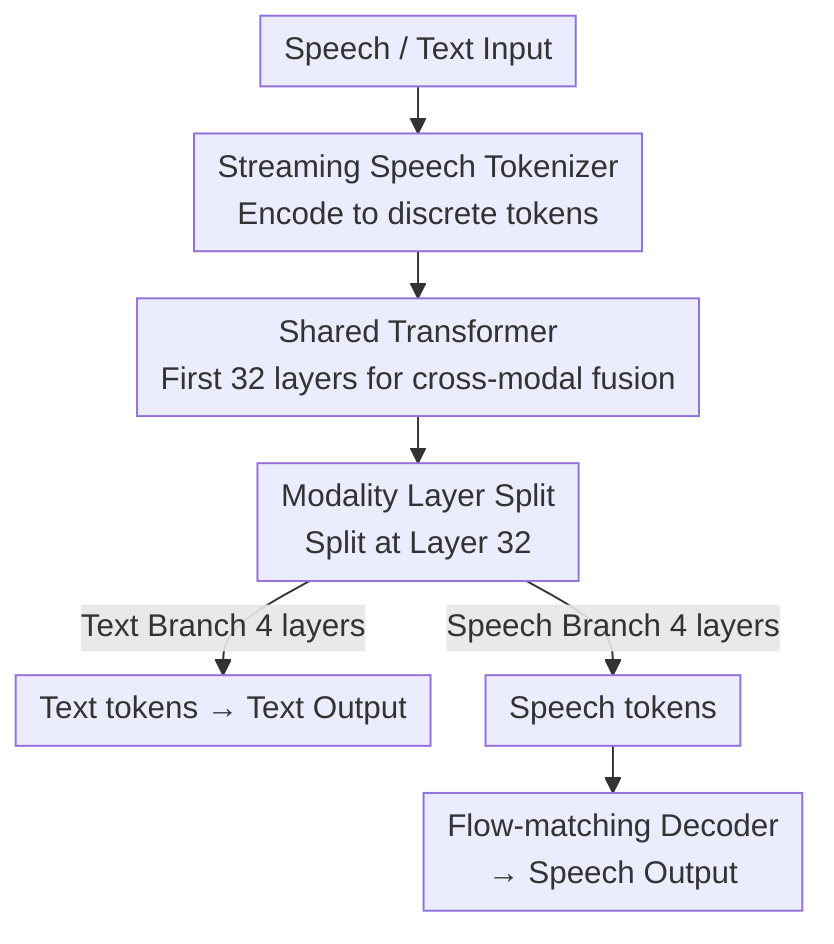

# Towards True Speech-to-Speech Models Without Text Guidance

**Conference**: ICLR 2026  
**OpenReview**: [https://openreview.net/forum?id=zjaV5zmlkl](https://openreview.net/forum?id=zjaV5zmlkl)  
**Code**: To be open-sourced (authors stated that code and models will be released)  
**Area**: Speech Dialogue / Speech LLM / Multimodal Alignment  
**Keywords**: Speech-to-speech, end-to-end speech LLM, modality-based layer split, frozen pre-training, streaming tokenizer

## TL;DR
This paper proposes a **true speech-to-speech large model**: starting from a pre-trained text LLM (Qwen3-8B), it utilizes "modality-based layer split" and "frozen pre-training" to directly understand and generate speech without relying on intermediate text. It achieves SOTA performance in speech QA while almost completely recovering from the text capability degradation commonly seen when extending to new modalities.

## Background & Motivation
**Background**: Current spoken dialogue systems primarily follow two categories. One is the cascaded pipeline (ASR → Text LLM → TTS), which converts speech to text, generates a textual response, and then synthesizes speech. The other is represented by recent end-to-end "text-guided" speech models (SpeechGPT, Moshi, GLM-4-Voice, etc.), which accept speech inputs directly but **still use text as an intermediary during generation**—generating text and speech tokens simultaneously.

**Limitations of Prior Work**: Cascaded pipelines lose paralinguistic information (tone, emphasis, emotion) from the original speech during the ASR step and are limited to producing content that can be faithfully represented by text. While text-guided end-to-end models preserve paralinguistic cues at the input, relying on a text intermediary at the output introduces three problems: increased latency, reduced efficiency, and limited expressiveness—non-verbal vocalizations like laughter or hesitations lack natural textual equivalents. More importantly, due to the modality gap between speech and text, existing methods often **sacrifice text capabilities** to gain speech capabilities; for example, adding speech modeling to SpiritLM caused MMLU to drop from 45.3 to 36.9.

**Key Challenge**: To achieve "true speech-to-speech" (without text intermediate at the output), reasoning and world knowledge from the text LLM must be transferred to the speech modality. However, simply adding speech tokens to the vocabulary or full joint training often allows speech training to disrupt text representations, leading to text capability degradation. Even GLM-4-Voice, which supports direct speech generation, shows significantly weaker performance in direct mode compared to text-guided mode.

**Goal**: To build a model with native support for bidirectional text/speech input and output, ensuring that **direct speech generation** approaches the quality of text-guided generation while **preserving the reasoning and knowledge** of the text backbone.

**Key Insight**: The authors made a critical observation on `speechgpt2-preview`: by comparing the hidden state similarity between speech and text representations of the same sentence layer by layer, they found that in a 28-layer model, similarity rises steadily in the first 11 layers, stabilizes in the middle 14 layers, and drops significantly in the final 3 layers. This indicates that speech and text representations merge in low-to-mid layers but naturally diverge at the top.

**Core Idea**: Since the top layers naturally diverge, the network is **split into two branches near the top**. A shared bottom backbone handles cross-modal fusion, while separate speech and text branches handle modality-specific generation. This, combined with a "frozen pre-training" strategy (freezing the text backbone and training only speech components), addresses both the transfer and preservation of text capabilities.

## Method

### Overall Architecture
The model modifies a 36-layer autoregressive Transformer (initialized from Qwen3-8B). Inputs can be either speech or text. Speech is first encoded into discrete tokens via a **streaming single-codebook tokenizer**, then fed alongside text tokens into the **shared Transformer layers** for deep cross-modal fusion. At layer 32, a **modality layer split** occurs, and hidden states are routed into two parallel four-layer branches: one continues to predict text tokens, while the other predicts speech tokens. Speech tokens are finally converted back to waveforms by a flow-matching decoder. Training involves two steps: first using **frozen pre-training** to inject the speech modality without damaging the text backbone, followed by supervised fine-tuning on **synthetic SFT data** featuring four modality pairings to unify text/speech interactions.

### Key Designs

**1. Modality Layer Split: Splitting into dual branches at Layer 32 following natural top-layer divergence**

To address the conflict where speech and text capabilities compete within the same layers leading to text degradation, the authors did not expand the vocabulary or use a Depth Transformer. Instead, they leveraged an observation of representations: hidden state similarity between speech and text for the same utterance increases layer by layer (deep fusion) until the final layers where it decreases (specialization for modality-specific generation). Since the top layers naturally "diverge," the modality split is inserted at the 32nd block of the 36-layer network. The first 32 layers act as a shared backbone for cross-modal fusion, after which hidden states are routed to parallel four-layer stacks. Both branches are initialized from the same pre-trained text backbone. This "split-then-specialize" approach ensures that most linguistic knowledge remains in the shared backbone, while the speech branch only needs to learn how to "speak" this knowledge. This allows text LLM reasoning to express natively in the speech modality without requiring massive, knowledge-dense speech datasets. Ablations show this as a primary source of improvement: compared to no splitting (NF–NoSplit), adding the split improves both speech modeling and text preservation.

**2. Frozen Pre-training: Freezing the text backbone to train speech first, then carefully unfreezing**

Even with branching, full joint training from the start could bias text parameters toward speech. This work employs two-stage pre-training: **Stage 1** freezes all parameters of the Qwen3-8B backbone and only trains the newly introduced speech components—speech token embeddings, speech-specific Transformer layers, and the speech LM head. This initializes speech parameters and establishes stable alignment with text representations over approximately one epoch (AdamW + cosine, LR $4\times10^{-4}$, batch 2.2M tokens, context 14,336). **Stage 2** unfreezes a larger portion for cross-modal adaptation. To mitigate the risk of text degradation, pure text pre-training data (FineWeb-Edu / Chinese FineWeb-Edu V2.1, score $\ge 3$) is mixed in, with the LR reduced to $6\times10^{-5}\!\to\!6\times10^{-6}$ and batch increased to 2.8M. Three unfreezing configurations were tested—full, shared layers only, and layer-wise from back to front—and found **minimal differences**, leading to the use of full unfreezing. Ablations show "substantial" gains from frozen pre-training, making it more critical than the specific unfreezing strategy for preserving language capabilities (as seen in MMLU/CMMLU results).

**3. Streaming Single-codebook Speech Tokenizer: Semantic-first, low bitrate, truly streaming**

To transfer text knowledge, tokens must be semantically rich, low bitrate, streaming-capable, and allow high-fidelity reconstruction. For the encoder, the authors avoid pure reconstruction objectives (which can be suboptimal for LLM learning) and follow CosyVoice 2 by using **ASR as the sole training objective** to maximize semantic content. They also modified the GLM-4-Voice tokenizer from block-causal to **fully causal**, enabling true streaming (instead of 2-second chunks), resulting in a 12.5 Hz frame rate and 175 BPS single-codebook representation. The decoder follows the CosyVoice 2 flow-matching architecture but reduces chunk sizes to minimize latency from chunk-attention. In evaluation, this tokenizer achieves a WER of 10.80% under streaming conditions—slightly higher than GLM-4-Voice's 9.17% (which uses 2s chunks)—but significantly outperforms Mimi-8 (14.45%) and CosyVoice 2 (13.78%). The decoding stage exceeds CosyVoice 2 in intelligibility (WER) and audio quality (DNSMOS) across English and Chinese benchmarks at lower frame rates, with only minor loss in speaker similarity.

**4. Synthetic SFT Data + Four Modality Pairs: "Translating" text SFT corpora into speakable multimodal dialogues**

High-quality supervised data for speech assistants is scarce, so the authors used synthesis. They took open-source text SFT data and performed **text adaptation** via GPT-5: converting non-speakable content (math, tables, Markdown) into TTS-friendly forms, filtering unreadable samples (long code, dense LaTeX), shortening long responses, correcting factual errors, and labeling emotional tones. They then used multiple TTS engines for **speech synthesis**: diverse voices for the user role to increase robustness, and a single fixed voice for the assistant to establish a stable "system persona," with MOSS-TTSD used to enhance dialogue diversity. Finally, quality filtering via SenseVoice-Small ASR removed samples with WER $\ge 0.2$, yielding over 1.5 million Q&A pairs (~650k English, ~860k Chinese). Fine-tuning intentionally covers **four modality pairings**: Speech-in/Speech-out, Speech-in/Text-out, Text-in/Speech-out, and Text-in/Text-out. These are controlled by system prompts while keeping underlying content consistent, strengthening cross-modal alignment and enabling a single model for all interaction modes.

### Loss & Training
The entire process uses an autoregressive language modeling objective (text branch predicts text tokens, speech branch predicts speech tokens). Pre-training follows two stages: Stage 1 for ~1 epoch, Stage 2 for 2 epochs on the same speech data mixed with 0.1 epoch of text data. SFT is performed on synthetic multimodal data for 2 epochs (AdamW + cosine, $1\times10^{-5}\!\to\!1\times10^{-6}$, batch 8, context 10,240, sequence packing). The pre-training corpus includes ~4M hours of speech (cleaned via VAD from 900M original hours), involving interleaved speech-text from podcasts and unsupervised speech from videos. Quality is bolstered by synthesizing high-quality text corpora using CosyVoice 2 to supplement the low knowledge density of raw speech.

## Key Experimental Results

### Main Results

The pre-trained model leads in both speech modeling and text preservation (StoryCloze evaluates speech continuation, MMLU/CMMLU evaluate text knowledge):

| Model | tS.C. | sS.C. | zh-tS.C. | zh-sS.C. | MMLU | CMMLU |
|------|-------|-------|----------|----------|------|-------|
| Moshi | 83.60 | 62.70 | - | - | 49.8 | - |
| GLM-4-Voice | 82.90 | 62.40 | 83.27 | 69.10 | 57.49 | 54.39 |
| SpiritLM | 82.90 | 61.00 | - | - | 36.90 | - |
| **Ours** | **84.87** | **63.17** | **90.32** | **71.94** | **67.19** | **69.53** |

On speech QA (post-SFT), the model reaches SOTA **without text guidance**, outperforming GLM-4-Voice (marked with ∗) which uses text guidance on several metrics:

| Model | LlamaQA S→S | TriviaQA S→S | WebQA S→S | UTMOS |
|------|-------------|--------------|-----------|-------|
| GLM-4-Voice∗ (text-guided) | 65.67 | 43.20 | 38.34 | 4.25 |
| Moshi∗ (text-guided) | 62.30 | 22.80 | 26.60 | - |
| **Ours (No text guidance)** | 63.67 | 28.80 | **36.71** | **4.37** |

Note: S→S denotes Speech-in/Speech-out. GLM-4-Voice∗'s S→S results used text guidance; Ours uses pure direct generation, resulting in slightly lower TriviaQA scores but superior WebQA performance and audio quality (UTMOS).

### Ablation Study

| Config | Split Layer | sS.C. | zh-sS.C. | MMLU | CMMLU | Description |
|------|--------|-------|----------|------|-------|------|
| FP–Full | 4 | 63.12 | 72.10 | 66.50 | 69.15 | Frozen Pre-training + Full Unfreeze (Default) |
| FP–Shared | 4 | 63.50 | 72.69 | 67.26 | 69.27 | Shared layers unfreeze only |
| FP–Layerwise | 4 | 62.64 | 71.51 | 68.82 | 69.26 | Layer-wise unfreeze (back-to-front) |
| NF | 4 | 56.60 | 67.56 | 62.11 | 64.11 | No freezing, full joint training |
| NF–NoSplit | 0 | 55.80 | 67.02 | 60.97 | 63.73 | No split (speech tokens in text vocab) |
| Qwen3-8B | - | - | - | 76.60 | 77.35 | Text-only backbone upper bound |

### Key Findings
- **Split and Frozen Pre-training are both essential**: Performance rises steadily from NF–NoSplit → NF (split added) → FP (freezing added); speech and text metrics improve simultaneously. Frozen pre-training provides more significant gains.
- **Unfreezing strategy has minimal impact**: Results for FP–Full/Shared/Layerwise are localized, implying that "freezing before unfreezing" is the critical mechanism, rather than fine-grained unfreezing schedules.
- **Text capabilities are largely preserved**: Compared to the Qwen3-8B upper bound (MMLU 76.60), the model achieves MMLU 67.19, significantly better than SpiritLM, which plummeted to 36.9.
- **Competitive streaming tokenizer**: A streaming WER of 10.80% is competitive against non-streaming codecs, and the decoder outperforms CosyVoice 2 in intelligibility and quality at lower frame rates.

## Highlights & Insights
- **Architecture decisions driven by representation analysis**: By quantifying top-layer divergence first, the decision to split at Layer 32 was grounded in empirical observation rather than trial and error.
- **"Split-then-specialize" as a lightweight transfer paradigm**: Shared bottom layers for fusion and branching tops for modality-specific generation allow knowledge to stay in the original backbone. This bypasses the need for massive knowledge-dense speech data and could extend to vision or action modalities.
- **Frozen pre-training decouples new learning from forgetting**: Freezing the backbone to align speech components first provides a practical recipe against catastrophic forgetting and is remarkably robust to engineering details during the unfreezing phase.

## Limitations & Future Work
- **Dependence on massive data and heavy synthesis pipelines**: ~4M hours of speech and 1.5M SFT pairs required GPT-5 adaptation and multiple TTS/ASR engines, posing high barriers to replication.
- **Direct generation still lags behind text-guided on some tasks**: Performance on TriviaQA S→S remains lower than text-guided GLM-4-Voice, suggesting that "no text intermediate" hasn't yet fully matched text-guided reasoning for knowledge-intensive QA.
- **Heuristic split location**: The split at Layer 32 was based on observation of a specific model (speechgpt2-preview); whether this is optimal across all backbones or could be adaptively determined remains unexplored.
- **Security risks**: The decoder could be misused for voice cloning/spoofing, an ethical risk the authors acknowledge.

## Related Work & Insights
- **vs. Cascaded Pipelines**: Cascades lose paralinguistic info; E2E directly models speech, preserving tone, emotion, and non-verbal cues.
- **vs. Text-guided E2E (Moshi/GLM-4-Voice)**: These use text as an intermediate during generation, causing latency and limiting expression. This work achieves **no text intermediate at output** and achieves SOTA in speech QA, narrowing the gap between direct and text-guided performance.
- **vs. SpiritLM**: SpiritLM suffers massive text degradation (MMLU 45.3→36.9); this work minimizes degradation (MMLU 67.19) via split and frozen pre-training.
- **vs. CosyVoice 2/GLM-4-Voice Tokenizers**: Reuses ASR coding objectives and flow-matching while shifting to a fully causal architecture for true low-latency streaming.

## Rating
- Novelty: ⭐⭐⭐⭐ Uses layer-wise representation analysis to derive a clear "split + frozen" paradigm for E2E speech LLMs that preserves text units without text guidance.
- Experimental Thoroughness: ⭐⭐⭐⭐ Extensive coverage of tokenizer, pre-training, SFT, and ablations (including unfreezing strategies); however, data/compute requirements are extreme, limiting external verification.
- Writing Quality: ⭐⭐⭐⭐ Logical chain from motivation to observation to design is clear; Figure 2's similarity analysis is highly persuasive.
- Value: ⭐⭐⭐⭐ Provides a viable paradigm for "true speech-to-speech" foundation models and commits to open-sourcing code and models.

<!-- RELATED:START -->

## Related Papers

- [\[ICLR 2026\] ParaS2S: Benchmarking and Aligning Spoken Language Models for Paralinguistic-Aware Speech-to-Speech Interaction](paras2s_benchmarking_and_aligning_spoken_language_models_for_paralinguistic-awar.md)
- [\[ACL 2025\] Leveraging Unit Language Guidance to Advance Speech Modeling in Textless Speech-to-Speech Translation](../../ACL2025/audio_speech/leveraging_unit_language_guidance_to_advance_speech_modeling_in_textless_speech-.md)
- [\[ICLR 2026\] Latent Speech-Text Transformer](latent_speech_text_transformer.md)
- [\[ICLR 2026\] Scalable Multilingual Multimodal Machine Translation with Speech-Text Fusion](scalable_multilingual_multimodal_machine_translation_with_speech-text_fusion.md)
- [\[ACL 2025\] Autoregressive Speech Synthesis without Vector Quantization](../../ACL2025/audio_speech/autoregressive_speech_synthesis_without_vq.md)

<!-- RELATED:END -->
