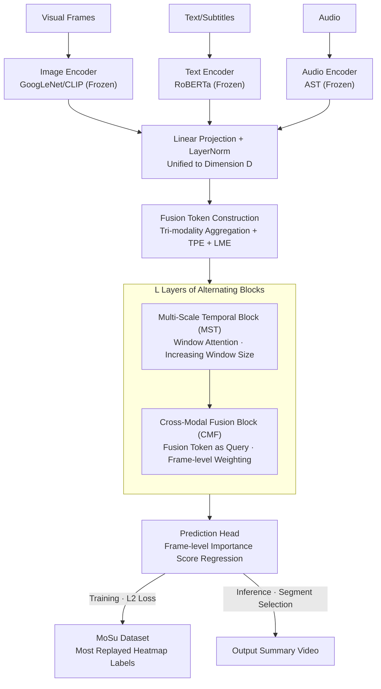

# TripleSumm: Adaptive Triple-Modality Fusion for Video Summarization

**Conference**: ICLR 2026  
**arXiv**: [2603.01169](https://arxiv.org/abs/2603.01169)  
**Code**: [https://github.com/smkim37/TripleSumm](https://github.com/smkim37/TripleSumm)  
**Area**: Audio and Speech  
**Keywords**: Video Summarization, Triple-Modality Fusion, Adaptive Weights, Multi-scale Temporal, Large-scale Dataset

## TL;DR
TripleSumm is proposed to achieve dynamic frame-level modality importance adjustment using Multi-Scale Temporal blocks (hierarchical sliding window attention) and Cross-Modal Fusion blocks (adaptive weighting of vision/text/audio via a fusion token). The authors also release MoSu, the first large-scale triple-modality video summarization dataset (52,678 videos), achieving SOTA results across 4 benchmarks.

## Background & Motivation

**Background**: Video summarization extracts key segments to represent the original video content. Existing methods primarily utilize visual features combined with attention mechanisms.

**Limitations of Prior Work**: Modality importance changes dynamically frame-by-frame (e.g., text is crucial when a judge speaks, while vision and audio are more important during a robot performance). However, current methods employ static or modality-agnostic fusion strategies. Furthermore, there is a lack of large-scale triple-modality datasets.

**Core Idea**: Adaptive frame-level modality fusion combined with a large-scale triple-modality benchmark.

## Method

### Overall Architecture
The core problem TripleSumm addresses is that the "most trustworthy modality" in a video changes frame-by-frame. Existing methods use static or modality-agnostic global fusion strategies, which struggle with segments not dominated by visual cues. The overall mechanism involves feeding visual, text, and audio streams into frozen pre-trained encoders (GoogLeNet/CLIP, RoBERTa, AST), projecting them into a unified dimension $D$, and aggregating a "fusion token" frame-by-frame. The model then stacks $L$ layers of Multi-Scale Temporal (MST) blocks and Cross-Modal Fusion (CMF) blocks in a "temporal refinement followed by cross-modal fusion" cycle. This allows the fusion token to adaptively decide which modality to trust at each frame. Finally, a prediction head regresses frame-level importance scores to select coherent segments. The central hypothesis is that since modality importance varies frame-by-frame, fusion must occur at the frame granularity rather than using global weights.

### Key Designs

**1. Fusion Token Construction: Creating an unbiased neutral anchor for cross-modal fusion**

If visual features are used as queries to absorb other modalities, as in traditional multi-modal methods, it assumes a prior that vision is most important, introducing modality bias. TripleSumm aggregates per-frame embeddings from all three modalities into an additional fusion token, $\mathbf{e}^f_i=\text{Agg}(\mathbf{e}^v_i,\mathbf{e}^t_i,\mathbf{e}^a_i)$. The $\text{Agg}$ function can be a simple average or an MLP. Since it does not belong to any single modality, it acts as a neutral anchor. To distinguish frame positions and modality sources, each token (fusion and the three modalities) is augmented with Temporal Position Encoding (TPE) $\mathbf{tpe}_i$ and Learnable Modality Embeddings (LME) $\mathbf{lme}^{\{f,v,t,a\}}$, such that $\mathbf{h}^{\{f,v,t,a\}}_i=\mathbf{e}^{\{f,v,t,a\}}_i+\mathbf{tpe}_i+\mathbf{lme}^{\{f,v,t,a\}}$. This fusion token persists through all layers, absorbing information from the most relevant modalities at the current frame without modifying the original modality tokens, thus preserving raw representations for subsequent layers.

**2. Multi-Scale Temporal Block (MST): Modeling long-video dependencies with hierarchical window attention**

Videos can last minutes or thousands of frames, making full $O(N^2)$ attention computationally prohibitive. MST uses Window Self-Attention (WSA), where each query only attends to a local window of width $w$, reducing complexity to $O(w\cdot N)$. The window size $w$ increases with layer depth—shallow layers capture local dependencies between adjacent frames, while deeper layers establish long-range connections across segments. A key design choice is that WSA shares parameters across the four token types (fusion, visual, text, audio). Since temporal patterns like scene transitions are modality-agnostic, parameter sharing reduces overhead and learns universal temporal structures.

**3. Cross-Modal Fusion Block (CMF): Deciding modality trust independently at each frame**

While MST refines features along the time axis within each modality, CMF enables cross-modal communication. CMF follows MST, using the fusion token $\mathbf{h}^f_i$ at time step $i$ as the query and the three modality tokens $\mathbf{h}^{\{v,t,a\}}_i$ as key/value pairs for cross-attention. This allows the fusion token to perform weighted aggregation of the most relevant modality—text weight increases during speech, while audio weight increases during musical performances. Alternating $L$ layers of MST and CMF ensures that frame-level modality preferences become increasingly accurate as the network deepens.

**4. MoSu Dataset: Utilizing "Most Replayed" heatmaps for free frame-level annotation**

Triple-modality video summarization has lacked large-scale benchmarks. TripleSumm filters 52,678 real-world videos (requiring English subtitles, available audio tracks, and sufficient views for reliable replay statistics). Labels are derived directly from YouTube's "Most Replayed" heatmaps, representing the collective attention of at least 50,000 viewers per video. This serves as a proxy for frame importance without requiring manual frame-by-frame scoring.

> ⚠️ Note: Refer to Sec. 4 of the original paper for specific MoSu filtering thresholds (view counts, duration).

### Loss & Training
The model is trained using an L2 regression loss $\mathcal{L}=\|S-\hat{S}\|_2^2$ to supervise the frame-level importance scores $\hat{S}$. During inference, temporally coherent segments that maximize the predicted scores are selected to form the summary.

## Key Experimental Results

### Main Results

| Benchmark | Metric | TripleSumm | Prev. SOTA | Gain |
|------|------|-----------|---------|------|
| MoSu | Kendall τ | 0.145 | 0.107 (CFSum) | +35.5% |
| Mr.HiSum | Kendall τ | 0.105 | 0.089 | +18.0% |
| SumMe | F1 | 52.3 | 50.1 | +2.2 |
| TVSum | F1 | 63.7 | 61.5 | +2.2 |

### Ablation Study

| Configuration | MoSu τ | Description |
|------|--------|------|
| Full TripleSumm | 0.145 | Complete model |
| Vision only | 0.091 | Significant degradation |
| Vision + Text | 0.128 | Clear audio contribution |
| w/o MST | 0.121 | Multi-scale importance |
| w/o CMF | 0.118 | Significance of adaptive fusion |

### Key Findings
- TripleSumm degrades robustly when modalities are missing, adaptively relying on available inputs rather than crashing due to missing data.
- Qualitative analysis shows the fusion token focuses on different modalities at different frames (e.g., high text weight for speech, high audio weight for music).
- Visual-only models achieve τ=0.091 on MoSu; adding text increases it to 0.128, and audio further to 0.145, proving independent modality contributions.
- MST's multi-scale design is critical for long videos; single-window models show an approx. 16% drop in τ on MoSu.
- High parameter efficiency: TripleSumm's parameter count is comparable to the visual-only PGL-SUM, despite utilizing triple the information sources.

## Highlights & Insights
- Using a fusion token as a "neutral anchor" for cross-modal interaction is a key innovation, avoiding the vision-centric bias of traditional methods.
- The hierarchical window design of MST allows the model to build temporal understanding from local to global scales, which is especially important for videos longer than 2 minutes.
- The inclusion of triple modalities improves both performance and robustness; performance degradation is controlled when any single modality is missing.
- The "Most Replayed" annotation scheme for MoSu is a pragmatic choice, leveraging collective viewing behavior as a free proxy for frame importance.

## Limitations & Future Work
- MoSu is based on YouTube "Most Replayed" data, which may bias towards entertainment content and lack coverage of educational/professional videos.
- Fusion token initialization uses simple average aggregation; more complex initializations (e.g., gating) might further improve results.
- The model uses frozen features from pre-trained encoders; end-to-end finetuning could unlock more potential.
- WSA window sizes follow a fixed schedule; adaptive window size adjustment could be more optimal.
- Comparisons with LLM-based summarization methods (e.g., VideoLLM) have not yet been explored.

## Related Work & Insights
- **vs CFSum**: CFSum also uses triple modalities but employs static fusion. TripleSumm’s frame-level adaptive weighting is the key differentiator.
- **vs A2Summ**: A2Summ focuses on audio-visual bi-modality; TripleSumm provides full tri-modality coverage.
- **vs PGL-SUM/CSTA**: These visual-only Transformer methods lag significantly on MoSu, validating the necessity of multi-modality.
- **MoSu Dataset**: The first large-scale tri-modality benchmark based on "Most Replayed" stats from 52,678 YouTube videos, each with at least 50,000 viewer "votes."
- **Inspiration**: The design of the fusion token as an "anchor" for cross-modal interaction is transferable to other multi-modal tasks (e.g., multi-modal retrieval, VideoQA).

## Rating
- Novelty: ⭐⭐⭐⭐ Adaptive tri-modality fusion + large-scale dataset; dual contributions in method and resource.
- Experimental Thoroughness: ⭐⭐⭐⭐⭐ 4 benchmarks + ablation + qualitative analysis + missing modality robustness tests.
- Writing Quality: ⭐⭐⭐⭐ Clear structure and intuitive diagrams.
- Value: ⭐⭐⭐⭐⭐ Both the MoSu dataset and the tri-modality fusion method possess lasting value.

<!-- RELATED:START -->

## Related Papers

- [\[ICLR 2026\] Scalable Multilingual Multimodal Machine Translation with Speech-Text Fusion](scalable_multilingual_multimodal_machine_translation_with_speech-text_fusion.md)
- [\[AAAI 2026\] Improving Multimodal Sentiment Analysis via Modality Optimization and Dynamic Primary Modality Selection](../../AAAI2026/audio_speech/improving_multimodal_sentiment_analysis_via_modality_optimization_and_dynamic_pr.md)
- [\[ICLR 2026\] Confident and Adaptive Generative Speech Recognition via Risk Control](confident_and_adaptive_generative_speech_recognition_via_risk_control.md)
- [\[ICML 2026\] Multimodal Fusion via Self-Consistent Task-Gradient Fields](../../ICML2026/audio_speech/multimodal_fusion_via_self-consistent_task-gradient_fields.md)
- [\[CVPR 2026\] SAVE: Speech-Aware Video Representation Learning for Video-Text Retrieval](../../CVPR2026/audio_speech/save_speech-aware_video_representation_learning_for_video-text_retrieval.md)

<!-- RELATED:END -->
