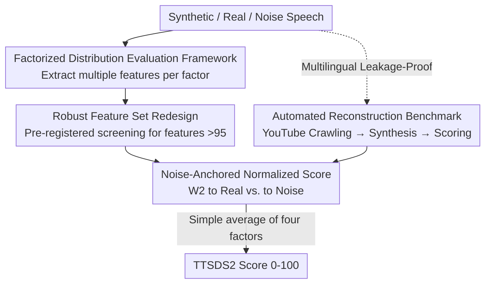

# TTSDS2: Resources and Benchmark for Evaluating Human-Quality Text to Speech Systems

**Conference**: ICLR 2026  
**OpenReview**: [https://openreview.net/forum?id=uGai5lYHlV](https://openreview.net/forum?id=uGai5lYHlV)  
**Code**: https://github.com/ttsds/pipeline (Available)  
**Area**: Speech Synthesis / TTS Evaluation  
**Keywords**: TTS Evaluation, Distribution Similarity, Wasserstein Distance, Multilingual Benchmark, Subjective-Objective Correlation

## TL;DR
Addressing the issue where modern TTS systems approach human quality and traditional MOS/objective metrics fail, this paper proposes TTSDS2—an unsupervised objective metric that factorizes speech into four perceptual factors and uses 2-Wasserstein distance to measure "how close the synthetic distribution is to the real one and how far it is from noise." It is the only metric among 16 candidates to achieve a Spearman correlation >0.5 (average 0.67) across all domains and subjective scores. The authors also release 11,000 subjective ratings, a leakage-proof multilingual reconstruction pipeline, and a benchmark covering 14 languages.

## Background & Motivation
**Background**: TTS models have advanced rapidly in recent years, often producing synthetic speech indistinguishable from humans. Multiple systems report MOS/CMOS scores comparable to or even preferred over real speech. Since subjective testing (MOS, CMOS, SMOS) is expensive and time-consuming, more works are turning to objective metrics for evaluation.

**Limitations of Prior Work**: Subjective metrics are incomparable across different papers due to variations in listener groups, survey designs, and samples. Objective metrics are rarely validated against subjective scores: signal-based metrics (PESQ/STOI/MCD) were designed for telephony/denoising and require aligned reference waveforms; MOS prediction networks (UTMOS, etc.) suffer from significant correlation drops out-of-domain; and distribution metrics like FAD require thousands of samples. Worse, it remains unverified whether these metrics can reliably predict "continuously updated" human ratings as synthesis approaches human quality.

**Key Challenge**: The fundamental difficulty in evaluation is that speech synthesis is a **one-to-many** problem—there is no unique "correct" speech for a given text, making the "sample-by-sample reference comparison" paradigm inherently flawed. Furthermore, distribution metrics in a single latent space are sensitive to confounding factors like domain, speaker, and recording conditions, leading to performance collapse when shifting domains.

**Goal**: To create an objective metric that is robust (high cross-domain and cross-lingual correlation), training-free, and continuously updatable to prevent leakage, while providing much-needed public resources (large-scale subjective ratings, multilingual benchmark).

**Key Insight**: Evaluation is reframed as a **distribution similarity** problem—comparing the characteristic distribution of synthetic speech to high-quality real distributions rather than sentence-by-sentence. By introducing "noise" as a unified anchor, the score becomes domain/speaker-agnostic. The authors also **factorize** the evaluation into four perceptual dimensions (Generic, Speaker, Prosody, Intelligibility), enhancing robustness and providing interpretable diagnostic breakdowns.

**Core Idea**: Use the ratio of "Wasserstein distance to the real distribution" vs. "distance to the noise distribution" to normalize the similarity of each perceptual factor to a 0–100 scale, then take a simple average. This results in a robust, distributed TTS evaluation metric that relies on multi-feature integration rather than any labeled data.

## Method

### Overall Architecture
The input to TTSDS2 is a set of synthetic speech (along with corresponding real reference speech and a set of fixed noise references), and the output is a scalar score from 0–100 (higher means closer to human). It avoids sentence-by-sentence comparison, instead comparing the "feature distribution of a whole batch of synthetic speech" against "real speech distributions" and "noise distributions." The calculation involves four steps: extracting multiple feature representations grouped into four perceptual factors (Generic, Speaker, Prosody, Intelligibility); calculating the 2-Wasserstein distance from the synthetic distribution to the real distribution $W_2^{\text{REAL}}$ and to the minimum distance of the noise distribution $W_2^{\text{NOISE}}$ for each feature; normalizing these into a 0–100 feature score; and finally averaging feature scores within a factor and factor scores into the final TTSDS2 score. By integrating multiple representations, each factor requires only 50–100 samples, far fewer than the thousands typically required by single latent space distribution metrics.

### Key Designs

**1. Factorized Distribution Evaluation Framework: Turning one-to-many evaluation into interpretable distribution similarity**

To address the inherent failure of "sample-by-sample" comparison in one-to-many generation and the domain sensitivity of single-latent metrics, TTSDS2 splits evaluation into four perceptually motivated factors: Generic (SSL embeddings for overall similarity), Speaker (speaker identity authenticity), Prosody (pitch, duration, rhythm), and Intelligibility (ASR-derived features). Each factor is averaged from **multiple** feature scores. This design offers two benefits: first, integrating multiple representations averages out noise from individual features, allowing stable distribution estimation with few samples; second, factor scores provide an interpretable diagnostic report, revealing if a system lacks prosody or speaker similarity, which a single MOS value cannot provide.

**2. Noise-Anchored Normalized Score: Eliminating domain/speaker bias via "Real vs. Noise" ratios**

Reporting raw Wasserstein distances makes scales incomparable across features and domains. The authors define a normalized score from 0 (equivalent to noise) to 100 (equivalent to real). Let $W_2^{\text{REAL}}$ be the distance to the real distribution and $W_2^{\text{NOISE}} = \min_{D_{\text{NOISE}}} W_2(\tilde{D}, D_{\text{NOISE}})$ be the distance to the nearest set of distractor noise (Uniform, Gaussian, All-ones, All-zeros). The score is:

$$\text{TTSDS2}(D, \tilde{D}, \mathcal{D}_{\text{NOISE}}) = 100 \times \frac{W_2^{\text{NOISE}}}{W_2^{\text{REAL}} + W_2^{\text{NOISE}}}$$

A score >50 implies the synthetic speech is "more like real than noise." Using noise as an anchor is key because it is **agnostic to domain and speaker**. No matter the dataset or speaker, noise remains a constant absolute reference, pulling different features to a comparable scale. The distance used is 2-Wasserstein: in high dimensions, it is approximated via multivariate Gaussians as the Fréchet distance $W_2^2 = \lVert \mu - \tilde{\mu} \rVert_2^2 + \mathrm{Tr}(\Sigma + \tilde{\Sigma} - 2(\tilde{\Sigma}^{1/2}\Sigma\tilde{\Sigma}^{1/2})^{1/2})$, while low-dimensional features have closed-form solutions via inverse CDFs. $W_2$ is chosen over KL or JS because it is symmetric and provides meaningful differences even when distributions do not overlap.

**3. Robust Feature Set Redesign: Filtering fragile features via pre-registered "Real data self-check"**

This is the primary upgrade over the original TTSDS, addressing the fragility where scores collapse when changing domains. The authors established a screening criterion **before any subjective correlation experiments** to avoid overfitting: split each real dataset in half and calculate the TTSDS score of one half against the other. Any candidate feature with an average score below 95 or a high standard deviation across datasets was removed. Following this: Intelligibility discarded WER (which yielded low scores for real data) in favor of final-layer activations from ASR models; Prosody discarded HuBERT token length and adopted articulation rates calculated as "deduplicated HuBERT tokens / frames" (likewise for Allosaurus), while retaining WORLD F0 and prosody embeddings; Generic added WavLM to HuBERT and wav2vec 2.0; and the multilingual version swapped HuBERT for mHuBERT-147 and wav2vec 2.0 for XLSR-53. The logic is consistent: ensure **real data achieves near-perfect scores**, otherwise the "100 = Real" anchor is invalid.

**4. Automated Multilingual Leakage-Proof Benchmark Pipeline: Continuous reconstruction to avoid data contamination**

To support a long-term credible benchmark, the author automated data collection for the WILD domain (Algorithm 1). The core goal is **anti-leakage**—using only data released later than the system being evaluated. For each language, the pipeline translates ten keywords emphasizing scripted/conversational speech, searches YouTube (filtering for videos >20 mins and published after the latest model in the test set), and performs speaker diarization via Whisper after trimming headers/footers. It uses FastText for language filtering, XNLI for sensitive content filtering (treating controversial topics as entailment), Pyannote for overlapping speech, and Demucs for background music. Finally, 50 speaker-matched samples are split into REFERENCE and SYNTHESIS sets. The system under test synthesizes SYNTHESIS text using the REFERENCE voice. Because fresh videos are crawled each time, systems could not have seen the data during training, fundamentally preventing "benchmark leakage."

### Loss & Training
TTSDS2 is **entirely unsupervised**, requiring no training, parameter tuning, or labeled data. This design choice was validated through ablation studies (see Method "Simple Average vs. Learned Weights"). The final score is the unweighted arithmetic mean of the four factor scores; the authors demonstrate that this simple average generalizes better than weights learned via regression on subjective scores, acting as a form of regularizer.

## Key Experimental Results

### Main Results
Across four English domains (CLEAN, NOISY, WILD, KIDS), Spearman correlations were calculated against human MOS/CMOS/SMOS ratings for 20 systems (11,846 ratings total, 200 Prolific annotators, 50 per domain), compared against 16 objective metrics. TTSDS2 is the only metric achieving correlation >0.5 in all 12 (domain × subjective score) combinations, with an average of 0.67, a ~10% improvement over the original TTSDS.

| Metric | Avg. Spearman (4 Domains) | Remarks |
|------|------|------|
| **TTSDS2 (Ours)** | **0.67** | Only metric >0.5 in all combinations |
| TTSDS (Original) | ~0.61 | Baseline, slightly better in KIDS domain |
| RawNet3 (Speaker Sim.) | ~0.60 | Strong in WILD/NOISY, weak in CLEAN |
| X-Vector (Speaker Sim.) | ~0.59 | Clustering/overfitting behavior |
| SQUIM-MOS | 0.57 | Only high-performing MOS prediction network |
| Others (DNSMOS/UTMOSv2/FAD/STOI/PESQ...) | <0.3 | Most fail or correlate negatively on KIDS/OOD |

Averaged across domains, the "Top 4" and "Bottom 3" system rankings for TTSDS2 are perfectly consistent with MOS and CMOS. Scatter plots also show TTSDS2 is the most continuous scale, whereas SQUIM and X-Vector exhibit clustering (suspected overfitting to specific systems).

### Ablation Study
Validating that "Simple Average" outperforms "Learned Weights" via Leave-one-out cross-validation (LOOCV: fitting linear regression weights on three domains and testing on the fourth).

| Held-out Domain | Simple Average (Ours) | Learned Weights (LOOCV) |
|--------|------|------|
| CLEAN | **0.747** | 0.645 |
| NOISY | **0.590** | 0.514 |
| WILD | **0.752** | 0.658 |
| KIDS | 0.606 | **0.853** |

Simple average wins in 3 out of 4 unseen domains. Learned weights (Table 5) prove highly unstable, varying drastically across training domains and even assigning negative coefficients (e.g., negative weights for Generic when trained on CLEAN/WILD, despite its positive individual correlation), indicating that learned weights overfit the training distribution.

### Key Findings
- **Simple Average as Regularization**: Unweighted averaging acts as a regularizer, canceling out noise from individual features during domain shifts. This is why TTSDS2 remains robust without in-domain tuning.
- **Complexity of KIDS Domain**: All metrics perform worst on the KIDS domain as it is furthest from typical TTS training data. Metrics like Audiobox Aesthetics or UTMOSv2 perform well on CLEAN/NOISY (audiobooks) but collapse out-of-domain.
- **Multilingual Validity** (Indirectly validated): Using Uriel+ typological distances as a reference, TTSDS2 scores between real language datasets correlate with linguistic distance at $\rho = -0.39$ (standard) and $\rho = -0.51$ (multilingual version, both $p<0.05$). Lower-resource languages score lower as expected, and all 14 languages fall within a narrow score range for real data.

## Highlights & Insights
- **Noise Anchoring is the "Secret Sauce"**: Using domain-agnostic noise as a zero-point anchor solves the historical problem of distribution metrics where raw distances are incomparable across features or domains. This trick is transferable to any one-to-many generation task (e.g., music, voice conversion).
- **Pre-registered Feature Screening**: The requirement that "real data must self-check at >95" before looking at subjective scores prevents the risk of metric designers "peeking at labels" to tune features, demonstrating rigorous evaluation methodology.
- **Counter-intuitive Robustness of Simple Average**: In domain-shift scenarios, simplicity wins. Weights learned on few domains invariably overfit, serving as a warning to researchers attempting to weight composite metrics.
- **Built-in Anti-Leakage**: Ensuring the benchmark only uses data chronologically following model releases provides a mechanism-level guarantee against contamination, which is rare in benchmark papers.

## Limitations & Future Work
- **Computational Overhead**: Extracting multiple features and calculating Wasserstein distances is CPU-intensive, making it slower than basic metrics. The authors suggest investigating MMD (Maximum Mean Discrepancy) for efficiency.
- **Correlation Ceiling**: Spearman correlations for TTSDS2 rarely exceed 0.8, suggesting inherent noise in listening tests or aspects of quality that objective metrics cannot yet capture. It is a robust approximation, not a replacement for human testing.
- **Indirect Multilingual Validation**: Without gold-standard MOS for 14 languages, validation relies on typological distances. Direct human validation in these languages is needed.
- **System Coverage**: The evaluation focused on voice-cloning TTS (20 systems, 2022–2024). Modern TTS failure modes might still evade detection by current objective metrics.

## Related Work & Insights
- **vs TTSDS (Minixhofer et al., 2024)**: This paper improves the "perceptual factor + distribution similarity" framework with more robust features (replacing WER with ASR activations, adding articulation rates and WavLM) and scales it to multilingual, automated benchmarks.
- **vs MOS Prediction Networks (UTMOS/SQUIM)**: These map single audio clips to MOS. While strong in-domain, they struggle out-of-domain. TTSDS2 is significantly more robust across domains due to its distribution-based ensemble approach.
- **vs FAD/FID Distribution Metrics**: These use single latent spaces, requiring large sample sizes and sensitivity to domain. TTSDS2 uses factorized ensembles, working with 50–100 samples and providing interpretable scores via noise anchoring.
- **vs Signal Metrics (PESQ/STOI/MCD)**: These fail in one-to-many TTS due to the requirement for aligned references. TTSDS2’s non-matching, distribution-based paradigm is fundamentally better suited for generative evaluation.

## Rating
- Novelty: ⭐⭐⭐⭐ The combination of noise anchors and factorized distribution similarity is clever, though it is a robustness extension of the original TTSDS rather than a new paradigm from scratch.
- Experimental Thoroughness: ⭐⭐⭐⭐⭐ Extremely comprehensive coverage: 20 systems, 16 metrics, 4 domains, 11k ratings, 14 languages, and LOOCV ablations.
- Writing Quality: ⭐⭐⭐⭐ Clear motivation, complete algorithms/formulas. Multilingual validation is slightly indirect but well-reasoned.
- Value: ⭐⭐⭐⭐⭐ Provides a credible objective metric and opensources large-scale ratings and an anti-leakage pipeline—essential infrastructure for TTS research.

<!-- RELATED:START -->

## Related Papers

- [\[ICLR 2026\] EchoMind: An Interrelated Multi-level Benchmark for Evaluating Empathetic Speech Language Models](echomind_an_interrelated_multi-level_benchmark_for_evaluating_empathetic_speech_.md)
- [\[AAAI 2026\] HPSU: A Benchmark for Human-Level Perception in Real-World Spoken Speech Understanding](../../AAAI2026/audio_speech/hpsu_a_benchmark_for_human-level_perception_in_real-world_spoken_speech_understa.md)
- [\[ICML 2026\] MultiBreak: A Scalable and Diverse Multi-turn Jailbreak Benchmark for Evaluating LLM Safety](../../ICML2026/audio_speech/multibreak_a_scalable_and_diverse_multi-turn_jailbreak_benchmark_for_evaluating_.md)
- [\[ICLR 2026\] Towards True Speech-to-Speech Models Without Text Guidance](towards_true_speech-to-speech_models_without_text_guidance.md)
- [\[ACL 2025\] It's Not a Walk in the Park! Challenges of Idiom Translation in Speech-to-text Systems](../../ACL2025/audio_speech/its_not_a_walk_in_the_park_challenges_of_idiom_translation_in_speech-to-text_sys.md)

<!-- RELATED:END -->
