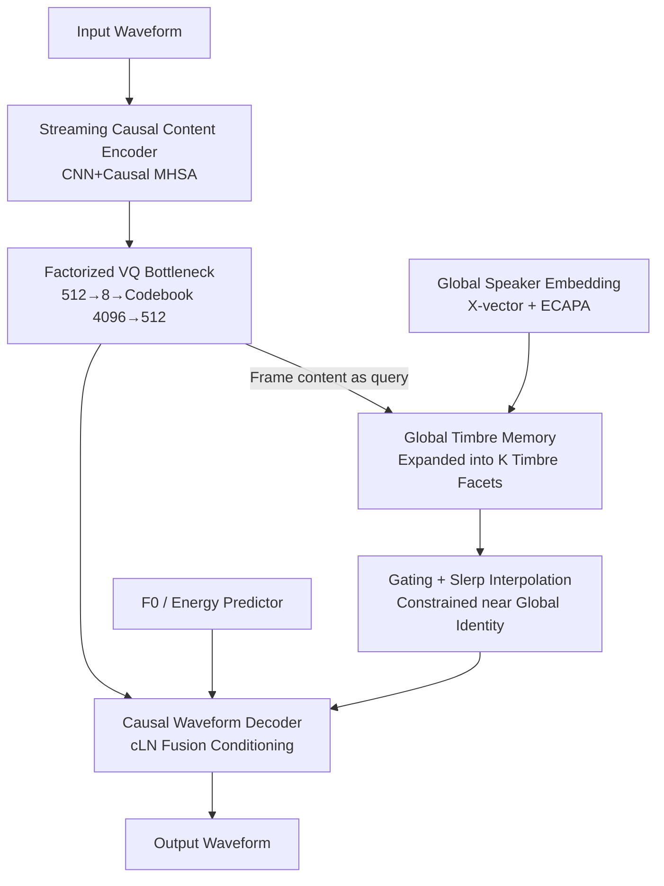

# TVTSyn: Content-Synchronized Time-Varying Timbre for Streaming Voice Conversion and Anonymization

**Conference**: ICLR 2026  
**OpenReview**: [https://openreview.net/forum?id=Tf4Lfw85lS](https://openreview.net/forum?id=Tf4Lfw85lS)  
**Code**: None (Audio samples only at [https://anonymized0826.github.io/TVTSyn/](https://anonymized0826.github.io/TVTSyn/))  
**Area**: Voice Conversion / Streaming Synthesis  
**Keywords**: Streaming Voice Conversion, Speaker Anonymization, Time-Varying Timbre, Vector Quantization, Low-Latency Synthesis

## TL;DR
To address the representation mismatch in streaming voice conversion—where "content varies frame-by-frame while speaker identity is injected as a static global vector"—TVTSyn utilizes a retrievable Global Timbre Memory (GTM) to expand static timbre into multiple timbre facets. Frame-level content performs attention-based retrieval, followed by gating and spherical interpolation to generate content-synchronized Time-Varying Timbre (TVT). Combined with a factorized VQ bottleneck to remove residual speaker info, TVTSyn achieves superior naturalness, speaker transfer, and anonymization effects compared to existing streaming baselines, with a GPU latency of <80ms.

## Background & Motivation
**Background**: Real-time voice conversion (VC) and speaker anonymization (SA) must maintain intelligibility and naturalness under strict causal and low-latency constraints while altering or erasing speaker identity. Recent streaming systems commonly adopt a "lightweight causal content encoder + direct waveform decoder" paradigm to push latency to sub-second levels.

**Limitations of Prior Work**: These systems suffer from a common structural flaw: content is represented as a frame-by-frame dynamic sequence, whereas speaker identity is often injected repeatedly into each frame as a **single static vector**. This temporal granularity mismatch between "dynamic content" and "static identity" suppresses expressiveness and produces over-smoothed timbre, particularly evident with intra-utterance variations in pronunciation, emotion, or stress. Furthermore, aggressive bottlenecks used to make content speaker-independent for anonymization can inadvertently erase meaningful variations like accents or emotional nuances, or even introduce artifacts.

**Key Challenge**: The authors argue that this "privacy vs. utility" trade-off is **fundamentally architectural**—a fixed speaker vector forces the decoder to reconcile two incompatible timescales.

**Goal**: Introduce "temporal granularity" to speaker condition injection, allowing it to vary frame-by-frame in synchronization with content, while remaining controllable and meeting strict latency budgets.

**Key Insight**: Since content is frame-granular, timbre should also be retrieved and modulated frame-by-frame based on content context. However, to prevent identity "drift," variations must be constrained around the global identity.

**Core Idea**: Replace static speaker embeddings with a content-synchronized **Time-Varying Timbre (TVT)** representation. Global timbre is expanded into a set of timbre facets stored in a memory bank, which frame-level content retrieves via attention. Gating regulates the magnitude of variation, and spherical interpolation preserves identity geometry.

## Method

### Overall Architecture
TVTSyn is an end-to-end streaming synthesizer composed of four modules: ① A **streaming content encoder** that converts input waveforms into discrete, speaker-independent frame-level linguistic representations; ② A **speaker processing block** that consumes global speaker embeddings to output content-aligned TVT; ③ A **pitch/energy predictor** to model frame-level prosodic changes; ④ A **causal waveform decoder** that reconstructs waveforms directly from the merged representations. During inference, conversion or anonymization is achieved by changing the speaker embedding or its time-varying trajectory while keeping linguistic content intact.

The content encoder and decoder are trained independently in two stages: the encoder is supervised by pseudo-labels from an offline HuBERT (self-supervised, no text/alignment needed), while the decoder reconstructs input speech from content and speaker streams. The entire pipeline uses a minimal mask-based future window in the encoder (4 future tokens, ~80ms) and is entirely causal in the decoder using a ring KV cache for rolling reuse of ~2 seconds of history, enabling end-to-end streaming.

### Key Designs

**1. Global Timbre Memory: Expanding a single static timbre into retrievable facets**

This is the core design addressing the "static identity vs. dynamic content" mismatch. The system concatenates noise-robust X-vectors and context-aware ECAPA-TDNN embeddings into a global speaker embedding $g$, which is then projected into a Global Timbre Memory (GTM) $\{(k_i, v_i)\}_{i=1}^{K}$ with $K$ key-value pairs. The GTM uses a dual representation: one part is generated from $g$ via MLPs (speaker-specific), while the other is a learnable prior prototype $k_i^{prior}, v_i^{prior}$ shared across all speakers:

$$k_i = \mathrm{MLP}_k(g)_i + k_i^{prior}, \quad v_i = \mathrm{MLP}_v(g)_i + v_i^{prior}$$

The priors capture universal timbre components (e.g., breathiness, nasality, brightness), while the MLP outputs modulate these prototypes to a specific identity. At time $t$, the content embedding $c_t$ performs scaled dot-product attention over these keys to retrieve weighted timbre components $v_t = \mathrm{Attn}(c_t, \{k_i\}, \{v_i\})$. This allows **dynamic selection of the most relevant timbre sub-components based on phoneme/prosody context**.

**2. Gating + Spherical Interpolation: Enabling frame-level variation without identity drift**

To prevent the identity from drifting, a gating network calculates a scalar $\alpha_t \in [0,1]$ to regulate how much the final embedding should deviate from the global timbre. The final time-varying embedding is obtained via interpolation: $s_t = \mathrm{Slerp}(g, v_t; \alpha_t)$. Using Spherical Linear Interpolation (Slerp) instead of Euclidean interpolation respects the hyperspherical geometry of the embedding space, maintaining angular velocity and constant norm $\theta_t = (1-\alpha_t)\theta_g + \alpha_t\theta_v$. This ensures $\{s_t\}$ retains the global identity while achieving local adaptation.

**3. Factorized VQ Bottleneck: Compression-then-discretization for removing speaker cues**

To ensure content is speaker-agnostic, a factorized Vector Quantization (VQ) bottleneck is placed after the content encoder. The 512-dim output is projected down to an **8-dimensional** latent vector, quantized using a **4096** size codebook, and projected back to 512 dimensions. This "compress then discretize" design forces the model to learn discrete, speaker-independent units while preserving linguistic fidelity. Training uses cross-entropy against k-means discrete pseudo-labels from HuBERT-base layer 9.

**4. All-Causal Streaming Architecture and cLN Fusion Conditioning**

The content encoder uses a causal 1-D CNN (total stride 320, ~20ms) and 8 layers of causal MHSA, with a future mask of 4 tokens (~80ms) for co-articulation cues. Timbre injection is performed via **Conditional Layer Normalization with Fusion**:

$$y_t = \mathrm{Proj}\big[(1+\gamma_t)\cdot \mathrm{Norm}(x_t) + \beta_t \,\|\, g_t\cdot \mathrm{Norm}(s_t)\big]$$

This dynamically integrates speaker information while providing stability to normalized content features. Ring KV caches are used for end-to-end streaming.

### Loss & Training
The content encoder and VQ bottleneck are trained on HuBERT pseudo-labels. The decoder uses a multi-objective loss: multi-window log-Mel L1 reconstruction loss $L_{mel}$, adversarial loss $L_{adv}$, feature matching $L_{fm}$, and F0/energy L2 loss $L_{f0\text{-}e}$:

$$L_{total} = \lambda_{mel}L_{mel} + \lambda_{adv}L_{adv} + \lambda_{fm}L_{fm} + \lambda_{f0\text{-}e}L_{f0\text{-}e}$$

Weights are set as $\lambda_{mel}=\lambda_{f0\text{-}e}=20$, $\lambda_{adv}=1$, and $\lambda_{fm}=2$.

## Key Experimental Results

### Main Results

Results for Voice Conversion (NISQA naturalness↑, Src-SIM similarity to source↓, Trg-SIM similarity to target↑):

| Metric | TVTSyn | SLT24 | Note |
|------|--------|-------|------|
| NISQA-MOS ↑ | 3.91 | 4.01 | Second only to SLT24; Ground Truth is 4.41 |
| Src-SIM ↓ | 0.47–0.48 | — | Comparable to real "different speaker" similarity (0.48) |
| Trg-SIM ↑ | 0.77 | — | Comparable to real "same speaker" similarity (0.77) |

In human listening tests (N=20), TVTSyn achieved the highest MOS (3.82±0.10) and a target speaker preference rate of 74.33%.

Anonymization (VPC'24, WER↓ Intelligibility, EER↑ Privacy):

| Model | WER ↓ | EER(lazy) ↑ | EER(semi) ↑ |
|------|-------|-------------|-------------|
| TVTSyn | **5.35** | 47.55 | 14.57 |
| SLT24 | 5.70 | 31.40 | 10.12 |
| DarkStream | 10.80 | 49.09 | 20.83 |

Ours outperforms all streaming baselines in intelligibility while maintaining competitive privacy.

### Ablation Study

GTM component ablation:

| Configuration | Trg-SIM ↑ | NISQA ↑ | Note |
|------|-----------|---------|------|
| Full (48 GTM tokens) | 0.77 | 3.91 | Full model |
| w/o GTM | 0.75 | 3.45 | Quality drops the most without content-synced timbre |
| w/o prior | 0.75 | 3.62 | Generalization suffers without universal prototypes |
| w/o slerp | 0.76 | 3.75 | Replaced with linear interpolation |

### Key Findings
- **Removing GTM causes the largest drop** (NISQA 3.91 $\rightarrow$ 3.45), proving content-synchronized timbre is vital for naturalness.
- **Privacy is architectural; quality is driven by TVT**: Src-SIM remains stable at $\sim$0.48 across TVT ablations, indicating anonymization strength depends on the encoder/VQ architecture.
- **Latency**: GPU $\approx$ 78.5ms for a 60ms chunk (RTF 0.308). Entirely causal without separate look-ahead.

## Highlights & Insights
- **Diagnosing the "Static Identity" problem as "Temporal Granularity Mismatch"**: Instead of just tightening bottlenecks, the authors identify an architectural incompatibility between timescales.
- **The "Expand-Retrieve-Geometric Constraint" pattern is highly transferable** for any frame-level modulation that must remain anchored to a global attribute.
- **Dual Representation (Prior + MLP)** provides a strong inductive bias for unseen speakers, significantly improving sample efficiency.

## Limitations & Future Work
- Use of only **28 fixed pseudo-speakers** for anonymization.
- Privacy under "Semi-informed" attackers (EER 14.57%) is lower than offline systems.
- Intentional emotional suppression (low UAR); future work aims to disentangle timbre and style facets for more controllable anonymization.

## Related Work & Insights
- **vs. SLT24 / DarkStream**: These use static global vectors. Ours uses TVT, achieving better WER (5.35 vs 5.70/10.8) and naturalness without the 140ms look-ahead required by DarkStream.
- **vs. GenVC**: GenVC uses non-causal encoders; TVTSyn is end-to-end causal and achieves better anonymization under streaming constraints.

## Rating
- **Novelty**: ⭐⭐⭐⭐ Identifies architectural granularity mismatch; elegant GTM+Slerp solution.
- **Experimental Thoroughness**: ⭐⭐⭐⭐ Comprehensive VC/SA tasks; detailed ablations.
- **Writing Quality**: ⭐⭐⭐⭐ Clear motivation; intuitive analogies.
- **Value**: ⭐⭐⭐⭐ Practical for real-time privacy preservation in teleconferencing.

<!-- RELATED:START -->

## Related Papers

- [\[ICLR 2026\] WearVox: An Egocentric Multichannel Voice Assistant Benchmark for Wearables](wearvox_an_egocentric_multichannel_voice_assistant_benchmark_for_wearables.md)
- [\[ICLR 2026\] SpeechOp: Inference-Time Task Composition for Generative Speech Processing](speechop_inference-time_task_composition_for_generative_speech_processing.md)
- [\[ICLR 2026\] UniSS: Unified Expressive Speech-to-Speech Translation with Your Voice](uniss_unified_expressive_speech-to-speech_translation_with_your_voice.md)
- [\[ICLR 2026\] When and Where to Reset Matters for Long-Term Test-Time Adaptation](when_and_where_to_reset_matters_for_long-term_test-time_adaptation.md)
- [\[ICLR 2026\] DrVoice: Parallel Speech-Text Voice Conversation Model via Dual-Resolution Speech Representations](drvoice_parallel_speech-text_voice_conversation_model_via_dual-resolution_speech.md)

<!-- RELATED:END -->
