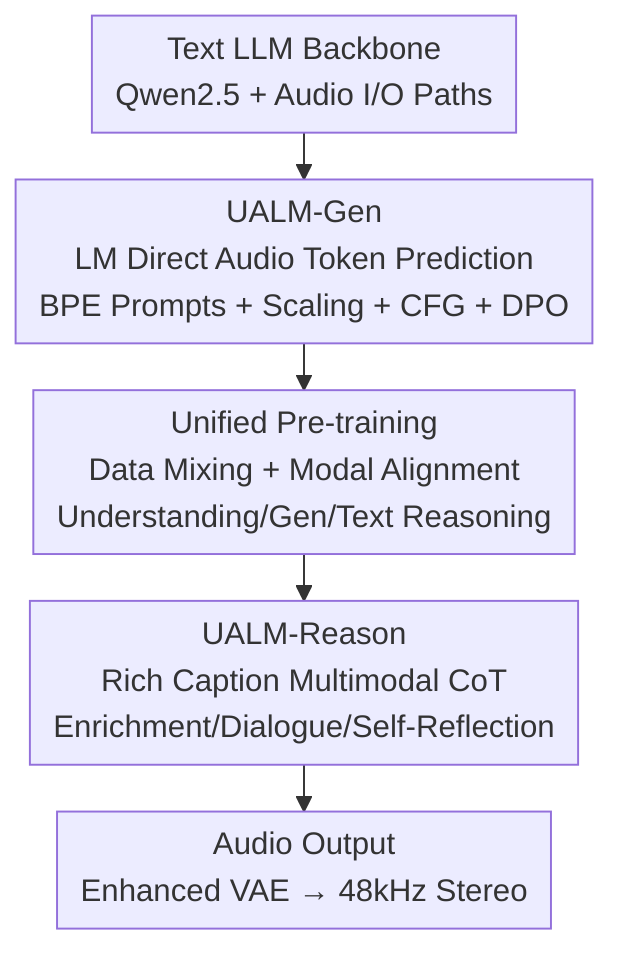

# UALM: Unified Audio Language Model for Understanding, Generation and Reasoning

**Conference**: ICLR 2026  
**OpenReview**: [https://openreview.net/forum?id=TsdlOjcQNu](https://openreview.net/forum?id=TsdlOjcQNu)  
**Code**: https://github.com/NVIDIA/audio-intelligence/tree/main/UALM  
**Area**: Audio & Speech / Multimodal / Unified Generation and Understanding  
**Keywords**: Unified Audio Language Model, Text-to-Audio Generation, Multimodal Reasoning, Audio tokens, Self-reflection

## TL;DR
UALM utilizes a single autoregressive language model to unify audio understanding, text-to-audio generation, and multimodal reasoning. It first demonstrates that a pure LM directly predicting audio tokens can match the generation quality of diffusion models (UALM-Gen), then integrates all three capabilities into one model via data mixing and modal alignment (UALM), and finally empowers the model with generative multimodal reasoning through interleaved "text+audio" Chain-of-Thought for planning, self-evaluation, and revision (UALM-Reason).

## Background & Motivation

**Background**: Current Audio Language Modeling (ALM) typically treats "audio understanding" and "text-to-audio generation" as separate tracks with conflicting modeling paradigms—understanding tasks generally use autoregressive LLMs (e.g., AF3, Qwen2.5-Omni), while SOTA generation models are almost exclusively diffusion-based (e.g., Stable Audio, ETTA).

**Limitations of Prior Work**: This dual-paradigm approach leads to three issues. First, no single model can "listen while generating and revising" like a human composer; understanding and generation capabilities do not benefit each other. Second, reasoning research in the audio domain is severely lacking; existing "reasoning" is confined to text-only trajectories and serves only understanding tasks, with no multimodal reasoning developed for "guiding generation." Third, there is a general consensus that LM-based audio generation quality cannot compete with diffusion models, leading researchers to abandon unified LM frameworks for generation.

**Key Challenge**: To achieve unification, generation must run on an autoregressive LM to share a token space with understanding and text reasoning; however, LM generation is widely considered inferior. This "necessary prerequisite for unification" is stalled by the "perceived disadvantage of LM generation."

**Goal**: Address three progressive sub-problems: (1) enable pure LM text-to-audio generation to match diffusion models; (2) balance understanding, generation, and text reasoning within a single LM without performance degradation; (3) achieve "generative multimodal reasoning" that transcends text-only trajectories.

**Key Insight**: The authors discover that the poor performance of LM generation is not due to the paradigm's ceiling but rather incorrect engineering recipes—insufficient data scale, lack of Classifier-Free Guidance (CFG), improper codec and sampling methods, and a lack of preference optimization. By addressing these, LM generation performance can be significantly improved.

**Core Idea**: Use a decoder-only LM + discrete audio token output to unify the three capabilities, and introduce "rich captions" as intermediate blueprints for generation, allowing the model to plan, critique, and revise its own generated results using interleaved text and audio in a Chain-of-Thought.

## Method

### Overall Architecture

The foundation of UALM is a decoder-only text LLM (Qwen2.5-7B), extended with audio input and output paths. **Audio input** follows the Encoder-Adapter-LLM route (25Hz acoustic encoder + single-layer MLP adapter, using continuous representations to avoid quantization loss). **Audio output** predicts discrete codec tokens (X-codec, 50Hz, 8 tokens per frame via RVQ, using a delay pattern for intra-frame autoregression), followed by an enhanced VAE to upsample the 16kHz mono waveform to 48kHz stereo. Training calculates loss only on output tokens, where one audio frame is equivalent to one text token (loss per audio token is scaled by 1/8).

The system is built in three stages: first, a generative LM is trained (**UALM-Gen**); second, a unified model is obtained via mixed-data pre-training (**UALM**); and finally, reasoning capabilities are injected through two rounds of SFT-DPO post-training (**UALM-Reason**). All three share the same backbone with progressively stacked capabilities.

### Key Designs

**1. UALM-Gen: Breaking the Consensus that "LM Audio Generation is Inferior"**

This step addresses the prerequisite of unification—autoregressive LM generation quality must match diffusion models. The authors systematically improved four engineering aspects. First, **removing external text encoders**: unlike prior LM or diffusion methods relying on external encoders like T5 for cross-attention, the authors proved that LM generation can treat text prompts as standard BPE tokens, reusing the LLM's linguistic knowledge. Second, **data scale**: LM generation is much more "data-hungry" than diffusion. While diffusion models succeed with <2M samples (<4k hours), LMs require 30M samples (80k hours, 17B tokens) to compete, showing significant overfitting at 1/32 of that scale. Third, **CFG**: common in diffusion but rare in multimodal LMs, CFG is used during both training and sampling as:

$$\pi^{\text{CFG}}_\theta(y_t\mid y_{1:t-1},x)=\lambda\cdot\pi_\theta(y_t\mid y_{1:t-1},x)+(1-\lambda)\cdot\pi_\theta(y_t\mid y_{1:t-1},\varnothing)$$

interpolating between conditional and unconditional distributions (optimal $\lambda=3.0$). Fourth, **DPO + Adaptation**: preference optimization follows cross-entropy training. Since the base model has only seen real audio, directly applying DPO with synthetic samples causes loss spikes; thus, the model is first adapted to the synthetic domain using "win-samples" for cross-entropy fine-tuning (roughly 1k steps), with cross-entropy regularization added during DPO to penalize deviation from the reference distribution $\pi_\theta(y_w\mid x)-\pi_{\text{ref}}(y_w\mid x)$.

**2. Unified Pre-training: Balancing Capabilities via Data Ratios and Modal Alignment**

Existing unified models in vision or speech exist, but their recipes often fail in the broader audio domain. The solution involved two points. First, **data mixing ratios**: audio understanding, generation, and text reasoning data were mixed at 27.7%/33.1%/39.2% based on token counts, with generation data 2x oversampled due to slower convergence. Second, **modal alignment stage**: as full-parameter training might degrade the pre-trained LLM backbone, the Transformer and acoustic encoder were initially frozen to warm up the MLP adapter and audio embeddings with a large batch size, followed by full unfreezing (the acoustic encoder remained frozen throughout).

**3. UALM-Reason: Multi-modal Chain-of-Thought with Rich Captions**

Audio generation reasoning was previously a blank slate. The core mechanism is the **rich caption**: a structured text blueprint containing Keywords (acoustic events), Layout (temporal arrangement), and Description (acoustic attributes). Three reasoning modes were established: **Enrichment** (translating abstract prompts into rich captions); **Dialogue** (multi-turn collaboration to resolve ambiguity); and **Self-Reflection** (the highest form—the model listens to its own output, generates a rich caption describing the actual result, critiques it against the plan, and generates an improved version). This is injected via **two rounds of interleaved SFT-DPO**.

### Case Example: Correcting Temporal Errors via Self-Reflection

For a prompt "generate music with brass followed by percussion": the model **enriches** a rich caption (Layout: brass first, percussion following) and **generates** version 1. The model then **listens** to its output and generates a caption reflecting the reality: "brass and percussion played simultaneously." The model writes a **critique**—"They were concurrent; brass should appear before percussion"—and **revises** the generation to version 2, correcting the temporal sequence. This cycle integrates understanding and generation within one CoT.

## Key Experimental Results

### Main Results

Audio Generation (SongDescriber / AudioCaps, lower FD/KL is better, higher CL/AES/OVL/REL is better):

| Model | SongDescriber FD↓ | SongDescriber CL↑ | AudioCaps FD↓ | AudioCaps IS↑ | Type |
|------|------|------|------|------|------|
| ETTA | 95.66 | 0.44 | 80.13 | 14.36 | Diffusion SOTA |
| Stable Audio Open | 138.58 | 0.42 | 100.93 | 11.80 | Diffusion |
| TangoFlux | 235.61 | 0.41 | 103.04 | 15.13 | Diffusion |
| MusicGen-stereo-L | 228.94 | 0.36 | — | — | LM |
| **UALM-Gen (Ours)** | **74.43** | **0.54** | **75.14** | 14.52 | LM |
| **UALM (Ours)** | 83.69 | **0.54** | **65.87** | **15.62** | Unified LM |

UALM-Gen outpaces all diffusion baselines across multiple metrics. The unified UALM further improves AudioCaps FD to 65.87, proving the LM paradigm can exceed diffusion performance.

Audio Understanding (MMAU / MMAR) and Text Capabilities:

| Model | MMAU Mean↑ | MMAR↑ | Remark |
|------|------|------|------|
| Audio Flamingo 3 | 72.3 | 58.5 | Understanding SOTA |
| Qwen2.5-Omni | 71.0 | 56.7 | Unified Speech |
| **UALM (Ours)** | **74.1** | 55.2 | Single Model |

| Model | MMLU↑ | GSM8K↑ | HumanEval↑ |
|------|------|------|------|
| Qwen2.5-7B-Instruct | 74.5 | 91.6 | 84.8 |
| **UALM (Ours)** | 71.6 | 92.1 | 81.1 |

UALM's audio understanding (MMAU 74.1) exceeds specialized models like AF3, while text reasoning remains highly competitive compared to recent unified models like Chameleon.

### Ablation Study

| Configuration | Observation | Explanation |
|------|------|------|
| No CFG | Generation quality collapses | CFG is mandatory for LM generation, optimal $\lambda=3.0$ |
| 1/32 Data (≈1M) | Significant overfitting | Data scale is key; LM needs far more than diffusion |
| DPO without Adaptation | Initial loss spike | Needs win-sample warmup for the synthetic domain |
| DPO without CE Reg | Large deviation from ref | CE reg prevents $\pi_\theta-\pi_{\text{ref}}$ divergence |

### Key Findings
- **Data scale is critical for LM generation**: While diffusion models perform well with 1-2M samples, LMs require an order of magnitude more (30M).
- **Understanding converges faster than generation**: Training curves indicate that audio understanding stabilizes quickly, while generation requires much longer, justifying the 2x oversampling.
- **OOD issues in DPO**: Models trained on real audio fail when suddenly exposed to synthetic preference pairs; adaptation + CE regularization are essential.
- **Rich captions provide fine-grained control**: UALM-Reason successfully distinguishes quantity, spatial location, temporal order, and texture (e.g., distortion).

## Highlights & Insights
- **"LM < Diffusion" is an engineering issue, not a paradigm failure**: By systematically applying recipes like CFG, DPO adaptation, and massive scaling—often taken for granted in diffusion but overlooked in LMs—the authors overturned the consensus.
- **Rich captions as "critique-able intermediate representations"**: This transforms abstract "self-reflection" into a concrete, executable text diff between planned and actual captions.
- **Unified token space is the prerequisite for multimodal reasoning**: Autoregressive tokens allow understanding and generation to be interleaved in a single sequence, something diffusion-based systems cannot naturally achieve.

## Limitations & Future Work
- **Lack of objective metrics for generative reasoning**: Evaluation currently relies heavily on qualitative analysis and subjective ratings.
- **High computational cost**: Training at the scale of 30M audio pairs on 16 nodes of A100s presents a high barrier to entry.
- **Marginal loss in text performance**: MMLU dropped from 74.5 to 71.6; seamless fusion without any degradation remains an open problem.
- **Limited depth in self-reflection**: Currently only involves one round of revision; the reliability of critique signals for multiple iterations is unexplored.

## Related Work & Insights
- **vs Diffusion (ETTA/Stable Audio)**: Diffusion is more data-efficient but cannot easily integrate into a unified LM; UALM proves LMs can match quality given enough data.
- **vs Understanding-only (Audio Flamingo 3)**: UALM matches or exceeds these specialized models while adding generative capabilities.
- **vs Unified Multimodal LLMs (Chameleon/OpusLM)**: While prior unified models often suffer from degraded text performance (MMLU ~52), UALM preserves text capability (71.6) and realizes cross-modal generative reasoning.
- **vs Text-only Reasoning**: Unlike Audio Reasoner, UALM-Reason allows the audio itself to enter the Chain-of-Thought (generate-listen-critique).

## Rating
- Novelty: ⭐⭐⭐⭐⭐ 
- Experimental Thoroughness: ⭐⭐⭐⭐ 
- Writing Quality: ⭐⭐⭐⭐⭐ 
- Value: ⭐⭐⭐⭐⭐

<!-- RELATED:START -->

## Related Papers

- [\[ICLR 2026\] MMSU: A Massive Multi-task Spoken Language Understanding and Reasoning Benchmark](mmsu_a_massive_multi-task_spoken_language_understanding_and_reasoning_benchmark.md)
- [\[ICLR 2026\] SmartDJ: Declarative Audio Editing with Audio Language Model](smartdj_declarative_audio_editing_with_audio_language_model.md)
- [\[ICLR 2026\] OWL: Geometry-Aware Spatial Reasoning for Audio Large Language Models](owl_geometry-aware_spatial_reasoning_for_audio_large_language_models.md)
- [\[ICLR 2026\] Human Behavior Atlas: Benchmarking Unified Psychological and Social Behavior Understanding](human_behavior_atlas_benchmarking_unified_psychological_and_social_behavior_unde.md)
- [\[ICLR 2026\] Music Flamingo: Scaling Music Understanding in Audio Language Models](music_flamingo_scaling_music_understanding_in_audio_language_models.md)

<!-- RELATED:END -->
## Related Papers

- [\[ICLR 2026\] MMSU: A Massive Multi-task Spoken Language Understanding and Reasoning Benchmark](mmsu_a_massive_multi-task_spoken_language_understanding_and_reasoning_benchmark.md)
- [\[ICLR 2026\] SmartDJ: Declarative Audio Editing with Audio Language Model](smartdj_declarative_audio_editing_with_audio_language_model.md)
- [\[ICLR 2026\] OWL: Geometry-Aware Spatial Reasoning for Audio Large Language Models](owl_geometry-aware_spatial_reasoning_for_audio_large_language_models.md)
- [\[ICLR 2026\] Human Behavior Atlas: Benchmarking Unified Psychological and Social Behavior Understanding](human_behavior_atlas_benchmarking_unified_psychological_and_social_behavior_unde.md)
- [\[ICLR 2026\] AudioX: A Unified Framework for Anything-to-Audio Generation](audiox_a_unified_framework_for_anything-to-audio_generation.md)

<!-- RELATED:END -->
