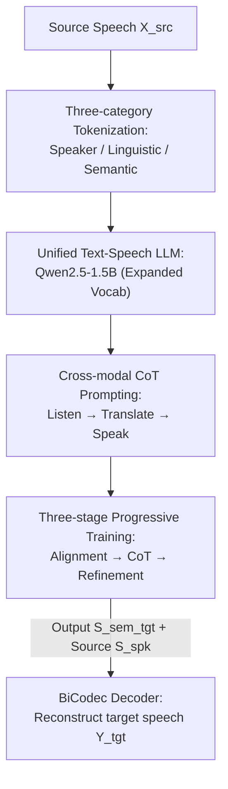

# UniSS: Unified Expressive Speech-to-Speech Translation with Your Voice

**Conference**: ICLR 2026  
**OpenReview**: [https://openreview.net/forum?id=5o0ZvYzh6B](https://openreview.net/forum?id=5o0ZvYzh6B)  
**Code**: None (Demo page only: https://cmots.github.io/uniss-demo/)  
**Area**: Speech Translation / Speech Generation  
**Keywords**: Speech-to-Speech Translation, Expressiveness Preservation, Cross-modal Chain-of-Thought, Unified Language Model, S2ST Dataset  

## TL;DR
UniSS discretizes speech into three types of tokens—speaker, linguistic, and semantic—and integrates them directly into a pre-trained text LLM (Qwen2.5-1.5B). By employing a single-stage autoregressive model with a "Listen-Translate-Speak" cross-modal Chain-of-Thought (CoT) prompt, it transfers the LLM's inherent text translation capabilities to the speech domain. This approach achieves accurate translation while preserving the original speaker's timbre, emotion, and duration, and additionally releases UniST, a 44.8k-hour Chinese-English expressive S2ST dataset.

## Background & Motivation

**Background**: Speech-to-Speech Translation (S2ST) aims to convert spoken language from one tongue to another. Traditional approaches utilize a cascaded triad: Automatic Speech Recognition (ASR), Machine Translation (MT), and Text-to-Speech (TTS). Recent trends have shifted toward end-to-end systems, leveraging LLMs to discretize speech into tokens for autoregressive generation.

**Limitations of Prior Work**: The authors identify three primary hurdles in this field. First, paired speech data capable of preserving both emotion and timbre is extremely scarce; existing datasets are either too small to train large models or collected from the web with inconsistent quality. Second, current LLM-based architectures are overly complex, often requiring multi-head parallel prediction for multi-stream acoustic tokens or a two-stage process (generating semantic tokens followed by a non-autoregressive (NAR) model). Some architectures, like Hibiki, even require training nested Transformers from scratch. Third, these methods often treat the LLM as a generic sequence converter, failing to utilize the rich text translation knowledge acquired during pre-training.

**Key Challenge**: No prior method has simultaneously achieved a single-stage concise architecture, unification of speech and text modalities, and explicit reuse of LLM text translation capabilities for expressive S2ST. There is a tension between architectural complexity and "fully exploiting the translation potential of LLMs": the more modules added to complete acoustic details, the further the system deviates from the simplicity of a pure text LLM, making it harder to directly invoke translation priors.

**Goal**: To utilize a pre-trained text LLM without architectural modifications to achieve "accurate translation + preservation of timbre/emotion/duration" in a single stage, while simultaneously addressing the limitation of data scarcity.

**Key Insight**: The authors observe that if speech can be represented as discrete tokens within the LLM's vocabulary, S2ST becomes essentially isomorphic to text translation. Similar to CoT, the model can first "mentally translate into text" before "speaking it out," thereby facilitating the transfer of text translation capabilities to speech.

**Core Idea**: Replace complex multi-stream/two-stage + NAR architectures with "three types of speech tokens + single-stage autoregressive LLM + cross-modal CoT." This allows a 1.5B text LLM to directly perform expressive S2ST.

## Method

### Overall Architecture

UniSS takes source speech $X_{src}$ as input and outputs target speech $Y_{tgt}$ that preserves the source speaker's timbre and emotion. The pipeline models the conditional distribution $P(Y_{tgt}|X_{src})$. It segments speech into three types of discrete tokens: speaker tokens $S^{spk}$ (a fixed set of 32 tokens encoding global style like timbre/prosody/emotion), linguistic content tokens $S^{ling}$ (encoding source content), and semantic tokens $S^{sem}$ (representing target utterances, directly decodable to waveforms). The process follows a single-stage autoregressive flow:

$$X_{src} \xrightarrow{\text{Tokenize}} (S^{spk}_{src}, S^{ling}_{src}) \xrightarrow{\text{Speech Translate}} (S^{spk}_{src}, S^{sem}_{tgt}) \xrightarrow{\text{Detokenize}} Y_{tgt}.$$

The source speaker and linguistic tokens serve as a prompt for the LLM, which autoregressively generates target semantic tokens. These are then combined with the source speaker tokens and fed into a BiCodec decoder to reconstruct the waveform. No intermediate acoustic representations or cascaded systems are required. The generation is organized via a "Listen-Translate-Speak" cross-modal CoT, and the model acquires this capability through three-stage progressive training.

### Key Designs

**1. Three types of speech tokenization: Decoupling timbre, content, and semantics into discrete sequences**

Using a single type of speech token for both content understanding and waveform reconstruction often leads to compromises. Preliminary experiments showed that while BiCodec's semantic tokens are excellent for reconstruction, their self-supervised nature makes them poor for content understanding. UniSS employs three tokenizers: the speaker tokenizer uses BiCodec's global encoder to extract 32 fixed-length tokens $S^{spk}$; the semantic tokenizer also comes from BiCodec, encoding waveforms at 50 tokens per second ($S^{sem}$); the linguistic content tokenizer uses GLM-4’s speech tokenizer (based on a quantized Whisper encoder) producing variable-length tokens at 12.5 tokens per second ($S^{ling}$) for robust content understanding. By representing source speech as $(S^{spk}_{src}, S^{ling}_{src})$ and target speech as $S^{sem}_{tgt}$, the model can accurately translate while controlling style. Replacing GLM-4 tokens with BiCodec tokens (w/o GLM) results in a Speech-BLEU drop of 15.01 / 8.73, confirming that content tokens are essential for understanding.

**2. Unified Text-Speech Language Model: Integrating speech into the LLM vocabulary without architectural changes**

To explicitly reuse translation priors, UniSS utilizes a pre-trained Qwen2.5-1.5B-Instruct as the backbone. The vocabulary is expanded to 180,407 to accommodate speech and control tokens. Consequently, speech and text are treated equally as token sequences within the same Transformer. The model processes prompts composed of speaker and linguistic tokens and autoregressively generates target semantic tokens using the standard next-token prediction objective:

$$L_{AR} = -\sum_{t=1}^{|\tau_{out}|} \log P_\theta(\tau_{out,t}\mid P, \tau_{out,<t}),$$

where $P$ is the input prompt including $(S^{spk}_{src}, S^{ling}_{src})$, and $\tau_{out}$ consists of text tokens, semantic tokens, or a concatenation depending on the task. The decoder reconstructions $Y_{tgt} = \text{Decoder}([S^{spk}_{src}, S^{sem}_{tgt}])$ into 16kHz high-fidelity audio, anchoring timbre and emotion to the source speaker without an NAR second stage. This single-stage acoustic fidelity is achieved by conditioning the decoder on the source speaker token.

**3. Cross-modal Chain-of-Thought prompting: Translating in text before speaking**

UniSS borrows from CoT to decompose S2ST into "Listen-Translate-Speak," transferring text translation expertise to the speech domain. The input is a structured prompt $P = [c_{task}, c^{tgt}_{lang}, c_{speed}, S^{spk}_{src}, S^{ling}_{src}]$, defining the task mode, target language, and source/target duration ratio. Two modes are provided for balancing fidelity and efficiency: **Quality Mode** follows the full CoT (transcribing source text $T_{src}$, translating to target text $T_{tgt}$, then generating semantic tokens), yielding $\tau_{out} = [T_{src}, T_{tgt}, S^{sem}_{tgt}]$. **Performance Mode** skips the transcription to output $\tau_{out} = [T_{tgt}, S^{sem}_{tgt}]$ for faster inference. Removing intermediate text (Direct S2ST) causes Speech-BLEU to plummet by 14.94 / 14.40, highlighting the importance of the text-based thinking chain. Additionally, $c_{speed}$ discretizes the duration ratio into speed tokens (0.1 intervals), enabling precise duration alignment.

**4. Three-stage Progressive Training: Aligning, S2ST training, and refining to prevent forgetting**

To prevent the catastrophic forgetting of text translation capabilities when integrating speech, UniSS uses three stages. **Phase 1: Speech-Text Alignment** involves multi-task training on ASR, TTS, S2TT, and MT. The first three align speech and text, while MT preserves the model's translation foundation. **Phase 2: S2ST with CoT** introduces the core S2ST task using the CoT prompt format mixed with Phase 1 data at a 2:1 ratio. **Phase 3: Refinement** utilizes a high-quality subset, UniST High-Quality, with an annealed learning rate to stabilize the CoT patterns and optimize final performance. Removing Phase 1 (Ours only) leads to a Speech-BLEU drop of 7.18 / 10.15, proving that alignment is the bedrock for S2ST.

### Loss & Training

The objective is next-token prediction $L_{AR}$. Optimization uses AdamW (weight decay 0.1, momentum (0.9, 0.95)) with a batch size of 2.3M tokens. Training was conducted on 16 H800 GPUs using Megatron-LM. The learning rate starts at 8e-4 in Phase 1, drops to 2e-4 in Phase 2, and poly-anneals from 5e-5 to 5e-6 in Phase 3.

**Dataset (UniST)**: Cleaned from public CN-EN TTS corpora using Paraformer (WER < 0.05). Qwen2.5-72B translated target text, and SparkTTS synthesized target speech conditioned on the source. After filtering for WER < 0.01 and duration ratios [0.5, 2.0], 44.8k hours of **UniST General** were produced. A further refined subset, **UniST High-Quality** (19.8k hours), used stricter VAD and duration ratio [0.7, 1.5] for Phase 3.

## Key Experimental Results

### Main Results

On the CVSS-T test set (results as EN-ZH | ZH-EN), UniSS with 1.5B parameters achieves state-of-the-art performance in translation fidelity, duration consistency, and speech quality:

| Category | Model | #Params | Speech-BLEU | SLC 0.2 | UTMOS |
| :--- | :--- | :--- | :--- | :--- | :--- |
| Cascade | 2-Stage (SeamlessM4T+CosyVoice2) | 2.8B | 26.94 \| 20.86 | 0.67 \| 0.52 | 3.79 \| 3.48 |
| MLLM | GPT-4o | - | 31.64 \| 19.27 | 0.47 \| 0.37 | 3.46 \| 4.18 |
| End-to-End | Seamless-L | 2.3B | 25.05 \| 17.67 | 0.67 \| 0.36 | 2.69 \| 4.04 |
| End-to-End | Seamless-Ex (Expressive) | 1.7B | 24.45 \| 15.84 | 0.68 \| 0.52 | 2.46 \| 2.90 |
| **Ours** | **UniSS (P)** | 1.5B | 30.28 \| 23.61 | 0.98 \| 0.84 | 3.77 \| 3.86 |
| **Ours** | **UniSS (Q)** | 1.5B | **32.20 \| 24.28** | **0.98 \| 0.87** | 3.76 \| 3.86 |

UniSS (Q) significantly outperforms all baselines in Speech-BLEU. Duration consistency (SLC 0.2) improved by approximately 44% (EN-ZH) and 67% (ZH-EN) compared to the best prior end-to-end system, Seamless-Ex. Subjective MOS scores for UniSS (Q) reached 4.51 for emotional similarity, 4.42 for speaker similarity (highest in class), and 4.45 for naturalness.

### Ablation Study

| Configuration | Speech-BLEU (EN-ZH \| ZH-EN) | Description |
| :--- | :--- | :--- |
| Phase 1+2 (Base) | 29.38 \| 21.55 | Baseline |
| w/ Phase 3 | 30.28 \| 23.61 | Refinement gain +0.90 / +2.06 |
| UniST only (Remove Phase 1) | 22.20 \| 11.40 | Alignment removal drop -7.18 / -10.15 |
| w/o GLM (Switch back to self-supervised) | 14.37 \| 12.82 | Content token degradation -15.01 / -8.73 |
| Direct S2ST (Remove CoT text) | 14.44 \| 7.15 | CoT removal drop -14.94 / -14.40 |

### Key Findings
- **Cross-modal CoT is the lifeblood**: Removing intermediate text results in the largest performance drop (~15 points), indicating that translating in text first is the core mechanism for transferring LLM capabilities to speech.
- **Content token selection determines the ceiling**: Switching to self-supervised tokens severely hurts performance, confirming that generation-friendly tokens are not necessarily understanding-friendly.
- **Efficiency-Quality trade-off**: Performance Mode is 1.07× faster than Quality Mode with only a minor drop in BLEU. Using the 0.5B UniSS-Small (P) provides a 1.25× speedup while maintaining competitive performance.

## Highlights & Insights
- **"Integrating speech into LLM" rather than "modifying LLM for speech"**: Keeping the Qwen architecture intact and only expanding the vocabulary allows the model to inherit text translation priors effortlessly.
- **CoT transfer from text to cross-modal**: Treating "Listen-Translate-Speak" as an explicit chain leverages the LLM's "think before answering" habit to bridge modality gaps.
- **Decoupled token strategy**: Using a 32-token speaker embedding for decoder conditioning eliminates the need for complex NAR stages while achieving superior speaker similarity.
- **Speed tokens for duration alignment**: Discretizing the duration ratio into control tokens effectively solves a long-standing challenge in S2ST consistency.

## Limitations & Future Work
- **Bilingual only**: Currently limited to CN-EN. While the data pipeline is extensible to multi-lingual scenarios, this has not yet been verified.
- **Tokenizer heterogeneity**: The use of three different tokenizers leads to a large vocabulary (180k). Future work may involve training a unified tokenizer.
- **Synthetic data reliance**: The UniST dataset relies on SparkTTS and Qwen2.5-72B, meaning performance is capped by these upstream models. Real-world expressive parallel S2ST data remains scarce.
- **Ethical Risks**: Timbre-preserving translation poses risks related to audio deepfakes and impersonation, as noted in the ethical statement.

## Related Work & Insights
- **vs Cascade (ASR→MT→TTS)**: Cascades accumulate errors and lose paralinguistic features. UniSS prevents error accumulation while preserving timbre and emotion, outperforming 2-stage pipelines in speaker similarity.
- **vs Hibiki / Multi-stream LLM-S2ST**: These models require complex nested Transformers or multi-stream tokens. UniSS achieves better accuracy with a standard 1.5B LLM and no NAR stage.
- **vs Seamless / SeamlessExpressive**: Seamless uses specialized prosody encoders. UniSS achieves comparable prosody with a simpler design and significantly leads in Speech-BLEU and naturalness.
- **vs LLM as generic sequence converter**: Unlike prior works that waste pre-trained translation knowledge, UniSS explicitly invokes it via cross-modal CoT.

## Rating
- Novelty: ⭐⭐⭐⭐⭐ The "three-token decoupling + cross-modal CoT" transformation of a text LLM into a single-stage expressive S2ST is a clean and robust new paradigm.
- Experimental Thoroughness: ⭐⭐⭐⭐ Solid objective and subjective evaluations across multiple baselines; however, the bilingual scope and reliance on synthetic metrics are slight limitations.
- Writing Quality: ⭐⭐⭐⭐⭐ The logical progression from challenges to design principles and final performance is exceptionally clear.
- Value: ⭐⭐⭐⭐⭐ The simplified paradigm and the 44.8k-hour UniST dataset represent a significant contribution to expressive S2ST research.

<!-- RELATED:START -->

## Related Papers

- [\[ICLR 2026\] Scalable Multilingual Multimodal Machine Translation with Speech-Text Fusion](scalable_multilingual_multimodal_machine_translation_with_speech-text_fusion.md)
- [\[ICLR 2026\] MambaVoiceCloning: Efficient and Expressive Text-to-Speech via State-Space Modeling and Diffusion Control](mambavoicecloning_efficient_and_expressive_text-to-speech_via_state-space_modeli.md)
- [\[ACL 2026\] Computational Narrative Understanding for Expressive Text-to-Speech](../../ACL2026/audio_speech/computational_narrative_understanding_for_expressive_text-to-speech.md)
- [\[ACL 2026\] StressTest: Can YOUR Speech LM Handle the Stress?](../../ACL2026/audio_speech/stresstest_can_your_speech_lm_handle_the_stress.md)
- [\[ICLR 2026\] Pay Attention to CTC: Fast and Robust Pseudo-Labelling for Unified Speech Recognition](pay_attention_to_ctc_fast_and_robust_pseudo-labelling_for_unified_speech_recogni.md)

<!-- RELATED:END -->
