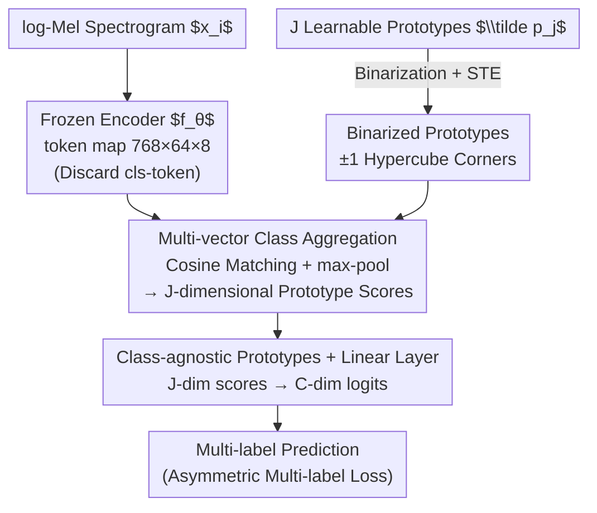

# Unmute the Patch Tokens: Rethinking Probing in Multi-Label Audio Classification

**Conference**: ICLR 2026  
**OpenReview**: [https://openreview.net/forum?id=FbY5Co2NWk](https://openreview.net/forum?id=FbY5Co2NWk)  
**Area**: Audio/Speech / Self-Supervised Representation  
**Keywords**: Audio Self-Supervision, Probing Evaluation, Multi-Label Classification, Prototype Pooling, AudioSet

## TL;DR
The authors point out that audio self-supervised models (SSL) rely on expensive fine-tuning to achieve SOTA on AudioSet because lightweight linear probing performs poorly. The root cause is not the embedding quality, but a "global pooling bottleneck": the `[cls]`-token compresses scattered, local sound events into a single vector, losing critical information. They propose **protobin (Binarized Prototype Probe)**, which uses a set of on-the-fly binarized, class-agnostic prototypes to perform per-class, multi-vector aggregation on the full token map. By simply adding a single prototype layer, it significantly outperforms linear and attentive probes, re-establishing probing as an efficient and reliable paradigm for evaluating audio SSL.

## Background & Motivation

**Background**: In computer vision SSL, freezing the backbone and using a lightweight probe is a standard evaluation paradigm—it avoids confounding factors from fine-tuning and faithfully reflects the intrinsic quality of embeddings. Audio SSL also uses probing, but mostly for multi-class benchmarks like HEAR. Once aiming for SOTA on the multi-label AudioSet, almost all spectrogram-based models (BEATs, EAT, ASiT, SSLAM, etc.) revert to resource-intensive fine-tuning.

**Limitations of Prior Work**: Most of these models use MIM or masked-distillation pre-training, which essentially encodes information into **per-token contextual representations**. However, standard probes only extract the `[cls]`-token from the last layer (or take the mean of all tokens) as a single descriptor for a linear classifier. Through visualization, the paper shows that the attention of the `[cls]`-token in MIM models becomes diffuse in deep layers and fails to focus on key regions. Consequently, it cannot summarize "sparse, local, and overlapping" multi-source sound events—weaker but important sounds are drowned out by more dominant ones, making it difficult for linear classifiers to disentangle the signals.

**Key Challenge**: Poor probing performance is not due to poor embeddings, but a **mismatch between the pre-training objective (token-level, local) and the pooling method (single-vector, global)**. Pre-training learns token-level information, but single-vector pooling flattens and discards it during evaluation. This causes probes to underestimate the true potential of embeddings and distorts the rankings of different backbones (making them "unreliable proxies").

**Goal**: (1) Systematically quantify the magnitude of this pooling bottleneck and determine if it is caused by multi-label polyphony; (2) Design a lightweight pooling method that extracts information from the token map while maintaining the "cheap and non-confounding" benefits of probing.

**Key Insight**: The authors move toward "per-class, multi-vector aggregation." Since evidence for different categories is naturally localized in different regions of the time-frequency map, they stop forcing a single vector to summarize the entire scene. Instead, they maintain multiple learnable "prototypes" for each class, allowing different prototypes to activate for different sound events.

**Core Idea**: Use a set of **on-the-fly binarized, class-agnostic learnable prototypes** to perform cosine matching and max-pooling on the full token map. This generates a vector of prototype scores, which is then mapped to class logits via a linear layer. This replaces the information-bottlenecked single-vector pooling at minimal cost (one prototype layer and 32× memory reduction).

## Method

### Overall Architecture
Given a frozen encoder $f_\theta$ and an input log-Mel spectrogram $x_i$, the encoder outputs a token map $z_i \in \mathbb{R}^{D\times S_t\times S_f}$ (where $D=768$, $S_t=64$, $S_f=8$), along with a last-layer `[cls]`-token $s_i^{cls}\in\mathbb{R}^{D}$. Standard probes use only $s_i^{cls}$, whereas this paper **discards the `[cls]`-token and consumes the entire token map**. Protobin maintains $C\cdot J$ learnable prototypes ($C$ is the number of classes, $J$ is prototypes per class), binarizes them to $\pm 1$ during the forward pass, computes cosine similarity scores with every token at each time-frequency position, and performs max-pooling across the grid to obtain prototype scores $\bar{s}_i\in\mathbb{R}^{J}$. A final linear classifier maps these $J$ scores to $C$ class logits, trained with an asymmetric multi-label loss. The method is a simple three-step serial pipeline: pooling, scoring, and classification.

### Key Designs

**1. Multi-vector Class Aggregation: Replacing the Single-vector Bottleneck**

This step addresses the issue of the `[cls]`-token compressing multi-source sounds. Instead of a global descriptor, each prototype $p_j$ calculates cosine similarity with every token $z_i^{t,f}\in\mathbb{R}^{D}$ in the map, and the maximum value across the time-frequency grid is taken to indicate if the prototype matched anywhere:

$$s_j(t,f) := \frac{p_j^\top z_i^{t,f}}{\lVert p_j\rVert_2\,\lVert z_i^{t,f}\rVert_2},\qquad \bar{s}_j := \max_{t,f}\, s_j(t,f).$$

Stacking $\bar{s}_j$ for all $J$ prototypes yields a clip-level descriptor $\tilde{z}_i := \bar{s}_i\in\mathbb{R}^{J}$. In multi-label audio, different events can **activate different specialized prototypes** (e.g., one for "dog bark," another for "siren") without interference. Cosine matching ensures scores are naturally invariant to scale and dimension, enabling fair comparisons across backbones. Max-pooling is well-suited for "sparse, local" events, as a high score is achieved if a match is found anywhere, without being diluted by background tokens.

**2. On-the-fly Binarization + STE: Emergent Orthogonality**

Prototype diversity is critical; if prototypes collapse into the same direction, multi-vector aggregation degrades back to single-vector. Unlike prior work (Rauch et al. 2025a) that uses explicit orthogonality loss, the authors binarize real-valued prototypes $\tilde{p}_j$ on the fly:

$$p_j = \mathrm{sign}(\tilde{p}_j)\in\{-1,+1\}^{D}.$$

Binarization forces each prototype to the corners of a $D$-dimensional hypercube. The large angular intervals between corners make "near-orthogonality" an **emergent property**. The `sign(·)` function is non-differentiable but handled using the Straight-Through Estimator (STE). As a bonus, binary prototypes save **32×** storage compared to 32-bit floats, which is ideal for memory-constrained scenarios like bioacoustics.

**3. Class-agnostic Prototypes + Linear Layer: Decoupled Semantics**

Previous prototype probes bound prototypes to specific classes. This paper makes all $C\cdot J$ prototypes **class-agnostic**. The association between prototypes and classes is learned by the final linear layer, which maps $J$ prototype scores to $C$ logits based on their utility for classification. This decoupling is motivated by the fact that multiple classes often share underlying acoustic patterns (e.g., transients). Class-agnostic prototypes can **collaboratively disentangle information**, making protobin more robust and suitable as a general evaluation proxy.

### Loss & Training
All probes are trained for 30 epochs using AdamW with cosine annealing and a batch size of 128. The **Asymmetric Multi-label Loss (ASL)** is used to mitigate positive-negative sample imbalance. The number of prototypes $J$ is fixed at 20 per class. Hyperparameters are tuned in a two-stage process (Sobol exploration + TPE with successive-halving). All embeddings are pre-cached to disk (single forward pass without augmentation) to isolate embedding quality and avoid redundant computation.

## Key Experimental Results

The benchmark consists of **13 datasets × 6 frozen encoders × 11 pooling methods**. Multi-label tasks use mAP, and multi-class tasks use accuracy.

### Main Results: Pooling Hierarchy (Q1)

| Pooling Category | Method | as20k·EAT (mAP) | fsd50k·BEATs (mAP) | Avg. Relative to Linear |
|----------|----------|------|------|------|
| `[cls]` single-vector | linear | 17.29 | 46.89 | Baseline |
| `[cls]` single-vector | mlp | 20.59 | 49.58 | Slight increase |
| token map | linpre | 26.49 | 39.93 | Moderate |
| token map·attentive | mhca | 26.11 | 48.51 | Strong, but lags behind prototype by −4.59 %p |
| token map·prototype | proto | 31.06 | 57.17 | Strong |
| token map·prototype | **protobin (Ours)** | **31.67** | **58.27** | **+14.41 %p Gen. Audio, +12.16 %p Bio-acoustics** |

A stable hierarchy exists: **Prototype > Attentive > Naive token-map > `[cls]` baseline**. Protobin wins in most cases, outperforming linear probing by an average of +14.41 %p on general audio and +12.16 %p on bio-acoustics.

### `[cls]` is an Unreliable Proxy (Q2)

| Backbone | linear Ranking | protobin Ranking | Implication |
|------|------|------|------|
| ASiT (2024) | #2 (Appears strong) | Last | Ranking completely reversed |
| SSLAM (2025, FT SOTA) | Middle | #2 | True quality revealed |

`[cls]`-token probing is not just a performance bottleneck; it is an **unreliable proxy**. Switching to protobin reshuffles backbone rankings. On as20k, protobin **closes 63% of the gap** between probing and fine-tuning.

### Multi-label vs. Single-label Contrast (Q3)

| Task | linear | mhca | protobin | FT |
|------|--------|------|----------|----|
| sc-2 (Single-label, EAT) | 69.1 | 93.2 | 90.4 | 98.3 |
| esc50 (Single-label, EAT) | 75.3 | 89.8 | 86.8 | 95.9 |
| as20k (Multi-label, EAT) | 17.3 | 26.1 | **31.7** | 40.2 |

### Key Findings
- **Bottleneck comes from pooling, not embedding**: In single-label tasks, mhca often matches or beats protobin (a single vector suffices for single sources). In multi-label polyphony, protobin's multi-vector advantage is evident because prototypes can handle multiple events simultaneously.
- **Supervised+ only fixes the single vector (Q4)**: For fine-tuned variants of EAT/BEATs/SSLAM, `[cls]` methods see gains in-domain, but linear still ranks bottom out-of-domain. Supervised fine-tuning strengthens the single-vector descriptor but does not fix the inherent token-level gap.
- **Proto vs. Protobin tradeoff**: Full-precision, class-bound `proto` can be better for specific cases (e.g., heavy polyphony in `urban`), but binarized, class-agnostic `protobin` is more robust and memory-efficient.

## Highlights & Insights
- **The "Unmute" diagnosis is spot on**: Identifying that the problem lies in the evaluation protocol's pooling rather than the embedding quality is a significant conceptual contribution.
- **Binarization benefits**: Using `sign` + STE provides large angular intervals (diversity), emergent orthogonality (no extra loss), and 32× memory compression simultaneously.
- **Class-agnostic design**: Moving labeling from the structural constraints to the optimization process (via a linear layer) allows for better collaboration between prototypes.
- **Engineering paradigm**: Caching token maps for 13×6×11 grid searches avoids redundant inference and ensures evaluation remains "cheap."

## Limitations & Future Work
- The study only uses the **last layer** token map; multi-layer aggregation might unlock better embeddings.
- Caching sacrifices data augmentation diversity, which means the reported probe upper bounds might still be underestimated.
- The method currently focuses on clip-level classification and has not yet been extended to fine-grained tasks like event detection or localization.
- The number of prototypes $J$ was fixed at 20 across the benchmark; ideally, it should vary with class complexity.

## Related Work & Insights
- **vs. linear / mlp (`[cls]` probes)**: These fail on MIM models where attention is diffuse and cannot summarize sparse local events. Protobin leads by +14.41 %p.
- **vs. attentive pooling (mhca / simpool)**: Attentive pooling still summarizes into a single vector, causing issues in polyphony. Protobin allocates slots for different events.
- **vs. proto (Rauch et al. 2025a)**: This paper simplifies the design (class-agnostic + no explicit orthogonality loss) and achieves 32× compression while remaining competitive.
- **vs. fine-tuning**: FT is robust but expensive and confounds embedding quality. Protobin recovers 63% of the gap, making it a credible, lightweight alternative.

## Rating
- Novelty: ⭐⭐⭐⭐ (Simplification of existing prototype probes with strong insights on the "pooling bottleneck")
- Experimental Thoroughness: ⭐⭐⭐⭐⭐ (massive 13x6x11 grid search with multi-label/single-label comparisons)
- Writing Quality: ⭐⭐⭐⭐⭐ (Relatable Q1–Q4 focus and clear hypothesis-driven structure)
- Value: ⭐⭐⭐⭐ (Challenges the "AudioSet must be fine-tuned" convention and provides a reliable SSL evaluation paradigm)

<!-- RELATED:START -->

## Related Papers

- [\[ICLR 2026\] STAR-Bench: Probing Deep Spatio-Temporal Reasoning as Audio 4D Intelligence](star-bench_probing_deep_spatio-temporal_reasoning_as_audio_4d_intelligence.md)
- [\[ACL 2026\] When Misinformation Speaks and Converses: Rethinking Fact-Checking in Audio Platforms](../../ACL2026/audio_speech/when_misinformation_speaks_and_converses_rethinking_fact-checking_in_audio_platf.md)
- [\[ICML 2026\] Probing Cross-modal Information Hubs in Audio-Visual LLMs](../../ICML2026/audio_speech/probing_cross-modal_information_hubs_in_audio-visual_llms.md)
- [\[ECCV 2024\] Label-Anticipated Event Disentanglement for Audio-Visual Video Parsing](../../ECCV2024/audio_speech/label-anticipated_event_disentanglement_for_audio-visual_video_parsing.md)
- [\[ICLR 2026\] PrismAudio: Decomposed Chain-of-Thought and Multi-dimensional Rewards for Video-to-Audio Generation](prismaudio_decomposed_chain-of-thought_and_multi-dimensional_rewards_for_video-t.md)

<!-- RELATED:END -->
