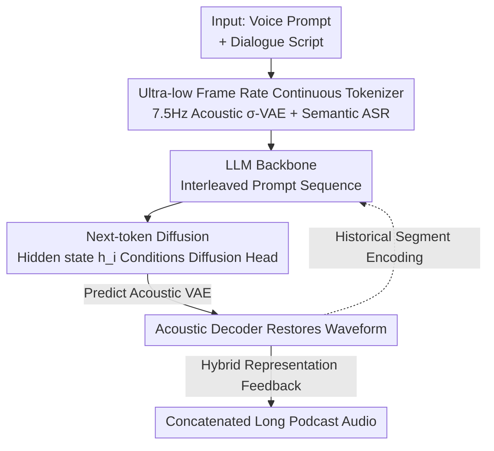

# VibeVoice: Expressive Podcast Generation with Next-Token Diffusion

**Conference**: ICLR 2026  
**OpenReview**: [https://openreview.net/forum?id=FihSkzyxdv](https://openreview.net/forum?id=FihSkzyxdv)  
**Code**: https://github.com/microsoft/VibeVoice  
**Area**: Speech Synthesis / Multi-speaker / Diffusion Models  
**Keywords**: Podcast Generation, Long-form Speech Synthesis, next-token diffusion, Continuous Speech Tokenizer, Multi-speaker TTS

## TL;DR
VibeVoice utilizes an ultra-low frame rate (7.5 Hz) continuous speech tokenizer to compress long audio into extremely short sequences. It then employs an LLM in a "next-token diffusion" framework to predict acoustic latents segment-by-segment, enabling zero-shot synthesis of podcasts up to 90 minutes with up to 4 speakers, including natural turn-taking and non-lexical details like breathing and lip-smacking.

## Background & Motivation

**Background**: Existing TTS models have achieved high-fidelity natural speech in single-speaker and short-sentence scenarios. Commercial products (e.g., Google NotebookLM) can generate podcasts, but their technical implementations remain proprietary.

**Limitations of Prior Work**: Synthesizing short sentences and concatenating them can produce multi-speaker long-form audio, but it suffers from three major flaws: speaker timbre drift over long conversations, rigid turn-taking and rhythm, and the loss of non-lexical cues (e.g., breathing, lip-smacking) that make speech sound human. Prior work like MoonCast demonstrated the feasibility of podcast synthesis but only supports 2 speakers for approximately 10 minutes and frequently crashes during longer or more complex sessions.

**Key Challenge**: Long-form audio implies ultra-long token sequences. Traditional discrete speech tokenizers have high frame rates (tens to hundreds of Hz), causing 90-minute dialogues to exceed the LLM context window. There is a sharp trade-off between efficiency and fidelity. Furthermore, maintaining speaker consistency and content coherence requires preserving both fine-grained acoustic information and high-level semantics.

**Goal**: To achieve end-to-end trainability across three dimensions: scalability (duration, number of speakers), speaker consistency, and conversational naturalness.

**Key Insight**: The authors observe that if speech can be compressed to an extremely low frame rate without losing fidelity, the long-sequence problem is mitigated. Furthermore, acoustic and semantic information should be decoupled—extracted by two separate tokenizers and then fused—to balance "who it sounds like" with "what is said."

**Core Idea**: Use a 7.5 Hz continuous (non-discrete codebook) dual acoustic-semantic tokenizer to compress long audio into a compact hybrid representation, followed by an LLM + lightweight diffusion head framework for "next-token diffusion" to generate acoustic latents segment-by-segment.

## Method

### Overall Architecture
The input to VibeVoice consists of voice prompts (waveforms) for each speaker and a dialogue script; the output is a continuous multi-speaker long-form audio. The architecture is an end-to-end "LLM backbone + Diffusion head" system. Voice prompts are encoded into continuous VAE features by an acoustic tokenizer, and the script is encoded via an embedding layer. Both are interleaved into the LLM prompt sequence. The LLM luego generates segments autoregressively; at each step, its hidden state $h_i$ conditions a lightweight diffusion head $D$ to predict the acoustic VAE latent for the current segment, which is then restored to a waveform by an acoustic decoder. Simultaneously, the LLM determines whether to emit an end-of-segment token. For the next segment, the generated audio is re-encoded into fused acoustic and semantic features and fed back into the LLM for streaming generation.

### Key Designs

**1. Ultra-Low Frame Rate Continuous Speech Tokenizer: Compressing 90 Minutes for LLM Processing**

The primary hurdle in long-form audio modeling is sequence length. VibeVoice overcomes this using two tokenizers sharing a 7.5 Hz frame rate. The acoustic tokenizer uses a symmetric encoder-decoder structure. The encoder uses 7 modified Transformer blocks (replacing self-attention with 1D depthwise separable causal convolutions for streaming) and 6 levels of downsampling to achieve a 3200x reduction from a 24 kHz input. The resulting 7.5 tokens per second is fundamental to supporting 90-minute dialogues. Crucially, it operates in a continuous latent space rather than a discrete codebook. Borrowing from LatentLM’s σ-VAE, the encoder predicts only the mean $\mu$, while the variance $\sigma$ is a predefined distribution $\mathcal{N}(0, C_\sigma)$ rather than a learnable parameter. Latents are sampled via reparameterization $z = \mu + \sigma \odot \epsilon$. This design avoids variance collapse common in ordinary VAEs during autoregressive modeling, ensuring stable acoustic features for the LLM. The semantic tokenizer uses the same encoder structure but omits the VAE component and is trained using ASR (Automatic Speech Recognition) as a proxy task to force the extraction of text-aligned semantic/phonemic information.

**2. Hybrid Speech Representation: Acoustic for "Who," Semantic for "What"**

Using only acoustic features maintains timbre but struggles with content coherence—ablations show a pure acoustic model reaches a multi-speaker WER of 6.22. VibeVoice utilizes both acoustic and semantic representations. Latents generated at each step are fused as $z_{p,i} = W_a z_{a,i} + W_s\,\mathrm{SemanticEnc}(y_i)$, where $W_a, W_s$ are learnable projection matrices, $z_{a,i}$ is the current acoustic VAE latent, and $\mathrm{SemanticEnc}(y_i)$ represents semantic features from the generated waveform. Since semantic features are closer to the text prompt, including them stabilizes the generation process and suppresses content drift. Notably, voice prompts enter the sequence only through the acoustic encoder to provide target timbre and prosody, while the generation loop uses dual feedback. This asymmetric design allows the model to replicate timbre while strictly following the content.

**3. Next-Token Diffusion and Lightweight Diffusion Head: LLM as Condition, Head as Sound**

Instead of forcing the LLM to output discrete tokens, VibeVoice attaches a lightweight diffusion head (the 1.5B version has only 4 layers, ~123M parameters) to the LLM to handle high-fidelity acoustic generation. During training, the diffusion process adds noise to the clean acoustic VAE $z_{a,i}$ such that $z_{a,i}(t) = \sqrt{\bar\alpha_t}\,z_{a,i} + \sqrt{1-\bar\alpha_t}\,\epsilon$. The diffusion head $\epsilon_\theta$ is conditioned on the noisy features, timestep $t$, and LLM hidden state $h_i$, minimizing the L2 noise prediction loss:
$$\mathcal{L}_{\mathrm{Diff}} = \mathbb{E}\,\|\epsilon - \epsilon_\theta(z_{a,i}(t), t, h_i)\|^2$$
During inference, Classifier-Free Guidance (CFG) is used:
$$\hat\epsilon = \epsilon_\theta(z_{a,i}(t), t, h_{<S>}) + w\,\big(\epsilon_\theta(z_{a,i}(t), t, h_i) - \epsilon_\theta(z_{a,i}(t), t, h_{<S>})\big)$$
where the unconditional branch uses the hidden state of the start token `<S>`, and $w$ is the guidance scale. Efficient samplers like DPM-Solver++ accelerate denoising.

**4. Data Pipeline without Enhancement: Preserving Expressive Cues**

Training requires long-range consistent labels (transcripts + speaker turns). The authors built an automated pipeline for segmentation, transcription, speaker diarization, and quality filtering to generate pseudo-labels for massive raw podcast data. A counter-intuitive but critical decision was to deliberately omit speech enhancement (denoising). Observations revealed that while denoising reduces noise, it distorts signals—especially interjections and modal particles—flattening emotional prosody. Retaining these "dirty" details allows VibeVoice to render immersive cues like breathing and lip-smacking.

### Loss & Training
The acoustic and semantic tokenizers are frozen during training; only the LLM (Qwen2.5 1.5B/7B) and diffusion head are trained. The primary objective is the L2 noise prediction loss $\mathcal{L}_{\mathrm{Diff}}$. Curriculum learning is used to gradually increase the LLM input length: 4,096 → 16,384 → 32,768 → 65,536 tokens across 110k steps. The 1.5B model was trained on ~80 billion tokens of internal pseudo-labeled podcast data using 64 AMD MI300X GPUs for ~170 hours.

## Key Experimental Results

### Main Results
Evaluations were performed on VibeVoice-Eval (108 podcasts, 1–30 minutes). Subjective MOS (Authenticity / Richness / Preference) and objective WER and speaker similarity (SIM-O) were measured.

| Model | Subjective Avg↑ | WER-W↓ | SIM-O↑ |
|------|-----------|--------|--------|
| Higgs Audio V2 | 2.99 | 5.94 | 0.543 |
| Elevenlabs v3 alpha | 3.40 | 2.39 | 0.623 |
| Gemini 2.5 Pro preview TTS | 3.66 | 1.73 | - |
| VibeVoice-1.5B | 3.54 | **1.11** | 0.548 |
| VibeVoice-7B | **3.76** | 1.29 | **0.692** |

The 7B version achieved the highest subjective average (3.76), leading in authenticity (3.71), richness (3.81), and preference (3.75), surpassing Gemini 2.5 Pro and Elevenlabs v3. The 1.5B version had the lowest WER (1.11), indicating high intelligibility.

### Ablation Study

| Configuration | Multi-speaker WER-W↓ | SIM-O↑ | Description |
|------|------|------|------|
| Acoustic-only (1.5B) | 6.22 | 0.68 | Stable timbre, incoherent content |
| Hybrid (1.5B) | 1.84 | 0.64 | Fused Acoustic + Semantic |
| VibeVoice-1.5B (64K) | 1.22 | 0.60 | Full model |
| VibeVoice-7B (32K) | **0.66** | **0.75** | Scaled to 7B |

### Key Findings
- **Semantic path is vital for coherence**: Pure acoustic models reach a WER of 6.22; adding the semantic hybrid path drops WER to 1.84.
- **Significant scaling laws**: Moving from 1.5B to 7B improves the subjective score from 3.54 to 3.76, reduces WER-W to 0.66, and increases SIM-O to 0.75.
- **Superior scalability**: The 7B version maintains WER-W 1.24 / SIM-O 0.75 for long durations (12–30 mins), whereas MoonCast frequently crashes beyond 2 speakers or long audio lengths.
- **Inference sensitivity**: Optimal WER (1.55) is achieved at CFG=1.25 and 10 denoising steps; too few steps (5) degrade quality severely.

## Highlights & Insights
- **7.5 Hz continuous tokenizer as the foundation**: 3200x downsampling solves the long-sequence problem at the source. Using continuous σ-VAE instead of discrete codebooks prevents quantization loss and autoregressive variance collapse.
- **Asymmetric Acoustic/Semantic fusion**: Voice prompts use only the acoustic path (for identity), while the generation loop uses both (for coherence), cleanly separating "who" from "what."
- **Insight on "No Speech Enhancement"**: Contrary to industry standards, retaining noise preserves emotional prosody cues. This is a reminder not to blindly apply cleaning pipelines to expressive generation tasks.
- **Next-token diffusion paradigm**: This allows the LLM to manage semantic flow while the diffusion head focuses on acoustic details. The extremely lightweight head (123M) is a reusable pattern for connecting LLMs to continuous modalities.

## Limitations & Future Work
- **Closed Data**: The 80B token podcast dataset is an internal pseudo-labeled set, making external reproduction difficult.
- **Claimed vs. Tested Length**: The title claims 90 minutes, but the main experimental evaluations are focused within 30 minutes; 90 minutes may represent a boundary capability rather than a fully validated performance.
- **Pseudo-label Dependence**: Transcripts and turns are generated by an automated pipeline; the impact of labeling noise on final naturalness deserves more analysis.
- **Hyperparameter Tuning**: CFG and denoising steps significantly impact WER/SIM-O, requiring scene-specific tuning for deployment.

## Related Work & Insights
- **Vs. MoonCast**: Both target podcast synthesis, but MoonCast is limited to 2 speakers and ~10 minutes. VibeVoice scales to 4 speakers and much longer durations via the low frame rate tokenizer + next-token diffusion.
- **Vs. Concatenative Multi-speaker TTS**: Concatenation produces rigid turns and timbre drift; VibeVoice’s end-to-end generation results in far more natural turn-taking and non-lexical cues.
- **Vs. LatentLM**: Both use σ-VAE and diffusion heads, but VibeVoice specializes in long-form multi-speaker podcasts through hybrid semantic representations and non-enhanced data pipelines.

## Rating
- Novelty: ⭐⭐⭐⭐ The combination of 7.5 Hz continuous tokenizer and next-token diffusion for long-form multi-speaker podcasts is highly novel.
- Experimental Thoroughness: ⭐⭐⭐⭐ Extensive subjective/objective comparisons and ablations, though 90-minute claims lack full empirical detail.
- Writing Quality: ⭐⭐⭐⭐ Clear structure and complete formulas.
- Value: ⭐⭐⭐⭐⭐ Providing open code and weights fills a gap in publicly available podcast-level long-form multi-speaker TTS.

<!-- RELATED:START -->

## Related Papers

- [\[ICLR 2026\] Token-based Audio Inpainting via Discrete Diffusion](token-based_audio_inpainting_via_discrete_diffusion.md)
- [\[ICLR 2026\] MambaVoiceCloning: Efficient and Expressive Text-to-Speech via State-Space Modeling and Diffusion Control](mambavoicecloning_efficient_and_expressive_text-to-speech_via_state-space_modeli.md)
- [\[ICLR 2026\] UniSS: Unified Expressive Speech-to-Speech Translation with Your Voice](uniss_unified_expressive_speech-to-speech_translation_with_your_voice.md)
- [\[ICLR 2026\] Scaling Speech Tokenizers with Diffusion Autoencoders](scaling_speech_tokenizers_with_diffusion_autoencoders.md)
- [\[CVPR 2026\] Hierarchical Codec Diffusion for Video-to-Speech Generation](../../CVPR2026/audio_speech/hierarchical_codec_diffusion_for_video-to-speech_generation.md)

<!-- RELATED:END -->
