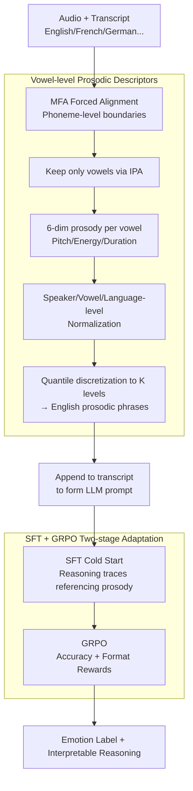

# VowelPrompt: Hearing Speech Emotions from Text via Vowel-level Prosodic Augmentation

**Conference**: ICLR 2026  
**arXiv**: [2602.06270](https://arxiv.org/abs/2602.06270)  
**Code**: None  
**Area**: Speech Emotion Recognition  
**Keywords**: Speech Emotion Recognition, Prosodic Features, Vowel-level, LLM Inference, GRPO

## TL;DR
VowelPrompt is proposed to extract vowel-level prosodic descriptors (pitch/energy/duration) based on phonetic evidence, converting them into natural language to enhance LLM prompts for emotion recognition. Combined with a two-stage SFT+GRPO training strategy, it consistently outperforms SOTA under zero-shot, fine-tuned, cross-domain, and cross-lingual conditions while generating interpretable emotional reasoning.

## Background & Motivation

**Background**: Speech Emotion Recognition (SER) has evolved through three generations: openSMILE handcrafted features → wav2vec/HuBERT deep self-supervised features → LLM-based text prompting for emotion recognition. Currently, two technical routes coexist: Audio LLMs (e.g., Qwen2-Audio) which process audio embeddings directly but remain opaque, and text-only prompting (e.g., SpeechCueLLM) which uses natural language to describe prosody but at a coarse granularity (e.g., "speaking very loudly").

**Limitations of Prior Work**: Deep features lack interpretability and cannot explain to users "why a judgment of anger was made." Text-only prompting methods use sentence-level prosodic descriptions (e.g., "high pitch, fast tempo"), losing fine-grained prosodic variations at the syllable level—where emotions are often concentrated on specific stressed syllables.

**Key Challenge**: How to achieve or even surpass the performance of opaque deep features while maintaining interpretability?

**Mechanism**: Vowels are the primary carriers of emotional prosody—they are voiced, acoustically stable (with clear F0 and formants), and occupy the majority of the utterance in terms of time and energy. In contrast, consonants contribute significantly less to prosody.

**Core Idea**: Extract vowel-level (per-phoneme) prosodic descriptors, convert them into natural language to embed into prompts, and enable the LLM to perform joint reasoning over lexical semantics and local prosodic information.

## Method

### Overall Architecture
VowelPrompt redefines "hearing emotion" as "reading emotion": it first extracts per-vowel prosodic features from audio, translates them into natural language appended to the transcript, and then allows a text-only LLM to jointly infer emotion labels and rationales from word meanings and local prosody. The first half of the pipeline is deterministic signal processing (alignment, feature extraction, normalization, discretization), while the second half involves a two-stage training process: SFT cold start followed by GRPO reinforcement. Ultimately, the model provides judgments with reasoning traces using only text. Since the MFA used for alignment and the IPA used for representation are language-agnostic, the pipeline can be extended to other languages with minimal modification, which is the source of its cross-lingual scalability.

### Key Designs

**1. Vowel-level Prosodic Descriptors: Anchoring Emotion on the Stablest Acoustic Carriers**

Sentence-level prompts ("very loud, fast tempo") lose the moments where emotion truly erupts—often a sharp rise in pitch on a specific stressed vowel. VowelPrompt takes the opposite approach, first using the Montreal Forced Aligner (MFA) to align audio and transcripts to phoneme-level time boundaries, then retaining only vowel segments based on the IPA vowel set. Vowels are voiced, acoustically stable, and dominate the utterance in duration and energy, making them the primary carriers of emotional prosody. Six Low-Level Descriptors (LLDs) are calculated for each vowel segment: pitch mean, pitch slope, pitch variance, energy mean, energy variance, and duration. To eliminate interference from speaker and intrinsic vowel differences, features undergo speaker-level z-score followed by vowel-type normalization. Thus, "this /a/ is high" indicates it is high relative to that speaker and vowel type, rather than an absolute value. Finally, continuous values are discretized into K levels (e.g., "very low/low/medium/high/very high") via quantiles and mapped to natural language phrases, creating a per-vowel readable prosodic description appended to the transcript. Discretization makes the information digestible for the LLM and naturally produces interpretable intermediate representations.

**2. SFT + GRPO Two-stage Adaptation: Learning to Reference Prosody, then Reasoning Accurately and Uniformly**

It is difficult for LLMs to spontaneously use unfamiliar prosodic descriptions in reasoning. The first stage, SFT, uses a small amount of training data paired with GPT-4o-generated reasoning traces for a cold start. These traces explicitly cite which prosodic feature of which vowel led to the judgment, using standard cross-entropy to teach the model the "reading prosody while explaining reasons" paradigm. The second stage uses Group Relative Policy Optimization (GRPO) for refinement with verifiable rewards: total reward $R = R_{acc} + R_{format}$, where $R_{acc}$ is the accuracy reward for exact matches between predicted and ground-truth labels, and $R_{format}$ checks if `<think>`/`<answer>` tags are complete. KL divergence constraints are applied to prevent the policy from drifting too far from the SFT reference. Accuracy rewards improve judgment quality, while format rewards ensure stable, parsable output structures—the latter contributed the primary gain (+2.7% WA) in cross-domain generalization.

**3. Zero-modification Multilingual Extension: Leveraging Cross-lingual LLM Capabilities via Unified IPA and English Descriptions**

Cross-lingual transfer in SER usually requires retraining, but VowelPrompt extends to other languages with almost no modification. MFA supports alignment for 20+ languages, vowels are uniformly represented via IPA, and normalization is adjusted to the language level. Therefore, 同构 (isomorphic) vowel prosodic descriptions can be extracted from French or German audio. A key trick is that even if the input is French or German, the prosodic descriptions are written in English, directly reusing the existing cross-lingual alignment capabilities of multilingual LLMs without needing to train separate emotion models for each language. This explains its significant lead on the French CaFE (+8.3%) and German EmoDB (+7.7%) datasets.

## Key Experimental Results

### Main Results

| Dataset | Condition | VowelPrompt | Prev. SOTA | Gain |
|--------|------|-----------|---------|------|
| IEMOCAP | Fine-tuned | 72.8% WA | 68.5% | +4.3% |
| MELD | Zero-shot | 52.1% WA | 46.3% | +5.8% |
| CaFE (French) | Cross-lingual | 62.4% | 54.1% | +8.3% |
| EmoDB (German) | Cross-lingual | 78.9% | 71.2% | +7.7% |

### Ablation Study

| Configuration | IEMOCAP WA | Description |
|------|-----------|------|
| VowelPrompt Full | 72.8% | full |
| w/o Prosodic Descriptors | 65.3% | Text only |
| w/o GRPO | 70.1% | SFT only |
| Consonant-level features | 68.7% | Vowel > Consonant |
| Shuffled Prosody | 58.2% | Confirms no spurious correlation |

### Key Findings
- Vowel-level prosody is significantly better than sentence-level coarse descriptions (+1.2% UACC over SpeechCueLLM on IEMOCAP zero-shot).
- The GRPO stage improves WA by +2.7%, primarily enhancing format compliance and cross-domain generalization.
- Counterfactual experiments (shuffling prosody order, assigning prosody to wrong vowels) confirm the model actually utilizes prosodic information rather than spurious correlations.
- Vowel-level features outperformed consonant-level features, and combining both yielded no significant gain—suggesting vowels capture the primary emotional cues.
- Cross-lingual generalization: Models fine-tuned on English were effective on French CaFE (+8.3%) and German EmoDB (+7.7%).
- Placebo experiments matching marginal distributions ruled out statistical illusions—random prosodic descriptions dropped performance to random levels.
- Human evaluation: Over 85% of prosodic references in reasoning traces were rated as "linguistically plausible" by annotators.

## Highlights & Insights
- **Interpretable Emotional Reasoning**: The \<think\> reasoning traces output by the LLM explicitly cite which prosodic features of which vowels led to the judgment—evaluated as >85% linguistically plausible.
- **Text-only Deployment**: Inference requires only the transcript and prosodic description text, removing the need for an audio encoder to run on the GPU—greatly reducing deployment complexity.
- **Value of GRPO**: Beyond improving accuracy, it ensures output format consistency (\<think\>/\<answer\> tags), which is critical for production environments.
- **Phonetic Hypothesis Validation**: The linguistic assumption that vowels serve as emotional anchors was fully validated—Vowel-level > Consonant-level > Sentence-level.
- **Architectural Advantage**: Since prosodic information is passed as text, the deployment architecture is simplified as the LLM itself does not require an audio modality.

## Limitations & Future Work
- Dependency on forced alignment quality—MFA precision decreases in noisy environments or non-standard speech.
- Prosodic descriptors are extracted from audio, so audio is still required during the preprocessing stage for inference.
- Only tested on a few SER benchmarks; more domains (e.g., customer service, mental health) remain to be validated.
- Performance of vowel-level features in tonal languages (e.g., Chinese) is unexplored—the interaction between tone and emotion may be more complex.
- The impact of GRPO hyperparameters (e.g., KL coefficient) on cross-domain generalization requires systematic ablation.

## Related Work & Insights
- **vs SpeechCueLLM**: Both use natural language to describe prosody, but SpeechCueLLM uses coarse sentence-level descriptions while VowelPrompt is precise to each vowel.
- **vs Emotion-LLaMA**: Emotion-LLaMA fuses audio embeddings into the LLM directly, making it uninterpretable; VowelPrompt’s intermediate representation is entirely readable.
- **vs wav2vec/HuBERT**: Deep features are powerful but opaque; VowelPrompt surpasses them on some benchmarks while providing explanations.
- **Insight**: Text-augmented speech understanding is a promising paradigm—translating audio information into natural language to leverage LLM reasoning capabilities.

## Rating
- Novelty: ⭐⭐⭐⭐⭐ Clever combination of vowel-level prosody and LLM reasoning with clear linguistic motivation.
- Experimental Thoroughness: ⭐⭐⭐⭐⭐ 5 datasets + 15 ablation/counterfactual experiments covering zero-shot/fine-tuned/cross-domain/cross-lingual scenarios.
- Writing Quality: ⭐⭐⭐⭐ Detailed and comprehensive, though slightly long.
- Value: ⭐⭐⭐⭐⭐ Interpretable, high-performance, and cross-lingual; a substantial contribution to the SER field.

<!-- RELATED:START -->

## Related Papers

- [\[ICLR 2026\] Beyond Instance-Level Alignment: Dual-Level Optimal Transport for Audio-Text Retrieval](beyond_instance-level_alignment_dual-level_optimal_transport_for_audio-text_retr.md)
- [\[ACL 2026\] Data-efficient Targeted Token-level Preference Optimization for LLM-based Text-to-Speech](../../ACL2026/audio_speech/data-efficient_targeted_token-level_preference_optimization_for_llm-based_text-t.md)
- [\[ICLR 2026\] Towards True Speech-to-Speech Models Without Text Guidance](towards_true_speech-to-speech_models_without_text_guidance.md)
- [\[ICLR 2026\] EchoMind: An Interrelated Multi-level Benchmark for Evaluating Empathetic Speech Language Models](echomind_an_interrelated_multi-level_benchmark_for_evaluating_empathetic_speech_.md)
- [\[ICLR 2026\] Scalable Multilingual Multimodal Machine Translation with Speech-Text Fusion](scalable_multilingual_multimodal_machine_translation_with_speech-text_fusion.md)

<!-- RELATED:END -->
