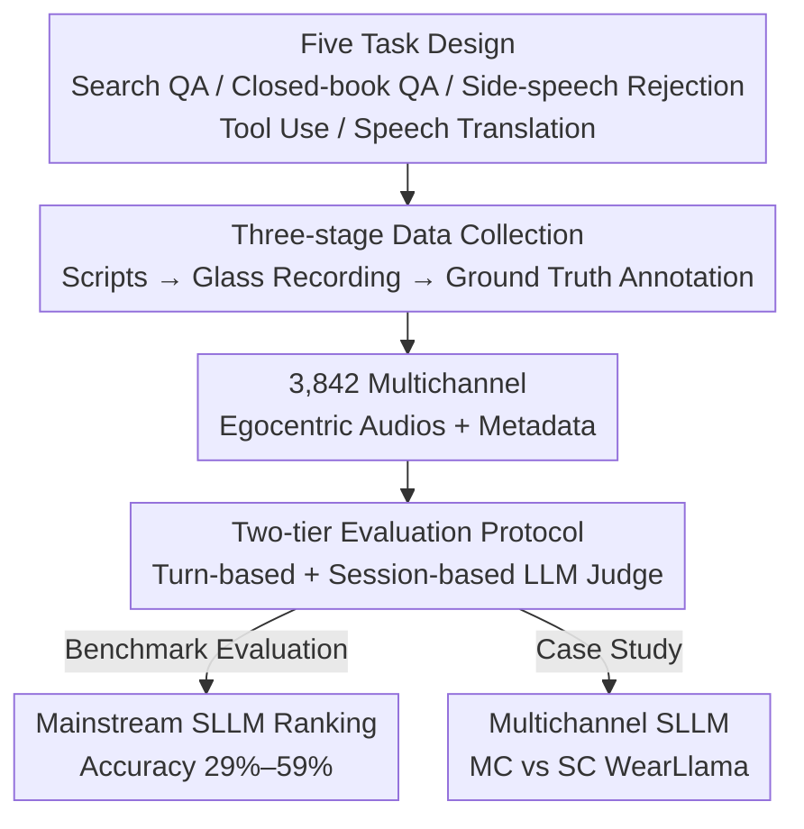

# WearVox: An Egocentric Multichannel Voice Assistant Benchmark for Wearables

**Conference**: ICLR 2026  
**OpenReview**: [https://openreview.net/forum?id=QpaNErg7ug](https://openreview.net/forum?id=QpaNErg7ug)  
**Code**: https://github.com/facebookresearch/wearvox  
**Area**: Speech / Speech LLM / Benchmarking  
**Keywords**: Wearable voice assistant, egocentric audio, multichannel audio, Speech LLM, benchmark

## TL;DR
WearVox utilizes AI glasses to collect 3,842 segments of egocentric, multichannel audio from real-world wearable scenarios, covering five task categories: Search QA, Closed-book QA, Side-speech Rejection, Tool Use, and Speech Translation. Systematic evaluation of mainstream Speech Large Language Models (SLLMs) reveals that real-time model accuracy ranges only from 29% to 59% and degrades severely under outdoor noise. A multichannel SLLM case study demonstrates that spatial audio cues significantly enhance noise robustness and device-directed speech discrimination.

## Background & Motivation
**Background**: Voice assistants are evolving from "on-demand" tools on smartphones and smart speakers into "always-on," hands-free collaborators like AI glasses. Users issue commands while walking, commuting, or socializing, making interactions high-frequency, fragmented, and situated in real-world, open acoustic environments.

**Limitations of Prior Work**: Existing voice assistant benchmarks (VoiceBench, Spoken-CoQA, Spoken-SQuAD, AudioBench, MMAU, etc.) almost exclusively use TTS-synthesized speech or clean, general conversational audio, mostly in single-channel format. They fail to cover the complexities unique to wearable scenarios—egocentric audio contaminated by motion and wind noise, latency-sensitive micro-interactions, and the need to distinguish "speech to the device" from ambient chatter and background noise.

**Key Challenge**: There is a massive distribution gap between evaluation data and real-world deployment environments. Models that appear "strong" on clean synthesized speech suffer a performance collapse when faced with multichannel audio from glass microphone arrays mixed with wind, traffic, or overhearing other people's conversations—a degradation existing benchmarks cannot detect.

**Goal**: To construct the first voice assistant benchmark specialized for wearable computing, satisfying four conditions simultaneously: egocentric perspective, multichannel audio, real conversational dynamics (side-speech, non-device directed speech), and environmental diversity, thereby systematically characterizing the capability boundaries of current SLLMs.

**Key Insight**: The core difficulty for wearable voice assistants is not simply "hearing clean speech clearly," but "identifying which sentence is directed at the device in noisy, multi-speaker scenes and responding correctly." Multichannel (spatial) audio cues provide critical information that single-channel benchmarks discard, yet they are vital for this discrimination.

**Core Idea**: Use real AI glasses to collect multichannel egocentric audio, spanning three dimensions: tasks, speaker roles, and acoustic conditions, creating a rigorous testbed for wearable voice assistants. Subsequently, use a multichannel SLLM case study to verify that spatial audio indeed provides significant gains.

## Method

### Overall Architecture
WearVox is essentially a benchmark suite comprising a "dataset + evaluation protocol + multichannel case study." On the data side, a three-stage pipeline produces 3,842 glass-recorded dialogues: script collection to define five task types and real scenarios, followed by native speakers recording multichannel audio in various indoor/outdoor environments, and finally, ground-truth annotation. On the evaluation side, the five tasks are formalized as "Text Input + Speech Input → Text Output" $f(T_I, S_I) \to T_O$, with scoring split into turn-based and session-based metrics. Finally, the authors train a multichannel SLLM (MC WearLlama) and compare it with its single-channel version (SC WearLlama) to address the core research question: "Does multichannel audio provide additional value over beamformed single-channel audio?"

### Key Designs

**1. Five-Task System: Decomposing Wearable Assistant Functions into Evaluable Tasks**

Existing benchmarks often stop at general QA, failing to test capabilities specific to wearable scenarios. WearVox designs five tasks covering the spectrum from information retrieval to device control and multilingual communication: **Search-Augmented QA** (fact-based questions requiring external retrieval), **Closed-book QA** (popular static facts relying on internal model knowledge), **Tool Use** (generating JSON API calls for 8 predefined tools like calendar, web search, and music player), **Side-speech Rejection** (identifying and ignoring non-device directed speech, outputting a special `[Mute]` token), and **Bi-directional Speech Translation** (conversations between the wearer and a partner speaking a different language, requiring simultaneous speaker diarization and translation). All tasks are unified as $f(T_I, S_I) \to T_O$, where $T_I$ provides task descriptions and context, $S_I$ is the real recording, and $T_O$ is the answer/API call/control token/translated text. This design forces the model to decide "is this person talking to me?"—a dimension missing from single-channel benchmarks.

**2. Three Roles × Multiple Acoustic Conditions: Injecting Real Dynamics and Noise Profiles**

To measure real-world degradation, the data must be authentically "messy." WearVox introduces three speaker roles: **Wearer** (initiates most device-directed requests), **Conversation Partner** (interacts with the wearer in different languages), and **Bystander** (contributes occasional background speech and interference). Their varied positions and distances naturally create dynamics like direct questions, interruptions, side-speech, and non-assistant-directed talk. Acoustically, ~31% of dialogues are recorded indoors (offices, cafes) and 63% outdoors (streets, parks, construction zones), with 58% in noisy environments and 42% in quiet ones, covering 13 noise types and varying SNRs from whispers to heavy traffic.

**3. Three-Stage Collection Pipeline: Balancing Realism and Annotatability**

Data comes from three serial stages. **Script Collection**: QA questions are reused from CRAG and Head-to-tail datasets; other tasks are designed as scenarios and expanded into multi-turn dialogues using Llama 3.3 70B. **Egocentric Recording**: Native speakers (Italian, Spanish, Portuguese, German, French for translation; English for others) record while wearing glasses. Participants use "loose script following" to ensure natural, colloquial speech rather than verbatim reading. **Ground Truth Annotation**: Translation tasks are transcribed and translated; tool tasks are labeled with API calls; non-device directed samples are labeled with `[Mute]`.

**4. Multichannel SLLM Case Study: Verifying Spatial Audio Cues**

Existing SLLMs are trained on single-channel audio. To test the value of multichannel data, the authors use a 17B-parameter Llama-4-Scout base with a 1B Conformer speech encoder. They simulate five-channel audio using AI glass microphone configurations and room impulse responses (RIR) under random SNRs (-5 dB to 40 dB). They compare **SC WearLlama** (trained on beamformed single-channel audio) with **MC WearLlama** (trained on multichannel audio). This directly quantifies the contribution of spatial cues to separating user speech from background interference.

## Key Experimental Results

### Main Results
Turn-based tasks (Search QA, Closed-book QA, Tool Use, Side-speech Rejection) report micro-averaged accuracy; speech translation is scored at the session level. QA and Translation use an LLM-as-a-judge approach (consistent with human judgment >98% and Pearson $r=0.89$ respectively).

| Model | Search QA | Closed-book QA | Tool Use | Side-speech Rejection | Turn-based Micro-Avg | Speech Translation |
|------|-----------|----------------|----------|-----------------------|----------------------|--------------------|
| Gemma 3n | 29.4 | 20.4 | 5.7 | 59.9 | 29.7 | 14.8* |
| Kimi-Audio | 10.1 | 31.5 | 6.3 | 47.0 | 43.6 | 41.8* |
| Qwen2.5-Omni | 35.8 | 29.8 | 7.3 | 60.4 | 33.1 | 43.9* |
| GPT-4o Audio | 50.5 | 59.4 | 8.9 | 66.0 | 43.1 | 76.0 |
| GPT-5 w/ Whisper | 57.8 | 70.6 | 35.7 | 73.8 | 57.8 | 92.9* |
| Gemini 2.5 Flash | 49.0 | 46.8 | 44.4 | 88.2 | 59.8 | 50.3 |
| Gemini 2.5 Flash Thinking | 48.8 | 61.4 | 68.1 | 91.4 | **71.3** | 70.1 |

Open-source models (<8B) are generally weak, especially in Search QA and Tool Use. GPT-4o Audio exhibits limited structured text capability (Tool Use only 8.9%). Gemini 2.5 Flash Thinking significantly improves quality (71.3% micro-avg) but at the cost of high Time-to-First-Token (TTFT) (5546 ms vs. 1592 ms).

### Ablation Study (Case Study)
| Model | Search QA | Closed-book QA | Tool Use | Side-speech Rejection | Turn-based Micro-Avg |
|------|-----------|----------------|----------|-----------------------|----------------------|
| SC WearLlama (Single-channel) | 43.3 | 42.5 | 58.5 | 85.4 | 61.9 |
| MC WearLlama (Multichannel) | 43.3 | 42.2 | 63.9 | **93.9** | **66.4** |

Multichannel audio provides significant boosts in Tool Use (+5.4%) and Side-speech Rejection (+8.5%). The gains are minimal in QA tasks because those were often recorded in quieter indoor settings where spatial cues are less critical.

### Key Findings
- **Spatial audio is critical for device-directed discrimination**: MC WearLlama outperforms SC by 8.5 points in side-speech rejection, especially in noisy outdoor environments.
- **Outdoor noise causes universal performance drops**: Most models drop 3%–15% in accuracy outdoors, with smaller models like Gemma suffering the most.
- **Reasoning models are inherently noise-robust**: Gemini 2.5 Flash Thinking's accuracy in noisy outdoors sometimes exceeds its quiet indoor performance, though latency remains a bottleneck for wearables.

## Highlights & Insights
- **Clean MC vs. Beamformed experimental design**: By simulating multichannel vs. mono under identical conditions, the value of spatial information—discarded by current paradigms—is directly quantified.
- **Explicit Side-speech Rejection task**: Forcing the model to choose between a tool call and a `[Mute]` token is a valuable evaluation construct for any multi-user voice system.
- **"Loose script following" strategy**: This pragmatic compromise between "controllable" and "natural" data collection can be applied to other real-world speech dataset construction.
- **Latency-Quality trade-off quantification**: Identifying that reasoning enhances quality (+12 points) but triples latency puts the core conflict of wearable AI research on center stage.

## Limitations & Future Work
- **Single hardware platform**: All data is from one Meta AI glass array configuration; cross-device transferability is not yet verified.
- **Purely audio-based**: Missing visual (camera) and inertial (IMU) signals which are inherent to wearables and could assist in speaker grounding and head-orientation detection.
- **Simplified translation task**: Modeled as offline segments rather than simultaneous interpretation.
- **Relative scale**: 3.8K dialogues is smaller than synthetic benchmarks but prioritized for realism.

## Related Work & Insights
- **vs. VoiceBench / AudioBench**: These focus on instruction following or acoustic scene sensing but use mono synthesized audio. WearVox fills the egocentric multichannel gap.
- **vs. CAVA / FDX-bench**: While those emphasize full-duplex/latency, WearVox focuses on spatial audio and intent gating (side-speech rejection).
- **vs. Full-duplex SLLMs (Moshi, etc.)**: As models move toward "listen-while-speak," WearVox provides a more realistic testbed for the spatial processing required in such systems.

## Rating
- Novelty: ⭐⭐⭐⭐⭐ (First egocentric multichannel benchmark; addresses neglected spatial audio dimension).
- Experimental Thoroughness: ⭐⭐⭐⭐ (Tested 7 SLLMs plus an internal case study; granular noise analysis).
- Writing Quality: ⭐⭐⭐⭐ (Clear task definitions and well-organized methodology).
- Value: ⭐⭐⭐⭐⭐ (Opens source tools to address core deployment pain points for wearable AI).

<!-- RELATED:START -->

## Related Papers

- [\[ACL 2026\] Still Between Us? Evaluating and Improving Voice Assistant Robustness to Third-Party Interruptions](../../ACL2026/audio_speech/still_between_us_evaluating_and_improving_voice_assistant_robustness_to_third-pa.md)
- [\[ACL 2025\] Does Your Voice Assistant Remember? Analyzing Conversational Context Recall and Utilization in Voice Interaction Models](../../ACL2025/audio_speech/does_your_voice_assistant_remember_analyzing_conversational_context_recall_and_u.md)
- [\[ACL 2025\] Distilling an End-to-End Voice Assistant Without Instruction Training Data](../../ACL2025/audio_speech/distilling_an_end-to-end_voice_assistant_without_instruction_training_data.md)
- [\[ICLR 2026\] SiNGER: A Clearer Voice Distills Vision Transformers Further](singer_a_clearer_voice_distills_vision_transformers_further.md)
- [\[ICLR 2026\] UniSS: Unified Expressive Speech-to-Speech Translation with Your Voice](uniss_unified_expressive_speech-to-speech_translation_with_your_voice.md)

<!-- RELATED:END -->
