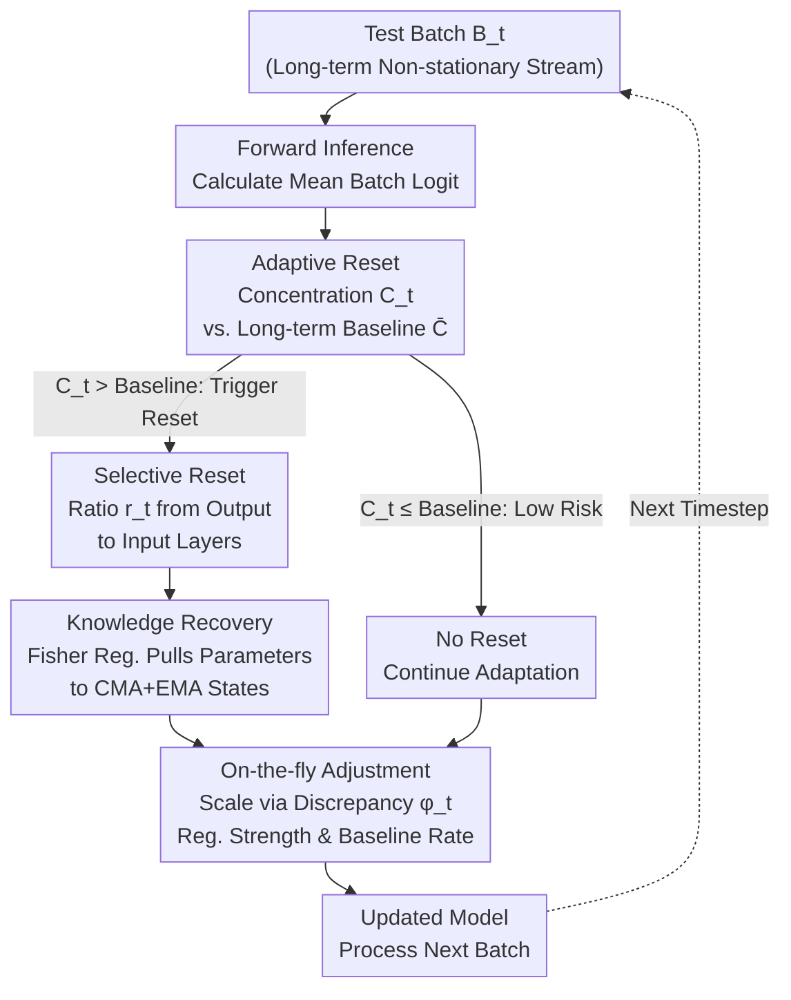

# When and Where to Reset Matters for Long-Term Test-Time Adaptation

**Conference**: ICLR 2026  
**arXiv**: [2603.03796](https://arxiv.org/abs/2603.03796)  
**Code**: [https://github.com/YonseiML/asr](https://github.com/YonseiML/asr)  
**Area**: Audio & Speech  
**Keywords**: Test-time adaptation, Model collapse, Adaptive reset, Selective reset, Fisher information, Long-term domain shift

## TL;DR
ASR proposes an adaptive selective reset scheme that dynamically determines *when* to reset via prediction concentration $\mathcal{C}_t$ (avoiding the suboptimality of fixed cycles) and *where* to reset via a progressive layer selection strategy from the output layer to the input layer (preserving valuable adaptation knowledge). Combined with importance-aware regularization to recover key reset knowledge and on-the-fly adjustments, it achieves a 44.12% improvement over the SOTA on CCC-Hard.

## Background & Motivation

**Background**: Continual Test-Time Adaptation (TTA) updates models on non-stationary domain streams, but long-term adaptation leads to error accumulation $\rightarrow$ model collapse: the model predicts only a few classes for all inputs.

**Limitations of Prior Work**: (1) Methods like RDumb use fixed-period full resets $\rightarrow$ cycles are unrelated to actual collapse risk, occurring either too early (wasting adapted knowledge) or too late (deep error accumulation); (2) Full resets catastrophically discard all knowledge accumulated over time; (3) There is a significant performance drop and recovery delay after each reset.

**Key Challenge**: Resetting too frequently $\rightarrow$ insufficient adaptation; resetting too rarely $\rightarrow$ irreversible collapse. Full reset $\rightarrow$ knowledge loss; no reset $\rightarrow$ error accumulation.

**Goal**: (1) When: How to dynamically determine collapse risk? (2) Where: How to select layers to reset to minimize knowledge loss? (3) How to recover key reset knowledge?

**Key Insight**: Using prediction concentration as a proxy for collapse risk, and leveraging the hierarchical structure of deep networks (layers near the output are first corrupted by label noise) to determine the reset range.

**Core Idea**: Use deviation in prediction concentration from a long-term baseline to trigger resets, reset progressively from output to input layers based on collapse severity, and apply Fisher-weighted regularization to recover key reset knowledge.

## Method

### Overall Architecture
ASR is a plug-and-play module for existing continual TTA methods (ETA, EATA, ROID, etc.). It repeats a standard process for each test batch in a long-term non-stationary stream: performing forward inference to obtain batch prediction averages, using a collapse risk signal (prediction concentration) to determine **when** to reset and thus deciding **how deep** to reset (proceeding from output-heavy layers toward the input), followed by Fisher-weighted regularization to "pull back" valuable knowledge from reset layers. Finally, it adjusts regularization strength and baseline update rates on-the-fly based on domain discrepancy.

### Key Designs

**1. Adaptive Reset — Determining when to reset: Replacing fixed cycles with prediction concentration**

Methods like RDumb reset everything at fixed intervals, which is unrelated to when the model actually nears collapse. ASR uses a signal directly reflecting collapse risk—prediction concentration $\mathcal{C}_t = \sum_{c=1}^C \hat{p}_{t_c} \log(\hat{p}_{t_c})$, where $\hat{p}_t = \sigma(\frac{1}{|\mathcal{B}_t|}\sum_i f_{\theta_{t-1}}(x_t^i))$ is the softmax distribution of mean batch logits. As the model collapses to few classes, the distribution sharpens, $\mathcal{C}_t$ increases, signaling collapse risk. The method maintains an EMA long-term baseline $\bar{\mathcal{C}}_t = \mu_\mathcal{C} \cdot \bar{\mathcal{C}}_{t-1} + (1-\mu_\mathcal{C}) \cdot \mathcal{C}_t$ and triggers a reset when $\mathcal{C}_t > \bar{\mathcal{C}}_{t-1}$. The signal is reliable due to its 0.88 Pearson correlation with actual accuracy.

**2. Selective Reset — Determining where to reset: Progressive depth from output to input**

Full resets discard all accumulated knowledge. ASR leverages observations that corruption from label noise first erodes the end of the network (near output). Thus, only a ratio $r_t$ of layers starting from the output end is reset. The reset depth is determined by the collapse severity: $r_t = r_0 + \lambda_r \cdot (\mathcal{C}_t - \bar{\mathcal{C}}_{t-1})$, with a maximum of 1.0. This cuts off contaminated sections while retaining clean, shallow-layer adaptation knowledge.

**3. Importance-weighted Knowledge Recovery — Preventing reset from erasing critical parameters**

Parameters critical to previous tasks should not be cleared. ASR uses a Fisher-weighted regularization term: $\mathcal{L} = \mathcal{L}_u + \lambda_\mathcal{F}\sum_i \bar{\mathcal{F}}^i(\theta_{t-1}^i - \bar{\theta}^i)^2$, where $\bar{\mathcal{F}}^i$ is the accumulated Fisher information matrix and $\bar{\theta}^i$ is the accumulated parameter state. To avoid dominance by "dirty" parameters just before collapse, the method uses a CMA+EMA hybrid: it accumulates via CMA (equal weight) between resets and aggregates through EMA at the reset trigger points.

**4. On-the-fly Adjustment — Automatically scaling mechanisms by domain shift**

Fixed regularization and baseline rates cannot handle varying domain shifts. ASR measures domain discrepancy via prediction inconsistency between source and current models: $\phi_t = \frac{1}{|\mathcal{B}_t|}\sum_i \mathbb{I}(\arg\max(\breve{y}_t^i) \neq \arg\max(\hat{y}_t^i))$. This discrepancy is used to adjust the regularization coefficient $\lambda_\mathcal{F} = \lambda_0 \cdot \phi_t^2$ and the baseline update rate $\mu_\mathcal{C} = \mu_0 \cdot \phi_t + 1 - \mu_0$.

## Key Experimental Results

### Main Results (ResNet-50 on CCC Benchmark)

| Method (Base: ETA) | Easy | Medium | Hard | Mean |
|----------------|------|--------|------|------|
| ETA | 43.24 | 19.03 | 0.32 | 20.86 |
| + RDumb | 49.47 | 39.42 | 9.77 | 32.89 |
| **+ ASR (Ours)** | **Best** | **Best** | **Best** | **Best** |

Ours improves over SOTA by **44.12%** on CCC-Hard.

### Key Findings
- ASR acts as a universal add-on for ETA, EATA, and ROID.
- Gains are most significant in challenging settings (CCC-Hard) where existing methods collapse most severely.
- $\mathcal{C}_t$ is more stable and reliable than other collapse detection metrics (e.g., high confidence or distribution shift detection).
- Selective reset significantly reduces performance drops and recovery lag compared to full resets.

### Ablation Study
- Removing Adaptive Reset (fixed cycle) $\rightarrow$ Performance decline.
- Removing Selective Reset (full reset) $\rightarrow$ Increased performance drops and recovery delay.
- Removing Fisher Reg $\rightarrow$ Failure to recover critical reset knowledge.
- Removing On-the-fly Adjustment $\rightarrow$ Reduced adaptability under challenging domain shifts.

## Highlights & Insights
- **Elegant Signal Design**: $\mathcal{C}_t$ is simple yet effective (0.88 correlation) at depicting collapse without requiring extra models.
- **Theoretical Basis for Hierarchical Reset**: Translates the observation of backward-spreading corruption into a practical strategy.
- **CMA+EMA Hybrid Accumulation**: Solves the bootstrapping dilemma where parameters near reset are better adapted to the current domain but more likely corrupted.
- **Plug-and-play**: Integrated easily into any existing TTA method without altering base adaptation algorithms.

## Limitations & Future Work
- Hyperparameters ($r_0, \lambda_r, \alpha_0, \lambda_0, \mu_0$) require determined holdout data (though only 5% of one split).
- Current assumption of intra-batch domain homogeneity; mixed-domain batches require further study.
- Fisher estimation accuracy may degrade over time in continuous online learning.
- Integration with prompt-based TTA methods remains to be explored.

## Related Work & Insights
- **vs. RDumb**: ASR introduces adaptivity and selectivity over the naive fixed-cycle full reset baseline.
- **vs. CoTTA**: While CoTTA uses augmentation-averaged pseudo-labels, ASR uses a more principled Fisher-based recovery.
- **vs. ROID/CMF**: Weight ensemble methods are complementary to the reset-and-recovery paradigm of ASR.
- **vs. PeTTA**: Prediction concentration $\mathcal{C}_t$ is a more direct collapse metric than parameter divergence.

## Rating
- Novelty: ⭐⭐⭐⭐ The combination of adaptive + selective reset and CMA+EMA accumulation is innovative.
- Experimental Thoroughness: ⭐⭐⭐⭐⭐ 4 benchmarks, multiple baseline combinations, detailed ablation, and multi-architecture validation.
- Writing Quality: ⭐⭐⭐⭐⭐ Clear motivation (very intuitive Fig.1), clear methodology (Fig.2), and rigorous statistics.
- Value: ⭐⭐⭐⭐⭐ The 44.12% improvement on CCC-Hard is a substantial breakthrough; the plug-and-play design is highly applicable.

<!-- RELATED:END -->

## Related Papers

- [\[NeurIPS 2025\] E-BATS: Efficient Backpropagation-Free Test-Time Adaptation for Speech Foundation Models](../../NeurIPS2025/audio_speech/e-bats_efficient_backpropagation-free_test-time_adaptation_for_speech_foundation.md)
- [\[CVPR 2026\] InfinityHuman: Towards Long-Term Audio-Driven Human Animation](../../CVPR2026/audio_speech/infinityhuman_towards_long-term_audio-driven_human_animation.md)
- [\[ICLR 2026\] AVEX: What Matters for Animal Vocalization Encoding](avex_what_matters_for_animal_vocalization_encoding.md)
- [\[NeurIPS 2025\] AVRobustBench: Benchmarking the Robustness of Audio-Visual Recognition Models at Test-Time](../../NeurIPS2025/audio_speech/textttavrobustbench_benchmarking_the_robustness_of_audio-visual_recognition_mode.md)
- [\[ICLR 2026\] SpeechOp: Inference-Time Task Composition for Generative Speech Processing](speechop_inference-time_task_composition_for_generative_speech_processing.md)

<!-- RELATED:END -->

<!-- RELATED:START -->

## Related Papers

- [\[ICLR 2026\] AVEX: What Matters for Animal Vocalization Encoding](avex_what_matters_for_animal_vocalization_encoding.md)
- [\[ICLR 2026\] SpeechOp: Inference-Time Task Composition for Generative Speech Processing](speechop_inference-time_task_composition_for_generative_speech_processing.md)
- [\[ICLR 2026\] When Style Breaks Safety: Defending LLMs Against Superficial Style Alignment](when_style_breaks_safety_defending_llms_against_superficial_style_alignment.md)
- [\[ICLR 2026\] TVTSyn: Content-Synchronized Time-Varying Timbre for Streaming Voice Conversion and Anonymization](tvtsyn_content-synchronous_time-varying_timbre_for_streaming_voice_conversion_an.md)
- [\[ICLR 2026\] Efficient Audio-Visual Speech Separation with Discrete Lip Semantics and Multi-Scale Global-Local Attention](efficient_audio-visual_speech_separation_with_discrete_lip_semantics_and_multi-s.md)

<!-- RELATED:END -->
