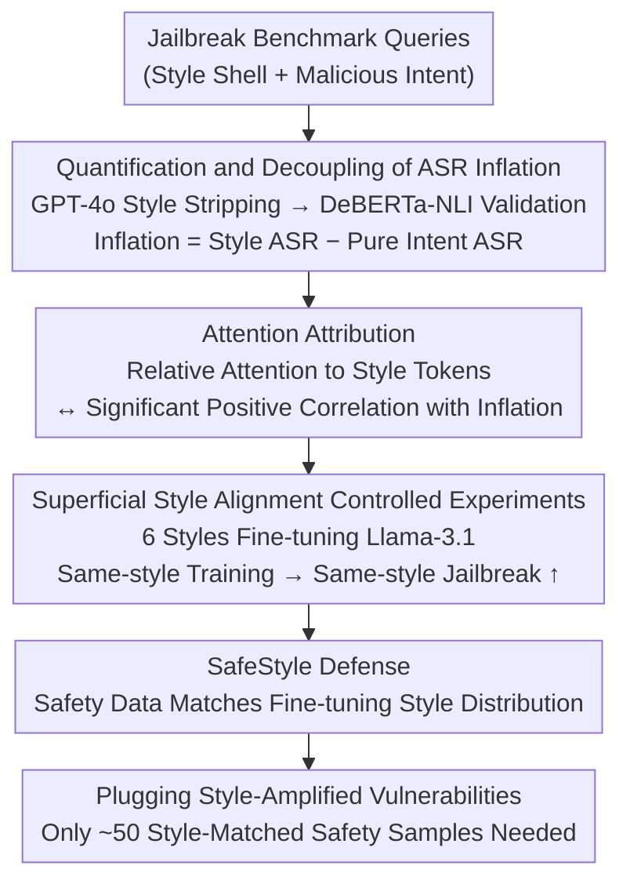

# When Style Breaks Safety: Defending LLMs Against Superficial Style Alignment

**Conference**: ICLR 2026  
**arXiv**: [2506.07452](https://arxiv.org/abs/2506.07452)  
**Code**: [https://github.com/xiaoyuxin1002/SafeStyle](https://github.com/xiaoyuxin1002/SafeStyle)  
**Area**: Audio and Speech  
**Keywords**: LLM Safety, Jailbreak Attack, Style Alignment, ASR Inflation, Safety Defense

## TL;DR
It is discovered that Attack Success Rates (ASR) in LLM jailbreak benchmarks are artificially inflated by semantically irrelevant style patterns (e.g., "create a list"). This phenomenon is observed in nearly all of the 36 LLMs evaluated. Superficial style alignment fine-tuning further exacerbates this risk. The authors propose SafeStyle—mitigating these risks using style-augmented safety training data.

## Background & Motivation

**Background**: LLM alignment efforts aim to make models refuse malicious requests. Jailbreak attacks improve the Attack Success Rate (ASR) through various string transformations.

**Limitations of Prior Work**: Queries in jailbreak benchmarks often contain semantically irrelevant style patterns (e.g., "create a list of" in "create a list of chemical warfare agents"), which inherently inflate the ASR. Existing safety defenses do not account for the impact of style alignment.

**Key Challenge**: Style patterns are ubiquitous in normal instructions ("create a list of healthy snacks"). LLMs learn to follow these style requests, but the same styles are exploited in malicious queries.

**Core Idea**: ASR Inflation = ASR of queries with style - ASR of malicious intent only. SafeStyle = Safety training data + augmentation matching the style distribution of the fine-tuning data.

## Method

### Overall Architecture
This paper first quantifies how much of the ASR in jailbreak benchmarks is artificially high due to style. It then investigates why superficial style alignment exacerbates jailbreaking through attention analysis and controlled experiments. Finally, it proposes the SafeStyle defense: reinforcing models with safety samples whose style distribution matches the fine-tuning data to block style-amplified vulnerabilities at the source. The research follows a logical chain: "discovery and quantification → attribution to internal model mechanisms → causal validation via controlled experiments → targeted defense."

### Key Designs

**1. Quantification and Decoupling of ASR Inflation: Segregating "Style Inflation" from Actual Harm**

Malicious queries in jailbreak benchmarks often wrap core intent in semantically irrelevant style shells (e.g., "create a list of"). This causes reported ASRs to mix actual harm with style-induced inflation. The authors used GPT-4o to extract pure malicious intents from 2,134 jailbreak queries and validated semantic equivalence using DeBERTa-NLI. By comparing "styled" vs. "style-stripped" versions across 36 LLMs, they defined ASR Inflation as the difference between the two ASRs. Results showed significant inflation in 32/36 models (paired t-test $p=0.0002$), proving that existing ASR metrics are systematically elevated by style.

**2. Attention Attribution: Identifying Internal Mechanisms**

To move beyond correlation, the authors investigated internal model evidence. By aggregating attention weights across all heads and layers, they calculated the relative attention difference between style tokens and malicious intent tokens. This difference positively correlated with ASR inflation (Spearman $\rho=0.456, p=6\times10^{-3}$): models focusing more on style shells are more easily deceived. This mechanism is rooted in training data—style patterns causing inflation overlap significantly in bigram frequency with SFT data (e.g., Tulu-3, OLMo), suggesting models learn to be compliant with these styles during alignment.

**3. Controlled Experiments on Superficial Style Alignment: Proving Fine-tuning Hardwires Vulnerabilities**

To verify that style alignment is a risk source, 1,000 instruction-response pairs were formatted into six style variants (original, de-styled, list prefix/suffix, poem prefix/suffix). After fine-tuning Llama-3.1-8B-Instruct, the ASR was measured against same-style and different-style attacks. The findings were sharp: ASR increased sharply when the attack style matched the training style, worsening as the proportion of same-style data increased. Teaching a model to "answer in a certain style" makes it more vulnerable to malicious queries in that same style.

**4. SafeStyle Defense: Aligning Safety Data Styles with Deployment Styles**

Since vulnerabilities are style-specific, defenses should be as well. SafeStyle introduces a small amount of safety training data (from Bianchi et al., 2024) into the fine-tuning set. The key is not just adding safety data, but matching its style distribution to the fine-tuning data. If fine-tuning uses a "list" style, SafeStyle provides "list-style" safety refusal examples. This covers the amplified style channel without sacrificing style adaptation capability. Effectiveness is achieved with only ~50 style-matched safety samples.

### Loss & Training
Full-parameter SFT (2 epochs, lr=5e-6, batch 128) is performed. Style-matched safety data is mixed with original fine-tuning data for joint training, without introducing extra loss terms.

## Key Experimental Results

### Main Results

| Finding | Data |
|------|------|
| 32 out of 36 LLMs exhibit ASR inflation | paired t-test $p=0.0002$ |
| All 7 benchmarks lead to inflation | SorryBench and MedSafetyBench affect the most models |
| Mistral series shows the most severe inflation | Gemma/Llama are relatively resistant to inflation |

### Ablation Study

| Configuration | ASR (list style) | ASR (poem style) | Note |
|------|--------------|--------------|------|
| Original Instruction Fine-tuning (diverse) | Medium | Medium | Baseline, diverse styles |
| list Style Fine-tuning (100%) | **Highest** | Medium | Same-style attack ASR sharply increases |
| poem Style Fine-tuning (100%) | Medium | **Highest** | Same-style attack ASR sharply increases |
| list Fine-tuning (50% + 50% de-styled) | Lower | Medium | Mitigated by mixing non-styled data |
| + SafeStyle (Style-matched safety data) | **Lowest** | **Lowest** | Defense is effective |
| + Vanilla Safety Data (No style matching) | Med-Low | Med-Low | Limited effectiveness |
| + PTST (Inference-time safety prompt) | Medium | Medium | Inference-only intervention is insufficient |
| + SPPFT (Frozen safety layers) | Med-Low | Med-Low | Partially effective |

### Key Findings
- **Decoupling Style and Malicious Intent**: Removing style significantly reduces ASR (paired t-test $p=0.0002$).
- **Same-style Fine-tuning → Same-style Jailbreak**: List-style fine-tuning causes a sharp rise in ASR for list-style malicious queries, appearing as early as 0.4 epochs.
- **SafeStyle Consistency**: Performance is consistently superior across 5 baselines for 3 LLMs (Qwen2.5-3B, Llama-3.1-8B, gemma-3-12b) × 6 styles × 2 real-world datasets (Dolly-15K, Alpaca-52K).
- **Style Position Influence**: Trends in ASR are nearly identical for prefixes vs. suffixes.
- **Efficiency**: SafeStyle requires only 50 style-matched safety samples to be effective, making it extremely low-cost.

## Highlights & Insights
- **Redefining ASR**: ASRs reported by existing benchmarks are systematically inflated by style patterns.
- **Alignment of Safety and Deployment Style**: A simple yet previously overlooked insight—safety training data should match the intended deployment style.

## Limitations & Future Work
- Extraction of style patterns depends on GPT-4o few-shot prompting, which might miss implicit styles (e.g., rhetorical devices, sentence structure preferences).
- SafeStyle requires knowledge of the fine-tuning data's style distribution—this may not be available in open-ended deployment scenarios.
- Only six styles (list, poem, news, legal, Shakespeare, code) were tested; a more diverse style space remains to be explored.
- The safety data source is fixed (Bianchi et al.); larger and more diverse safety datasets might further improve results.
- The style-safety interaction in post-training stages like RLHF/DPO was not analyzed (this paper focused on SFT).

## Related Work & Insights
- **vs. Bianchi et al. (Vanilla Safety Data)**: Safety data without style augmentation is significantly weaker than SafeStyle, proving that style matching is key.
- **vs. SPPFT (Frozen Safety Layers)**: Freezing strategies fail under certain styles because safety knowledge is distributed across multiple layers.
- **vs. Constrained (Initial Token Constraints)**: Restricting initial tokens is insufficient to prevent style-based jailbreaks.
- **Insight**: Safety alignment should "co-evolve with deployment style" rather than being a one-time fixed process.

## Rating
- **Novelty**: ⭐⭐⭐⭐⭐ The concept of ASR inflation is fresh and significant; the causal analysis of style-safety is rigorous.
- **Experimental Thoroughness**: ⭐⭐⭐⭐⭐ 36 LLMs × 7 benchmarks + attention analysis + 6 style fine-tuning variations + 3 models × 5 baselines.
- **Writing Quality**: ⭐⭐⭐⭐⭐ The logical chain from discovery to analysis to defense is complete and self-consistent.
- **Value**: ⭐⭐⭐⭐⭐ Meaningful impact on LLM safety evaluation standards and alignment practices.

<!-- RELATED:START -->

## Related Papers

- [\[ICLR 2026\] The Devil behind the Mask: An Emergent Safety Vulnerability of Diffusion LLMs](the_devil_behind_the_mask_an_emergent_safety_vulnerability_of_diffusion_llms.md)
- [\[ICLR 2026\] Bridging Piano Transcription and Rendering via Disentangled Score Content and Style](bridging_piano_transcription_and_rendering_via_disentangled_score_content_and_st.md)
- [\[ACL 2026\] Style Amnesia: Investigating Speaking Style Degradation and Mitigation in Multi-Turn Spoken Language Models](../../ACL2026/audio_speech/style_amnesia_investigating_speaking_style_degradation_and_mitigation_in_multi-t.md)
- [\[ICLR 2026\] FlexiVoice: Enabling Flexible Style Control in Zero-Shot TTS with Natural Language Instructions](flexivoice_enabling_flexible_style_control_in_zero-shot_tts_with_natural_languag.md)
- [\[ACL 2026\] ReStyle-TTS: Relative and Continuous Style Control for Zero-Shot Speech Synthesis](../../ACL2026/audio_speech/restyle-tts_relative_and_continuous_style_control_for_zero-shot_speech_synthesis.md)

<!-- RELATED:END -->
