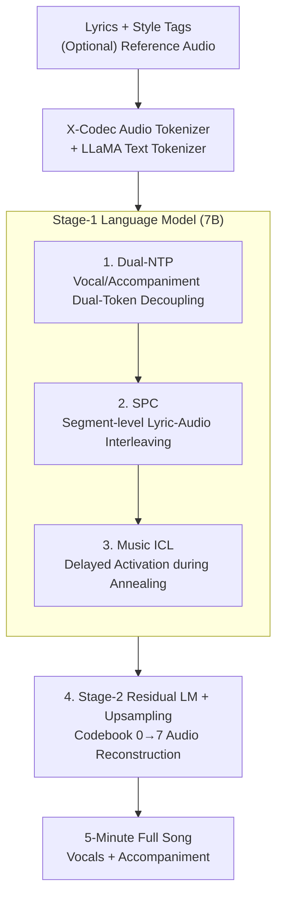

# YuE: Scaling Open Foundation Models for Long-Form Music Generation

**Conference**: ICLR 2026  
**OpenReview**: [https://openreview.net/forum?id=hZy6YG2Ij8](https://openreview.net/forum?id=hZy6YG2Ij8)  
**Project Page**: [map-yue.github.io](https://map-yue.github.io/)  
**Code**: https://github.com/multimodal-art-projection/YuE (⚠️ Subject to original/project page)  
**Area**: Audio Generation / Music Generation / Autoregressive Language Models  
**Keywords**: Long-form music generation, lyrics-to-song, track decoupling, in-context learning, X-Codec

## TL;DR
YuE scales the LLaMA2 architecture to trillions of tokens to train the first open-source "lyrics-to-song" foundation model. By employing **dual-token track decoupling** (separate prediction of vocals/accompaniment), **structural progressive conditioning** (interleaving lyrics and audio by segments), and **re-designed music in-context learning**, it generates songs up to 5 minutes long with aligned lyrics and vivid vocals, matching or exceeding certain commercial systems (e.g., Udio, Tiangong) in musicality.

## Background & Motivation

**Background**: In neural music generation, "lyrics-to-song" (generating complete songs with vocals and accompaniment from lyrics) is one of the most challenging tasks. Commercial systems like Suno and Udio have demonstrated impressive results but remain closed-source with opaque technology. Open-source models (e.g., Jukebox, MusicLM) mostly generate short instrumental clips (~30s) and suffer from semantic lyrical chaos when vocals are added.

**Limitations of Prior Work**: The authors categorize the difficulties of lyrics-to-song into four points: ① **Long-range dependency**: Music structures span several minutes, making long-term coherence difficult; ② **Signal complexity**: Music is multi-part, requiring precise coordination between vocals and various instruments; ③ **Linguistic distortion**: Singing alters phonemes, duration, and prosody significantly compared to speech, complicating lyric-melody alignment; ④ **Data scarcity**: Lack of large-scale, high-quality paired "lyrics-vocals-accompaniment" data.

**Key Challenge**: Existing LM-based methods use a **single codebook-0 token to represent each audio frame**, forcing one token to carry two vastly different signals (vocals and accompaniment). In genres where accompaniment energy far exceeds vocals (e.g., metal, low VAR), Residual Vector Quantization (RVQ) compression severely loses vocal linguistic information, resulting in unintelligible lyrics. Furthermore, long-context conditioning (prefixing full lyrics) fails as audio tokens lengthen—degenerating around 3k tokens and collapsing after 6k tokens according to empirical tests.

**Goal**: Build an open-source, scalable foundation model capable of generating 5-minute full tracks with aligned lyrics, addressing both "dual-track signal entanglement" and "long-range lyric following," while enabling controlled capabilities like style cloning and bidirectional creation.

**Key Insight**: Rather than modifying the LM architecture or using serial two-stage vocal/accompaniment pipelines (which introduce latency and error propagation), it is better to **keep the LLaMA2 architecture unchanged** and reshape the token sequence organization using "explicit source separation priors" and "musical structure priors"—encoding priors into the data/sequence rather than the model.

**Core Idea**: Output **two tokens** (vocal + accompaniment) per time step to disentangle tracks; cut the full song into segments (intro/verse/chorus) and **interleave lyric text with audio tokens** to maintain long-range alignment; and **redefine ICL for music** (removing reference text, supporting bidirectionality, and injecting only during annealing) to achieve style transfer and controllability.

## Method

### Overall Architecture

YuE is an autoregressive language model framework based on LLaMA2 consisting of **two stages**: Given instructions, style tags, lyrics (and optional reference audio), the **Stage-1 LM (7B)** models it as an autoregressive "next-token prediction" task to generate the semantically richest base audio tokens (RVQ codebook-0). Then, the **Stage-2 LM (2B)** completes the codebook-0 into all 8 codebooks (0–7) residual tokens under strict temporal alignment. Finally, the sequence is restored to a waveform via a de-tokenizer and lightweight upsampler, outputting a full song of up to 5 minutes with both vocals and accompaniment.

Stage-1 is where the three core contributions occur: **Dual-NTP** decides the dual-token output per step, **SPC** determines the interleaving of lyrics and audio on a song scale, and **Music ICL** manages style activation during annealing. Audio is tokenized using **X-Codec** (semantic-acoustic fusion tokens for faster convergence), and text uses an expanded LLaMA vocabulary.

### Key Designs

**1. Track-Decoupled Next-Token Prediction (Dual-NTP): Splitting a frame into vocal and accompaniment tokens**

To address the issue where a single token fails to carry both vocals and accompaniment in low-VAR genres, YuE introduces a **source separation prior**. Instead of standard NTP factorizing a sequence $x_{1:T}$ as $P(x_{1:T})=\prod_{t=1}^{T} P(x_t\mid x_{<t};\theta)$, YuE explicitly splits each step into two tokens: vocal $v_t$ and accompaniment $a_t$. The sequence becomes $(v_1,a_1,v_2,a_2,\dots,v_T,a_T)$, and the joint probability factorizes as:

$$P(v_{1:T},a_{1:T})=\prod_{t=1}^{T} P(v_t\mid v_{<t},a_{<t};\theta)\times P(a_t\mid v_{\le t},a_{<t};\theta).$$

This decomposition allows implementation within a standard autoregressive framework **without changing the LM architecture**, reusing mature pre-training infrastructure while maintaining scalability. It avoids synchronization and error propagation issues of serial two-stage methods. Experimentally, Dual-NTP achieves lower training loss (~0.4 lower than standard NTP with identical data/compute) and maintains robust lyric intelligibility in difficult cases like metal music.

**2. Structural Progressive Conditioning (SPC): Interleaving lyrics and audio using musical segment structures**

To solve the issue where prefix lyric conditions become ineffective as audio tokens lengthen (>3k tokens degradation, >6k tokens collapse), SPC leverages the natural **segment structure prior** of music. Songs are composed of segments like intro, verse, chorus, bridge, and outro. These are automatically segmented into parts (mostly <30s). **Within each segment**, the corresponding text conditions (lyrics + structural tags) are paired with the audio; from a full-song perspective, structured text and audio tokens are **interleaved**. Each segment's lyrics are close to the audio they constrain, avoiding the problem of aligning lyrics across thousands of tokens. Ablations show SPC consistently outperforms Vanilla/Curriculum/ABF baselines in WER across 30s–150s intervals.

**3. Redesigned Music In-Context Learning (ICL): Text-free, bidirectional, and delayed activation**

To adapt speech-style ICL to music, YuE redefines it by **directly prepending a randomly sampled 30s reference audio token segment** before the SPC data: $D_{icl}=A_{ref}\circ D_{spc}$. This removes the need for reference text and supports bidirectional creation. A critical engineering insight is the **delayed activation strategy**: since ICL provides strong alignment and is "easy" data, injecting it too early induces shortcut learning (where the model copies reference audio and ignores lyric control). Therefore, ICL data (~10B tokens, ~2% of pre-training) is only introduced during the **annealing phase**. This ensures **decoupled control** between text and reference audio—e.g., using Japanese city-pop female vocals as a reference while changing lyrics to English or generating a male rap version.

**4. Tokenization and Stage-2 Residual Modeling: Completing codebook-0 into full-resolution audio**

To reconstruct high-fidelity audio from Stage-1 base tokens, the **Stage-2 LM** jointly predicts all $K=8$ codebooks on a strictly time-aligned stream. It reads the complete codebook-0 and predicts 8-tuples frame-by-frame. During inference, codebook-0 is clamped to Stage-1's output, and only residual codebooks 1–7 are generated, refining sound quality while maintaining temporal alignment.

### Loss & Training
- **Multi-task Pre-training**: Jointly trains on TTS, lyrics-to-song, and unconditional music generation using 70k hours of speech and 650k hours of CC-licensed music. Annealing uses a 2:1 ratio for SPC:ICL.
- **Scaling**: Most Stage-1 experiments use 0.5B models; the final 7B model is trained on 1.75T tokens with a 16k context window, followed by 40B tokens of annealing. Stage-2 uses 2T tokens. Global batch size is 768 with a peak learning rate of 3e-4.
- **Inference Techniques**: Uses Sampling + Classifier-Free Guidance (CFG); ICL uses song choruses as prefixes to enhance stability.

## Key Experimental Results

### Main Results (Objective Metrics Comparison, Table 1)

| System | KL↓ | FAD↓ | CE↑ | CU↑ | PC↑ | PQ↑ | CLAP↑ | CLaMP 3↑ |
|------|------|------|------|------|------|------|--------|----------|
| Hailuo | 0.756 | 2.080 | 7.350 | 7.737 | 6.793 | 8.132 | 0.265 | 0.106 |
| SunoV4 | 0.620 | 1.544 | 7.474 | 7.813 | 6.601 | 8.120 | 0.265 | 0.160 |
| Tiangong | 0.708 | 2.547 | 7.421 | 7.766 | 6.060 | 8.220 | 0.244 | 0.114 |
| Udio | 0.503 | **1.222** | 7.112 | 7.520 | 6.626 | 7.803 | **0.310** | 0.156 |
| **YuE** | **0.372** | 1.624 | 7.115 | 7.543 | 6.280 | 7.894 | 0.118 | **0.240** |

- **Human Evaluation**: 40 raters (including 12 AI experts and 7 musicians) performed A/B tests. YuE **tied with Tiangong and Udio** in preference and musicality, significantly outperformed Hailuo, and trailed only Suno V4.
- **Distribution Matching**: YuE achieved the best KL (0.372) and competitive FAD (1.624). CLaMP 3 alignment (0.240) was highest, though CLAP (0.118) was lower—attributed to CLAP’s insufficient exposure to singing/music content.
- **Vocal Flexibility**: YuE’s song-level vocal range median is ~27 semitones, approaching top-tier closed-source systems.

### Ablation Study

| Configuration | Key Metric | Description |
|------|---------|------|
| **Dual-NTP** vs standard NTP | Training loss ~ **0.4** lower | Faster convergence; more stable lyrics in low-VAR genres |
| **SPC** vs Vanilla/Curriculum | Lower WER across all 30s–150s segments | Prevents drift where vocals start late relative to lyrics |
| Model Scale 0.5B→7B (SPC) | WER drops from ~70% to ~20% | Scaling improves both musicality and lyric following |
| **ICL** vs SPC (Testing) | Musicality win rate 0.63 vs 0.21 | ICL constrains decoding to a "music-friendly" subspace |
| **ICL+CFG** | Win rate **0.79** (Highest) | CFG amplifies text conditions to further align with prompts |

### Key Findings
- **Benefits of Dual-NTP from separation priors**: The authors define VAR (Vocal-to-Accompaniment Ratio). Standard mixed-track reconstruction WER spikes as VAR decreases, whereas vocal-track reconstruction is robust, proving that modeling vocals separately preserves intelligibility.
- **ICL must be delayed until annealing**: Early injection causes the model to lazily copy reference audio, breaking lyric control.
- **Scaling is essential**: 0.5B→7B shows clear gains; 7B exhibits emergent abilities like vibrato, operatic singing, death metal growls, scat improvisation, and cross-lingual singing.
- **Memorization tests**: Using ByteCover2 to measure melody similarity, results showed Ref-Gen similarity is much lower than duplicated sets like Covers80, indicating the model recombines learned patterns rather than copying segments.

## Highlights & Insights
- **Encoding priors into sequences, not the architecture**: Dual-NTP and SPC modify the organization of tokens (dual tokens per frame, interleaved lyrics) without changing LLaMA2. This allows reuse of mature LM infrastructure while injecting domain priors.
- **VAR as a clever metric**: Quantifying "why metal lyrics are unintelligible" via energy ratios turns engineering intuition into a scientific, ablatable problem.
- **Delayed activation for shortcut prevention**: The realization that strong conditions (ICL) can cause "lazy learning" and should be introduced doses-wise in the final training stage is a valuable insight for multi-conditional generation.
- **First open-source full-track foundation model**: Effectively narrows the gap between open-source and state-of-the-art commercial systems.

## Limitations & Future Work
- **Still trails top commercial systems**: Overall performance remains below Suno V4 in human evaluations.
- **Metric-perception mismatch**: High human preference but low CLAP scores suggest existing automatic metrics are unreliable for singing content.
- **Dependency on automated segmentation**: SPC relies on the quality of automated structure cutting; errors there may lead to lyric-audio misalignment.
- **Copyright and Misuse**: While trained on CC music and showing no segment copying, style cloning capabilities carry potential risks for misuse.

## Related Work & Insights
- **vs Jukebox / MusicLM**: Previous models favored ~30s instrumental clips; YuE models 5-minute vocals, accompaniment, and lyrics together.
- **vs MelodyLM / SongCreator**: Previous dual-track methods modified the base architecture or used error-prone serial pipelines; YuE uses a single forward pass with dual tokens.
- **vs Speech ICL (e.g., VALL-E)**: Traditional ICL requires reference text and is unidirectional; YuE is text-free and uses delayed activation for better control.

## Rating
- Novelty: ⭐⭐⭐⭐⭐ Dual-NTP/SPC/Music ICL directly target lyrics-to-song pain points.
- Experimental Thoroughness: ⭐⭐⭐⭐⭐ Comprehensive comparison with 4 commercial systems plus multi-angle ablations.
- Writing Quality: ⭐⭐⭐⭐ Clear motivation-method-ablation chain.
- Value: ⭐⭐⭐⭐⭐ Significantly advances the open-source music generation landscape.

<!-- RELATED:START -->

## Related Papers

- [\[ICLR 2026\] Music Flamingo: Scaling Music Understanding in Audio Language Models](music_flamingo_scaling_music_understanding_in_audio_language_models.md)
- [\[ICML 2025\] Long-Form Speech Generation with Spoken Language Models](../../ICML2025/audio_speech/long-form_speech_generation_with_spoken_language_models.md)
- [\[ACL 2026\] Comprehensive Benchmarking of Long-Form Speech Generation in Diverse Scenarios](../../ACL2026/audio_speech/comprehensive_benchmarking_of_long-form_speech_generation_in_diverse_scenarios.md)
- [\[CVPR 2026\] AudioStory: Generating Long-Form Narrative Audio with Large Language Models](../../CVPR2026/audio_speech/audiostory_generating_long-form_narrative_audio_with_large_language_models.md)
- [\[ICLR 2026\] Scaling Speech Tokenizers with Diffusion Autoencoders](scaling_speech_tokenizers_with_diffusion_autoencoders.md)

<!-- RELATED:END -->
