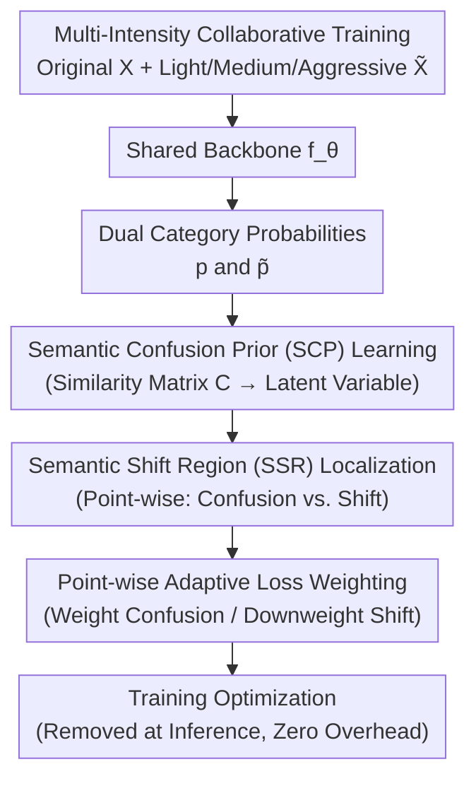

# Adaptive Augmentation-Aware Latent Learning for Robust LiDAR Semantic Segmentation

**Conference**: ICLR 2026  
**arXiv**: [2603.01074](https://arxiv.org/abs/2603.01074)  
**Code**: None  
**Area**: Autonomous Driving / 3D Point Cloud Semantic Segmentation  
**Keywords**: LiDAR Semantic Segmentation, Data Augmentation, Adverse Weather Robustness, Semantic Confusion, Distribution Shift

## TL;DR

The A3Point (Adaptive Augmentation-Aware Latent Learning) framework is proposed to decouple intrinsic model semantic confusion from semantic shift introduced by data augmentation through two core components: implicit learning of Semantic Confusion Prior (SCP) and localization of Semantic Shift Regions (SSR). It adaptively optimizes across varying interference levels and achieves SOTA results on multiple LiDAR segmentation benchmarks under adverse weather.

## Background & Motivation

**Background**: LiDAR point cloud semantic segmentation is a core 3D perception task in autonomous driving, requiring precise point-wise category prediction (vehicles, pedestrians, roads, vegetation, etc.). Dominant methods (Cylinder3D, MinkUNet, SPVCNN, etc.) perform well in normal weather, but **adverse weather conditions** (rain, fog, snow, wet surfaces) introduce significant distribution shifts, such as scattering, occlusion, and reflection anomalies.

**Limitations of Prior Work**:
- Data augmentation-based methods (e.g., simulating raindrop scattering or adding fog noise) attempt to cover weather interference during training but face a fundamental **light-aggressive augmentation dilemma**:
    - **Light Augmentation**: The simulated interference is too weak to cover the magnitude of distribution shifts in real adverse weather.
    - **Aggressive Augmentation**: Simulated interference is extreme enough but alters the semantic meaning of the point clouds, introducing **semantic shift**.
- Existing methods treat all augmentation intensities uniformly, failing to distinguish between "intrinsic model confusion" and "erroneous semantics introduced by augmentation."
- There is a lack of fine-grained perception and adaptive adjustment mechanisms for the effects of augmentation operations.

**Key Challenge**: Increasing robustness requires stronger augmentation → stronger augmentation introduces semantic shift → semantic shift leads the model to learn incorrect information → robustness actually decreases. This contradiction prevents existing methods from fully exploiting data augmentation for LiDAR segmentation robustness.

**Key Insight**: The core insight is the need to **distinguish between two sources of "confusion"**: semantic confusion caused by the model's limited capacity (valuable for learning) and semantic shift introduced by excessive augmentation (to be avoided), applying adaptive optimization strategies for different levels of interference.

## Method

### Overall Architecture

A3Point is a plug-and-play training framework designed to resolve the dilemma of using strong augmentation for robustness without being misled by it. The original point cloud $\mathbf{X}$ and the augmented point cloud $\tilde{\mathbf{X}}$ (subjected to various weather intensities) are simultaneously fed into any standard segmentation backbone $f_\theta$ (e.g., Cylinder3D, MinkUNet, SPVCNN) to obtain class probabilities $\mathbf{p}$ and $\tilde{\mathbf{p}}$. The Semantic Confusion Prior (SCP) module extracts stable confusion patterns from the differences between these two paths. The Semantic Shift Region (SSR) module performs point-wise discrimination to determine if a difference arises from intrinsic confusion or corrupted semantics. Finally, it adaptively decides for each point whether to enhance learning or downweight the loss. During training, this mechanism accommodates the full spectrum of augmentations; at inference, all modules are removed, resulting in zero extra overhead.

### Key Designs

**1. Multi-Intensity Collaborative Training: Breaking the Intensity Ceiling**

Traditional methods are forced to choose between insufficient coverage and semantic shift. A3Point instead utilizes multiple augmentation intensities in a single training session. The SCP and SSR modules handle these intensities differently: light augmentations are mostly fully absorbed to build basic robustness, while medium and aggressive augmentations are filtered by SSR to remove corrupted semantic regions, retaining only clean signals. This allows the model to benefit from the entire augmentation spectrum without suffering from performance degradation at high intensities.

**2. Implicit learning of Semantic Confusion Prior (SCP): Utilizing "Where the Model Fails" as a Prior**

Prediction errors under adverse weather stem from two sources, one being the model's own capacity boundaries—such as confusing pedestrians with poles or bicycles with motorcycles. This type of confusion is "informative" as it identifies category pairs that require enhanced learning. The SCP module compares $\mathbf{p}$ and $\tilde{\mathbf{p}}$ to construct a class similarity matrix $\mathbf{C} \in \mathbb{R}^{N_c \times N_c}$ (where $N_c$ is the number of classes), extracting stable confusion patterns encoded as a latent variable $\mathbf{z}_{\text{scp}}$. This variable adjusts loss weights to emphasize high-confusion category pairs during training.

**3. Semantic Shift Region (SSR) Localization: Precise Downweighting of Corrupted Areas**

The other source of error is semantic shift caused by augmentation itself. Aggressive augmentations might approximate real-world shifts but can also turn a patch of vegetation into noise or erase vehicle boundaries, leading to noisy labels. The SSR module performs point-wise discrimination between semantic confusion and semantic shift. For light augmentations, it maintains normal optimization. For aggressive augmentations, it identifies regions where semantics have truly changed. It then applies spatially adaptive loss weighting: increasing weights in semantic confusion zones to learn robust features and decreasing weights in semantic shift zones to avoid learning incorrect labels.

## Key Experimental Results

### Main Results: Generalization Under Adverse Weather

Evaluated on standard LiDAR segmentation benchmarks (trained on normal weather, tested on adverse weather):

| Method | Backbone | Normal Weather mIoU | Fog mIoU | Rain mIoU | Snow mIoU | Avg mIoU |
|------|---------|-------------|----------|----------|----------|----------|
| Baseline (No Aug) | Cylinder3D | ~64.0 | ~35.0 | ~38.0 | ~32.0 | ~42.3 |
| Random Aug | Cylinder3D | ~63.0 | ~40.0 | ~42.0 | ~37.0 | ~45.5 |
| Adversarial Training | Cylinder3D | ~62.0 | ~42.0 | ~43.0 | ~38.0 | ~46.3 |
| Consistency Reg | Cylinder3D | ~63.5 | ~43.0 | ~44.0 | ~39.0 | ~47.4 |
| **A3Point** | **Cylinder3D** | **~64.5** | **~48.0** | **~49.0** | **~44.0** | **~51.4** |
| Baseline (No Aug) | MinkUNet | ~66.0 | ~37.0 | ~40.0 | ~34.0 | ~44.3 |
| **A3Point** | **MinkUNet** | **~66.5** | **~50.0** | **~51.0** | **~46.0** | **~53.4** |

Key Findings:
- A3Point significantly improves performance across all adverse weather conditions, with the **largest gain in snow** (~12 mIoU).
- **No loss in normal weather performance**: A3Point does not sacrifice performance in clean conditions for robustness.
- Effective across different backbones as a plug-and-play framework.

### Ablation Study: Component Analysis

| Configuration | Fog mIoU | Rain mIoU | Snow mIoU | Avg ↑ |
|------|---------|---------|---------|-------|
| Baseline (Aug only) | ~40.0 | ~42.0 | ~37.0 | ~39.7 |
| + SCP | ~44.0 | ~45.0 | ~41.0 | ~43.3 (+3.6) |
| + SSR | ~43.0 | ~44.5 | ~40.0 | ~42.5 (+2.8) |
| + SCP + SSR (A3Point) | **~48.0** | **~49.0** | **~44.0** | **~47.0 (+7.3)** |

Key Findings:
- SCP and SSR are both independently effective, with a significant **synergistic gain** (1+1>2) when combined.
- SCP contributes slightly more, suggesting that capturing model confusion is crucial for guiding adaptive optimization.
- SSR contributes more in aggressive augmentation scenarios where semantic shift is more prevalent.

## Highlights & Insights

### Strengths
- **Precise Insight**: Attributes the data augmentation dilemma to the confusion between semantic confusion and semantic shift, with a clear problem definition.
- **Sound Design**: SCP and SSR modules logically address "what information to capture" and "where to apply it."
- **Plug-and-Play**: Non-intrusive to backbones during training and applicable to various 3D segmentation networks.
- **Zero-Loss Normal Performance**: Maintains high performance in normal weather while improving robustness, offering high practical value.

### Limitations & Future Work
- Technical details (e.g., the specific construction of $\mathbf{z}_{\text{scp}}$ or SSR algorithms) are difficult to verify based on truncated information.
- Evaluation relies on synthetic adverse weather data; validation on real-world adverse weather datasets is remaining.
- Applicability to other domain shifts (e.g., cross-city or cross-sensor) has not been verified.

### Rating
⭐⭐⭐⭐ — Clear problem definition and sound solutions with high practical value. However, full technical depth and experimental completeness cannot be fully assessed from the abstract alone.

<!-- RELATED:START -->

## Related Papers

- [\[ECCV 2024\] Rethinking Data Augmentation for Robust LiDAR Semantic Segmentation in Adverse Weather](../../ECCV2024/autonomous_driving/rethinking_data_augmentation_for_robust_lidar_semantic_segmentation_in_adverse_w.md)
- [\[CVPR 2026\] Test-Time Training for LiDAR Semantic Segmentation under Corruption via Geometric Inlier Discrimination](../../CVPR2026/autonomous_driving/test-time_training_for_lidar_semantic_segmentation_under_corruption_via_geometri.md)
- [\[CVPR 2026\] C-LaV: Conditional Latent Velocity Field Denoising for Weather-Robust LiDAR Place Recognition](../../CVPR2026/autonomous_driving/c-lav_conditional_latent_velocity_field_denoising_for_weather-robust_lidar_place.md)
- [\[ICLR 2026\] UniSplat: Unified Spatio-Temporal Fusion via 3D Latent Scaffolds for Dynamic Driving Scene Reconstruction](unisplat_unified_spatio-temporal_fusion_via_3d_latent_scaffolds_for_dynamic_driv.md)
- [\[CVPR 2026\] LiDAR-to-4DRadar Diffusion Bridge via Cross-Modal Alignment and Translation in Latent Space](../../CVPR2026/autonomous_driving/lidar-to-4dradar_diffusion_bridge_via_cross-modal_alignment_and_translation_in_l.md)

<!-- RELATED:END -->
